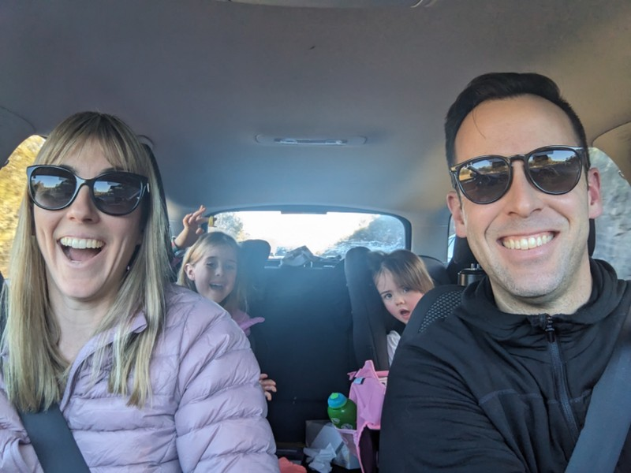
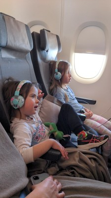
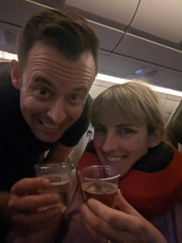
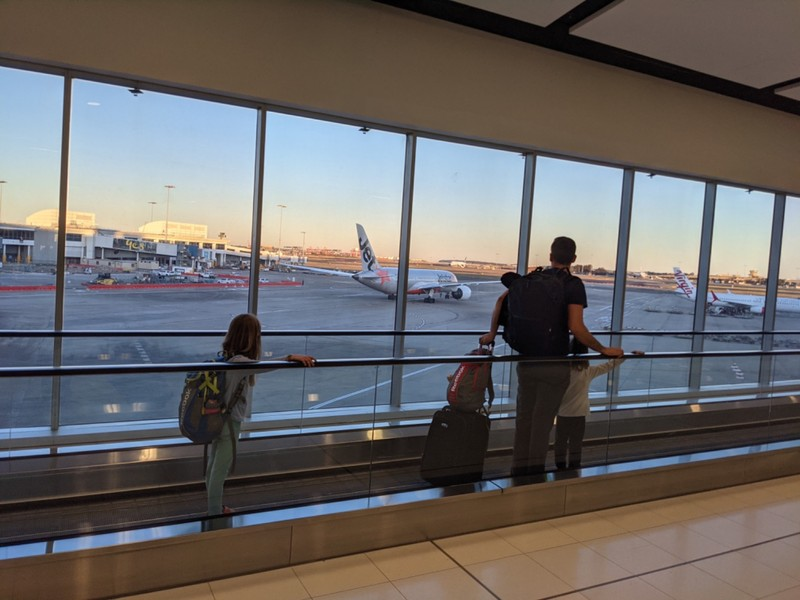
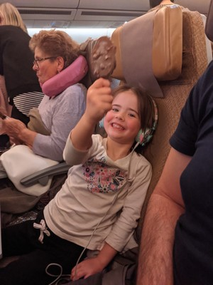
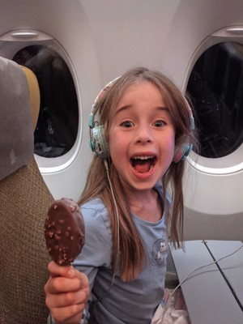
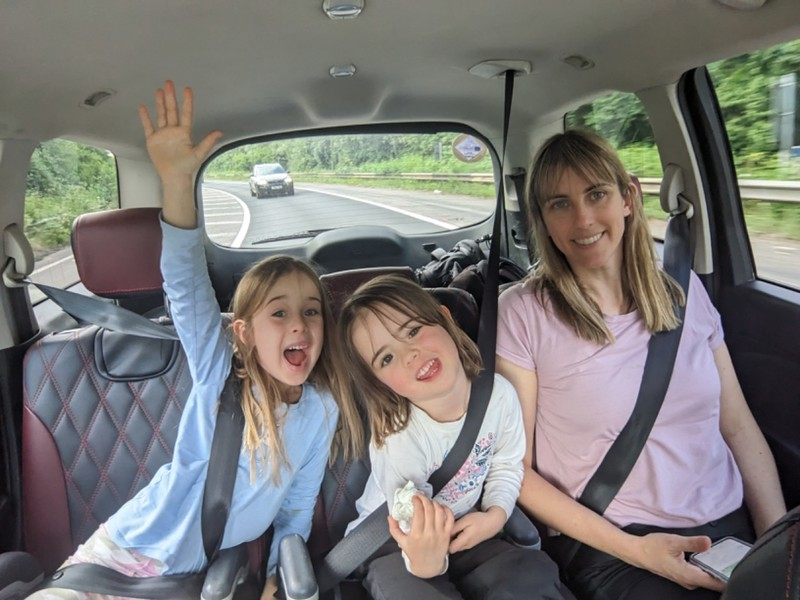

Last night we heard from Jill and Peter about the 5 trains they had to catch to get from Frankfurt to London after the direct one was cancelled last minute. This reminded Kate about our trip in 2019 when a similar thing happened. Pat stared at her blankly- no recollection of that hellish transit with a toddler and a newborn in a record setting heatwave. He suggested we should start writing a travel diary again so he might be able to remember things that have happened in his life.

On the drive to Sydney today when Kate asked him to jot down some notes, he'd already forgotten his resolution to keep a travel diary. Good thing we have wedding photos on display or his sieve memory would forget we got married.

After a few days of tiredness and loss of appetite, Violet woke up today with a rash on her neck and torso. Negative COVID test and no fever, but seemed inauspicious. Pat called the GP to get an emergency appointment (deja vu of the emergency GP appointment to look at his knee before the aborted trip to the US in March 2020). We got in at 9:45. Good start to the morning.

Turns out she probably has Scarlet Fever. Is that even a thing anymore?? Our heads are immediately filled with visions of quarantine, burning her sheets and all her toys ala Velveteen Rabbit. Instead, we got a script for antibiotics, which need to be kept refrigerated (super easy when you're driving to Sydney then getting on 24 hours worth of flights) and are told we're all good to travel tonight. Hooray for penicillin! After the first dose of antibiotics and chewable ibuprofen, Violet has perked up considerably and is eating normally.

Picked up Wendy (our online house sitter) and brought her home. We're both a bit stressed about leaving her at the house with the dogs. She seems nice enough, but just have to trust she'll look after the place and take good care of the monsters, I mean dogs. We got together before things like online dating- trusting strangers from the internet isn't natural for us!

We get on the road, and stressed out Pat has to finish annual reviews for his new team in the car on the drive to the airport. Remember when Kate told him not to take the promotion because he's busy enough already? Good thing he listened. Our travel soundtrack and activities have changed drastically since our last time writing a travel blog.

*We're currently listening to Fancy Cat by The Beanies. "I'm a fancy cat, with a fancy hat, meowmeowmeowmeowmeowmeowmeowmeow" and playing "I Spy"*

Once we actually made it to Sydney airport we were back in the swing. Park, check in, immigration, security, gate, boarding, on the way! Lucky to get an extra seat next to Pat so we could have one kid per adult. 6 hours into the flight Pat went to the back to ask for a cup of water. The flight attendant insisted that what he really wanted was a glass of champagne. Or two, one for his sleeping wife as well. They don't normally open champagne for economy, guess Pat's new haircut was working overtime.

*Pat and I set up with a drink, the kids set up with Fire Buds*

The kids did pretty well for 24 hours in the air. There was some minor kicking, whinging, and a refusal to let Kate get any sleep, but they did manage to sleep around 10 hours between the two flights. The only drama was on landing at Heathrow. Our fight was late, so when it landed there was minor pandemonium from people (presumably) trying to push to the front so they wouldn't miss connections. Margot was a bit overwrought by this point, and decided she would sit in the aisle and refuse to move or let anyone past. In the end Kate had to jettison a bag with hopes Pat would rescue it to pick Margot up and carry her off the plane.

Heathrow itself was much nicer than we remembered, apparently we were in the new terminal. Less than 30 minutes from the plane to the curb, where we had a man waiting to drive us to Oxford (decided against fluffing around with public transport with two tired kids and two tired us).

Uneventful drive, so glad to have Nana and Grumps already at the house with a fridge full of groceries. The only excitement on arrival day was a little walk to the local dry-cleaners. The kids found some coins in the grass, and spent the rest of the walk digging through all the piles of dead leaves on the path in hopes of striking gold again. Hopefully the 2 pence is worth all the diseases they contract. Hooray again for penicillin!

*Sunset at Sydney Airport*

*Icecream Time*

*Kids Thrilled, Kate Holding On By a Thread*
