12 hours sleep is inadequate to tackle the Oxford bus system. A seemingly endless array of permutations and combinations of ticket options, zones, bus companies (some of which allow you to travel between them on a common ticket, some don't). No information about children under 5, so we just assume Margot is free. Finally, after nearly an hour of debate between us, we decide a £9 all day group ticket is the best we can do, so we set a new goal of figuring all this out on the app.

The girls were excited about riding a Double Decker bus. They went to the top deck with Kate and stood the front watching everything, deciding with each tree we passed if the bus or the tree was taller. The bus was jam packed with people. Standing room only on the bottom and crowded up top as well. The stop before ours, we figured out why: there was a school group of some kind on the bus, which also explained why the bus took so long at the stop before ours when picking us up. It was like a clown car situation watching all the people come down the stairs of the bus to get off; they just kept coming.

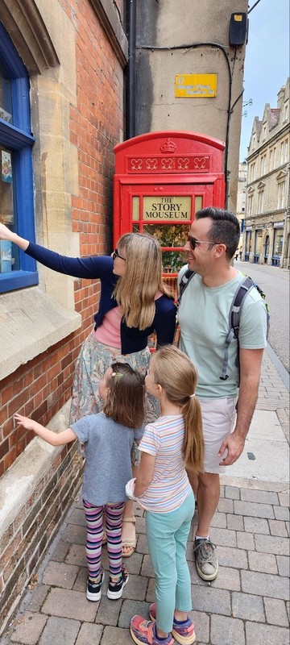

*Checking Out the Story Mouseum in front of the Story Museum*

We walked down one of the main streets in Oxford towards the Story Museum. Lots of old fancy looking buildings. On arrival at the museum, the girls were a little tentative. We were first taken into a room decorated like an enchanted forest, filled with trees made out of thick ropes and lots of green felt. Each tree had its own story which you could hear by picking up a little headset. The girls didn't have much patience for those, but they did enjoy walking around looking for the animals hidden amongst the trees and listening to a story told by one of the guides. The room itself was fantastically decorated. They've clearly gone to lots of effort to make this an immersive experience for the kids.

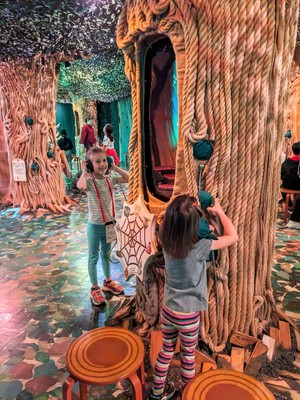

*Listening to the story of Anansi and the Sky God*

The next room was ant themed. We all had to wear little antenna on our heads. There were a few things that the kids were supposed to do to learn about climate change, I think? Violet made her own climate protest sign, which I don't think really had any impact on her. Margot settled in a bean bag and was read a story by Nana. Kate didn't notice that everyone took their antenna off ages ago and was the only one left with hers on by the time we were ready to move to the next room. The fool!

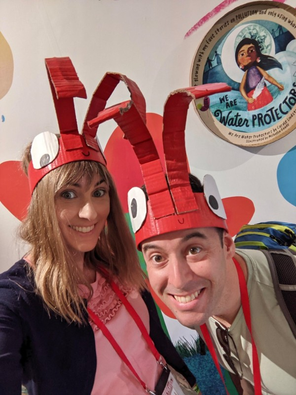

*Ants*

The last section was called The Enchanted Library and had maybe a dozen different rooms which were each decorated in a theme of a particular story. Some of the kids favourites were the Poohsticks room, Alice in Wonderland (you stood under the glass table looking up at the bottle to make you small, the cake to make you grow as well as the rabbit hole in the ceiling) and Choose Your Own Adventure. Kate’s favourite was Narnia, which involved walking through a fur coat filled wardrobe to the snowy landscape and lamppost. We were immersed in a narration of The Lion, The Witch and The Wardrobe with accompanying projections on the ground. It made Violet jump when Mr Tumnus dropped his packages at her feet. There was a room for The Snowman, which Pat enjoyed. It was set up like a 1950s living room and had a television which played pages from the book. After a minute the picture flew off the TV and was projected on two of the walls. Very fun. Both Margot and Violet were scared of the room for the Subtle Knife.

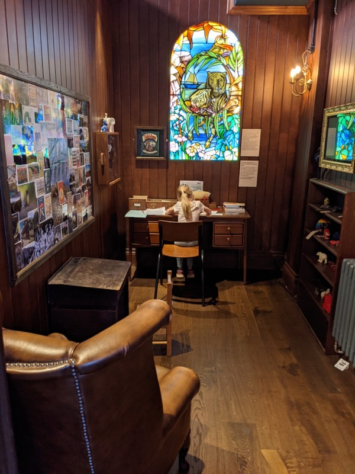

*An interesting highlight was Violet sitting at CS Lewis' desk and writing a note about how much she loved stories. Literally, "I <3 stories".*

We had a quick bite at the cafe and went to the toilets before we left and were amused by a reminder of covid in the bathrooms.

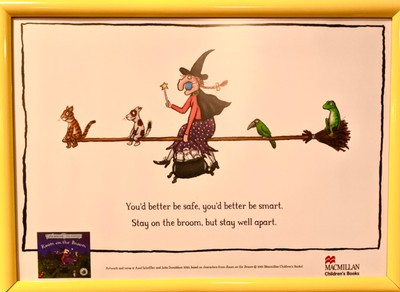

*Posters from Covid about social distancing by Julia Donaldson*

We parted ways with Jill and Peter so we could head to Bicester Village to see Kate and co, and went to Sainsbury's for cheap lunch en route. Kate thought it was totally adequate, Pat thinks you get what you pay for. While walking to the train station it started to rain, and on cue a distant brass instrument played the opening bars of Singin In The Rain. Violet was immediately singing and dancing along, and before the song ended we passed the busker playing a bright green trombone. The girls wanted to put money in his bag so we gave them each 5p. They went to put it in a competing busker's bag and had to be redirected by the trombone player's slide. He asked what they wanted to hear, the girls requested "Let It Go" and he obliged. The girls looked like stunned mullets, but eventually started smiling and wanted to give him more money for playing. Given we only gave him 10p for the song it seemed like a reasonable request, so we gave them a pound and they gave it to him and said thank you. Good manners.

We made it to the station just in time to miss the train. Luckily they were quite frequent, and we didn’t wait long for the next train to Bicester Village. On the way we played a spotting game looking for livestock out the window. Worried we might get to the next station before she spotted a sheep, Violet tried her luck convincing us thay the pond she saw was basically a sheep. Nice try, kid. Kate’s Dad, Nick, picked us up at the station walked us to Kate’s house. Side note, he had clearly grandparented before and deftly managed/redirected Margot’s big tired feelings on the walk.

At Kate’s we caught up with Brad and Luke, met Gill and Alya for the first time in a decade, and met John and Will for the first time ever. The kids had a play with Will, jumping on trampoline and making bracelets with little rubber bands. Once the rain stopped we walked to a local playground next to the building John and Kate would have their civil ceremony in.

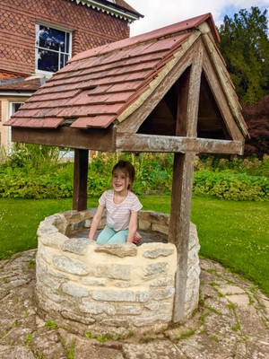

*Apparently Vi has been watching too much Zelda. As soon as she saw the well, she jumped in 'looking for faries'*

The playground was very cool with cubbies, climbing structures and a giant flying fox, but activity that got all the kids involved was a game called Jackpot which involved throwing pinecones into the fountain in front of the council office. At some point nature called and Pat wandered over to the loo. He was amused by a sign that warned him not to drop various items in the toilet. Pretty standard for a public toilet, except for the first item on the list: tea bags. The implication being that when you make your tea in the toilet you're supposed to carry the bag away with you and dispose of it in a bin, I guess?

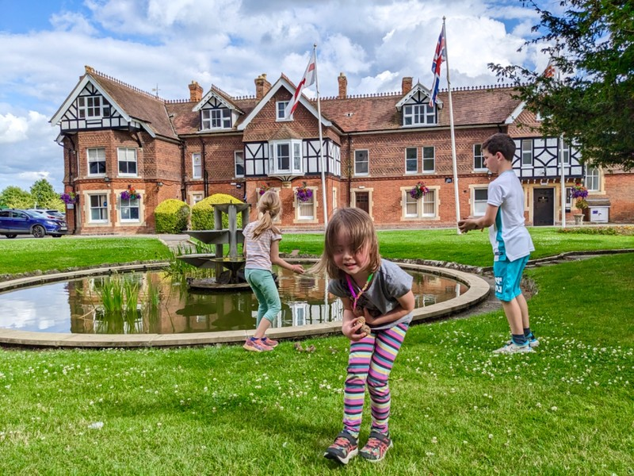

*Jackpot!*

After our playdate, we caught the train back to Oxford. By now it was already coming up on 7 and Margot would usually be in bed. We moved from the train to a bus and despite all our efforts finding the right ticket for all day travel, it didn't work. The kindly bus driver took pity on us and let us on anyway. The fool. Margot at this point was totally fed up and has a meltdown on the bus so spectacular that it offends the sensibility of the British people on the bus and they literally get up and move seats to get away from her.

On the walk from the bus stop to the house we can't seem to get away from a woman walking her two dogs. The girls love the dogs and the dogs love the girls. The owner is socially awkward so I can't tell if she's enjoying the attention from the kids or not, but the dogs are so excited to play with the kids that she really doesn't have a choice but to endure it.

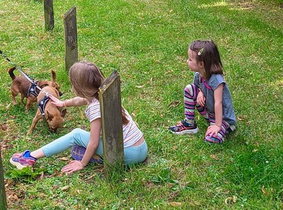

*Doggies!*

Eventually make it home to dinner already on the table from Jill (the joys of traveling with your parents) and put the kids to bed a bit late, but still a reasonable hour.

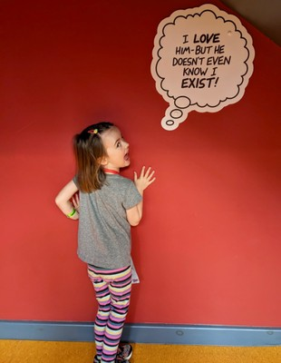

*Being hilarious at the Story Museum*

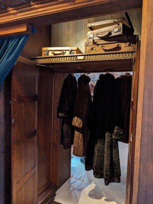

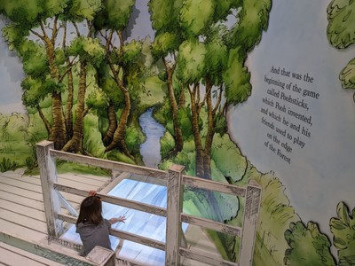

*Entry to Narnia and Poohsticks*

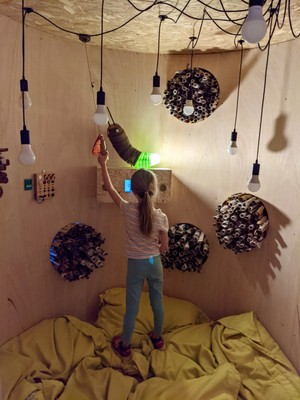

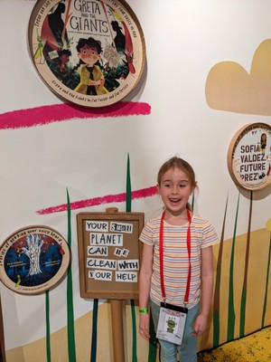

*Violet learning maybe?*
