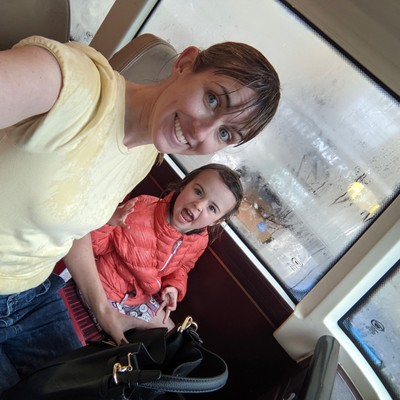
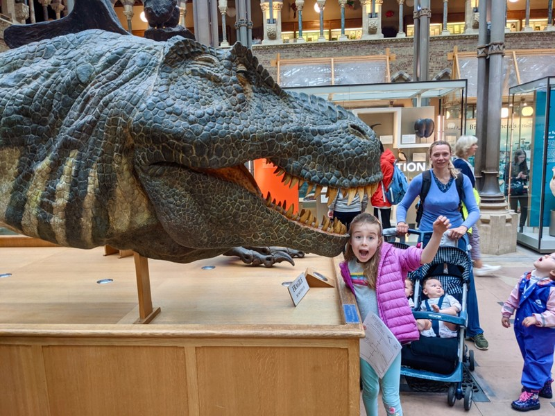
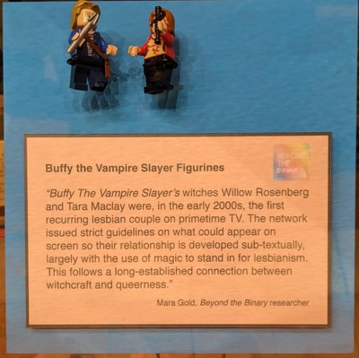
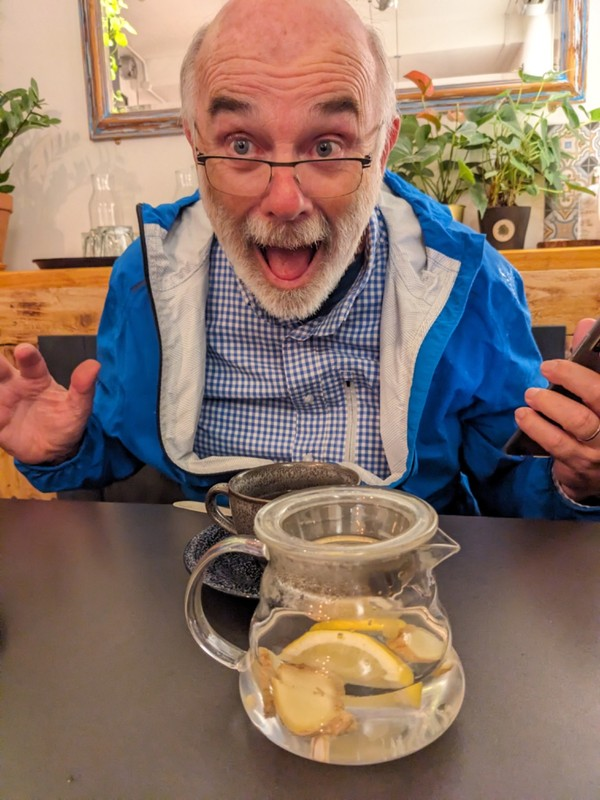
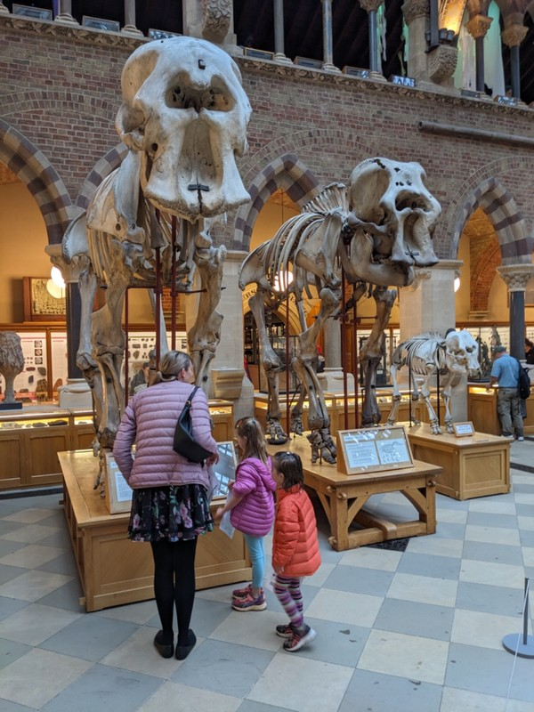
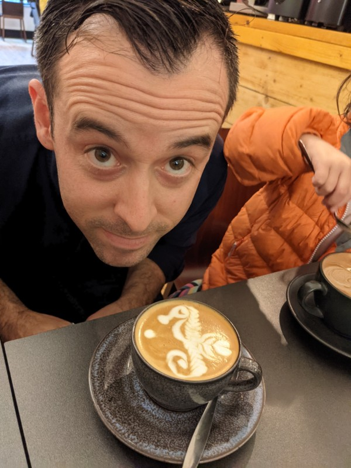
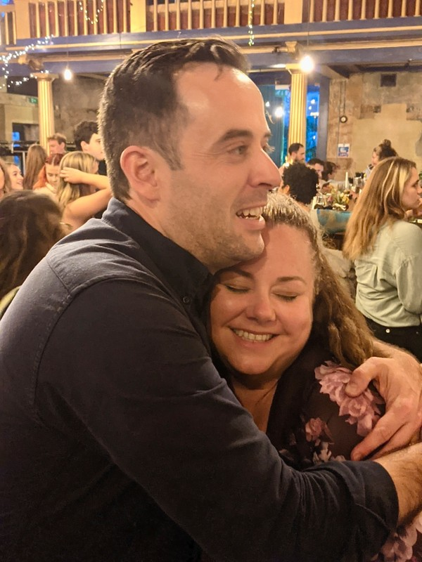
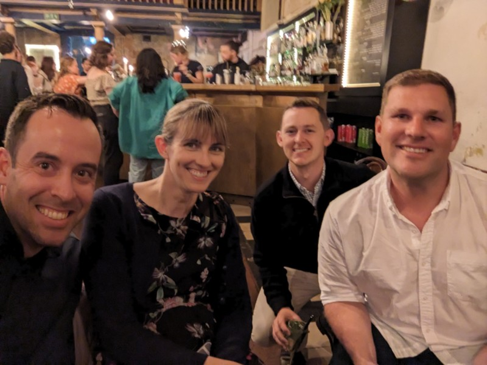

Quiet day today, with a lot of rain. In the morning we headed into the shops to get some bits and pieces and ended up completely saturated. At This point it was still fun for the kids, so it was soggy but not a drama.

*Soggy*

One thing was still bothering Pat: on which side of the footpath does one walk in England? He asked both Nick and Kate and neither of them had any idea. The English, who invented queuing and will get upset at you if you scoop your soup from your bowl the wrong way, don't have a shared understanding for which side of the footpath to walk on. Absolute pandemonium.

In the afternoon we were keen to go to the Natural History Museum before meeting Kate's side of the family for dinner. This time the rain had lost its novelty and the walk to the bus stop, then walk from the bus stop to the museum were completely miserable. Pat found two umbrellas, but one of them was mostly broken, which turned into completely broken when the wind turned it inside out

*You Didn’t Ask For Reality, You Asked For More Teeth!*

On the walk, estimated at 10 minutes on Google, we tried to keep the kids' spirits up, pointing out the beautiful old buildings, the golden gates, the enormous puddles on the road that almost swallowed cars (how a country known for it's rain has such poor road drainage is beyond me), and a wet bride and groom on a bicycle having a wonderful day despite the weather. The girls were not convinced. 25 minutes later the '10 minute walk' was over and we arrived at the Natural History Museum and met Nana and Grumps.

Once surrounded by dinosaurs, butterflies, dodos and grandparents, the arduous walk was forgiven and forgotten.

In the Pitt Rivers Museum they're not displaying the shrunken heads anymore. Questions people were asked to consider: how would you feel if you saw one of your relatives head in the display case? How would you feel if you saw your child's umbilical cord on display as a trinket? Also saw a set of lego Buffy the Vampire minifigs set amongst the countless priceless artefact respectfully relocated* from all corners of the world.

- * forcibly stolen

*Proof of Buffy's enduring cultural significance.*

We were having dinner at a nice restaurant with Kate's family, Brad, Luke and Alya about 10 minutes from the museum. Having learnt a lesson from the last walk, we made it two 5 minute walks with a hot chocolate break in the middle. Dinner was fun and the kids mostly behaved themselves.

*Grump unruffled by the lack of coffee art*

After the kids went home with Jill and Peter, we walked down the road to a bar called Freud. In addition to making a perfectly serviceable Old Fashioned, Freud was in a deconsecrated church built in 1834. Its claim to fame is that it was the first new church built in Oxford following the Reformation. It was kind of an odd experience sitting on what was once very clearly a church altar drinking cocktails, but hey, when in Oxford...

*Elephants*

*Seahorses*

