Today was Kate and John's wedding day. First was a lovely ceremony in Wolfson College which John used to attend. We'd only met John a few days prior, but you couldn't leave the ceremony thinking anything but the best of him and the couple's future with all the references to kindness, openness and the growth they've helped each other achieve. Will was very involved with the ceremony and at the pivotal moment did the old 'forgot the rings' gag, which got a good laugh. After formalities, there were snacks and drinks while the kids played laser tag and nerf. There was some rain, but not enough to impact the fun.

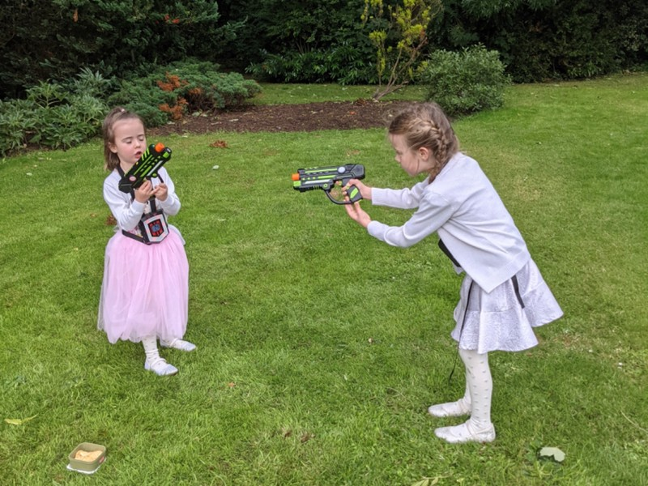

*Kids getting into the romance of the day*

After photos, we walked over to the Boathouse where the reception was being held. The kids immediately got into a Thunderdome style fight to the death to claim the ultimate prize of an inflatable champagne bottle. Friendships formed in fire? Pat and I determined the prime spot to catch nibbles as they came from the kitchen and set up there. Pork belly bites, crumbed haloumi, deep fried prawns and avocado toast. Yum.

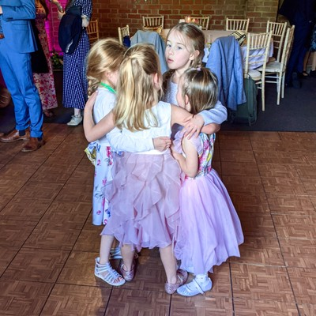

*The 'Little Girls Team' plotting how to destroy the 'Boys and Big Girls Team'*

Around when we moved upstairs for dinner the kids started getting overtired. We decided to call in reinforcements and asked Jill and Peter to come and get the kids early. They came about 6pm and took the kids home in a taxi, which was a good decision in the end: there was no way they were going to last another hour, let alone the rest of the evening.

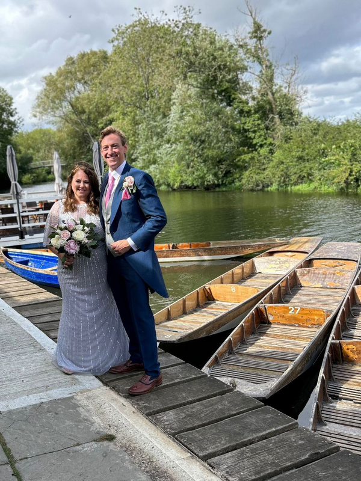

*Happy Couple*

With the kids out of the picture, we could focus on socialising with friends and relaxing a bit more. Someone suggested a drinking game for the wedding speeches: everyone wrote down a word on a napkin and put it in a cup. We all took turns drawing the words back out of the cup. Every time your word was mentioned in one of the speeches, you had to drink. Kate drew "family" and Pat drew "here". Surprisingly each of our words only came up 2 or 3 times between all of the speeches. The couple next to Pat both drew 'Will' and didn't have such an easy time.

In her "thank you" speech, Kate revealed that their gift to Will for his help was two new kittens for the house. Gill looked bemused about this decision- cats will now outnumber humans in the household. Still be less trouble and stinks than our two fat staffies though.

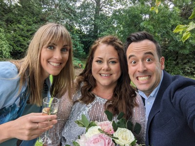

*Adelaide Reunion*

Back downstairs and a small band started playing music and got us into Ceilidh dancing.  Brad insisted on calling it Kylie dancing in honour of Ms Minogue, and also to annoy the bride. Pat and Kate both participate in the first round which involved a lot of toe tapping, holding hands while running around in circles. Good times were had by all. When the band took a break, Horses started playing and all of the (a few drinks in) Australians gathered together and started singing for some reason. Apparently that's our national anthem now? Why do we both know all the words? Is this the mind control the Illuminati are exerting with fluoridated toothpaste?

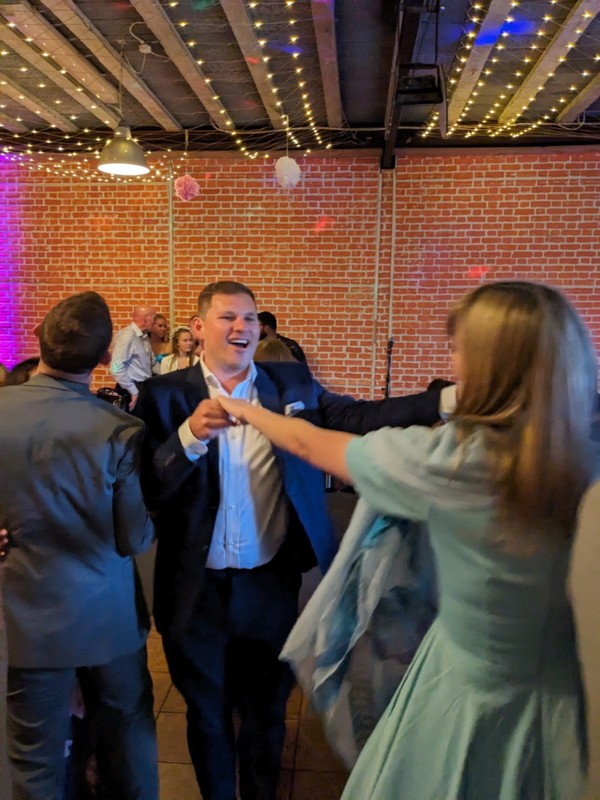

*Dancin'*

At 11, the music turned off and the lights came on. We thought we'd go on for an hour with Brad and Luke, and talked John's best man, Joff, into coming too. What followed was an odd, meandering night. It took ages to get going, then when Pat, Joff and I finally got an uber to Brad's address we couldn't see a way in. We spent some time standing in the rain trying to call one of them. Eventually someone came and showed us the way up. We sat around the loungeroom chatting while Luke attempted to order drinks to be delivered. It didn't seem to be successful, so the decision was made to go to a club. Just as we walked out to get a cab, the drinks arrived. A case of beer, plus an extra 3 loose bottles.

I still don't fully understand Luke's logic. "There's 4 people who have come over for a nightcap, better get a case of beer. No, 24 bottles isn't enough, I better order another 3 single bottles too. Yes, 27 beers is exactly the number of beers we need to see out this evening." I think there were a couple bottles of Prosecco in the box as well.

We took the drinks in, put them in the fridge, then went out again and got a cab to Plush, a busy EDM Club in a bunch of interconnected cellars underground in the old town. Having finally made it somewhere, we left 10 minutes after arriving because Joff and Alya had something else in mind when they heard the word "club". At this point, we gave up in favour of going home way later than intended for an inadequate nights' sleep.

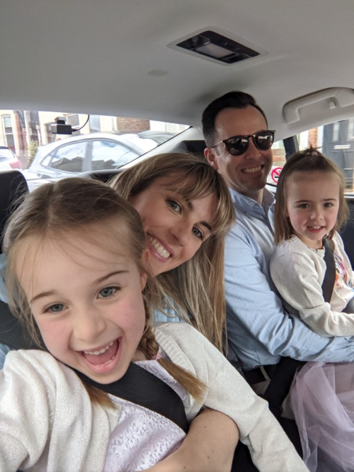

*No Carseats in Oxford- Lapspace Only*

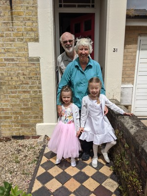

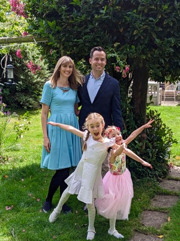

*Family Photos*

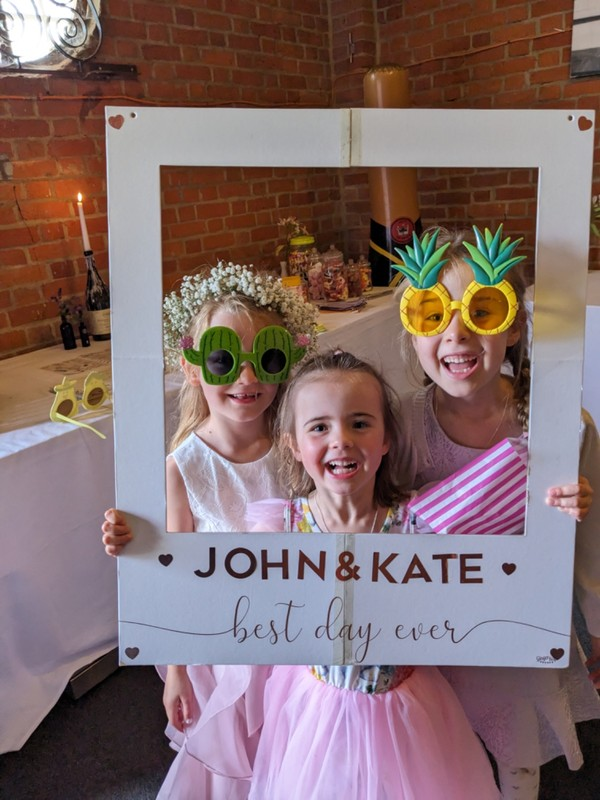

*1. LittleGirlTeam4Eva*

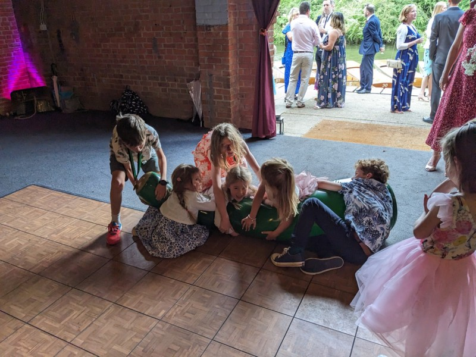

Margot Witnessing the Carnage

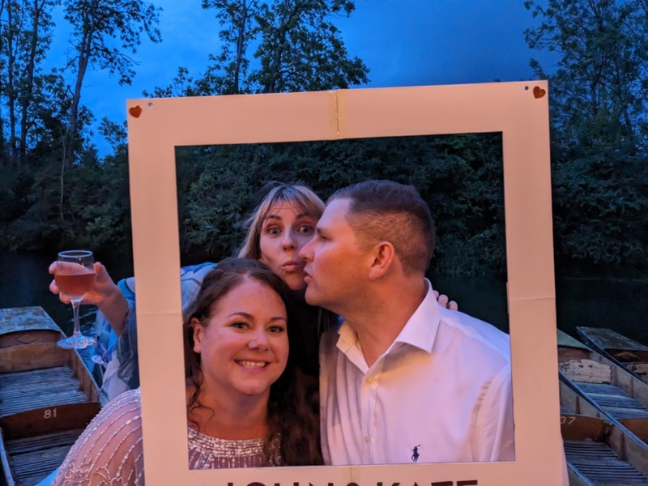

*Kate Photobombing Kate*

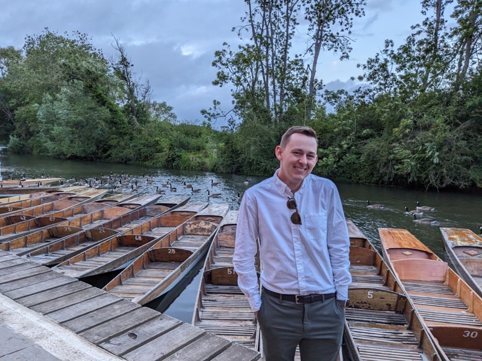

*Luke Being Cute with Geese*

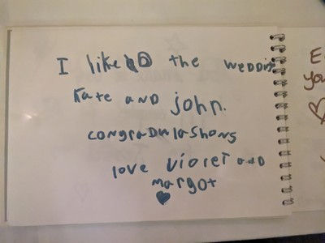

*Vi’s Guestbook Entry*

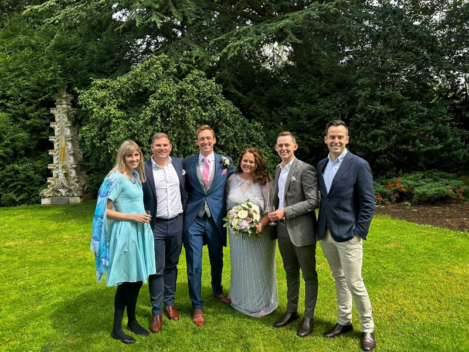
