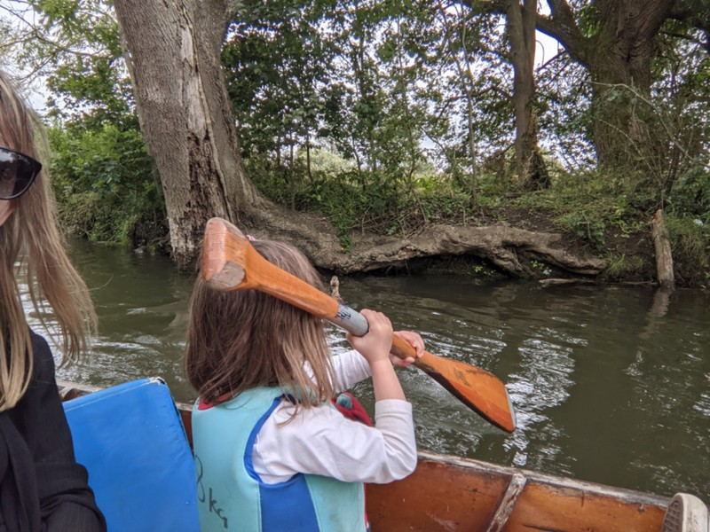
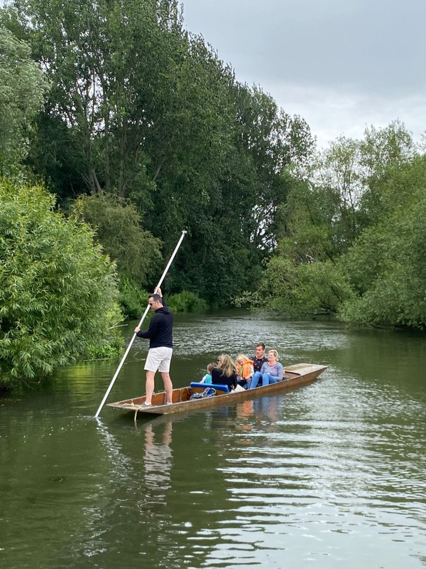
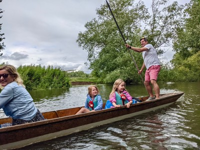
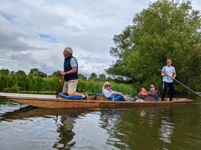

Tired, lay down while the kids watched Alice In Wonderland. Eventually pulled ourselves together and walked back to the Cherwell Boat House for punting. Not hunting as Pat initially understood. The walk to the boathouse involved a meandering stroll along the river through a quintessential English garden. Lots of wild flowers, long grass, and trees. Vi noticed the lampposts were like the ones in Narnia. Sounds correct given C.S. Lewis wrote the book living in this town.

We were one of the last groups to arrive and made friends with another family that had two kids similar in age to ours. Violet joined another boat (punt?) with Becky and Simon and their kids. Margot stayed with us, our new pals, and their 4 year old, Mary. On the first leg of the journey, Foz took control of the pole and admirably punted us up the river towards the pub. About halfway he asked if Pat wanted a turn. Feeling cautious, tired, headachey, and hungover, Pat declined and said he'd take the return journey, hoping that he'd feel better after a big greasy pub lunch. Quite the gamble.

*Mary and Margot did a good job taking turns with the oar and "helping" paddle us up the river.*

It started raining shortly after we got to the pub. Not bad timing, really. There was a mysterious hole in the roof which was right behind Pat's chair so he got a bit wet while waiting for lunch. A roast beef, flat white, and a full litre of Pepsi later Pat was feeling slightly more human and excited to give this whole punting business a go.

Navigating away from the pub was a challenge; the boats didn't have an obvious reverse gear and Pat was pretty damned incompetent (and still quite hungover). But once we got away from the pub we made reasonable progress down the river back towards the boathouse. We floated mostly in the right direction and only had a couple close calls when the pole got stuck in the bottom of the river and almost pulled Pat in when he tried to retrieve it.

*Punting Patrick*

Back at the boat house standing on the shore waiting to pay, Pat felt a fly tickling his leg. He kicked his leg to try and shoo away the fly. Unfortunately, it wasn't a fly, it was Margot. And Pat's kick caught her right in the face. She was rightfully upset and wouldn't let Pat comfort her. Eventually she forgave him, but she was sporting a shiner for the next few days as a reminder of Pat's abusive parenting.

Before we left, Kate retrieved her wedding cake and parcelled bits out to the kids. Kate was surrounded by half a dozen kids all picking bits of cake off the foil and competing to get more than the child next to them. It was a bit like watching hyenas pick at the carcass of a kill.

We finished the day with long goodbyes to Kate, Brad, Luke, and all the new people we'd met over the week, another peaceful country walk back to the house, and a very early bedtime.

*Vi with her new friend Izzy*

*John and Nick had clearly done this before*
