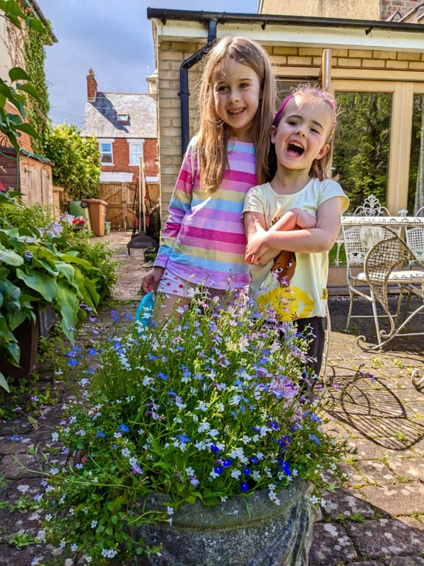
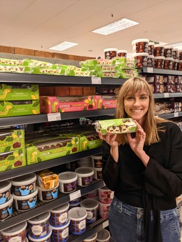
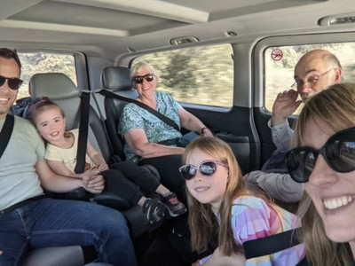
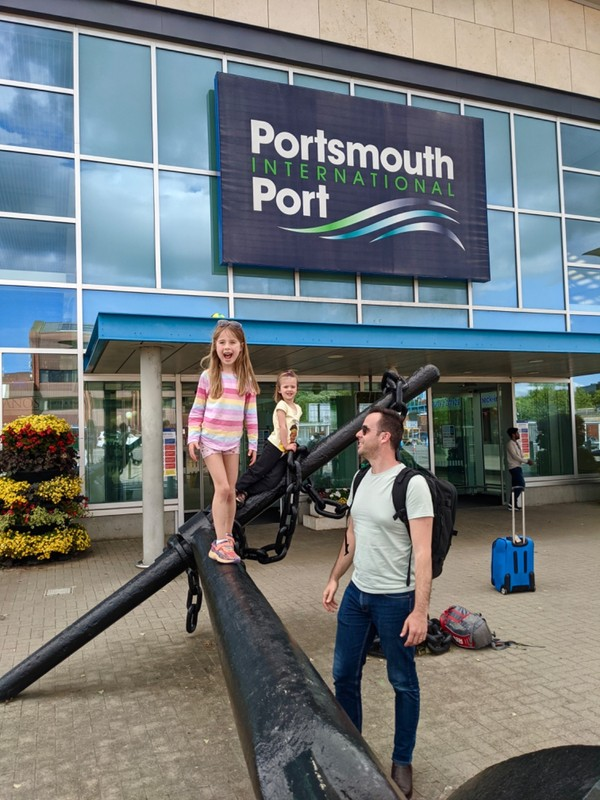
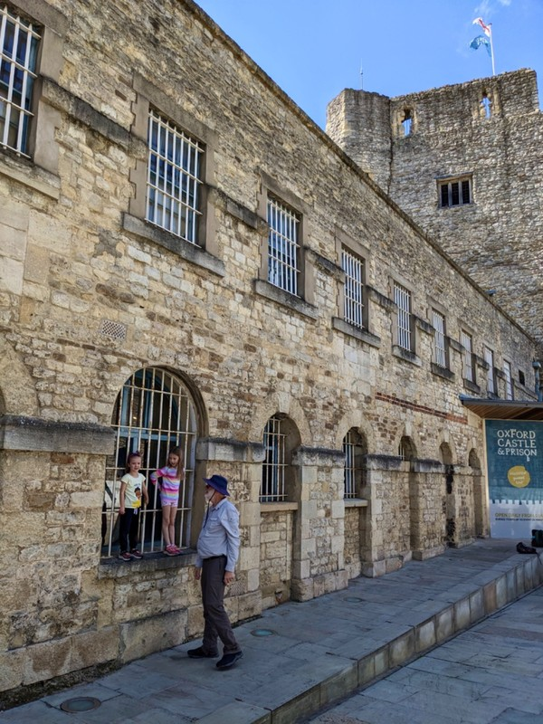

Today's the last day in Oxford, and it's actually sunny and beautiful. We’re heading to Portsmouth in the afternoon to catch a Brittany Ferry to St Malo, France. We didn't get any packing or organisation done yesterday because we were dying from lack of sleep, so this morning is busy collecting all our scattered belongings. We spend a little time in the gorgeous garden we've mostly avoided with all the wet weather, then catch a bus into town to look at some of the historical buildings while we're not being pelted with rain.

*Lovely When the Rain Stops*

We wander the central part of town, check out the exterior of the castle ("The Queen died and The King will die soon too" Margot presages), admire spires and ivy, and pass the alley to Plush (calm and picturesque in the day time). There is no space on the footpaths; tour groups are everywhere acting like enormous amorphous blobs that can't possibly break up to allow the children to walk on the footpath instead of the road.

*Finally, we have a detour to collect a true English delicacy from Marks and Spencer as directed by Luke.*

We grab a bus back towards our Air BnB and pop to the local pub, The Up In Arms, to meet Stuz for a quick lunch. He and his family are doing a UK road trip and very kindly got up early and rushed from Plymouth so we could have a little crossover in Oxford. We sit in the garden sunshine enjoying fresh woodfire pizza while the girls make magic potions and play 'table tennis'.

*Heeeey Stoozie*

A car comes to take us to the ferry terminal in Portsmouth. The first 10 minutes of the ride is very high energy as the kids find a stowaway ladybug on Margot's shirt, then make up a loud song with the lyrics "I see me, I see you and a coconut too" repeated ad nauseum. Then the energy runs out and they both go to sleep, followed soon after by Pat and Jill. This makes for a more peaceful ride the next hour and a half.

*How it started/How it's going*

In Portsmouth we sus out the Seaport, then pop next door to The Ship and Castle, a very cute dog-friendly English pub, for dinner. Vi makes friends with two dogs- she tells me the Labradoodle, Freddy was the jumpiest and the Retriever was the lickiest.

*Ready to Raise the Anchor!*

After a really nice home-style meal, we potter back and board the ferry. Jill and Peter luxuriate in their Commodore Suite with three separate beds, a study area, a bathroom with separate toilet and included breakfast. The four of us make our way down to steerage and squeeze into our room of half the size, and compress into bunk beds. You could almost hear Kate/Rose and Leo/Jack enjoying some Kylie dancing in the next room. It takes the kids some time to settle, but eventually we make a go at sleep. Kate is awake most of the night as her bunk has a loud squeak directly adjacent to her head. She seems to be adjusting to sleeping only every other night. Margot wakes up a few times when the boat rocks and froggy leaps to the floor. Violet sleeps like a log. And when we get up in the morning, we're in France!

*Castle Snaps*
