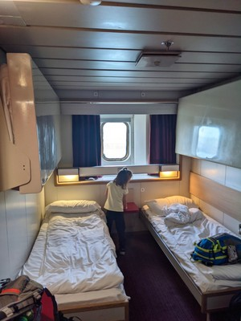
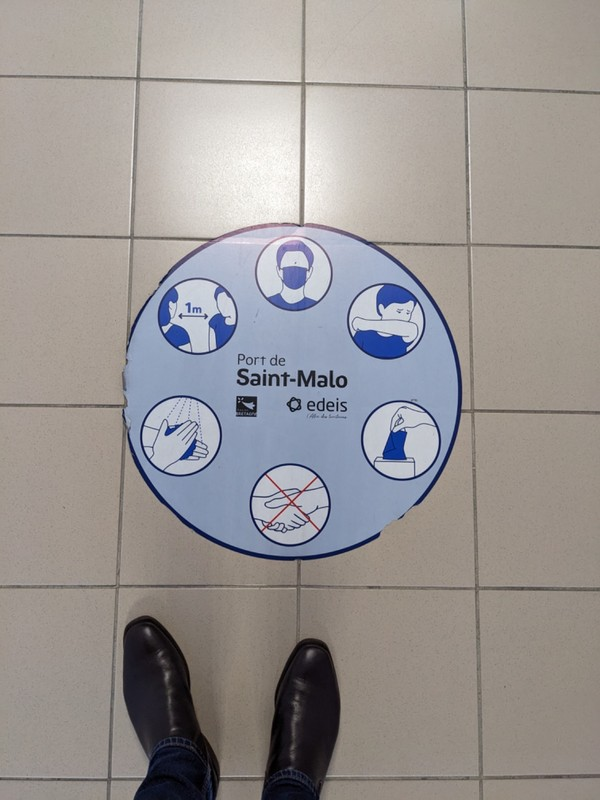
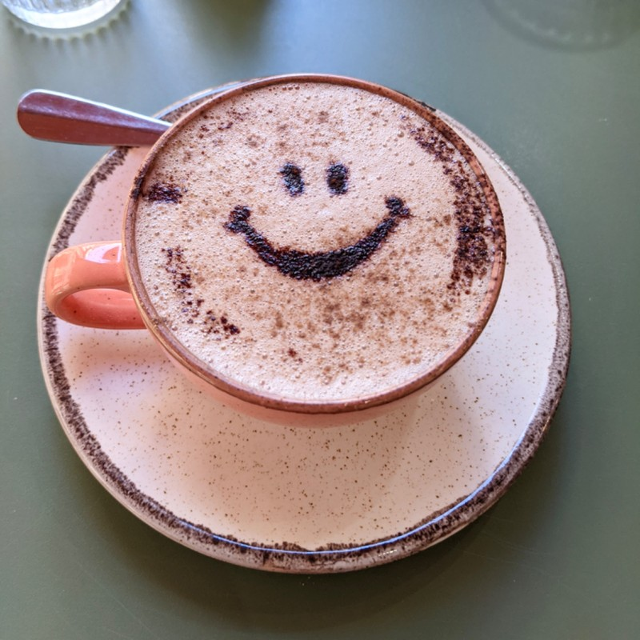
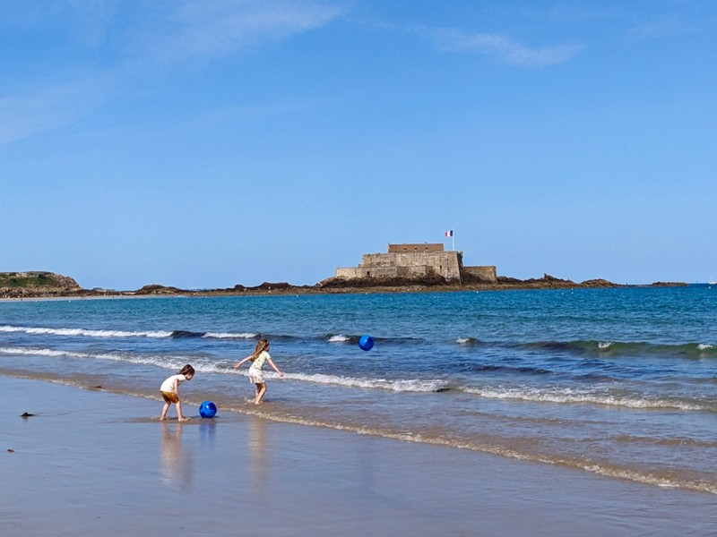
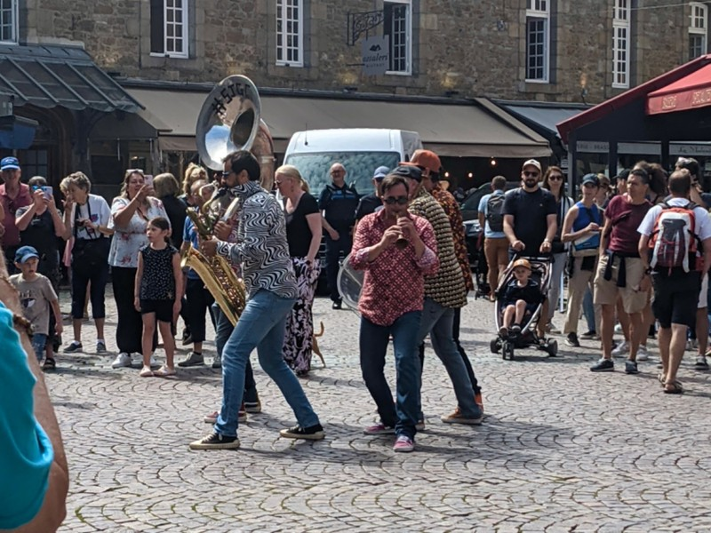
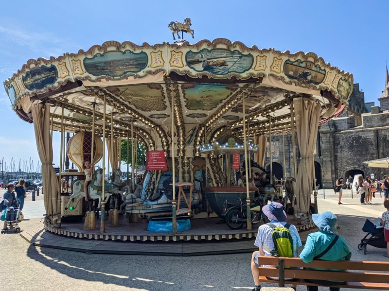
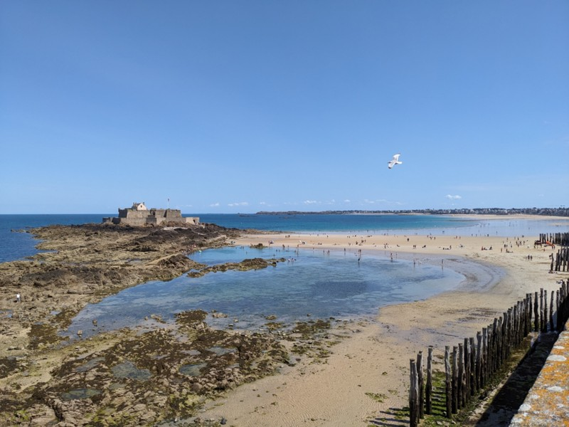
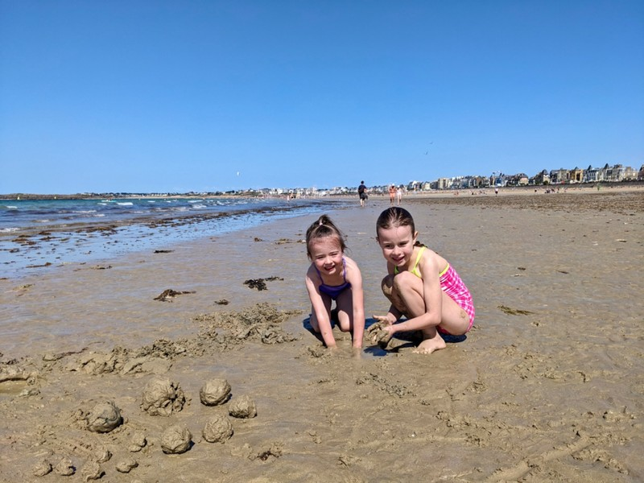
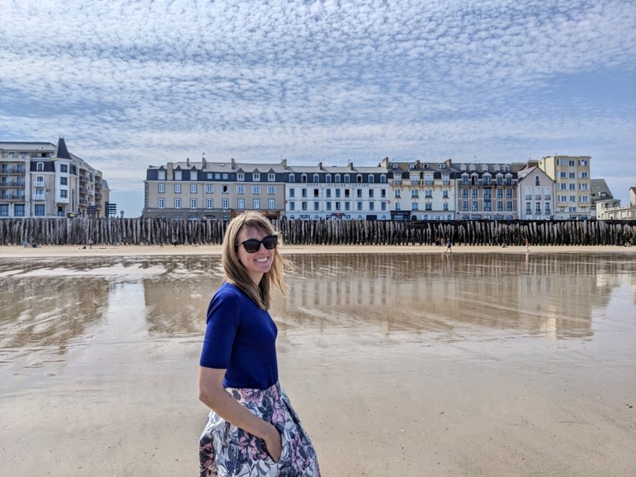
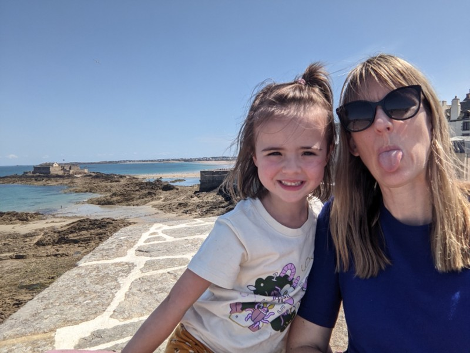

We're all booted out of our cabins shortly before the boat docks. We congregate where we came onto the ferry on Deck 6 and await instructions on how to disembark. After 30 minutes of instruction for people who came in cars, we're up: "Piétons- exit at door 3C". No explanation follows on where this mystical door is in the 10 deck ship that carries 2000 people. Chaos ensues in a Scooby Doo sketch with passengers going up and down stairs, in and out of doors, bashing the lift button with luggage, kids, and probably a Great Dane calling "Scooby Dooby Doo"! At one point I pass Mum- she's going down a staircase adjacent to the one I'm going up. But we are unable to get back together because hers is only between even decks and mine only between odd decks.

*Our spacious accommodation*

Jill decides this is crazy and we should just ask the staff where to go. She finds a French woman at the info stand, who argues with her about whether there had been any announcement for pedestrians at all, then when it was clear there had been an announcement while she was not listening, she proceeds to argue about whether Mum is allowed to go on the stairs and refuses to tell her where Door 3C is.

Somehow, the coalition of Piédtons find their way one by one to an overcrowded bus, which drives to freedom. Raise a glass to the poor souls who were lost along the way and are ferry people now.

While Kate, Jill and the girls head off in search of breakfast, Pat and Peter stay behind with the bags at the ferry terminal, bubbling with optimism that they'll grab a taxi which will whisk them and the bags to the hotel where they can be safely stored until check in later in the afternoon. But, the reality of France hits them like a ton of bricks. They waited in a ramshackle queue for 25 minutes with no sign of a taxi. Pat tries Uber to no avail. Finally, a taxi comes to drop someone off for the next ferry. The group in front of Pat and Peter approach the taxi hoping to catch a lift into town. The taxi driver looks annoyed, looks at his watch (in an annoyed fashion), gestures towards the road saying, "mon collègue arrive". He hops back into his car and speeds away.

*Another COVID Reminder- Interesting That It’s Only 1m*

Okay, well that was weird but I guess he has another fare that he's going to get and his colleague will be here soon. Another 10 minutes and the same driver comes back and drops off more passengers and refuses to pick anyone up from the port. At this point Kate's already walking back to the port to help Peter and Pat walk with the bags to a cafe for breakfast under the assumption that a taxi will never come. Just as she arrives a taxi finally pulls into the queue and after pausing for half a second starts to drive away again. Pat chases him down and asks for a ride. He begrudgingly agrees and hops out to open the boot.

He then stares in disbelief at the luggage before him, as if he's never encountered a suitcase or a backpack before. He puts one bag in the boot, puts his hand to his chin and says something to the effect of "no, they won't fit". Pat says there's only two people, so we can put some bags in the boot and some in the back seat. Can't we at least try? No, he says. You need un taxi grand. He then removes our bag, closes the boot and drives away. We pick up the bags and walk.

Sometimes the French suck.

*Cafe Could See Pat and Grumps Needed Cheering Up*

During the wait for a taxi, Kate, Jill and the kids walk into the genuinely stunning old town (like Kate was actually stunned). It's surrounded by high stone ramparts, and inside are narrow lanes with beautiful historic buildings linked overhead with bunting and lined with flowers. We found a cute cafe and ordered breakfast (including a flat white, which we're finding is a standard menu item in Europe now) and waited for Pat and Peter.

Once we were all together, we had breakfast, then walked to hotel along a path near the beach. This town is the definition of picturesque.

After dropping off the bags, and picking up some free beach balls, we walked back to the old town along the beach. The kids took it to heart when we told them not to get too wet and made sure they didn't get wet past their necks. Sigh.

*Beach Fun- Fort Nationale in the Background*

Old town is lovely, but so busy. Jill and Peter were here a decade ago and said it wasn't anything like it is now. We had crepes and a quiche. Vi started asking people 'je peux caresser votre chien sil vous plait?"

We visit the cathedral, which holds the tomb of Jacques Cartier. Contrary to our assumption, he was not a watch maker. The tomb describes him as the discoverer of Canada. This caused some consternation on Google where the top review points out that actually, people were already living in Canada before 1534 and the colonialist version is a bit on the nose in 2023.

There were also plaques referencing the Siege of Saint Malo in 1944. Apparently the town was occupied by German forces during WWII, and was bombed by the Allies in 1944. During the bombing, the massive cathedral spire was knocked over. There were fires all over town, the French believe these were set by the Germans burning code books. No one could put them out because the Americans had cut the water to the town in an attempt to force the Germans to surrender. In frustration, the Germans arrested all the French male civilians in the town and jailed them in Fort Nationale off the coast. 18 of these men were killed in an American bombardment, and there was a plaque commentating them in the cathedral also.

*Roaming Minstrels*

After visiting the cathedral, we had a walk along the ramparts. St Malo was founded in the 1st century BC, but became very rich through 'privateering' (legally approved piracy) in the 1600s and 1700s. The ramparts were built around that time to keep competing pirates out. We visited a tower that used to act as a powder magazine and was attacked by the Dutch in 1693. The Dutch sent a ship filled with explosives to run into the tower, but missed and instead ran aground further up the coast.

On the walk back to the hotel to let the kids have a rest, we stopped for a ride on the carousel just outside the old town wall and got the kids an ice cream to keep them occupied on the walk. Perhaps not the best idea when we're hoping to get them down for a nap, but we're not the most clever parents on the planet...

*Carousel*

Despite the sugar hit, everyone (Pat and Kate included) managed to have a solid snooze for an hour. We got the kids into their swim suits and went for a play on the beach. St Malo has massive tides, so we walked more than 100m out to the shoreline and set up shop for the girls to have a bit of a play. It was an hour past low tide, so we knew the tide was going to start to come in soon. The water was clear, but cold as the tide starting coming in. Margot made a special walled hole for the inflatable ball to stay in and told us the recipe to make wet sand for the walls. Sure enough, the tide started to come in quick and we had to retreat 10m a couple times before we called it a day and went back home for a shower and clean clothes, then off to dinner.

It seems we all forgot that the French don't like to eat early and nowhere was open for dinner before 7pm. After a lot of searching, we found a place that opened at 6:30 and figured that was as good as we were going to get. Uneventful dinner and walk back to the hotel for (hopefully) a good night's sleep.

*Scenic*

*Wet Sand Balls by Margot*

*Scenic*

*“Make A Silly Face!” Says Margot, Then Smiles and Leaves Mum Looking Ridiculous*
