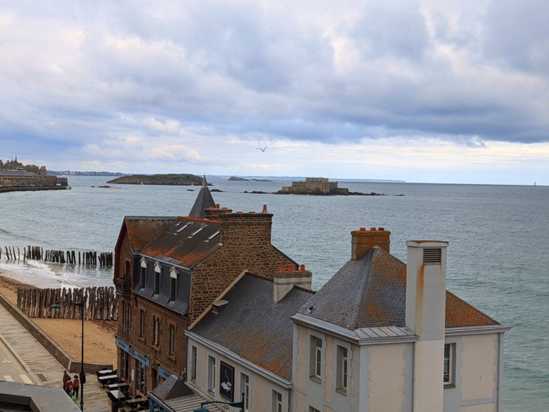
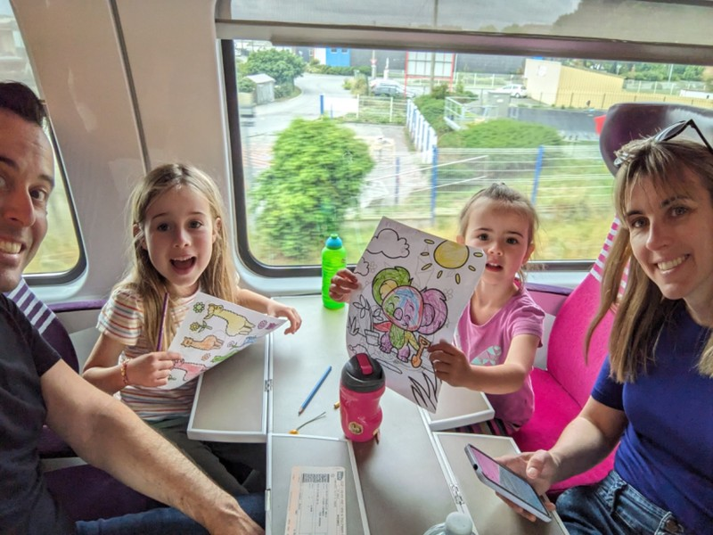
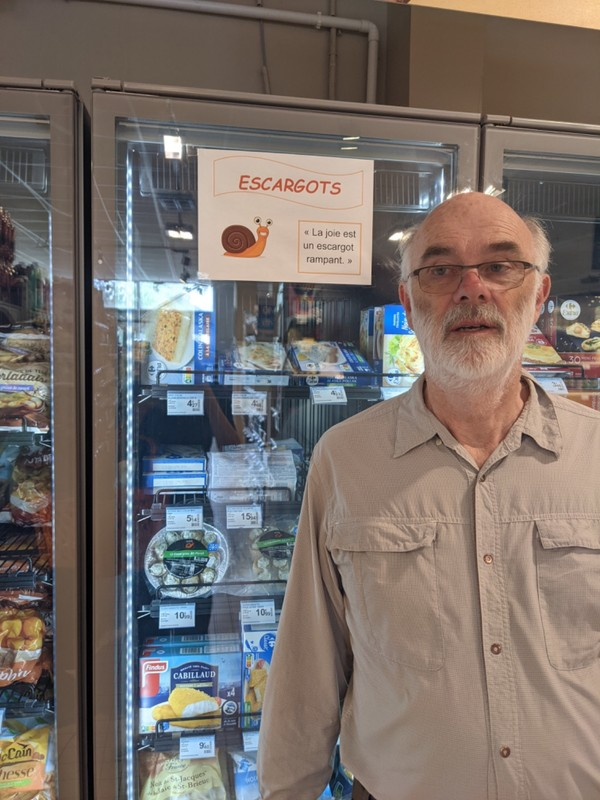
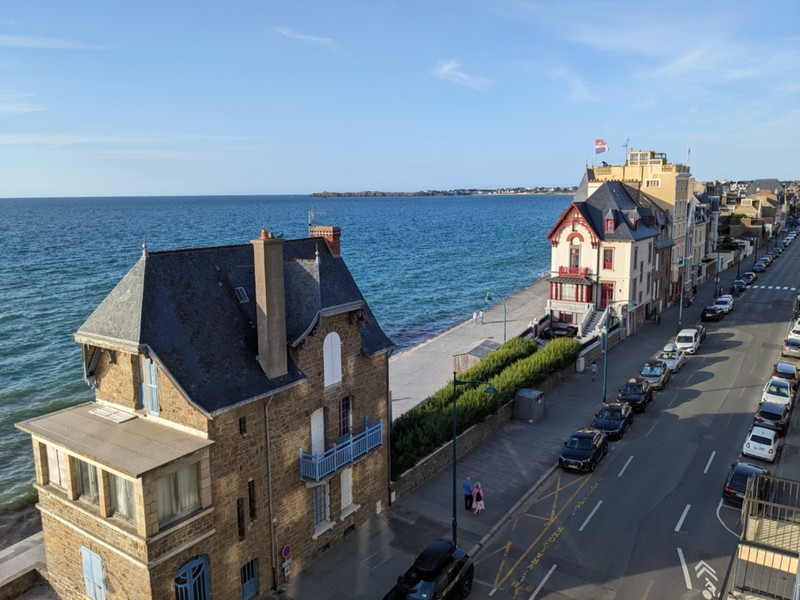
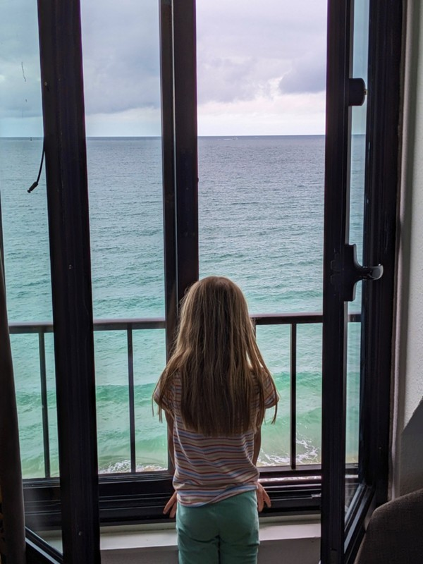

Today we transit from St Malo to Rennes, then Rennes to Rohan, the location of our B&B stop in Brittany.

We wake up to a very nice buffet breakfast. German, English and French tastes are all catered to. Pat tries one breakfast of each type; the life of a Hobbit would suit Pat just fine. Then we have to say goodbye to our beautiful view and walk to the train station. It's about a 20 minute walk, and the kids carry their backpacks the whole way. I think they're starting to adjust to being pack mules. We get on the train to Rennes just in time.

*Say Goodbye To Our Room With a View in St Malo*

Violet wants a note that she loves that dogs are allowed everywhere. "They're so cute and they know how to use escalators. Our dogs would get their bottoms stuck in an escalator. They're even allowed in the shops! But they couldn't eat everything in the shops. Maybe they could get a free fruit in Woolies..?" she ponders.

In the train station in Rennes we find the car rental shop and are given a printed set of directions, complete with pictures, to help us navigate to the parking garage where we collect the car. We exit the station, follow our treasure map into a parking garage, through doors, down a rabbit hole, up an elevator, through a portal into another dimension, and end up at a kiosk on the top level. Could we be stealing a stranger's car from some random valet service? As long as they're willing to give us a car it's best not to ask too many questions.

*On The Train*

While the car we're given does indeed have enough seats for everyone once the 3rd row of seats are installed, luggage space is practically non existent in what could only very optimistically be considered a boot at this point. We fill every nook and cranny between people's legs, on the middle row of seats and somehow manage to fit all our bags in. Pat doesn't mind since he's driving and has all the legroom he needs, but everyone else is packed in like sardines for the drive to Rohan.

Outside Rennes, we stop for lunch and a toilet. At this point, we're reminded that there are no toilets in France. Either everyone here only drinks liquid when in their own home for the entire day OR they don't travel outside a 'I need to zoom home to pee' radius. End up buying $100 overpriced ham sandwiches to get to the toilet in the restaurant rather than getting lunch for less than half that from the boulangerie across the road. Jill starts what will be a trend and orders a coffee with her sandwich, which never arrives.

On the drive we see so much corn and so many tractors. Incredibly scenic countryside which we've come to expect and love from France. In the last 5km, we come across detour signs telling us the road ahead is closed. This would become a theme of the next week. Thankfully Google Maps handles all of our random turns with ease and keeps us heading in the right direction.

*Grumps Unsure About The Frozen Food Options*

We also pass heaps of cows on the drive, who always seem to be laying down. Lazy French cows.

Finally, we check in to Central Brittany B&B, a lovely place run by Sharon and Pete, a couple of British expats. We pull up the driveway to a broken retaining wall out front. Sharon did message us ahead of time to warn us about this- apparently it was broken during city works in February. After months of arguing with insurance, some tradies showed last week without any notice and did some demolition. On their way out they let Sharon and Pete know the builder would come to repair the wall as soon as he was free. In April 2024. Unreliable tradies and bureaucracy know no geographical bounds. The place consists of three guestrooms, so we own the upper floor.

We finish the day with a three course meal prepared by our host Sharon. First a platter of finger food. Kate particularly enjoyed the rounds of honey drenched camembert on fried baguette slices. Violet liked the dates stuffed with blue cheese and the toast with pesto, fresh tomato and black olive.

The main was individual dishes of zucchini and potato gratin with salad (macaroni cheese for the girls). We finished with chocolate brownie with ice-cream and whipped cream. Yum.

*More View From St Malo Hotel*

*And One More*
