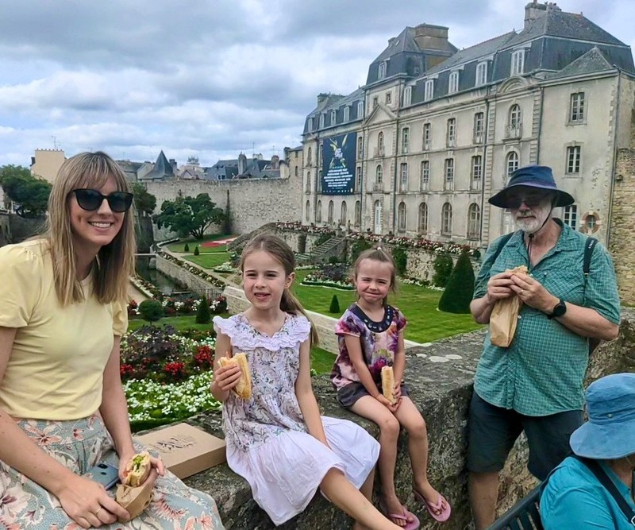
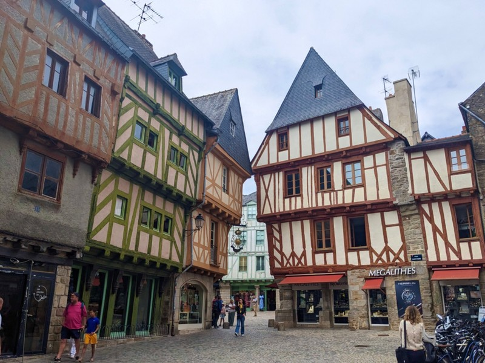
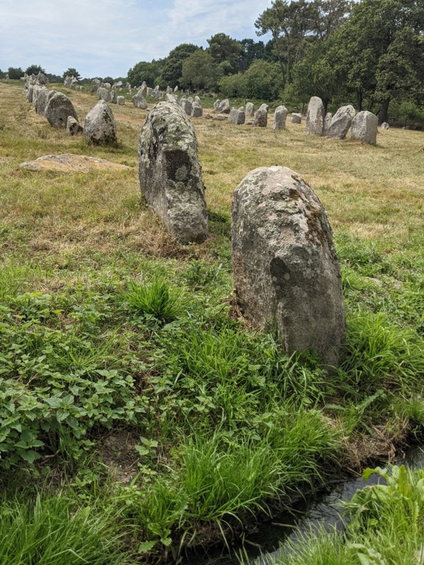
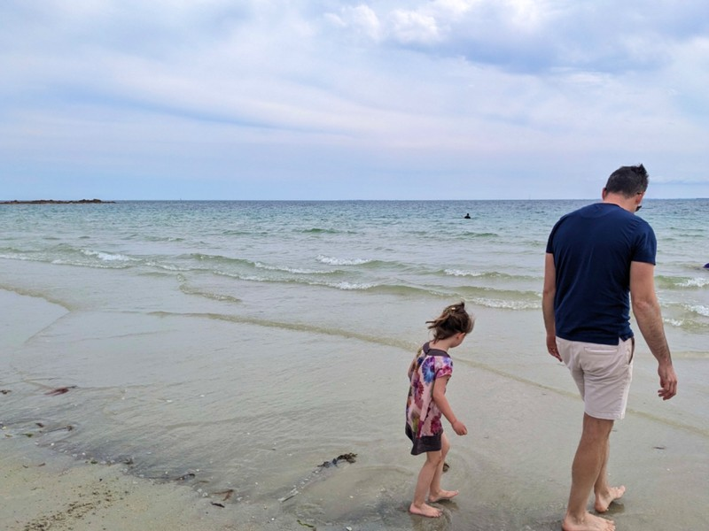
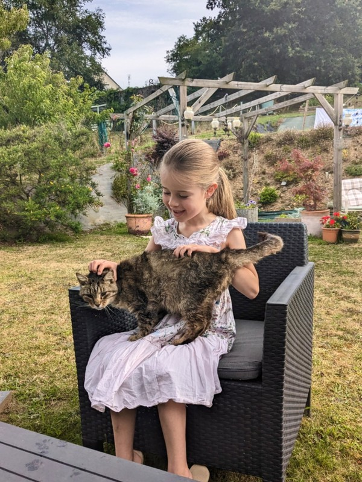
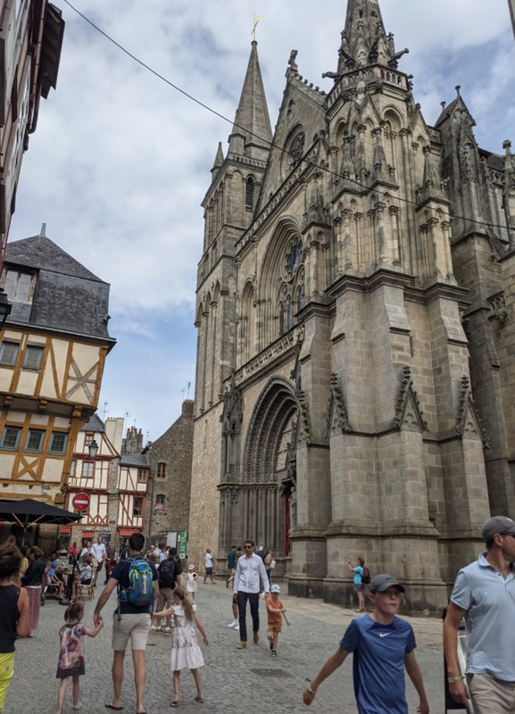
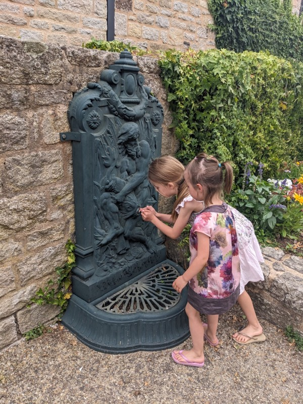
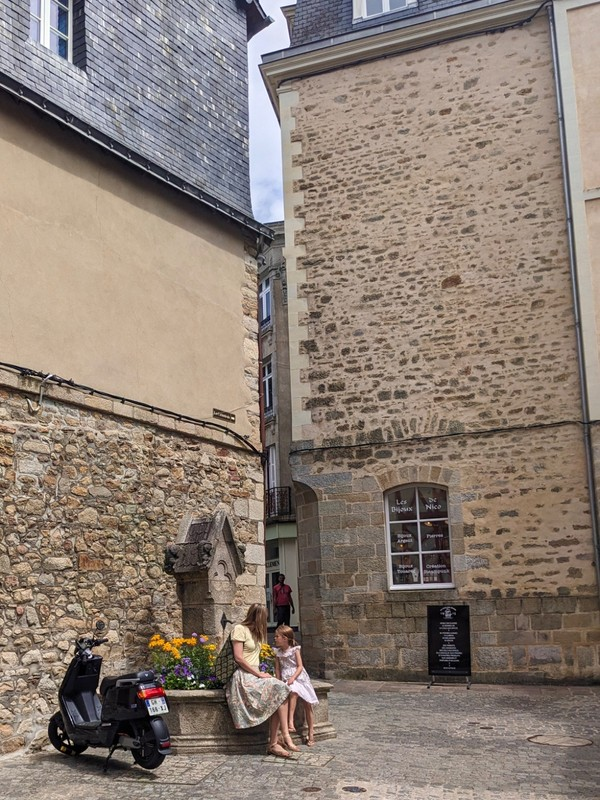
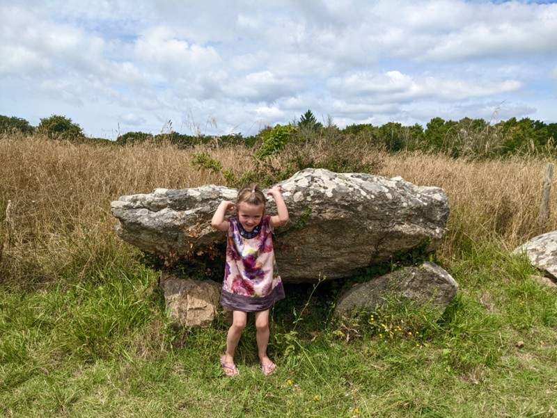

Slow start to the day today. Eventually we head to Vannes for lunch. We drive along a brand new road: Google hasn't even mapped it yet. In Vannes we find a boulangerie to pick up some fresh sandwiches for lunch. Instead we have an argument with Violet who is very disturbed that French boulangeries don't put grated carrot on their sandwiches. We find a beautiful garden to eat in, then arrive to find it closed.

*We Eat on a Wall Looking Down at the Forbidden Park*

Vannes has another pretty old town, but very commercial. Creperie, cafe, miel et confiture, clothes, glace, crepes etc etc. The cathedral did have an interesting display of European and Catholic history since the birth of Jesus noting historical events around the world over the last 2000 years. Kate could have spent an hour or more looking at it, but we got about 10 minutes before the kids got bored.

*Half Timbered Houses in Old Town*

On the way back to the car we get a Whatsapp notification that the Paris apartment we're meant to stay at in 5 days has cancelled our booking at no notice. Fab.

We take another scenic drive to Dad's choice, the Alignments de Carnac. Kate was dubious about looking at old rocks, but was quite won over once we arrived. The rocks are aptly named Alignments- they're rows of massive granite rocks, up to 4 metres tall. They were placed in 3200-4500BC and are the largest group of alignments in the world. Standing looking at them in person, its really impossible to imagine how anyone dragged them there and stood them on end without any machinery. What a massive effort. Also hard to imagine why? The Christian myth a few centuries ago was that they were pagan soldiers turned to stone by the Pope. They get smaller down the rows- is this the parents forcing the next generation to add to the alignment and the kids rolling their eyes and selecting increasingly small boulders , or is it the kids showing up their parents by selecting increasingly large ones? Unsurprisingly given its been 6000 years, the rows are incomplete. Farmers have moved some, and the government had pinched some to build roads. It's a little unclear if they're protected even now.

*Didn’t Take Any Good Photos Here- I Promise it Was Impressive*

Then the kids pick- the beach. Carnac Beach is a surprisingly nice white sand beach. There are lots of yachts out on the water. The local kid's game seems to be "dig big holes". Vi is on board and gets stuck in right away.

After the requisite tantrum leaving the beach from both kids we start driving towards home. We debate (read: argue) about whether we should go home and clean the kids first, or get food from the grocery store to reheat at home (but is it appropriate to ask to use the kitchen of the B&B to reheat our food??), or get take away food, or go to a restaurant? It's really a moot point since we can't find anything that's open anyway given it's before 7pm. Sigh. We agree that we'll just have to change the kids sleep schedule to accommodate the local time: late to bed and late to rise.

*Beeeeeach*

Google suggests a pizza restaurant to us on the way home, which we collectively decide is good enough to end the debate (read: argument). On arrival we find out it's take away only so we'll have to find a park bench to eat on. The pizza guy must have understood Pat's struggle on a cosmic level because when Pat grabbed a beer out of the fridge and went to pay for it he refused Pat's money and told him it's free.

Pizza's in hand we look through the old town square for a park bench, but the square has been turned into a parking lot with no public facilities to speak of. Joni Mitchell would be disappointed. With options running out, we just stand on the side of the path and eat, much to the amusement / judgement of the locals who tell us "bon appetit" as they pass.

The day ends frantically searching for accommodation in Paris for 6, centrally, with air conditioning, for cheap, with no notice. Relaxing holiday activities.

*Friendly Cat at Central Brittany B&B*

*Impossible to Take Straight Photos in Vannes Where Everything is Wonky!*

*Playing With Bubblers*

*Kate and Vi Dreaming of Vespa-ing Around Europe*

*Town Beautification Everywhere*

*As Soon as Margot Saw These Rocks She Shouted “Pebblit! I’m Link!” And Pretended to Throw It. Too Much Zelda For Our Kids!*
