We started the day at Poet Ferrailleur (The Junkyard Poet), a collection of machines, puppets, games, and creations made by an artist named Robert Coudray using materials collected from the tip. His creations have grown steadily over time and are now all displayed in a farm in Lizio.

Almost all of his creations are based on movement of some kind, either powered by water or electricity. Pat's favourite was a mechanical clock controlled entirely by water pouring from a spout on to a carefully balanced large spoon. An oscillating stopper allowed a tiny bit of water from the spout every second. After 60 seconds, enough water had collected in the spoon to tip the balance, allow the spoon to drop which advanced all the gears to register the passing of a minute. The whole process then started again. It would have been great if he took a picture of this, but he didn't. So I guess you'll just have to go to Brittany to see it for yourself.

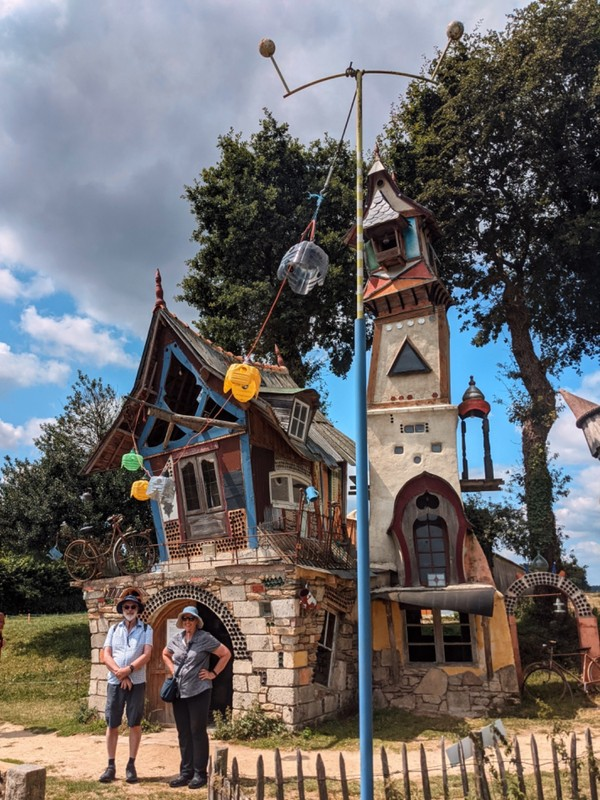

*Nana and Grumps Acquire Property in France*

There was also a cinema at the farm which showed a sort of documentary about the artist and the various creations. Prior to the film, there were two "trailers" for independent movies which were released that told the story or featured Robert in some way. They could not have been more stereotypically "French film" in style if they tried. Pat didn't know if it was parody and it was the artist making fun of French film traditions. It was all Kate could do to stop herself from laughing out loud.

Pat wasn't won over by the offerings at the Poet's Junkyard cafe, so we decided to go into Josselin for a meal. Kate had the town marked on the map as 'Another Pretty Town". Is it ever! A huge chateau lines the riverside with giant pencils and paintbrushes adorning flower boxes of blooming hydrangeas. Easles with paintings of the town are set up every now and then, maybe encouraging you to stop and admire the view, maybe to get out a paintbrush yourself. Every corner we turn inside the city wall reveals well maintained half timber houses, cute cafes or historic stone buildings. We find a restaurant on the river with a view of the castle for a galette and crepe lunch. Jill orders a coffee with her galette , which is again not delivered. No coffee until apres the meal. Vi insists she hates gallettes and we decide we'll need to take her back to the shop for repairs- must be something broken.

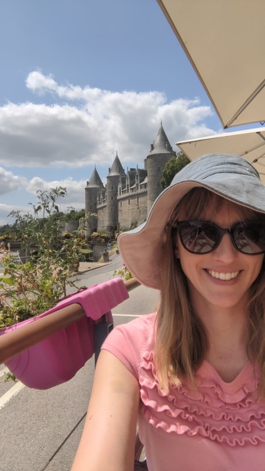

*Nice Views*

After a long lunch we walk back to the cathedral and climb the 134 steps to the top of the spire. On the way up the girls spot a pigeon nesting on one of the landings with two little eggs. While soaking up the views from the spire, the church bell went off for 4 pm. Everyone jumped out of their skin at the loud, unexpected bell ringing 2 metres above our heads. Lesson learned: if you're going to climb a bell tower, be conscious of the time.

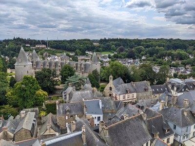

*View From the Top*

We popped to the chateau for a quick visit before we left town. It was first built something like 1000AD, but in wood. Henry II of England was apparently keen to bring Brittany into the UK fold, so he sent some men over to discuss/burn the castle to the ground. Amazing that kind of diplomacy wasn't more successful. The chateau was rebuilt in stone, and added to over the years. Our favourite room was the antechamber. The explanatory notes say this room was designed and decorated very intentionally- it's the first place guests see, so it needs to impress visitors with the power and importance of the owner and their ancestors. The opposite wall to the entry curves imposingly towards visitors and houses four large portraits of owners.

The effect was somewhat diminished by a man who was clearly so impressed with himself that he opted to pose with his bum facing the viewer, looking back over his shoulder as if to suggest, "you like what you see, no?". Spare a thought for the poor painter who probably had Guy hovering over his shoulder critiquing every brush stroke.

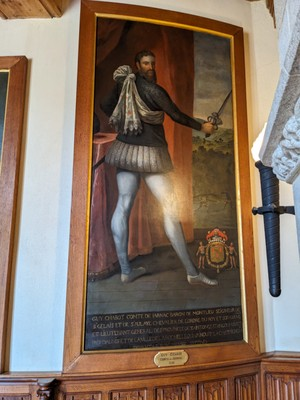

*"Make my bum more imposing! Add more muscles to my calves!"*

The exit to the chateau takes you through a doll and toy museum, which the kids enjoyed. Patrick also enjoyed it because in French, it's the 'Poupée Museum'. He can't stop giggling and saying in Jamie Tart's accent "It's just poopy".

Last stop for the day is La Ferme de Lintan, a little fromagerie that's only open on Friday afternoons. The owner, Vanessa, is an absolute delight and tells us how she came to be making cheese. The cliff notes are- it's very difficult to make in Brittany because the climate is inconsistent and wet. The humidity is so variable that even with climate controlled rooms, aging cheese is challenging and time intensive. Brittany is the only area in France with no cheese appellation. And basically, knowing it's meant to be next to impossible, she decided she wanted to make cheese in Brittany. We tasted her cheeses (mostly moderately hard cheese) which was very nice, and bought a fair amount to nibble on over the next few days.

The owner roped her 10 year old daughter to take us out to meet the cows on our way out. So cute.

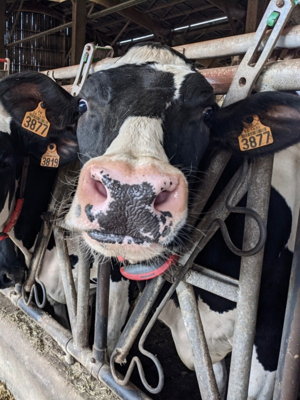

*Moo*

On the way back to the B&B we popped into town and picked up some baguettes, meats, more cheese, and nibbly fruit and veg. When Sharon saw us come in with the makings of a platter, she insisted on getting us cheese knives, boards, and some extra bits and pieces like homemade chutney. After our grazing platter dinner and getting the kids down, she and Pete had the grown ups over to their side of the house for a glass of champagne and a chat. Incredibly nice people.

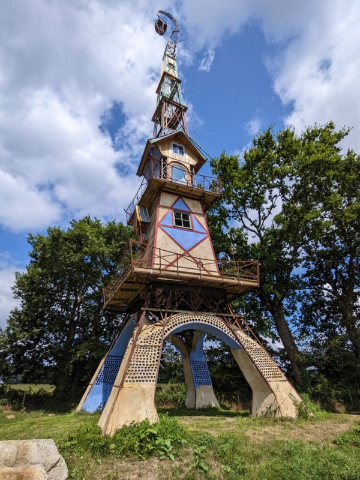

*Eiffel Tower De Junk*

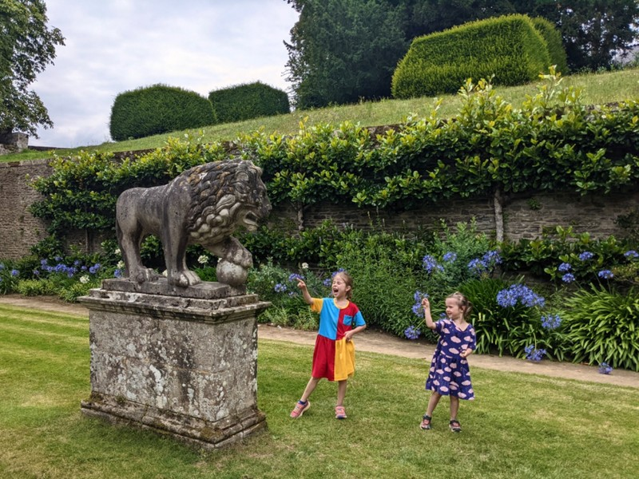

*Kids Playing Chronicles of Narnia with Stone Aslan*

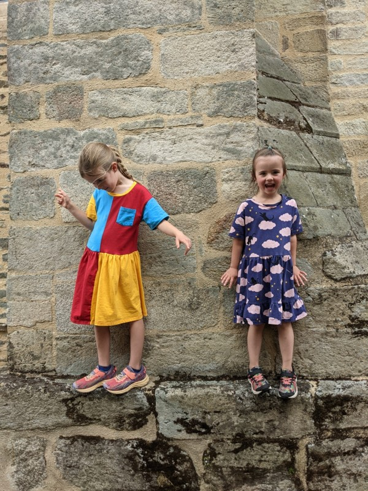

*Fascinating Statues Outside the Cathedral*

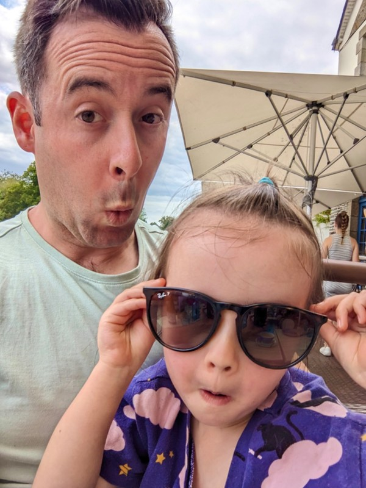

*Posers*

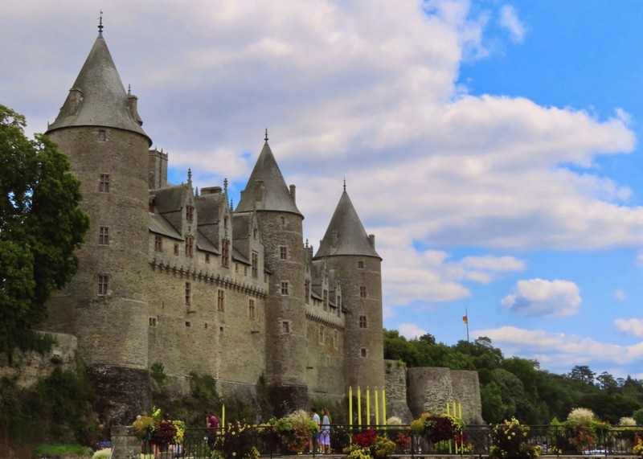

*The Property Pat Hopes We Will Acquire*

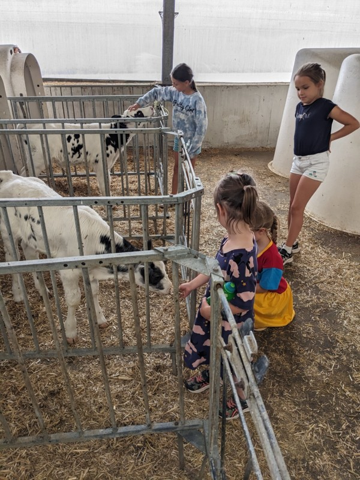

*Kids With Baby Cows*
