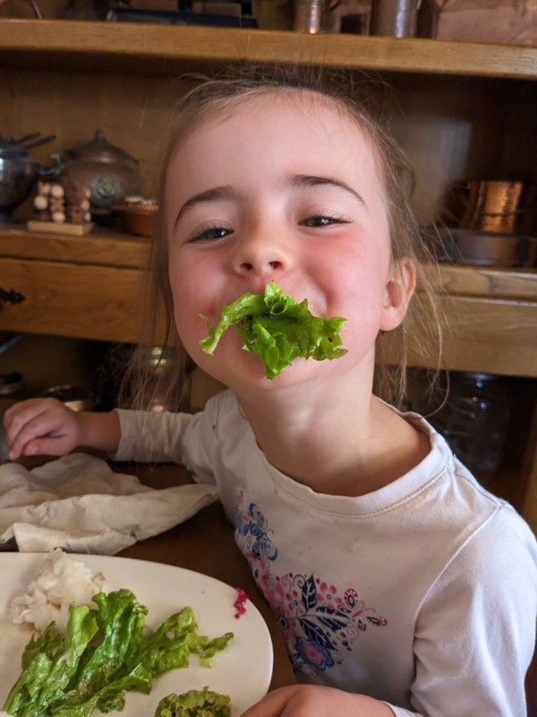
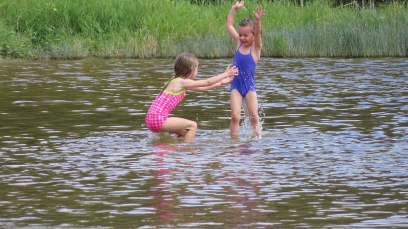
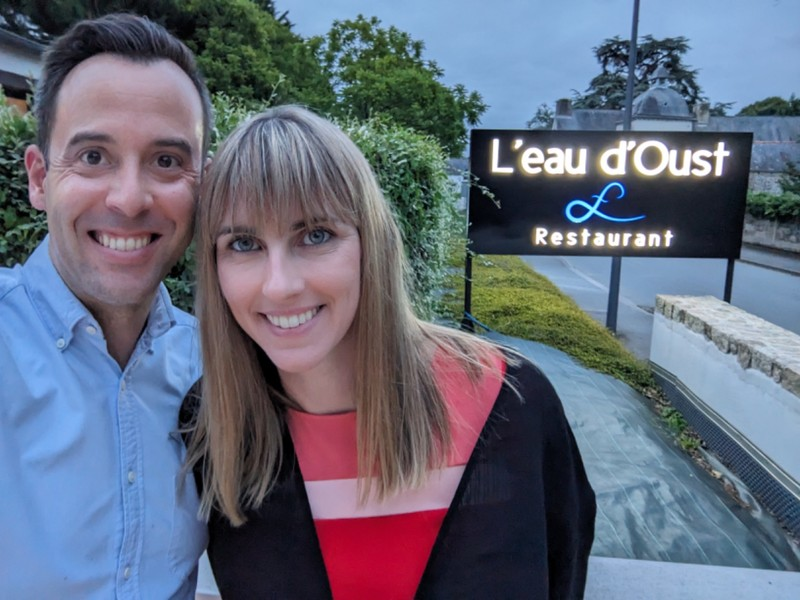
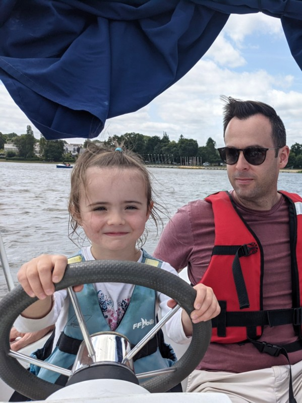
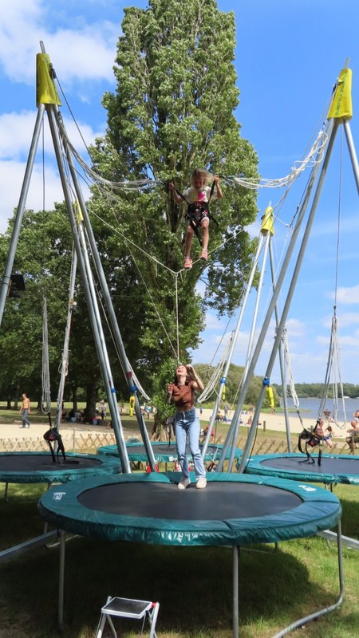
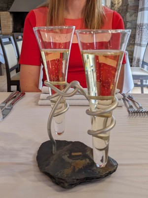
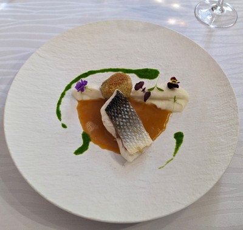
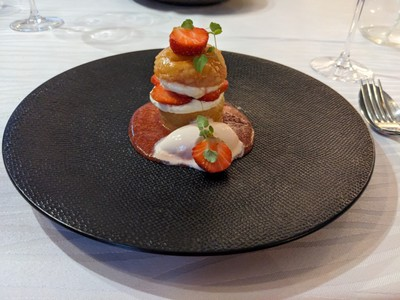

Today we go to Ploërmel to visit a lac, apparently a common Summer pastime for Bretons. We start with an early fish and chips lunch at the Pigs Ear Pub, a place that walked straight out of a joke and is owned by a Scottsman, a Brit and a French woman. We walk in the door to a tiny puppy sitting politely on a mat. The girls immediately make best friends and have a cuddle and a lick.

Jill persisted in ordering coffee with food at lunch, rather than at the end once everyone had finished eating. This hasn't worked yet. "But it works at home", she says. Pat asks her if we're home and she admits we're in France. Against all odds, her coffee arrives with the food. But Jill has been conditioned to expect it won't come and she thinks the drinks have been sent to the wrong table. It wasn't until Kate passed the drinks to Jill and Peter that she really believed her dreams could have come true.

*Margot’s Restaurant Manners*

Bellies full we potter off to Lac au Duc. We can see why the Lacs are so popular! There's a beach, playground, boat hire, wake boarding, elastic trampolines, inflatable balls, pony rides, horse and carriage, kayak basketball, beach volleyball, and half a dozen other things. We try a range of things out, which takes up the rest of the day. Before heading back to the B&B we make sure to have a quick glace.

*Splash in Le Lac*

Kate and Pat have one last activity planned for today- a fancy dinner at a local Michelin restaurant 'L'Eau d'Oust'. Beautiful decor and atmosphere, excellent service, great wine, and food ranging from good, to really exceptional. We arrived at the comically early time of 7.30 so we had the restaurant to ourselves for a half hour. The whole thing only cost as much as two overpriced ham sandwich lunches.

*Au Restaurant*

*Captain Margot*

*Trying to Reach the Clouds*

*Toile d'Araignée*

*Some Yummy Food*
