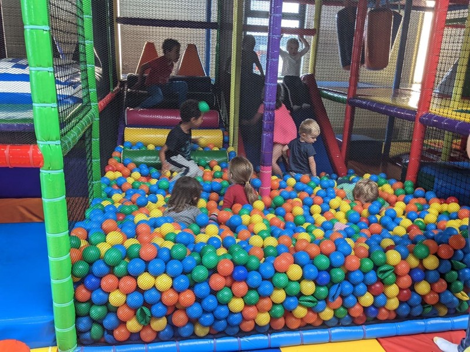
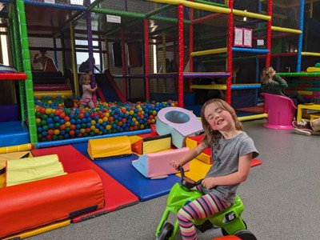

A rainy day. Quite some time spent trying to figure out what to do. We look for some kind of indoor play space, but all we find are British expats complaining they don't exist in France. Kate wants to go on a tourist train, but the kids decline. Jill suggests a dinosaur park, Kate's dubious because of the rain and Pat thinks we could do something similar at Gold Creek in Canberra so why do it in France. Pat finds a series of activities that all turn out to be a 90 minute drive away. Peter wants to feed the ducks in town, which is almost the winning suggestion until Sharon suggests an indoor play space, Happy Park, in the next town over, Pontivy. Apparently all the things exist if you know the right people.

Wet drive to Pontivy. We go check out 'Mac Doner' and find it's closed for July and half of August. So many things are closed in peak tourist season. I suppose it's a different attitude here- better to earn less and enjoy the sunshine in Summer than make fat stacks by missing out on life. So instead it's another pizza lunch. 90% of the restaurants sell pizza or crepes.

*Swimming in Rainbows*

With the kids sufficiently full we drive across town to an indoor play area. It reminded Pat of a Discovery Zone from his childhood. On entering and seeing what was in store for them, both Violet and Margot immediately lost their minds and set off for what would be nearly 3 hours of uninterrupted climbing, jumping, and running. Despite being a clear winner on a rainy day, it wasn't very busy. That changed after 2pm when the national siesta ends and more families start showing up. It ended up being full, but not overwhelming. Nana and Grumps must regret coming to France with us. But what else is there to do on a day like this?

Peter answers this question when we get back to the B&B. While we cozy up with books and movies and he chucks on a plastic raincoat and goes out for an amble in the rain. I guess someone has to feed that duck.

Then for dinner- why not crepes!? Lucky they're so delicious.

