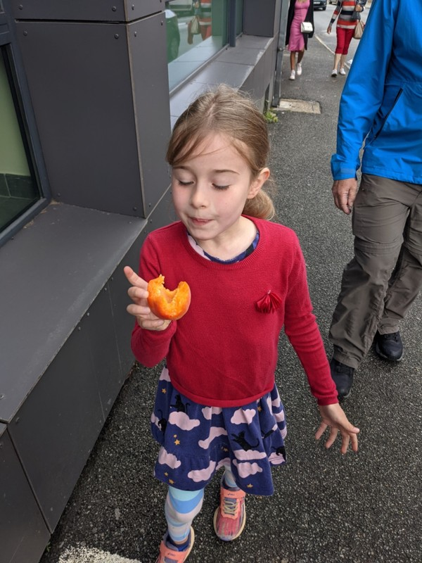
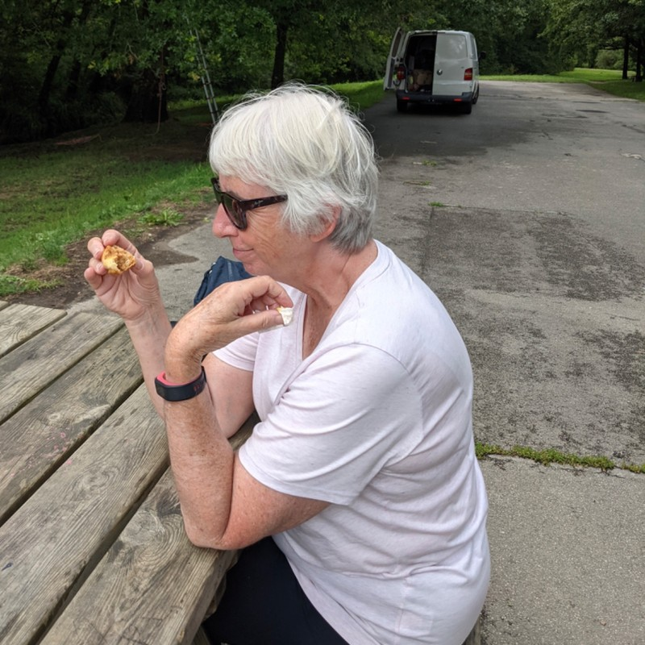
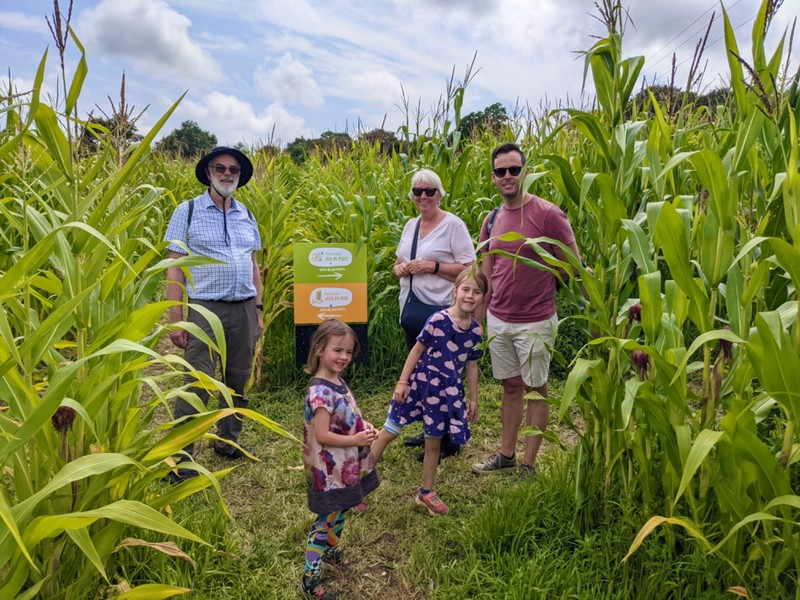
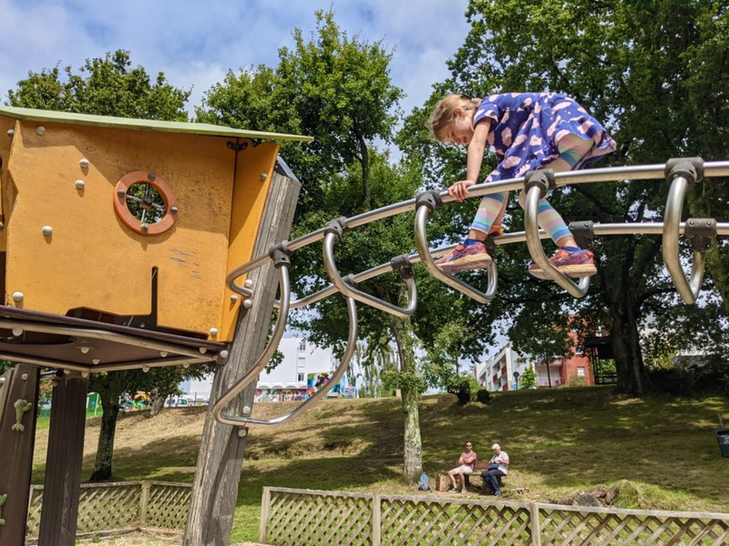
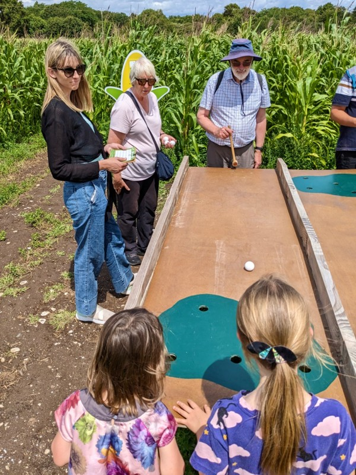
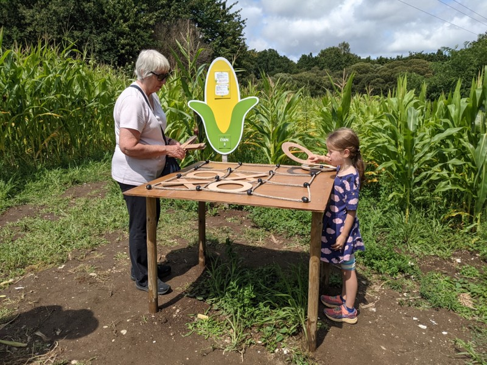
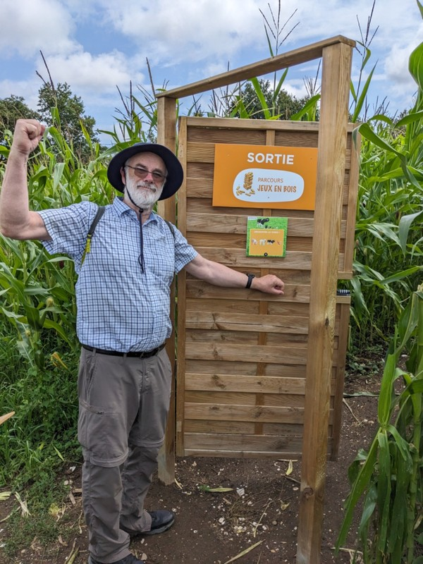
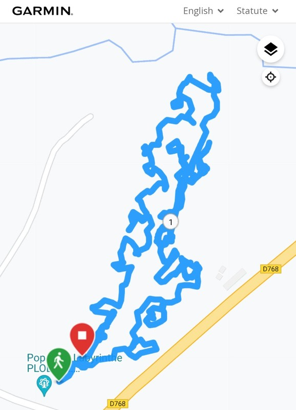

I’m quite proud of my alliteration.

Today's Monday, the day of the best market in Morbihan according to Sharon. The market is down in Auray, about an hour drive from the B&B. We get moving a smidge earlier than usual as the market is only on in the morning. Once we get to Auray we have a struggle finding a place to park- this place is jam packed.

We have a bit of a walk back to town from our parking spot once we find one. Margot is too tired from another late dinner last night and says she doesn't want to come, she wants to sit in the car. Pat stays with her while the remaining 4 head in to the market. This market has everything. Fruit, meat, clothing, jewellery, bric a brac, belts and bags and hats, kitchen appliances, and even two separate stalls for mattresses. For many this would be a market dream, for Kate and Pat who really only go to markets to eat, there's far too many non-food related stalls.

*Yummy Apricots*

Side note on food here, one thing that fills in the 10% of restaurant offerings that aren't pizzas or crepes are 'Taco Doners'. Pat feels compelled to point out that tacos are different to kebabs. They can not and should not be combined. While their constituent parts might be similar, the end result of each is unique and delicious in their own way. What would a taco doner even be? A hard taco shell with kebab meat? Pita bread with carnitas in it? Just, you know... don't. Leave them alone. Please. For me.

After some time, Margot decides she does want to join us at the market and she comes along with Pat. They arrive just in time to see Violet coming scarred out of a French public toilet. These are very variable- some are totally normal, some have no toilet seat to sit on, many have no toilet paper, soap is rare, and every now and then it's just a hole in the ground. Cleanliness is also a scale from 'nice' to 'questioning if this been cleaned since it was built 400 years ago'. Violet had been lucky so far, but today her luck ran out and she was not impressed. "These are the most disgusting toilets in the world" says she. Just wait until she visits inland China.

*A Bite of This Pastry Brought on Nostalgia for Mum and Dad for a Patisserie Near Their First Home in Sydney*

We have a quick boulangerie lunch at a playground, then head to a corn maze. These seem to be a big thing in Brittany, they're all around the place. It involved a long walk in the sun, and every now and then we stumbled into 'Jeux Au Bois' to play. This included tabletop mini golf, a string and ball game, naughts and crosses, Jenga, air hockey, and a mini maze with clues to unlock a door out. There was one meltdown about naughts and crosses and whether Kate was cheating when she only let Margot put down one cross at a time, but otherwise it was a fun experience. We were all pretty tired from the sun by the end and snoozed on the drive home.

*Victory Over the Maze!*

At the B&B, Sharon and Pete feed us another delicious three course dinner while we field annoying requests from the new Paris accommodation for absurd safety deposits (€1200) that are completely lost for any damage to the apartment down to a scratch on a chair. The home cooked dinner with wine and nice local Breton cider allows us to maintain sanity while dealing with Paris. We'll see tomorrow how it pans out!

*Monkey Bar Instructions Unclear*

*Grumps Showing Off His Golf Game*

*Nana Dominated Naughts and Crosses*

*Grumps At The Exit!*

*Corn Posers*

*Our Circuitous Route*
