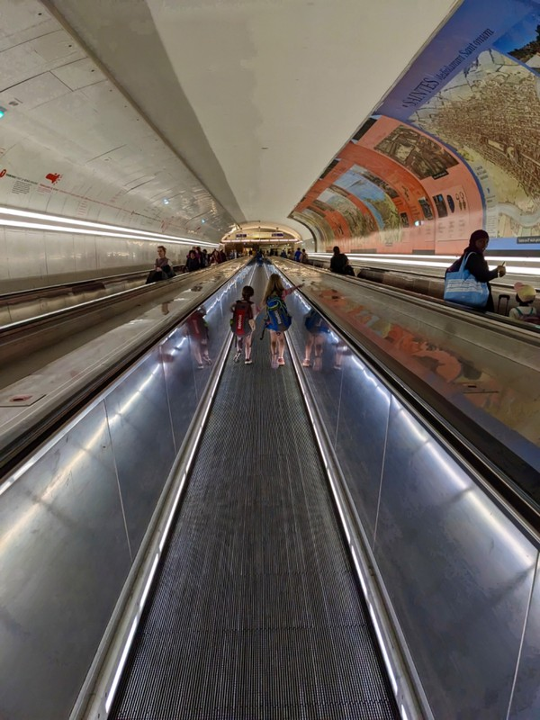
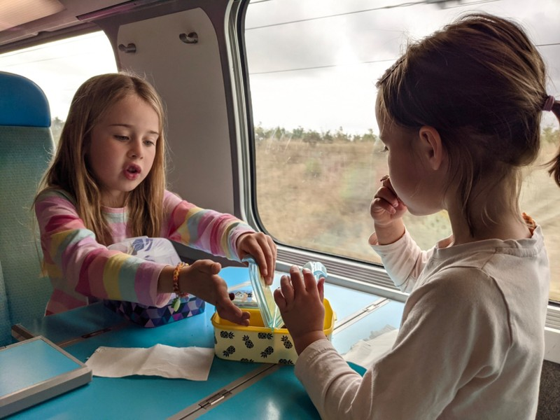
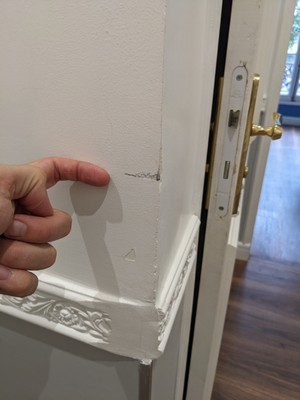
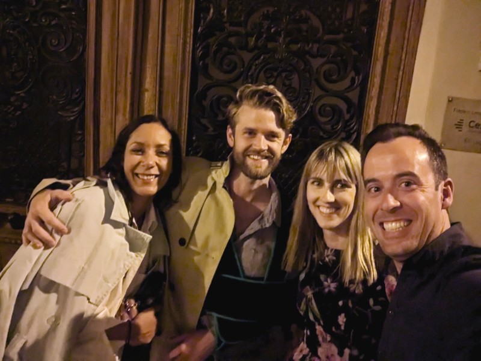
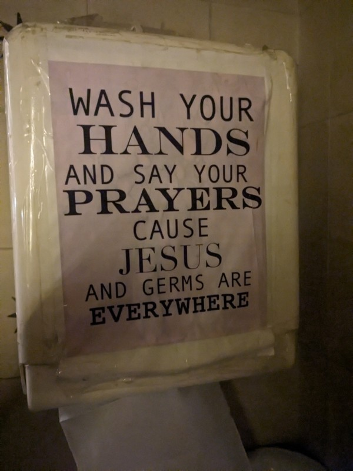
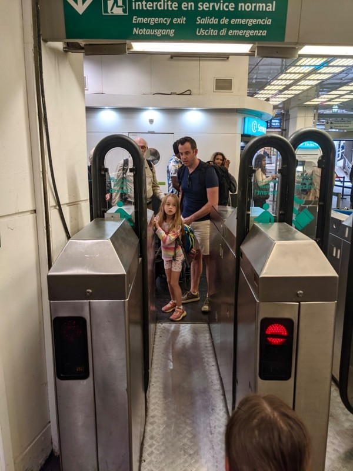

Checking out today and heading to Paris. We've enjoyed our stay here, but there's so much in Brittany we haven't seen. We think we'll return in the future when the kids are bigger and cycle along the Brest to Nantes canal. Rohan, the town we've been staying in, is on the canal.

The canal was constructed mostly under Napoleon's rule as an alternative to the sea route between the two port cities. The motivation was to avoid any sea blockages by British naval power. It was completed in 1842 just in time for train travel to supercede barges, so it was hardly used by boats. (One could draw an interesting parallel between that government initiative and Australia's copper dependant national "broadband" network, which was obsolete before construction started). Then they built a hydro station on it, so now it can't be used by boats at all. The path adjacent to the canal is a scenic, well maintained cycle route.

Just to add a bit of drama to the day, we received multiple emails about our train overnight and early in the morning. Urgent! Your train has been cancelled! No wait, just changed your seats. No it's actually a new train! No its all fine, ignore all the other emails. Not very confidence inspiring. We're glad we'll have at least an hour after dropping off the car to sort out any issues at the station.

Aside from the parking garage for returning the rental car being designed for the exclusive use of Matchbox cars, dropping off the car went smoothly. The train station in Rennes, however, is a shit storm. Following the inexplicable European tradition of pretending humans never have to pee, public toilets are practically non existent. We find one in the station that charges €1 per person (kids included!), which we have to settle for since the kids are busting. Kate gets into a fight with the turnstile (which is quite aggressive and scares the children) and is chastised by the attendant. Kate has no patience for this and threatens the kids might wee on the floor if they won't just let us go to a cubicle already. Out of principle Pat waits to go on the train.

*Futuristic Travelators*

We find out that our train is delayed because the train hit a deer on the way to Rennes and needed to be inspected for damage and (hopefully) cleaned. When the platform is finally announced there is a mad run to the platform as everyone's been sitting around waiting.

Most large stations have screens set up on the platform giving you an indication where your car will stop to make boarding easier. So being good little travellers we follow the directions and set up where they say car 7 will stop. When our train arrives, it overshoots the stop by more than half the length of the train. This creates immediate chaos when everyone starts running to where there car is actually going to be, knowing it will only stop at the station for a few minutes. This is bad enough on a small platform, but it gets worse when a bunch of people start getting off the train and walk the opposite direction towards the station. Pandemonium.

The fun doesn't stop there. Because of all the emails this morning and the reissuing of tickets, the seats are almost all double booked on the train. When we get to our seats and find them occupied, a nice man taps Pat on the shoulder and asks if i understood the announcement. He said there was a problem with the ticketing system and its free seating now. A very nice group of people move so we can sit with the kids in what was supposed to be our seats.

Ugh.

*Kids Didn’t Mind!*

Arriving in Paris is as you'd expect: busy. Lots of people going this way and that. We make our way to the metro and are confronted with another lovely feature of the Paris Metro system: the long distance walking and all the pointless stairs. We must have walked for more than 1km, under ground, IN the metro station before we got to the platform. And the stairs, my god the stairs. I remember them from last time when we were dealing with a pram, and they're still just as annoying. Go up 7 stairs, walk 10 metres, go down 8 stairs, walk 5 metres, go up 4 stairs... and on and on it goes. It's really not the way to travel if you have a piece of luggage with you. I should remember this for next time. I won't, but I should.

We found our new apartment easily, which was conveniently a stone's throw from a metro station. Check in was an ordeal to say the least. It was all self service, so no one in the building to get us settled. There was a 4 digit code to enter the building, another 4 digit code to the key safe, another 4 digit code to unlock a glass door on the first floor, and then a key to enter the apartment. I reckon we're safe from thugs. We also had to take pictures of the entire apartment because they state if they determine you've cause any damage (no matter how minor) they keep your entire $1,250 deposit. Some local company in Lyon made the platform which facilitated this extortion, I mean deposit. After carefully taking photos of every room and all the chipped paint and minor damage I went online to upload them all and found out that we could only upload 15 photos and they had to be under 4MB each. My phone's camera default setting ended up with almost all of the pictures being larger than that. Had to create a shared Google Photos folder and put the link in the comments instead. I can't imagine someone not tech savvy dealing with this bullshit.

*Example of Our Million Photos*

FINALLY checked in, we got the kids sorted and headed out to meet Nick and Alice. The last time we caught up with Nick in Europe was 2013 in Berlin and we didn't make it home until 6am (and that was us leaving early- we never even made it to the club he had planned), so we were mentally prepared for a late night. We met Nick at La Banquette and had a bit of a chit chat and a glass of wine. Alice was still working so we decided to do a bit of bar hopping. The next stop was just around the corner. Pat, being the American he is, ordered bourbon and sent a message to his brother to make him jealous. Mission accomplished. From there we ventured to an Italian wine bar and shared a bottle of "orange" wine, in this case a Fiano Macerato. This is a hip new trend in white wine made by leaving the grape skins and seeds in contact with the juice, creating a deep orange-hued finished product. Yum. Alice meets us at the wine bar, we order some bruschetta and watch in amusement as Nick and Alice debate the best place to take us for dinner.

With two restaurants in mind we start walking. We find the first one closed for the month of July and make our way to the back up option, Le Ma Zenay. By this time it's approaching 10pm. Between the olives and bruschetta everyone's enjoying the evening. We finally find our restaurant and after a final inspection of the menu outside (and some gentle encouragement from Kate) we head in. It's meant to be pretty traditional French cuisine. For entree we order foie gras (and feel guilty about it, but the waiter insists). It tasted okay, but certainly not something either of us are keen to repeat given the animal welfare issues associated with its production.

*Team Dinner*

Pat orders a steak, which is very nearly the best steak he's ever had. Kate gets fish, which she describes as "good". Alice insists we get some dauphine potatoes, which are absolute heaven and we must eat them again. We finished with some cheese, a cherry pastry, and some glasses of Chartreuse. We were the last table in the restaurant and left well after midnight. This isn't unusual in Paris apparently, even for a Tuesday evening. The chef and waiter don't see to mind us too much.

A collective decision is made to head to a cocktail bar near Nick's apartment which was recently included in a list of the best cocktail bars in the world according to... Someone... They had a menu which they described as "farm to glass". During covid, they reached out to local producers in the area who were having trouble selling their produce to restaurants and started making wines and liqueur and built a cocktail menu around those drinks. Kate had a "Pumpkin" cocktail, Pat had "Holy Basil", Nick had "Pepper" and Alice had "Walnut". Each were quirky, but we weren't terribly won over with the taste. Certainly an interesting concept!

*COVID Sign in the Bathroom*

We had to call it a night, given it wasn't night anymore, but heading quickly towards early morning. And the kids were going to be up at 7 whether we wanted them to or not. So we parted ways and walked home. Pat noted that even at 2am on a (now) Wednesday morning, Paris was nonchalantly awake. People spilled out of bars onto the street, quietly chatting, drinking, and smoking. People rode bikes, walked down the streets and went about their business as if it wasn't some ungodly hour. We didn't hear or see any drunken shouting matches or feel unsafe as we walked home.

Finally home and to bed. Because we're not Parisians, we're tourists and we're damn tired.

*Poor Child Has a Fear of Turnstiles and Automatic Doors Now*
