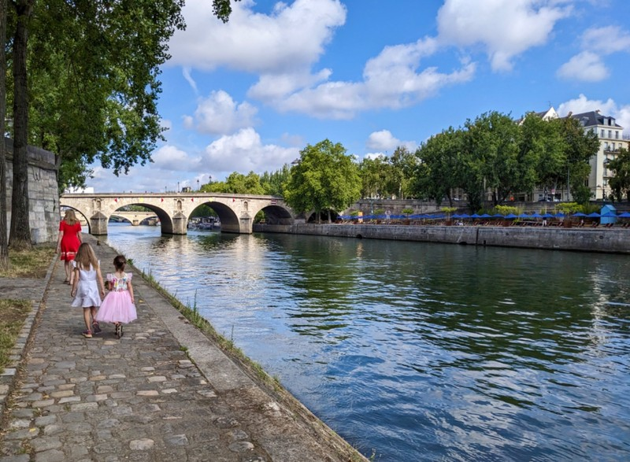
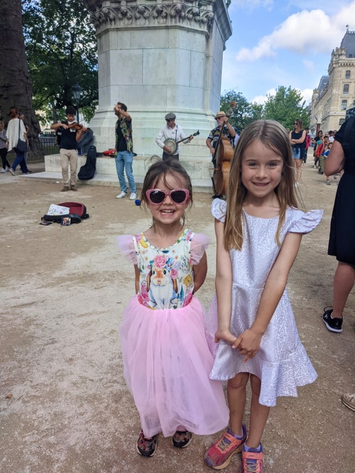
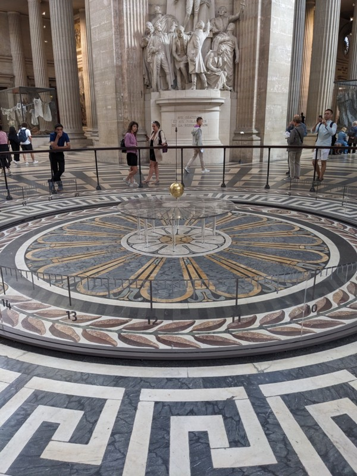
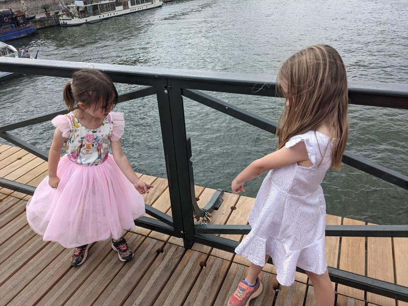
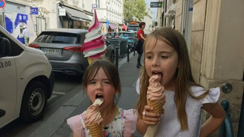
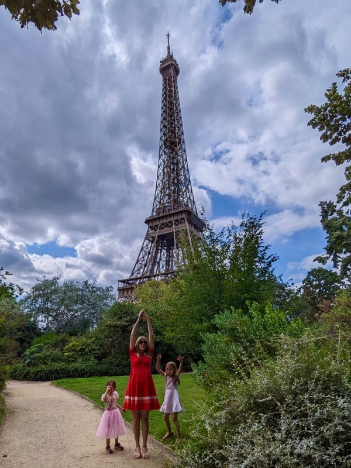
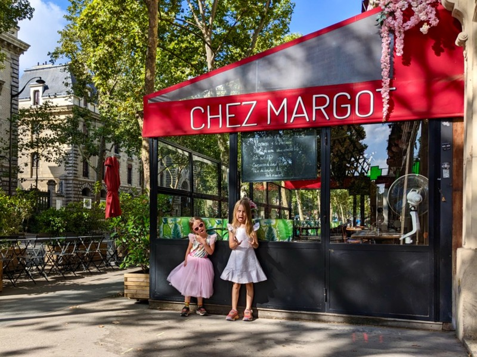
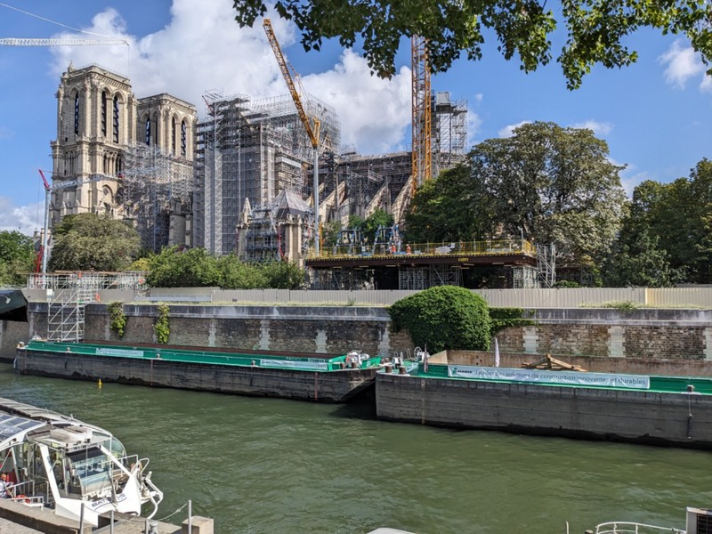
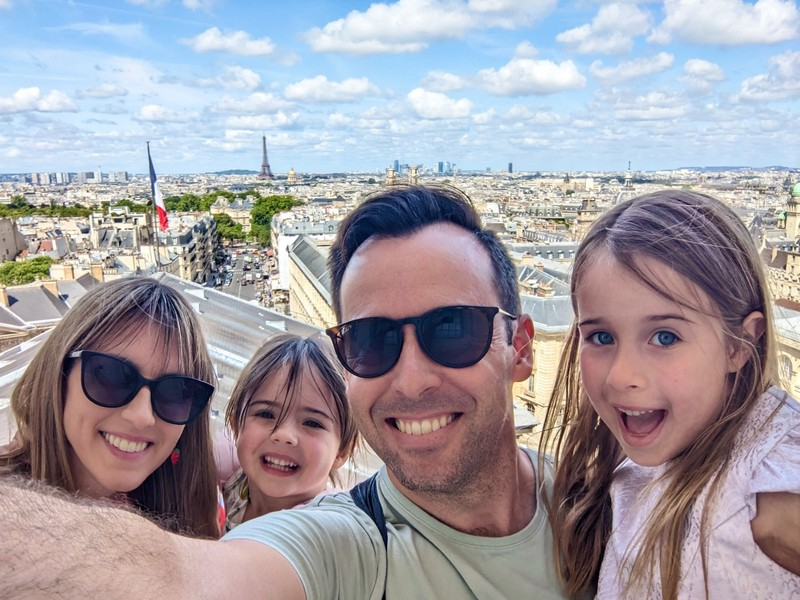
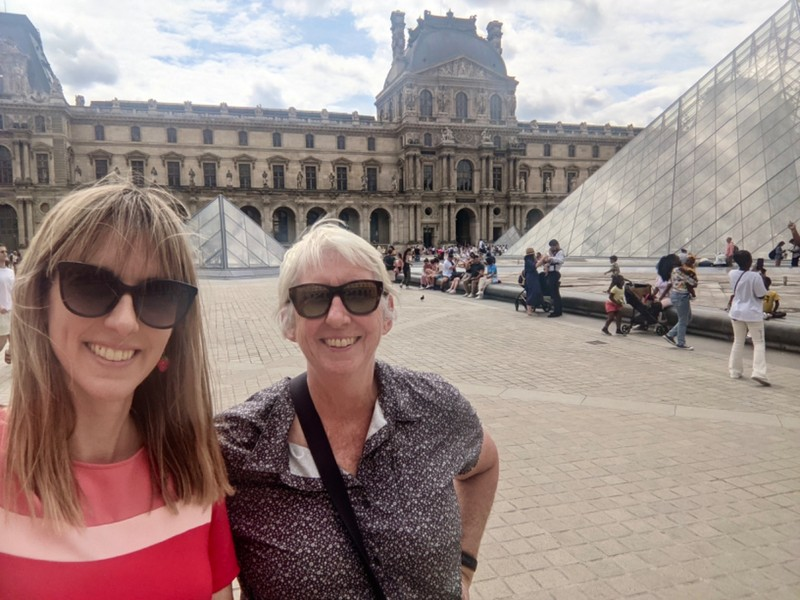

Today is our only full day in Paris. The kids have set the itinerary. Violet wants to see 'The Locks Bridge", the Louvre and the Eiffel Tower because they're in Miraculous Ladybug (a phenomenon of a French TV show), and Margot wants to see Notre Dame from Richard Scarry's Busy Busy World. Jill would like to go into the Pantheon, and Kate's keen to join as Pat's never seen it. There's also a demand for macarons from the girls, and we'd like to get a vegetarian friendly lunch for Grumps' birthday (which is today).

With the long itinerary, it's a day heavy in walking. We head to the Siene and Margot asks her signature question when near any body of water- "Do crocodiles live in here?".

*Once she's assured she's at no risk of being eaten by a croc in central Paris, we can continue.*

Violet and Pat walked around the construction site that is Notre Dame. There's a huge barge parked in the river adjacent to the building which currently had several massive wooden trusses in it which must have been constructed off site and were waiting to be installed. Reading the information posters they have fixed to the security fencing, the French government took 2 years of investigation and planning before they started the restoration work in earnest. You could still walk around to the front of the building to see the rose window, and they'd even constructed some makeshift stadium seating, since that's all you could really do: sit and look.

There was a 4 piece jazz band busking at the site, and Margot was totally taken by them. She declined to see anything else at Notre Dame in favour of dancing.

*One of the few times I wish we carried cash to give strangers*

A short walk followed to the Pantheon, where we met Nana and Grumps and waited in a long queue for tickets. We would have been better off getting them online on our phones while in the queue, but by the time we realised it was too late. The kids waited outside the queue designating areas between the massive columns 'the spinning land', 'the jumping land' and 'the running land', and behaving as was appropriate in each of these culturally diverse countries.

Physics was on display inside the Pantheon with the Foucault pendulum. There were heaps of other amazing things to see inside, but this grabbed Pat's attention for the majority of the time. From what we could learn from the signs adjacent to it, a physicist in the 1850s got permission from  Napoleon to build a pendulum to demonstrate the Earth's rotation. We spent over an hour in the Pantheon and by the time we left we could clearly see that the pendulum's plane had changed. Or rather, the plane had stayed the same but the Earth rotated? I don't know, I'm not a physicist, but either way something moved and it was cool.

*Tick Tock*

We opted to pay the extra 2 Euros each to climb to the top of the building to get a panoramic view of Paris from the dome. At the top of 203 steps we had a stunning view of Paris, only somewhat ruined by Tour Montparnasse. How was that eyesore ever approved.

A Lebanese spot next to Le Jardin Du Luxembourg fit the bill for lunch. 'Taboulé' lived up to it's name with one middle aged Lebanese man serving a killer tabouli. He was flat out the whole time we were there. Pretty impressive when just a few hours down the road there's no distinction between the cuisine of the Middle East and Central America.

The girls ran through Le Jardin Du Luxembourg, then dragged feet increasingly slowly until we reached Pont Des Arts, the love lock bridge. We were greeted by some devastating news- all of the locks had been removed (apparently the weight was causing the bridge to fail) and the bridge was being replaced with a new, lock proof version. Violet's disappointment wore off quickly as she noticed all the creative places people had overcome the lock proofing and attached little padlocks. The back of the signs hanging off the bridge for boat traffic, anywhere supports were attached to anything, and all over the temporary fence while bridge construction was completed.

*She and Margot had a great time looking for all the strange places a creative mind can attach a padlock.*

On the other side of the bridge we came to the Louvre. I'm still blown away by the size of that building. You'd need weeks to see the whole collection properly. Vi was quite disappointed we didn't have time to go in and see the Mona Lisa, but eventually decided seeing a picture of it on a magnet was adequate.

Jill and Peter left us at this point with some cash for ice creams, and we started the trek over to the Eiffel Tower. By now both kids (and adults) were getting sore feet and running out of steam. We attempted distraction in the Tuileries ("Look at those big dahlias!" "How do you think they keep all the trees looking the same?" " How many ducks are in the pond") which was a partial success, or a partial failure depending how you look at the glass. Margot decided she needed to be carried, and Violet decided this was unfair. We had seen a dozen ice cream places throughout the day but knew we should save it for a desperate time. The desperate time had arrived, but the ice cream shops had all disappeared.

We consulted Google- we can get to one with only a 5 minute detour! Get there to find it closed behind a wall of construction. That's ok, the next one is just around the corner! Also closed inexplicably. We give up and apologize to the kids for letting them down just as we turn a corner and are confronted by a soft serve store front.

*Hooray!*

Finally, the girls covered in ice cream drips, the grown ups mentally exhausted, we come to the Eiffel Tower.

*Hooray!!!*

3 photos later the kids are done with it.

Vi needs a toilet, which is impossible in France, so Pat buys an overpriced drink from a restaurant to gain her access to the bathroom.

On the bus ride home, a man got into an argument so heated with the bus driver that the driver stopped the bus in the middle of the road, got out of his seat, and came back to yell at the man. They both seemed to be enjoying shouting at each other. The man, clearly upset that his stop had been skipped, exclaimed "Regarder!" and pointed at the route map plastered over the bus window. The driver didn't seem convinced by his logic. Eventually they both went back to their respective seats and the driver let the man off at the next stop. The only way it could have been better would be if we had popcorn to munch on during the show.

We have a casual nibbles style dinner, then get a good sleep before we leave France tomorrow and head back to finish off the trip in the UK.

*Margot's House!*

*Reconstruction*

*Above Paris*

Paintings in the Pantheon

*Louvre Selfies*
