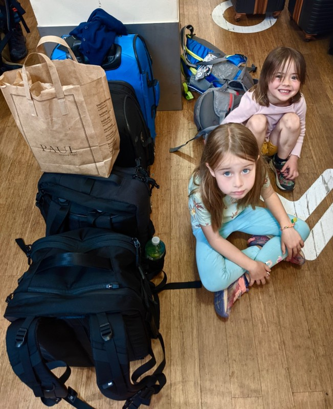
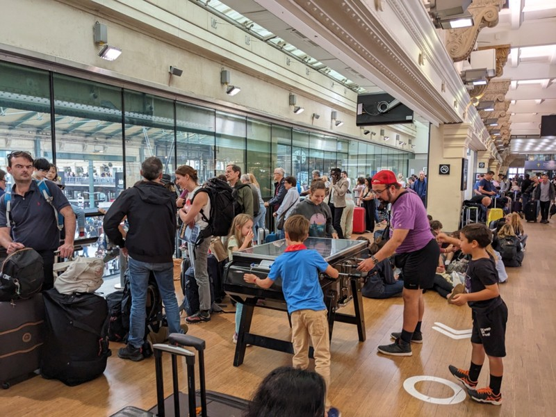
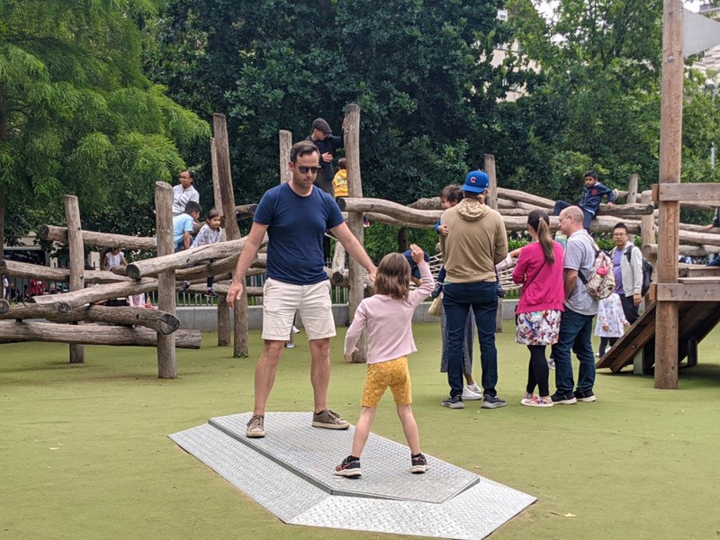
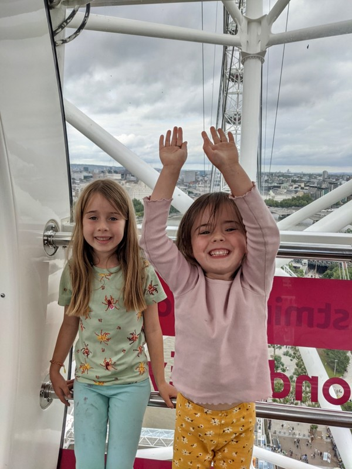
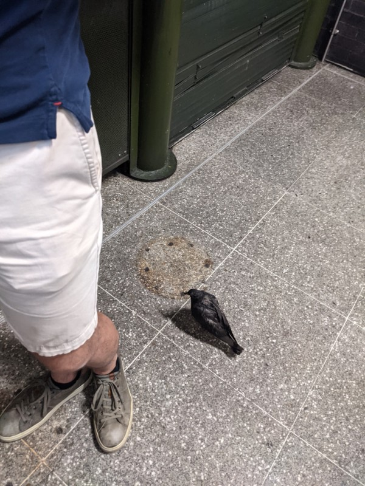

The hour long photoshoot from check in 40 hours ago is followed by a similar process for check out. Whatever Pat does forget about this trip, he will remember every inch of that apartment. Then taxis to the station, wherein we annoyed the cab driver by not having cash to pay. He said the fees for card payments are too high for a short trip and please do better next time.

After grabbing some baguettes to bring on the train for lunch, we head upstairs to the Eurostar waiting area for our 12.15 train from Paris to London. This was a bit hectic- constantly being herded down new queues without a minute to figure out what paperwork they wanted at the front. If we stopped we were told the whole area is a secure no standing area and under no circumstances may we stop moving! Don't care if you don't have a ticket or a passport or your child or your shoes, just keep moving!

Through to the waiting area to find it packed. They encourage arrival 2 hours before departure, so the passengers for the 10.15 and 11.15 trains were all still there. The space had seating for about one train worth while a second train worth of people queue, so a third train load was fairly hopeless.

*We set up on the floor near a post.*

The 10.15 train departed soon after we arrived, but 11.15 came and went without any train for those passengers. Then an announcement- the 11.15 train was delayed over an hour, putting their departure time later than ours. We continued to sit around until 12, past our boarding time, when Pat went and asked what was going on with our train. By now all of the 1.15 departure passengers were in the waiting area and the keen 2.15 passengers were trickling in too. Getting increasingly shoulder to shoulder and uncomfortable.

The Eurostar customer service person told Pat that the trains would board in their departure order, and leave in order, regardless of which train arrives at the station first. I guess since they don't have any facility to check the ticket of people as they're boarding, this is the best they can hope for. I can just imagine the chaos of trying to tell people they still have to wait for their train while watching people board a train that was supposed to leave after them. You just know some clever sausage is going to try and sneak in and make a (bigger) mess of everything.

During our protracted wait there was a security lady walking around with a huge German Shepard sniffing people. The dog came over to sniff a a boy who would have been under 10 and was clearly scared of dogs. When he started to panic and fell backwards into a store, the security lady just loosened the lead to allow the dog to sniff him more effectively. Poor kid was shaking in tears for the next 30 minutes. You'd think there would be a less traumatising option.

*For Vi the wait was far from traumatising- she found kids playing tabletop football and joined in.*

It was theoretically pay-to-play, but every time the ball was captured by the machine any random adult walking past would give the whole thing a tip and a shake to get the ball back out for the kids. I don't know how so many strangers knew exactly how to game the system.

Finally, close to 1pm with more than 4 trains worth of people crammed into a space designed for half that (flashbacks to public transit in Asia), the 11.15 train boards and departs. The second it's gone we board and depart too. The train itself was totally uneventful and easy. We arrived in London and took the underground (great, but filthy) to our accommodation, 'Kennington Bed & Breakfast'.

Our arrival instructions were provided via a 5 minute video emailed to us which the owner of the B&B filmed on her phone while narrating the instructions. Why she couldn't just write down the instructions and send those instead of some ASMR whisperfest is beyond me. Having successfully solved the riddle to locate our keys, we're presented with a new problem: Peter and Jill are in a different buildings with different keys. A bit odd considering the owner knew we were traveling together and there was no indication on the website that it was more than one house. Why put us in separate buildings? This will make it much harder for Jill and Peter to babysit tomorrow too. We also discovered the toilet seat was broken in our bathroom. Not to worry, the owner is in France so she'll WhatsApp her cleaner to try and fix it, and if not her son (who apparently lives here as well?) can try tomorrow when he's home. So this is less of a quaint B&B and more of a "let's pack as many people into these house as possible while I holiday in the south of France" kind of situation. Aside from it's location, there isn't much going for this place.

*Margot and Pat Rockin' Out*

Bags dealt with, we grabbed a train into the London Eye. The kids were desperate to go on the Eye. We've never done it before because it's so expensive and the queue is always so long, but they put on their 'please' faces and puppy dog eyes and we couldn't say no. The kids had a play at a cool playground near the base while we waited for our session, then we joined the queue (which actually moved quite fast). Getting into the capsules was a little stressful- the wheel doesn't actually stop turning and you just have to run with a bunch of other people to jump on before it leaves without you. I was a little worried about Nana tripping or Margot being left behind, but we all made it! We turned to the kids, ready to see the joy and excitement for us fulfilling their expensive dreams- Violet was almost in tears and grossly disappointed. It's not fast! She's stuck in a glass capsule! She thought it would be like a really high carnival ride, not this boring thing! She wants to get off!!! Too bad kid, it's a 30 minute ride and there is no exit.

*It was good to have the experience, but never again.*

After our overpriced tourist activity, we can only find overpriced tourist dinners. Everyone's getting tired and cranky after the day of travel and the kids want to eat NOW so we settle for eating Maccas standing up surrounded by disease ridden pigeons at our feet, and fluttering around our heads. Delightful.

I should note once the kids were calm, we did go to an absolutely delicious Ethiopian restaurant near Elephant and Castle for an adults dinner which was a much nicer welcome to London and a good way to end the day.

*Dinner Companion*
