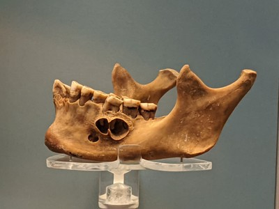
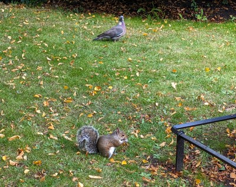
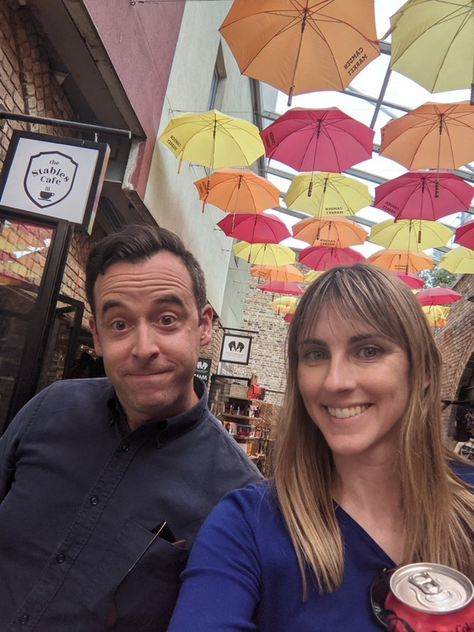

Our plan for today involved meeting Zoe and Beeks and eating as much delicious food as we could stomach. Violet and Margot's plans involved 'REAL LIFE MUMMIES'. So, first stop was the London Museum.

We made our way up to the Egyptian section to try our luck. The museum had a page on their website with activities to keep children engaged during their visit. For the Egyptian exhibit, they had a scavenger hunt of sorts which gave the kids a picture of an artefact to find. It would have been extremely enjoyable were it not for the throng of people in the room with us.

*Kate Took Photos of our 'London Museum' Visit- A Whole Album of Teeth*

Being a Friday in summer, at one of the more popular tourist activities in London, in one of their most popular exhibits, the Egypt rooms were packed shoulder to shoulder with people. To make matters worse, unlike the rest of the museum which was quite cool, these rooms were hot and humid. The kids actually didn't seem to mind too much. They happily weaved in and out of the crowds looking for different mummies and sarcophagi to complete their challenge. When we ticked off the last challenge we agreed to head down to the café for a snack and to find Jill and Peter and Beeks and Zoe. Mum and Dad foolishly agreed to take the children while we head off with Beeks and Zoe.

We decided to all grab lunch together before venturing out into the city. Being so close to the London Museum most of our options were either overpriced tourist food or cafes. The kids were reaching their breaking point in terms of hunger, so we agreed on an inoffensive Italian restaurant for pizza and pasta.

We set off walking with Beeks and Zoe towards Regent's Park. The vague plan was to wander around the gardens then make our way to Camden Market for food and drinks. On the way, Beeks spotted what appeared from the outside to be a hipster Melbourne-esque coffee shop. Inside, it turned out that it was actually a chain coffee shop, complete with a McDonalds style touch screen ordering system. After trying in vain to order a flat white with a single shot for Kate, Pat gave up and asked the barista if we could just order the drinks with her. Given how bonkers people get with their coffee orders, it's astonishing that anyone would think a self service ordering screen would be a good idea. The coffee was fine in the end. Nothing to write home about, but then again, here I am writing about it so I guess the coffee shop wins this round.

*Distinguished Pigeons and Manicured Squirrels*

Fully caffeinated, we make our way to Regent's Park, a new site for both Kate and Pat. Neither of us know how we've missed it on previous visits to London; it's absolutely stunning. We've just missed the roses in full bloom in the rose garden, but it was still pretty speccy. There were several different types of beautiful manicured gardens in the park, some man made lakes, and a little outdoor concert area. No sky rats here- instead well fed, majestic sky guardians. Best of all, there was a section of trees called "golden shower" right next to the toilets. Some landscaper definitely had a bit of fun with that choice. The toilets here in London are also pay for use, but they have modern automatic turnstiles with the ability to pay by card. France could learn something.

Feeling hungry, we continued on towards Camden Market. Popping out of the tube station we were greeted by masses of people from all different walks of life. Beeks says the area used to be pretty rough but has been slowly gentrifying over the years. It was a bit of a mix between counter culture, pop culture, and good ol fashioned capitalism.  At some point Kate ended up in a big chat with a 9 year old girl about why she's so tall. "Why are you so much taller than me??" "I'm a grown up" "But my Mum's grown up and she's up to here!" (indicating below Kate's shoulder). The girl looked completely incredulous when Kate told the girl her brother was taller still. Surely Kate already maxes out human height. We grabbed drinks and some food  before heading to the Went End for our show: Operation Mincemeat.

*Camden Markets*

The show was recommended to us by one of Kate's patients, who said that their daughter had seen it and had very good taste when it came to stage shows and was usually able to pick which ones were going to end up being popular. It was showing in a smallish theatre with the smallest bar / lobby that Pat had ever seen. High school theatres have more room for people to mill around before the show than this theatre did. Against all odds, we persisted in making our way to the bar and ordering Aperol Spritzes. Well, Pat did at least.

The play was about a WWII British 'secret mission' to trick the Nazis into thinking the allies were going to invade Sardinia instead of their real target, Sicily by stealing a body, disguising it as a soldier and dumping it in the ocean near Spain. It had some great songs and talented actors, and three dimensional female characters. It made some vague effort towards social commentary (e.g. the Americans taking in the Nazis after the war/the 'brains' at MI5 being incredibly well connected and privileged rather than incredibly talented), but only with throw away lines. It definitely ran a bit long. There was probably a quarter of an hour devoted to bits about Ian Fleming, who apparently worked at MI5 at the time. There was also a British cringe humour character, which really gave Kate this inward feeling of acute embarrassment and awkwardness.

After the show, we said our goodbyes to Beeks and Zoe and went home for a very late bedtime.
