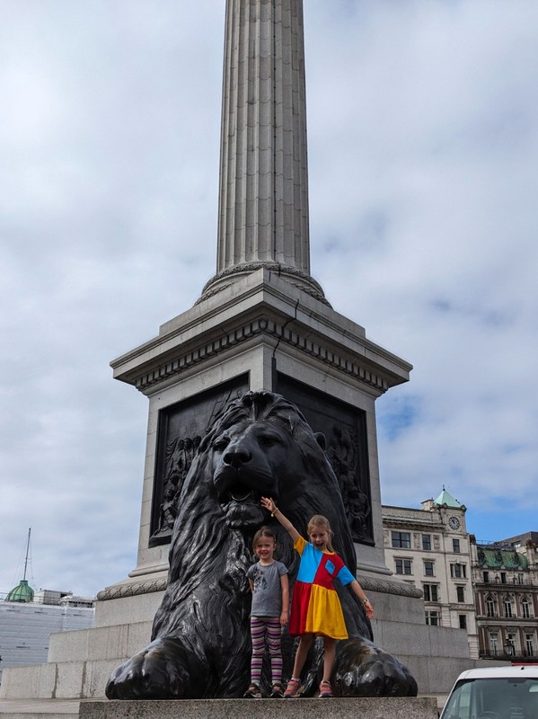
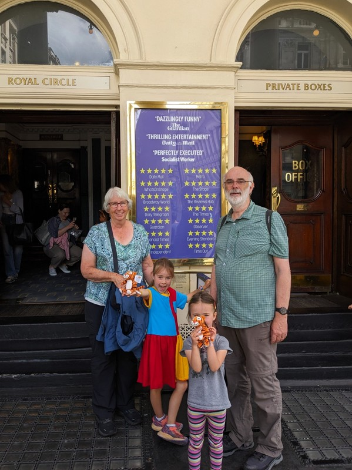
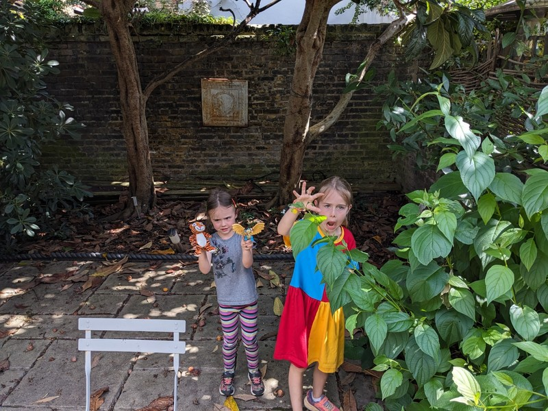

It's the last real day of our trip today, our flight is first thing tomorrow morning. The main goal of the day is to get from the "B&B" to an airport hotel near Heathrow. But first, one more London activity for the girls- a theatre production of the book Tiger Who Came To Tea.

During breakfast another family arrived who were supposed to check in to our room later in the day. We gather they didn't phone ahead to ask about early check in, because the cleaner was clearly bewildered by the whole situation and didn't really know what to do. At one point she asked us to give them the key to our room (which was still full of our things), and we were forced to politely but sternly decline. She also had to tell them off for sitting down and starting to eat breakfast when they hadn't paid for it. Mildly annoying and highly amusing. Eventually they agreed that they'd stash their bags in the breakfast room and come back later in the day when their room was actually ready.

Once we finished breakfast and packing up the last bits and pieces we checked out without incident. On, and in case anyone's keeping score, the toilet seat for our bathroom is still broken.

*We took tube into Trafalgar Square and walked to the theatre.*

The kids were a little amused to see the statue of Paddington Bear on a park bench, Kate was very excited to see Mr Bean and Don Lockwood. We got to the theatre early, but it filled up- clearly a popular show. The kids were wriggling all over the place, both were complaining loudly that they didn't have the best seat and Kate was getting worried Margot in particular wouldn't get through the whole hour long production. But as soon as the actors came onto the stage, they were mesmerised. Both girls shouted out 'BEHIND YOU!!' on queue, danced along with the Tiger dance, and sang along with the song about loving Sausages and Chips. We left with two tiny Tiger soft toys which they have hardly put down since.

We stopped at a place around the corner for a quick ramen lunch, then went to the post office to send Beeks some novelty socks we bought him in Australia and forgot to bring along yesterday. Unlike Australian Post Offices which are pretty much a full service affair, this shop was inexplicably split into two: one store for all the stationery and postage supplies, and then a Royal Post desk to actually pay for the postage. Not realising this, Pat stood for a long time in a line (because all three of the automatic post machines were out of order) and when he finally got to the front presented the man with a satchel and the pair of socks and asked to buy the satchel and enough postage to get it to Norwich. The man politely told Pat that he'd have to buy the satchel from the other counter first, then come back. When he saw the rage start to bubble in Pat's insides at the thought of having to wait in the (now longer) queue again, he said that Pat could come to the front next time. Relief washed over him, the satchel was purchased, and Beeks' socks were entrusted to the safe hands of the Royal Post.

*Out Front of the Theatre*

Then a train back to get bags, another train on the Northern Line, changed to the brand new Elizabeth Line, changed to a bus, and finally to the hotel- we're in the same room as the kids, but it's sound proofed and air conditioned and the bed is actually big enough that our feet aren't poking out the bottom so we're pretty happy.

We were both really surprised and happy with how well the kids travelled throughout this whole holiday. They were amazing little troopers on the flights (all 7 million hours of them), busses, trains, and car rides and held their nerve with all the different places we stayed. I doubt they'll have very clear memories of the trip, but hopefully they'll have some vague recollections of their new friends in Oxford, the crepes in France, the cafe named after Margot in Paris, how much they enjoyed wearing their "wetting" shoes and "sockings", and the general joy of being in another country.

If we're being realistic, the thing they'll remember most is that they got fruit yoghurt on the plane. A win as long as it keeps their enthusiasm for travel alive and inoculates their sockings with our itchy feet.

