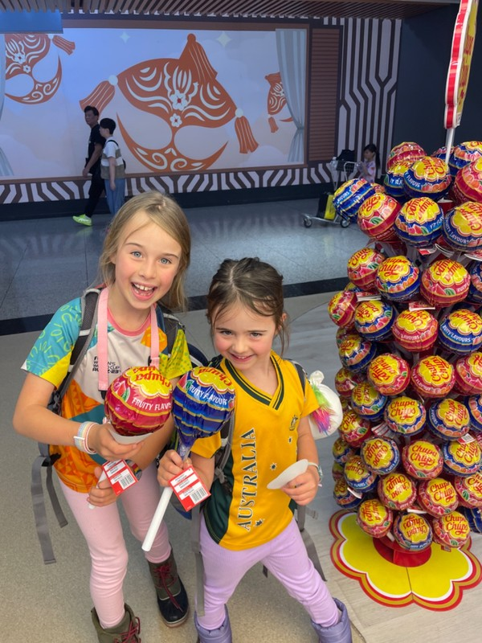
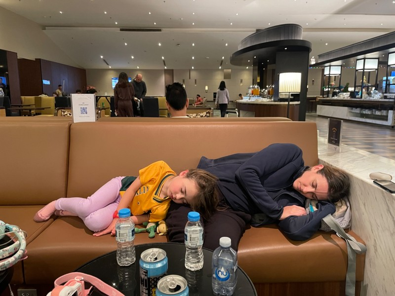
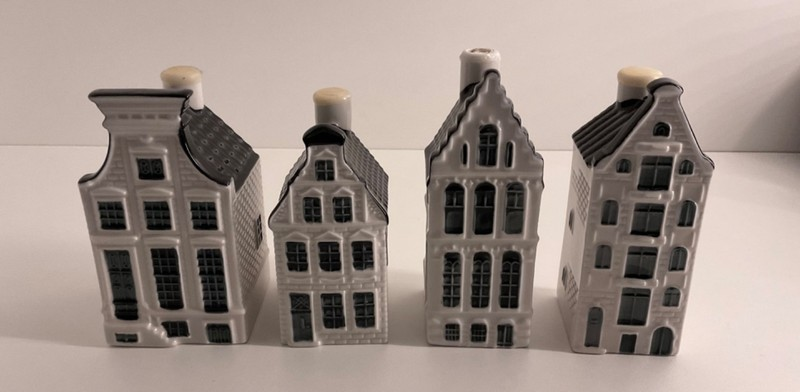
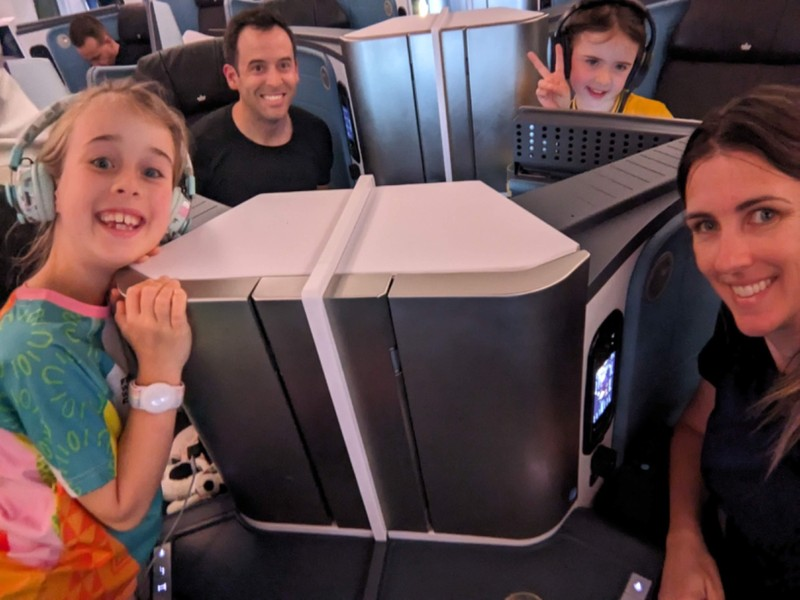

As our fitful night's rest is cut short by the alarm at 4.40am, we question our sanity. We could be asleep right now. We could roll out of bed in 3 hours, laze around until a peckish feeling arose, then meander to Nana and Grumps place to pick at Christmas leftovers and eggnog while the kids played. Instead, we're up before the sun, pulling the tired kids out of bed, and heading to the airport for 36 hours in transit to a freezing, rainy European Winter. Fingers crossed for some Northern Lights in Lapland, an enjoyable Hogmanay, and a good chance for Violet to use her French to make this worthwhile!

Grumps kindly supported our insanity and gave us a 5am lift to the airport.

The flights themselves were fairly uneventful. CBR to SYD was the standard take off, speed run down the aisle by the flight attendants to pass out snacks, then come take them away again almost immediately for landing.

In Sydney airport, we ran into Margot's preschool teacher Ms Foong at the gate, and she was subject to a million cuddles. After boarding, it turned out she was sitting directly in front of us for the flight. The kids did a fantastic job of trying to get some sleep, then quietly watched Sean the Sheep on the in-seat entertainment (excepting the occasional outburst of hysterical laughter).

*First thing the kids spotted in Kuala Lumpur Airport*

Bit of a walk in KL to get from the gate to a bus to immigration (high tech), to baggage claim, back to check in. Since we’re flying business for the last leg, Pat was told we’d have access to a special transport back to the other terminal. En route to our fancy bus, we spotted even fancier BMWs that would shuttle people between terminals. No longer satisfied with the VIP bus, Pat wants to figure out how to access that fancy car next time.

*Napping in the airport*

Business class also gave us access to a nice lounge, with a very welcome kids play space. The food selection included a laksa station, pasta station, sandwich station, lots of other buffet style food. All very tasty and puts the Qantas / Virgin lounge food to shame

Finally we boarded the last flight, and all did our best to get some sleep in the flat beds. For our meals, we ate from Dutch beautiful ceramics with engraved metal cutlery, and were given some lovely Dutch houses as a souvenir/parting gift. Very impressed with KLM! How will we ever go back to economy? Because we’re broke and out of frequent flyer points now, that’s how.

*Lovely Dutch houses*

*So much room!*
