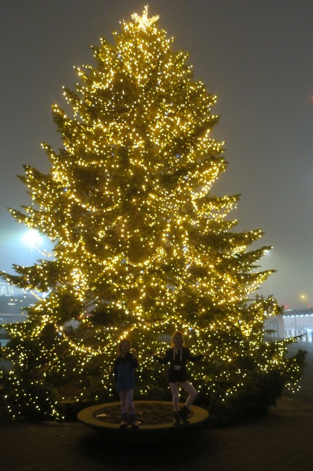
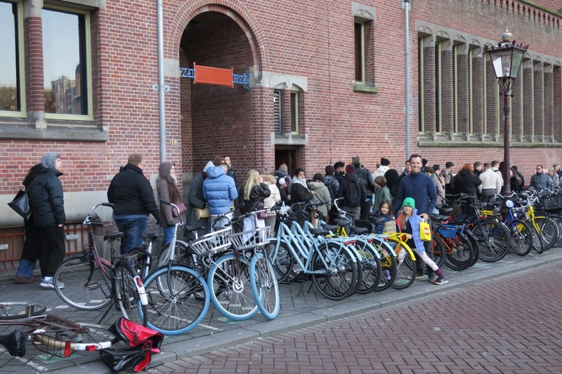
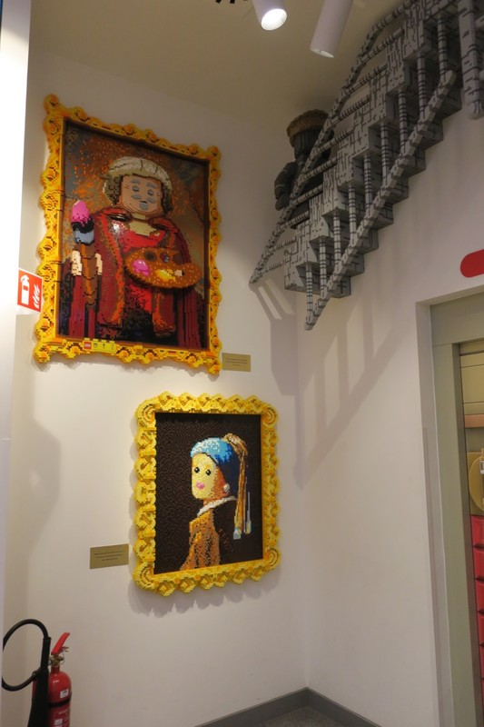
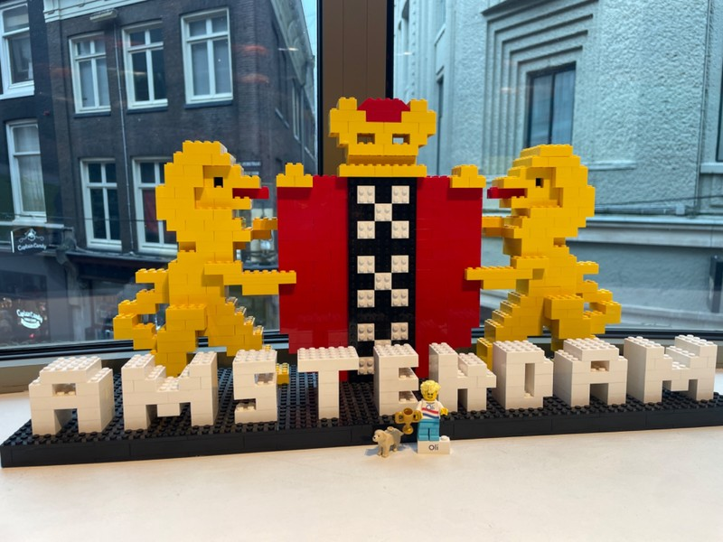
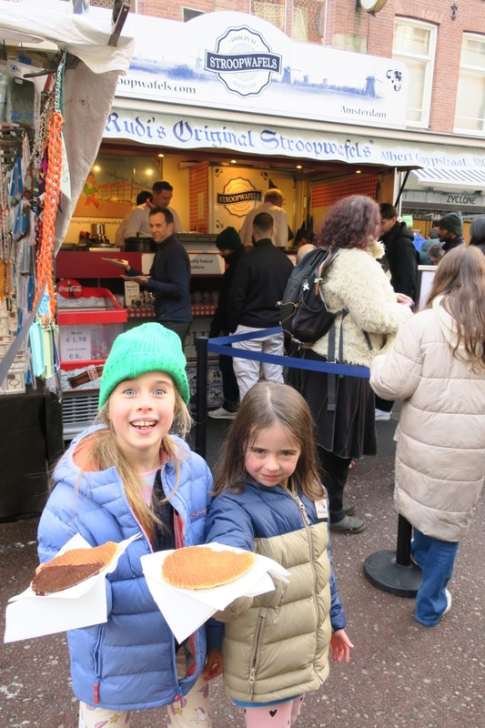
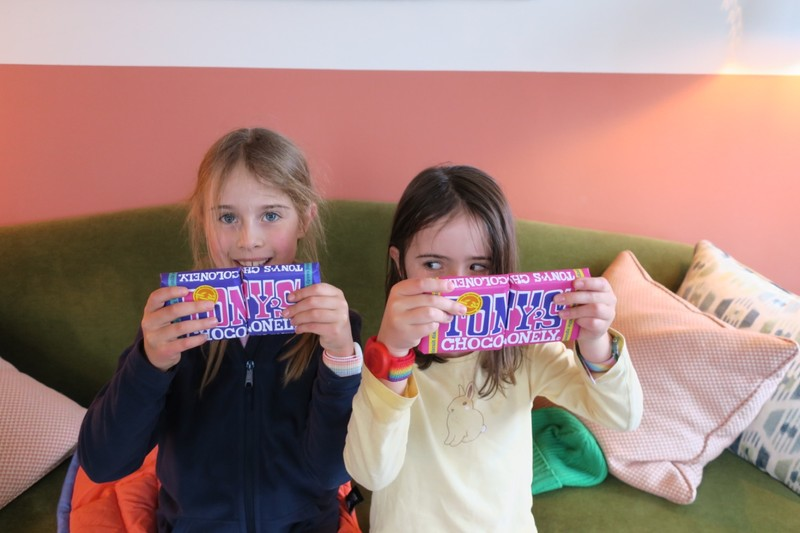
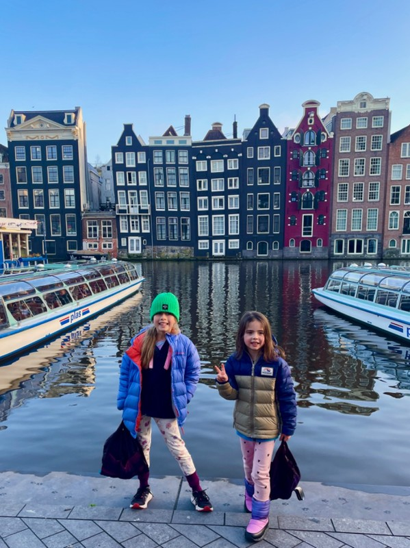

Our checked bag made it all the way here without getting lost. It’s a Christmas miracle. We taxied from the airport to our hotel before 7am, and were met with a second miracle; very early check in was allowed!

*Welcomed to Europe with a giant Christmas Tree at the airport*

The hotel is called 'The July', and we've both been very impressed with it's aesthetic. All of the decor looks custom. The lamps/tapware/tiling/paint/upholstery are very loud and not anything we would pick, but together they create a really warm and unique space. Miles from the 'everything IKEA' we're used to at the Meritons in Australia.

After showers, an episode of Dutch Duck Tales, and figuring out the bus ticketing system, we headed into town.

First impressions coming out of Central Station is that Amsterdam feels a bit like a parody of itself. They’ve gone all in on weed culture from the look of things. Every souvenir shop sold all manner of weed paraphernalia (magnets, postcards, shirts, hats) as well as weed itself in every form imaginable (gummies, cookies, brownies, joints). This feels a little different to our last visit. Of course marijuana was available, but you had to go to the right area and find the right kind of coffee shop. Now there are laced lollies at kid height next to the soft toy cows and tulip magnets. I guess that’s what people expect to see when they come to Amsterdam as a tourist, so that’s what the tourist shops cater for.

First stop - Tony's Chocolonely for the kids to make personalised chocolates. Tony’s Chocolonely was started by a Dutch journalist who was horrified when he learned about child slave labour used in chocolate production. When his initial journalistic and activist attempts to instigate change didn’t get much traction, he started making his own ethical chocolate. They have a major store in Amsterdam; but as there was no queue when we arrived we were unsure we had the right spot.

*By the time we left this had corrected itself and there was a queue out the shop and down the street.*

The girls had a blast picking cocoa content, extra additions (popping candy, cookie, pretzels etc), naming their creation and colour coordinating the wrapper. Pat felt it smelled like gym socks in the shop and wasn’t sure how a chocolate shop ended up smelling so foul.

Second, we walked to the local LEGO store. It was so impressive: LEGO recreations of famous Dutch paintings, a fuctional staircase with LEGO constructions all around bringing Esher paintings to life, and a selection of hidden LEGO parrots Pat enjoyed spotting. One of the employees involved the girls in a scavenger hunt for LEGO Christmas decorations hidden around the store. Once completed, the girls were presented with a LEGO passport (apparently special stamps to collect from stores all around the world) and Minifigures.

*LEGO Art Gallery*

The kids also designed a totally personalised Oli Minifigure for their cousin - they got to pick the colour of the shirt, pick images to put on it, and draw the design before it was custom printed. 100% individual. Very cool. Every staff member the girls spoke to wanted to give them another minifigure - we ended up drawing the line when there were 6 figures all with their own accessories spilling out of their hands.

*Lego Oli*

Next a quick stop as directed by Vi so she could try every cheese in a cheese shop. We'd had to have a word with her around the etiquette for free samples after she ate more than her fair share of chocolate samples at Tony's. Clearly having taken that message on board, she dutifully took one bit of cheese from each of the shop’s dozen+ sample bowls. God bless loopholes in the system.

Sufficiently stuffed with cheese, we took the tram to Albert Cuyp Market to try 'The Best Stroopwaffel in Amsterdam' (according to the Internet) at Rudi's Original Stroopwaffel. Admitted we have few points of comparing, but yum. Would recommend.

*Right before the stroopwaffel was used to coat fingers and faces*

With very sticky fingers and faces we tried another local cuisine for lunch - Indonesian fusion. The kids were less enthusiastic about the spicy fried chicken dumplings than they were about sugar filled waffle, but Kate and Pat were satiated.

We had planned to stop and watch the ice skaters for a while, but both of us agreed that it was too cold to be outside anymore. We picked up the completed custom chocolate bars from Tony's, and grabbed some pasta and jar sauce for dinner to cook back at the apartment (Nat would be disappointed in us)

By 4:30pm Pat was well and truly fading, and the kids fell asleep during their bedtime story before 6. Jet lag sucks

*Margot wondering how fast she’d have to be to steal that block without Vi noticing*

*Check out how uneven the houses are in the background - a lot appear to be sinking!*
