Good night sleep overall. Up around 7 and headed to Rijks museum. This is Kate's third trip to Amsterdam, but the first time she's seen the museum open after a decade of extensive renovations.

The museum organise a Family Quest through one of their audio/video guides. It let the adults see a lot of things while the kids were entertained with the tablet based quest. It took us through the Dutch masters gallery where we got to see a selection of Rembrandts, a naval model ship gallery, a selection of cool watches that chimed for the time to the minute, and a gallery dedicated to guns and swords. Apparently the Dutch were quite accomplished arms makers in the sixteenth century, able to supply weapons to anyone who would pay (including other armies).

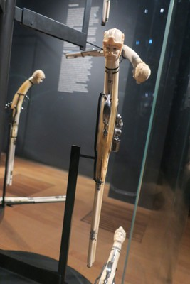

*Personalised LEGO doesn’t look as impressive next to the personalised carved ivory guns*

The museum is in the process of restoring Rembrandt's Night Watch painting. Rather than taking it out of display, they’ve built a custom glass enclosure around it so the public can still see the painting as well as observe the restoration work as it progresses.

The museum also had detailed information cards for quite a few of the paintings and exhibitions which gave context to the artwork and called out specific details. Neither of us could remember seeing anything similar in other museums around the world where if you didn’t opt for the audio guide, you’d be limited to the caption to the side of the painting (or subtly following a tour group and pretending not to listen to the explanation).

Throughout the visit, Margot spotted subtle and hidden animals in the paintings. Clearly takes after her Mother's side of the family. Give it another decade and all her holiday snaps will be of chickens and cows off the side of the road.

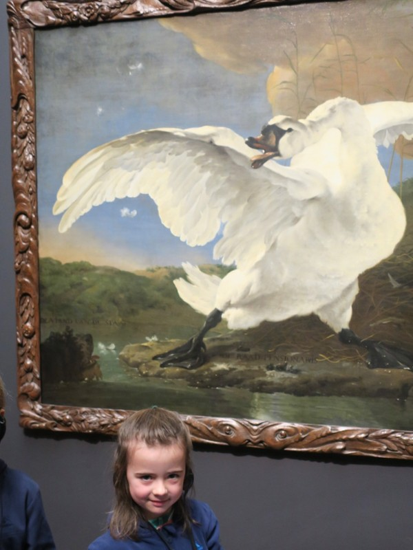

*Margot was chuffed to spot the dog stirring up this pooping swan.*

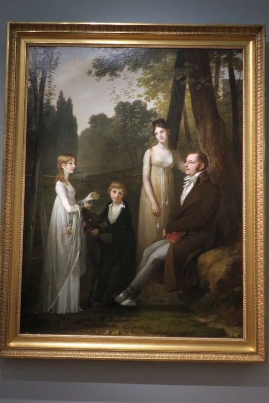

*In this painting, Margot says the little brother, Hendrix, is telling his goat to eat his sister, Stella's, flower bracelet while she's distracted*

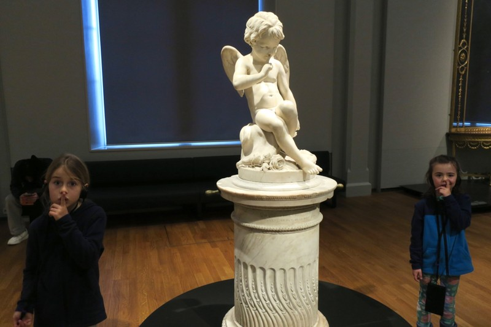

*Margot and Vi wonder whether the cherub is shushing, or preparing to pick its nose.*

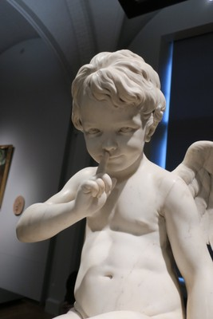

*You decide…*

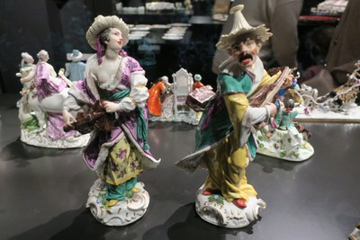

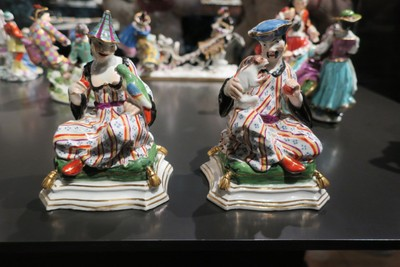

*Some racists ceramics of what Europeans imagined people from India looked like based on stories they’d heard from travellers*

After the museum, we ate some overpriced sandwiches we guilt bought earlier in the day when Margot badly bit her lip, and we had to rush into the nearest shop for a stack of napkins to stem the bleeding. The kids were keen to give ice skating a try, having seen a few different outdoor skating rinks from the tram. Given Kate’s livelihood depends on her hands, she elected to sit this one out so Pat rented some skates and took the girls onto the ice. The rink was set up just outside the Rijksmuseum and was incredibly scenic. A few enterprising kids had nabbed some cones and sectioned off one end of the rink for a makeshift hockey match. There were a handful of chairs around the rink that kids would hold on to and push around to help them learn to balance and move forwards. This was Violet’s preferred method of learning, while Margot was more comfortable holding Pat’s hand and skating next to him. By the end of the session, both kids were able to skate (mostly) independently for at least a few metres at a time.

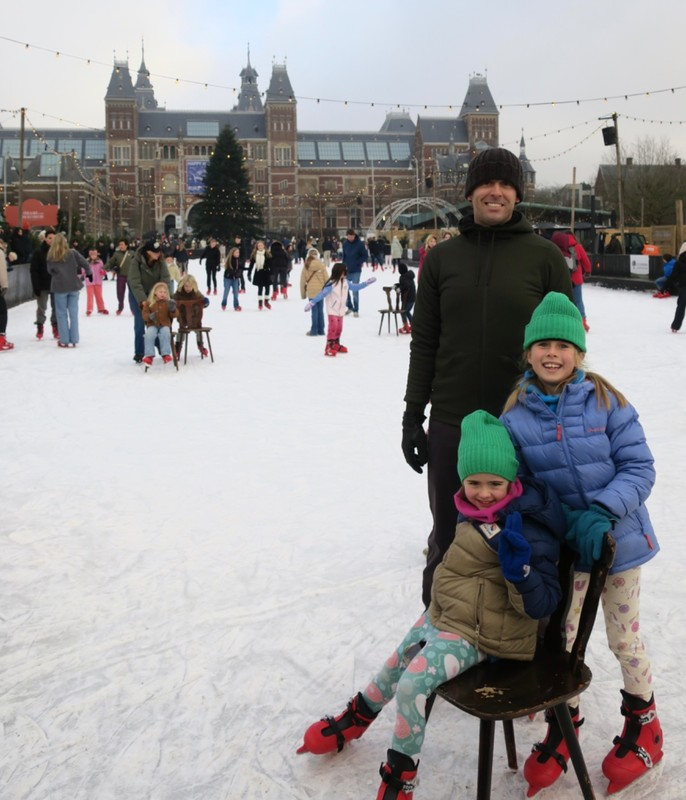

*Pretty impressive given neither of them had skated before today.*

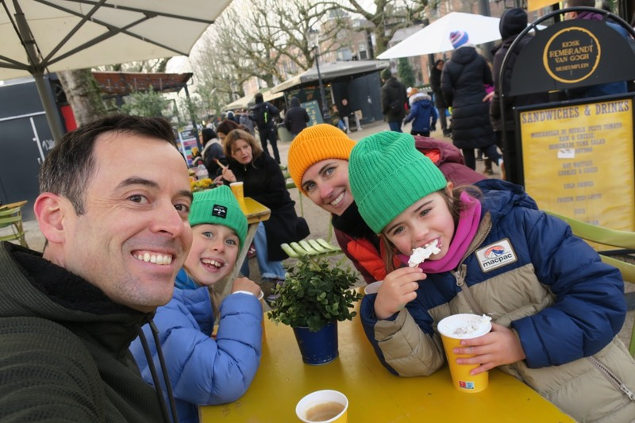

*We wrapped the activity up with a hot chocolate for all the girls, and a terrible flat white for Pat (the Australians need to come and train some baristas here).*

On the walk back to central, we passed a sculpture for Walraven Van Hall in a park next to the Dutch National Bank. In Germany it would have been accompanied by a detailed explanatory sign, here we had to rely on Google to learn who this guy was. It seems Wally was a Dutch resistance leader during World War II. He was known as ‘The Banker of the Resistance’ after founding the bank of the resistance, which supported victims of the Nazis and funded the Dutch resistance. His major fundraising was through fraud (approved by the Dutch government in exile). He exchanged falsified bonds for real bonds in the Dutch National Bank, and managed to steal the equivalent of half a billion euro for the resistance. He was eventually betrayed and executed by the Nazis in 1945.

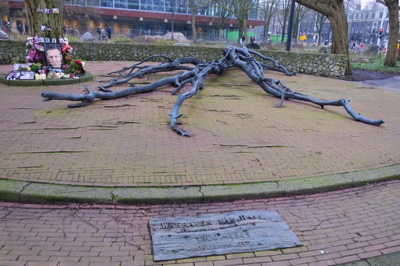

*Walraven Van Hall - Fallen Giant (with shrine to Alexis Navalny adjacent)*

Walking along the canals as it started to get dark, Pat was enjoying the winter aesthetic of the town. There were fairy light strung up on building, on trees, out front of cafes, on bridges… everywhere. They left a lovely warm glow around them and helped brighten up what would have otherwise been a grayscale scene. It was also interesting looking into the windows of the houses along the canal. Everyone seems to take great pride in their home decor, paying particular attention to lighting and furniture. Rather than LED down lights, homes have a variety of tastefully selected lamps with warm globes in them. Broad leafed indoor plants seemed to be common in a number of places we walked past. It made Pat wish he had any taste whatsoever so we could do something interesting and cozy in our house back home.

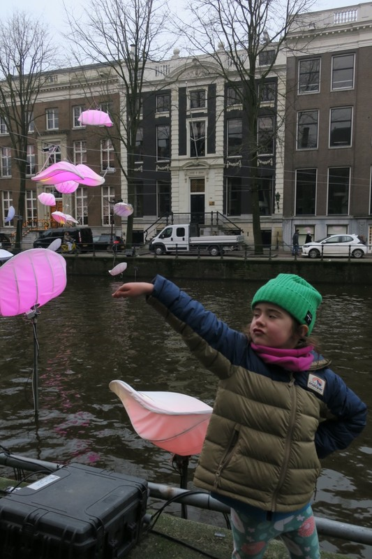

*The girls enjoyed special light installations along the canals for the Festival of Lights.*

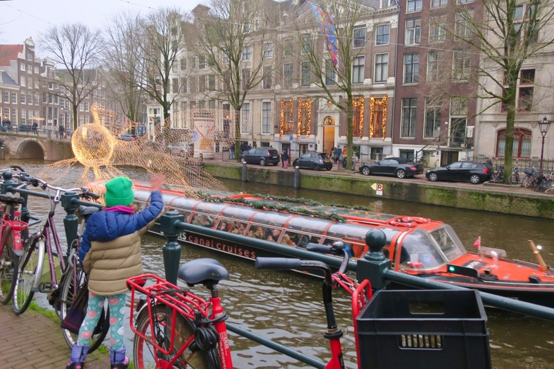

*Margot tried to get a wave back from the people in tour boats.*

We finished the day with a stop to try Broodje haring (herring sandwich), bitterballen (arancini balls with beef stew inside served with mustard), and frites with mayo. Violet was surprisingly adventurous and tried all three, and even more surprisingly, rated the herring broodje.

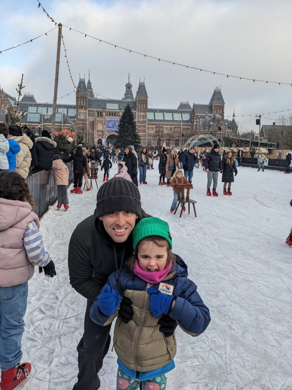

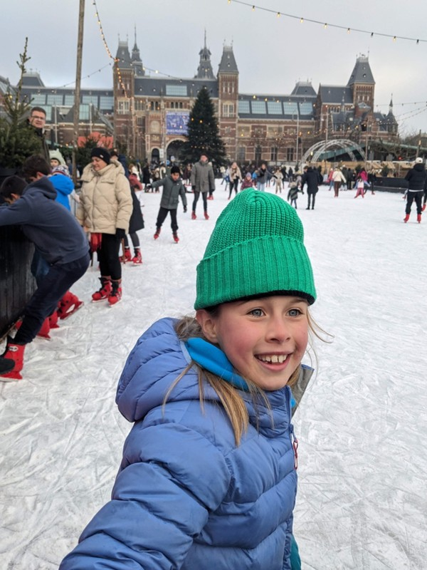

*Happy Skaters*

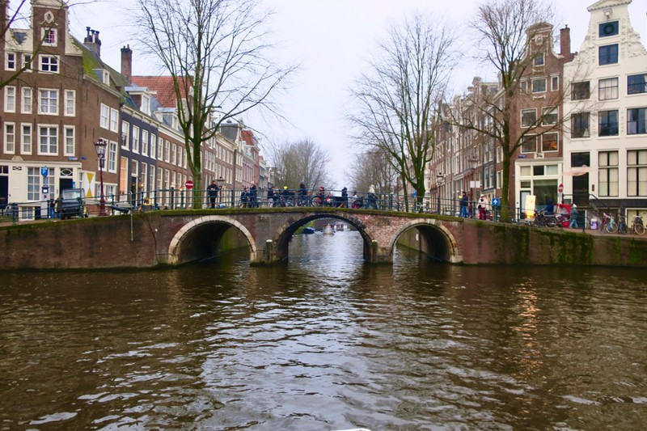

*Freezing, but hard to knock that view*

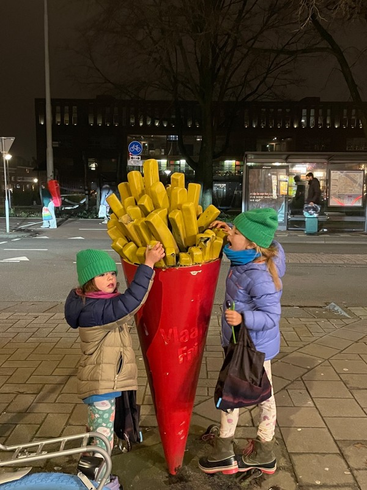
