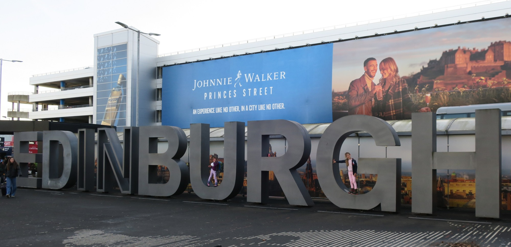
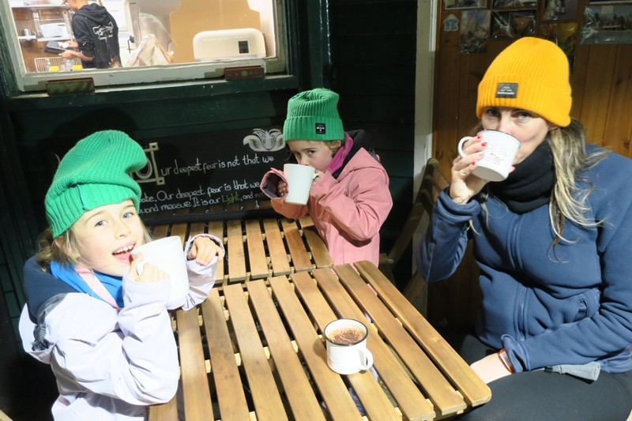
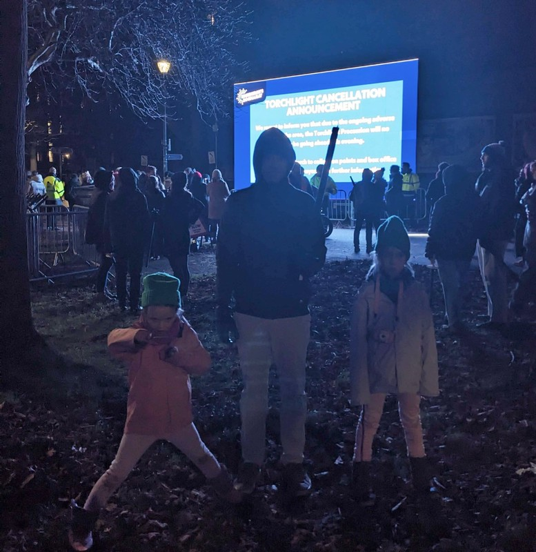
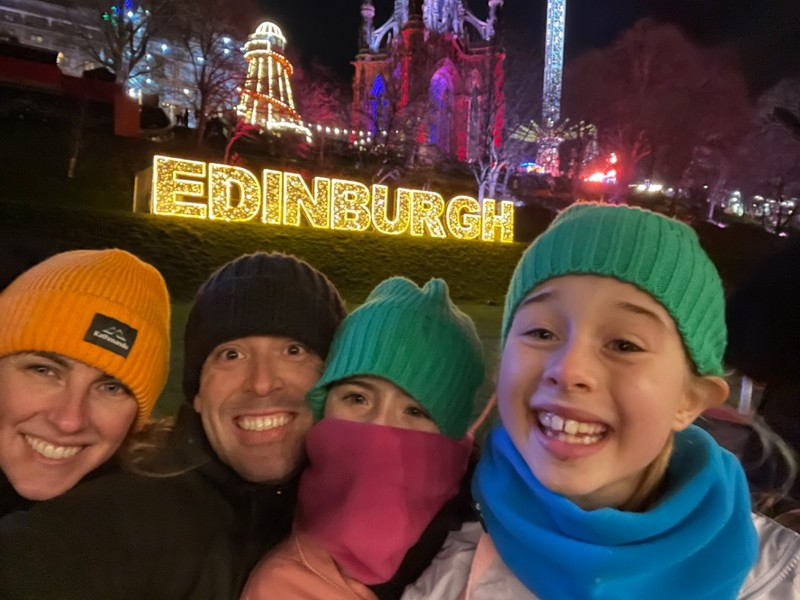
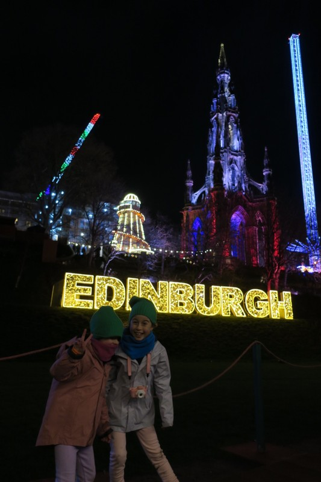

Most of today was taken up with transit. We got a bus to a station where we were to change to the airport train. At the station we tried the tickets on Pat's phone at the gate - no luck. We tried screenshots of the tickets. Fail. We tried the tickets texted to Kate, tried the phone upside down, all the combinations we could think of. We'd bought a multiday ticket that included transit to Schiphol, but found we couldn't get through the gate because of reasons only clear to the Dutch.  At one point Violet got through the gate with the rest of us stuck on the other side. Everyone in the station started to panic and try to get her back through. We were quite happy to have her 30cm away though a pane of glass while we sorted the ticket situation out, but it was not to be, she was unwillingly rescued and returned to her kin.

Eventually we got new tickets, got everyone on the same side of the gate, and went to the airport. The airport was enormous, but well organised with friendly staff. As soon as we were through immigration, Violet asked where the lounge was here - we may be ruining these children.

*Ready for some Hogmanay*

In Edinburgh, we got the bus to the hotel. Our apartment is on Princes St overlooking the castle. Certainly not the kind of view we’re used to on our normal accommodation budget, but we’ve splurged to ensure we don’t miss the fireworks. After we unpacked and put a load of clothes in the washer, we headed out to pick up our torch for the first of our Hogmanay activities, the Torchlight Procession. It’s only about a 15 minute walk to The Meadows where there are torch pick up points, live entertainment, and the all important queue to light our torches, and process our way through Edinburgh.

Picking up the torches was Pat’s first interaction with a truly unintelligible Scottish accent. While pulling up the QR code on his phone for them to scan, the man running the table asked him to do... something. Reasonably sure we’d left Amsterdam this morning, Pat knew he was being asked something in English. And, in fact, English was his native language. But neither of those facts were much help. Sensing Pat’s confusion, a woman helpfully translated and asked him to scroll up on his phone a bit to another QR code.

Cultural crisis averted, we picked up our torch and wandered through the park looking for something to pass the time. We spotted a cafe with a fire pit going outside and went to investigate. They had all the things on offer you’d hope for on a cold winter night: several styles of hot chocolate and a giant pot of mulled cider keeping warm on the stove. The kids each got a cider and we tried different types of hot (really, luke wam at best) chocolate. The fire attracted quite a crowd of adults, families and dogs. While we all enjoyed our drinks, a passerby started playing Christmas carols on a piano that was set up outside of the cafe and enticed everyone to sing along. So festive, so Scottish - a pretty good vibes for a random cafe in the middle of a park!

*Coorie*

Warm drinks consumed, we started in the direction of what appeared to be where the entertainment was set up. A few big screens and people milling around. As we got closer, the good vibes were all but lost; the torch procession had been cancelled due to high winds. After a “test” torch walk along the planned route (which I guess is a thing) the organisers determined that it was too windy to have thousands of people waving flaming sticks around in close proximity to each other. Boo.

*What’s a little singed hair or a itty third degree burn? We want to march!*

Determined not to let it ruin our night, we dutifully handed back our unlit torch and walked in the direction of the Royal Mile, figuring we’d at least get some sightseeing in. On our walk, we unwittingly found our way to the entrance of the Christmas market, so we went in and immediately came across a stall selling brownies which, for an extra $1.50, the proprietor would smother in hot chocolate sauce and whipped cream. Torch schmorch, the girls were over the moon. Several (dozen) napkins later, we resumed our walk through the markets. Margot saw the biggest disco ball she’s ever seen and we walked past some seriously intense carnival rides. Violet is pretty sure she’s big enough to ride the monstrosity that takes people up in little chairs on chains and whirls them around, all the while praying that the carnie who assembled them remembered to tighten the bolts properly. No thank you.

*Not a Flaming Torch, But Still Fun*

Admittedly, the wind was quite strong, and as it was showing no sign of buggering of we set off for home to get the kids to sleep.

