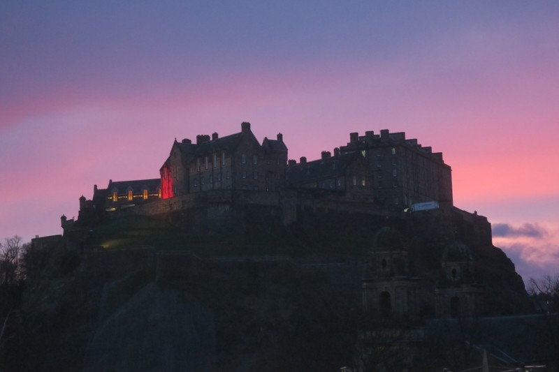
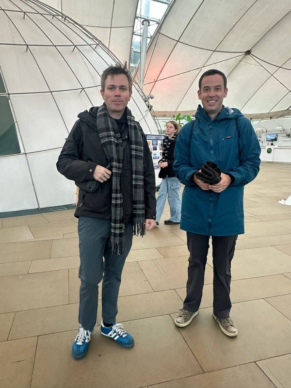
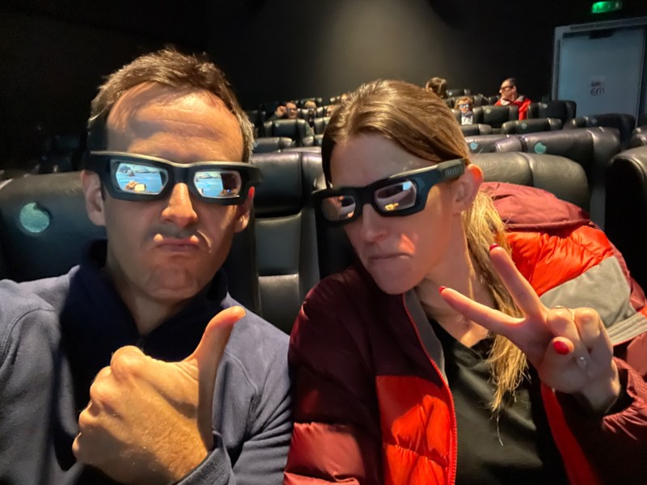
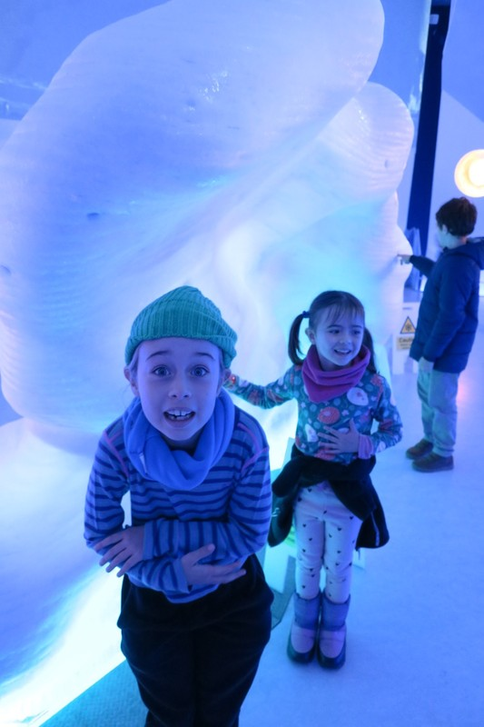
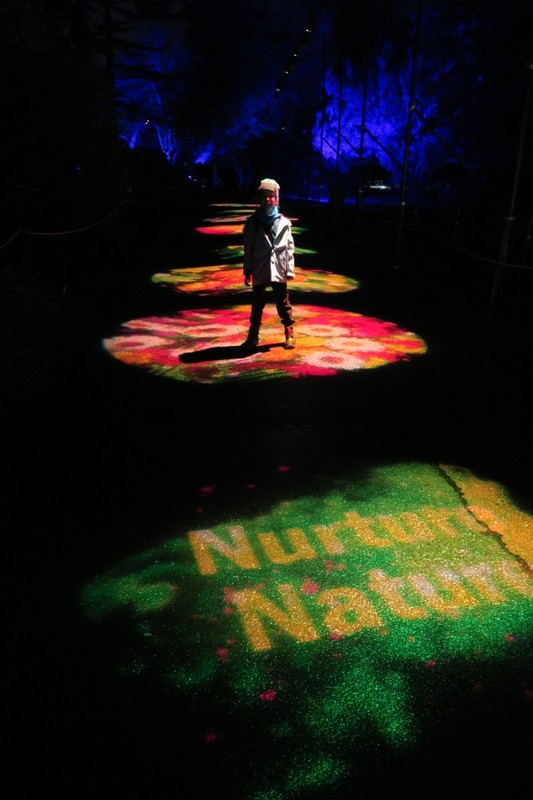
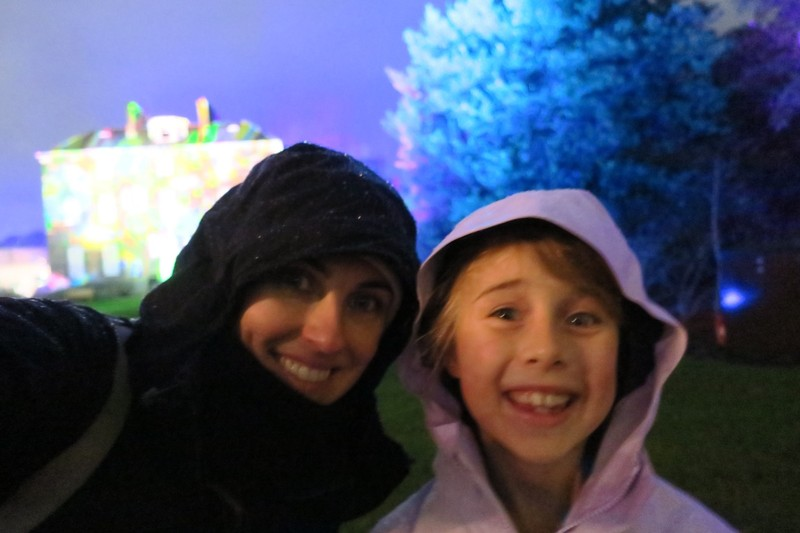
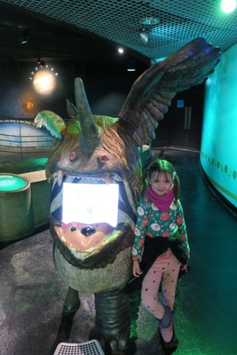
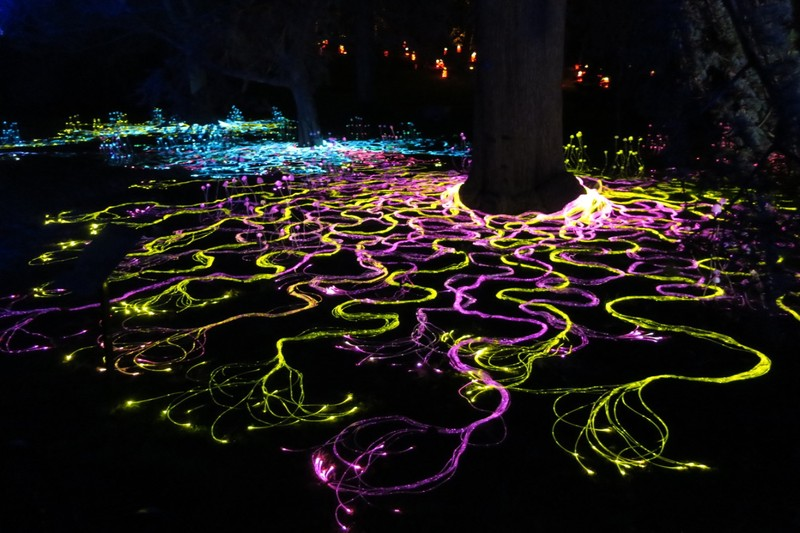

We had a pretty ordinary sleep last night. Violet tells us Margot was up at 2am, and by 4.30 she'd had enough and called us in to help. Kate spent an hour laying with the kids trying to settle them, and gave up just before 6. Their report this morning was they both fell asleep right after I left the room, and didn't wake up again until 8.30.

*Beautiful Sunrise from the Window Though*

As it was meant to rain all day, we picked some indoor activities. We got tickets to the Earth sciences museum, Dynamic Earth for the morning. For the afternoon, we booked a Harry Potter inspired potion making experience to help make up for missing the Torchlight procession. Jordan and Claudia are coincidentally in Edinburgh as well and met us at Dynamic Earth.

*Check out that affectionate reunion*

It was a pretty cool concept for a museum. It led us through the start of the universe, how mountains form, tectonic plates and what earthquakes are, evolution, different environments (eg. the Arctic, rainforests). The rooms were all interactive with things like wall sized screens displaying information, a 4D movie (we got the 3D glasses, but I’m not sure what the 4th D was), an earthquake room, and a massive lump of real ice in the Arctic room. The 3D movie was a massive hit with the kids, turns out they’ve never seen one before and the experience was pretty mind-blowing for them.

*Into the 4th Dimension*

Unfortunately from the start, Margot said she felt bad in her tummy. We thought it might be tiredness or nerves or all the massive screens, but it impacted her ability to really enjoy the experience.

*She was pretty taken with the ice though*

Afterwards we got a bus to the Potions Cauldron, and about 10 metres from the door Margot vomited everywhere. Rather than being empathetic, Violet got upset that she might miss the potion experience. A very helpful couple who were enjoying an afternoon drink at the pub saw what happened and went inside the pub to get a glass of water for Margot.

Pat took Margot back to the apartment, and Kate (somewhat reluctantly after the outburst) continued on with Violet. We were led down a staircase at the back of the shop into a dimly lit room with a long table spread with magic ingredients. A rather spooky witch started to lead the experience. First we were to drink a blue shot of 'healing potion' (sweet cordial). This was followed by a 'magic potential test' with a trick test tube. Violet didn't like the taste of the blue potion, and her trick tube was the only one in the room not to work. She said she felt sick too and wanted to leave.

Whether it was actually illness, guilt, or the heat and incense we'll never know, but total failure of an activity.

After a few hours rest, Violet felt better, but it was clear Margot was not going to improve enough to go to the Christmas Lights at the Botanic Gardens, so Kate and Violet braved it alone.

*Christmas at the Botanics*

The light installations were really phenomenal, completely immersive and set to music. There were a dozen or so installations, all entirely distinct. It was an experience that couldn't be captured adequately on film, and I certainly can't describe it well enough with words. Over the 90 minutes we were there the rain got progressively heavier and heavier, and it got colder and colder. Our wet weather gear held up very well, and Violet was engrossed enough she didn't want to skip anything to leave early, but we didn't linger, and the roasting marshmallows was a no go.

*Wet and Wild*

Back at the apartment, Pat and Margot were watching Shaun the Sheep Farmageddon when an ominous text message came through from Jordan. Thinking surely he must be joking, Pat checked the Hogmanay website and sure enough, all outdoor activities for the 31st, including the fireworks display over Edinburgh Castle, and the street party were cancelled due to the ongoing rain.

What. A. Bummer.

Apparently all of the rain has left them unable to prepare the fireworks and set up for the street party, so they made the call to cancel everything. In their limited defence, the weather bureau had yellow alerts (whatever they mean) across all of Scotland for heavy rain (up to 150mm in some regions) and potentially damaging winds. To that, we say pish posh. Who’d have thought the Scots would be undone by a wee bit of wind and rain?

*Posers*

*Just imagine this, but moving, and with music, and completely surrounding you*
