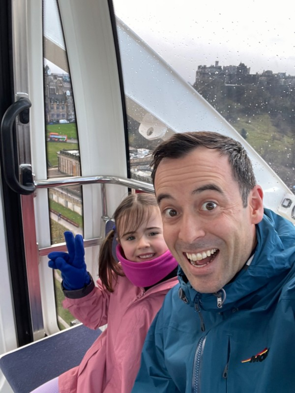
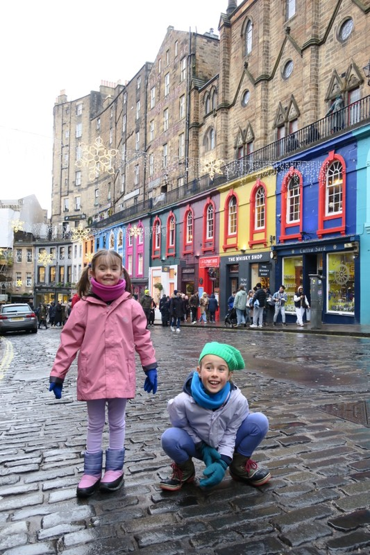
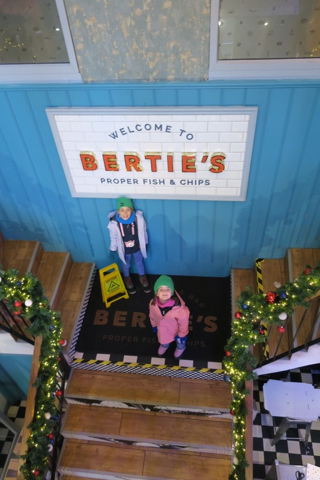
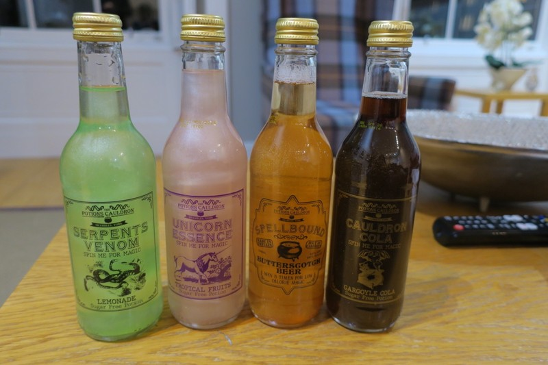
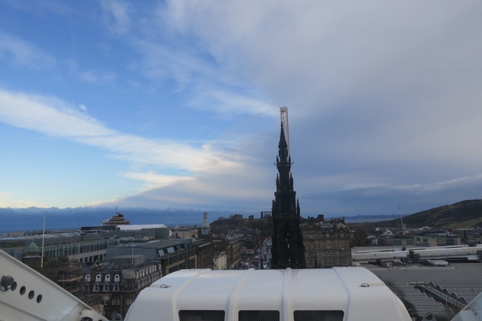
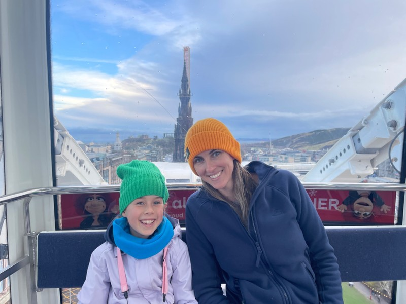
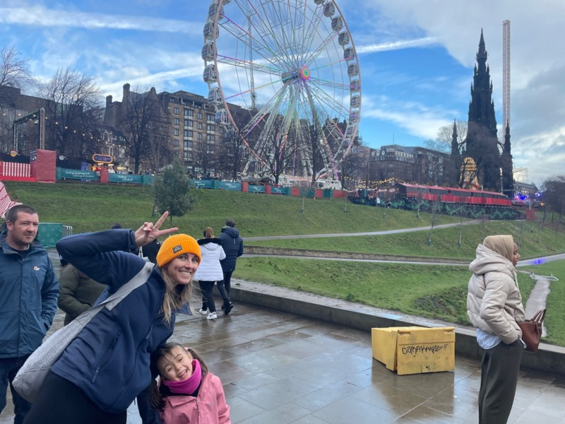
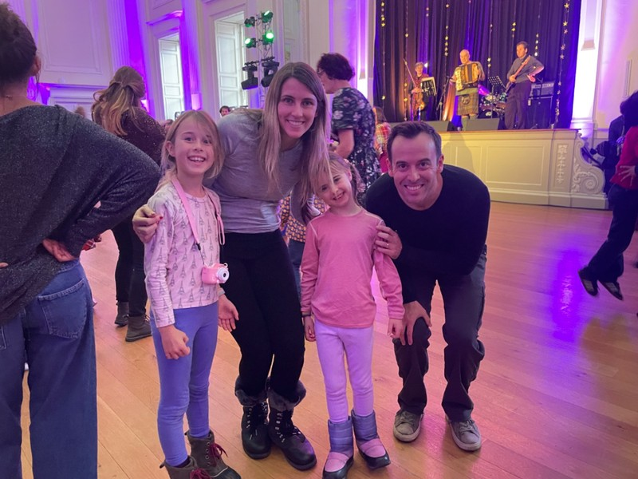
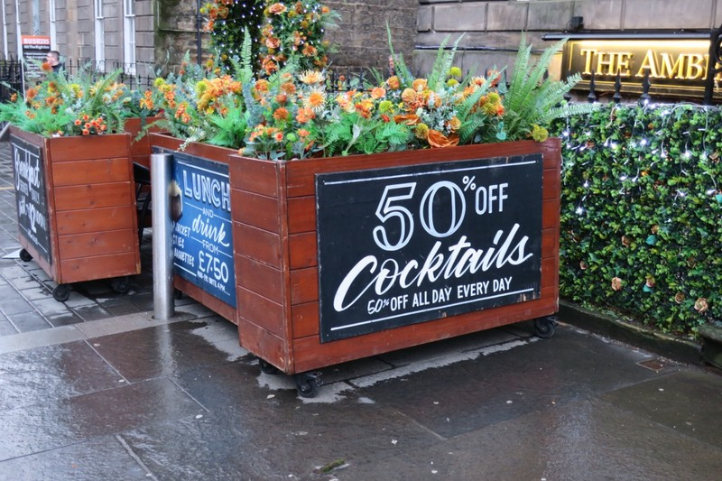

Not a great night’s sleep. Margot was understandably restless and was disturbing Violet’s sleep, so Violet went to sleep with Kate, and Pat slept with Margot. Margot woke up frequently throughout the night feeling out of sorts, but didn’t have any more vomits.

By the time morning rolled around, everyone was still pretty sleepy so we had a relatively chill morning to recover. The rain outside was being blown horizontal by the wind, so not a terribly inviting morning to be outside exploring anyway.

By mid morning, the weather was easing up and we decided to brave the elements and try and check off some more items from our list: namely eating proper fish and chips and a deep fried Mars bar. We walked back to the Christmas Market and took a ride on the giant ferris wheel - Kate had booked the ‘last 4 tickets’ online earlier in the morning. When we arrived it was basically deserted; Kate will never not fall for false scarcity.

Margot perked up a little bit for this activity and the weather seemed to be improving. Lovely views from the top across Edinburgh, including spotting a building that had a sculpture on top which looked like a giant coil of poop. Subverting expectations, it was Kate who made this observation.

*Pat, Margot, and the castle*

Toilet humour aside, we trundled on towards our lunch destination on Victoria Street, which may have been the inspiration for Diagon Alley in Harry Potter. We say “may”, but the real answer is almost certainly “no”, as Rowling has stated that it wasn’t based on any real place. But, it’s good for tourism so why let the truth get in the way of a good story?

*It looks magical enough. What does JK Rowling know anyway.*

Lunch was at Bertie’s Proper Fish and Chips, and had all the trapping of a tourist trap: located on a popular tourist street, big flashy sign, having to specify that their fish and chips are “proper” in the name… However, despite being a bit expensive they delivered on their promise: really, really good fish and chips. We killed two birds with one stone and ordered a serving of haggis on the side, and a deep fried Mars bar for dessert. Violet even had a try of haggis, but agreed after a bite that it wasn’t for her. Both Kate and Pat thought it was perfectly fine.

*Deep Fried Delicious*

Now laden with oil, we trundled toward our next activity, ceilidh dancing! On the way, there was a slight drizzle. You’d be hard pressed to describe it as rain, nor would it be something any self respecting weather bureau would issue a yellow alert for.

By this time, poor Margot was fading again and was too tired and hot to participate in more than one dance, which is a shame because we thought this activity would be right up her alley! The ballroom was absolutely packed and it was difficult to hear the instructions, so the dancing was more chaotic than organised, but we still had fun. Pat and Violet danced a waltz together, and Kate, Violet, and Margot shared an awkward dance with a family who didn’t speak English, so there was zero chance of any of them knowing what to do.

*Assembly Rooms - Really beautiful venue*

After we got home, Pat went out to collect the magic potions that Margot and Violet didn’t get yesterday because they were both unwell. He also stopped on the way back home to get a bottle of French bubbles to drink at midnight. Didn’t even need to wear a raincoat for this journey. Honestly, no fireworks over the castle tonight????

*Very cool potions - they glittered and changed opacity when swirled*

So absurdly, we rang in the new year here in Edinburgh, with our perfect view of the castle, by watching the Sydney fireworks on TV with Claudia, Jordan and the girls. At 9pm we celebrated “New Years” for the kids, watched the Sydney fireworks and drank the kids magic potions from champagne flutes. After the kids went to bed we caught up with Jordan and Claudia and subjected them to Dinner for One in the lead up to midnight. After nearly missing the countdown trying to figure out the TV controllers to find the countdown, we jumped into the new year and watched the London fireworks. The number of music tracks playing at once, and the insane amount of fireworks going off with no discernible theme or pattern led us to believe the Edinburgh sound and pyrotechnics had been trucked down to London and just put on simultaneously with their display.

Meanwhile out the window here, some rouge hero snuck up to the castle and set off a few fireworks at midnight. The few exploding fireworks sounds were immediately followed by police sirens (presumably from the fun division).

*Giant Poop Emoji to the left*

*View from the top*

*Margot on a Ferris Wheel high - check out that disastrous weather in the background*

*Ceilidh Family*

*I don’t think this restaurant understands what a discount is…*
