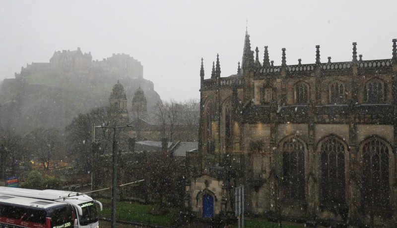
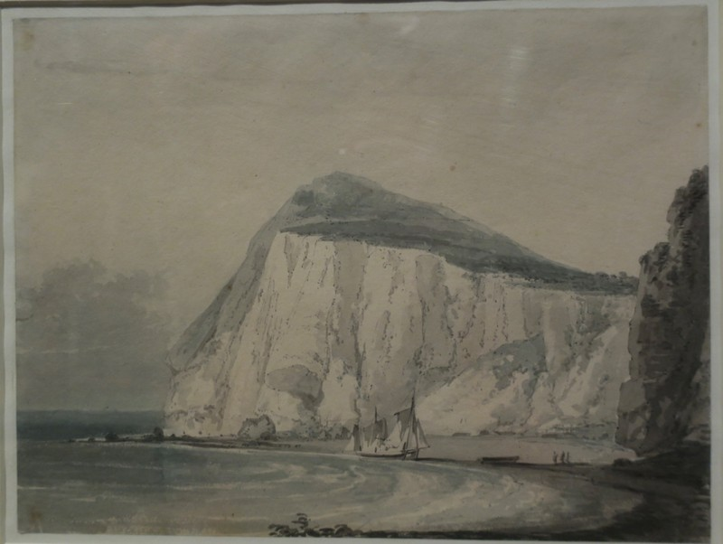
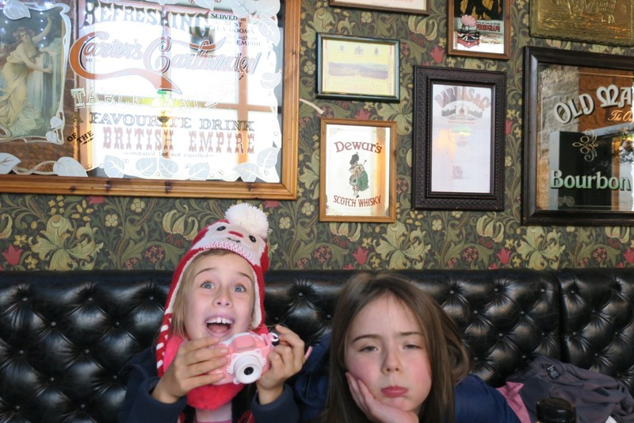
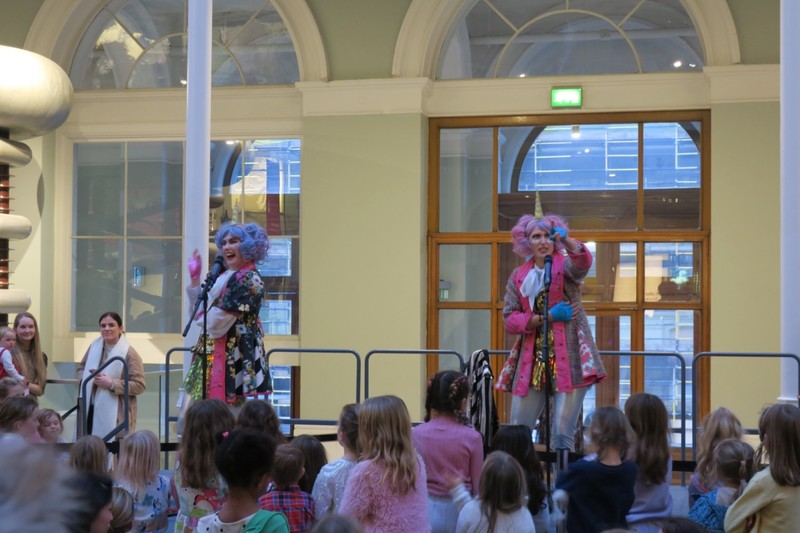
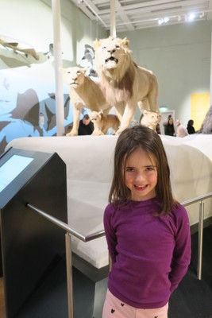
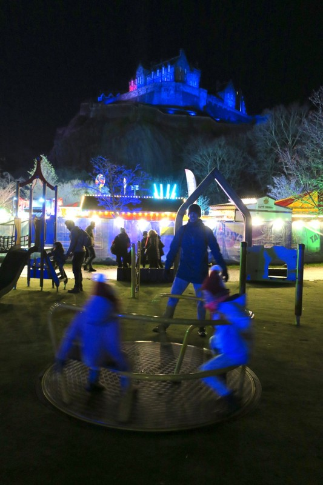
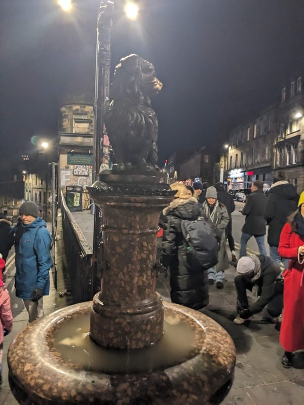

This morning Margot woke up much improved, but tired and low on blood sugar so she was a little bit of a hellion. Violet, who had been avoiding physical proximity to Margot while she was sick, could sense she was better and got back into sister antagonism. It was not the best morning of the trip, but we managed to get them settled by reading a few more chapters of The Voyage of the Dawn Treader.

*They both cheered up considerably when it started to snow out the window.*

Eventually all of the tantrums had wrapped up, everyone had eaten, everyone was dressed, and we headed out to the Scottish National Gallery to go to a Turner exhibition. The paintings were donated to the Scottish and Irish National Galleries by an art collector, Henry Vaughan. The donation came with several conditions:

1. The works were to be displayed as a complete collection.  
2. They were to be displayed for free.  
3. They could only be shown in January.

We thought the first two conditions were great, and it was a generous enough donation to give leeway for some excentricity with the third. We did later learn it was actually to protect the paintings from fading in sunlight, so less the mad requests of a millionaire, and more practical requirements from an art expert.

This year was a special year, as the Scottish and Irish galleries had traded collections so the works displayed hadn’t been shown here before.

*As we lapped the gallery the kids spotted Lucy, Edmond, Caspian and Eustace in the paintings, and the Dawn Treader in the storm. No Reepicheep sadly.*

One of the few Hogmanay events that wasn’t cancelled was a series of kid friendly events at the Scottish National Museum. We left the gallery and set off towards the museum with a plan to stop somewhere along the way for a bite to eat. We picked a pub that looked, well, like a pub. Violet was keen for bangers and mash again and as long as Margot could pick from an assortment of juices to drink she was happy. We ordered from a waiter who gave the impression that he really should be writing down our order rather than trying to remember everything.

After 45 minutes of waiting, we checked if our food was ever coming. “It’s on the way, it’ll be here soon”, claimed the waiter without speaking to the kitchen (or anyone else for that matter). Perhaps he’s just really on the ball and anticipated the question? Another 15 minutes and we checked again with another waiter. He said he’d check with the kitchen, went into a corner for a few minutes, and came back to us with “Soon” and packets of chips to placate us.

*Kids filled the wait with a complex game about pets they made from folded pieces of paper*

After another quarter hour, and unsatisfied with “soon” as a quantification of time, Kate went and politely demanded an actual timeframe on where our food is. The staff didn’t understand what she meant by ‘timeframe’ until she started to ask details like - Is the pie still defrosting? Is it plated up and awaiting delivery to the table? Are the potatoes still being chopped? The waiter (who we were really starting to suspect had never waited before today) looked totally flabbergasted, and another woman popped out from behind the bar to help. She actually checked with the kitchen, which it turned out was 2 doors down the road and also cooking for another restaurant, and assured us we really were the next ticket. “Like, 2 minutes”, was the reply. 10 minutes later our food did arrive. Margot and Violet were happy enough with their meals, but Pat’s sausages tasted like they’d spent the last couple days under a heat lamp while our Scotch egg was covered in completely uncooked pork meat. Unfortunately we didn’t realise this until we’d each taken our first disconcerting bite. Yum.

When the poor waiter came back to ask how everything was, Pat was mean (according to Margot) and said the sausages were dry and the Scotch egg was raw and requested to have the Scotch egg taken off the bill. It really wasn’t the waiter’s fault, the whole concept of ‘waiting’ seemed to totally overwhelm him, but our ‘quick lunch’ had now taken 2 hours. By this point we only had about a bit over an hour until the museum was going to close, so we scoffed down what we could and hurried off so we could catch the last show of the day.

*Dance Party!*

We arrived at the museum just in time to find a spot for the Unicorn Dance Party. Two highly energetic Scottish women dressed as unicorns came onto the stage and got the kids dancing. Margot and Vi got into it for a while, then Violet needed the toilet, Margot didn’t like being in the crowd alone, and we decided to go check out the giant T Rex skeleton they could spy in the next room instead.

An observation I want to pop in here is that Edinburgh has generally been really impressive with access to period products. They seem to be free in most bathrooms in both public bathrooms, and those in private businesses. I wonder if it’s legislated, or a cultural thing.

The animal section was simultaneously haphazardly cluttered, and well organised. Rather than grouping animals by type, or location, they were in displays according to jumping ability, or how fast they could fly. Violet used her camera to go around and systematically take photos of every display and explanatory sign. We spent a little time looking at the rocks and gems, then headed back to the apartment as the museum closed.

*Aslan!*

Perhaps the biggest win for the kids came on the walk back to the apartment. We cut through the Christmas markets again and walked through the kids carnival section to discovery a playground. The kids lost their little minds as if this was the first see saw and slide they’ve ever seen in their lives. A good reminder that we don’t need to spend heaps of money on organised events and experiences to keep them entertained; sometimes a playground is all it takes.

*Wheeee!*

At the accommodation, we packed up for our early morning flight and said goodbye Edinburgh. While it has really been a constant run of misfortune (Hogmanay cancelled, the very expensive castle-view apartment for no fireworks, Margot getting sick, worst meal at a restaurant in maybe ever), we still had a good time and feel really keen to come back to Edinburgh. We might just aim for a season with more cheerful weather next time, and perhaps we’ll try tracking down Greyfriar’s Bobby on day 1 just in case.

*Accidentally happened on Greyfriar’s Bobby on the way home and got our good luck pats in*

*Spooky?*
