Jan 2nd was another transit day - Edinburgh to Helsinki to Ivalo. We woke up before 6, got the bus back to the airport, scoffed down breakfast, and boarded the plane. The kids decided on The Lion, The Witch and The Wardrobe movie on the first flight to get in the frozen wonderland mood.

Observations today:  
- Edinburgh airport looks like a run down tin shed (it's hard to believe it's not a temporary structure)  
- Lots of dogs in the airports (cute until they wee)  
- Designated kids' play spaces in Helsinki airport  
- No seating at the gates at Helsinki airport, only at the restaurants (felt more like a mall or shopping centre than an airport)  
- Violet was horrified by a restaurant near our gate selling Reindeer Pasta Alfredo   
- No free food or drinks on the flights (which also horrified the kids coming from Australia where a snack and a beverage are standard on the major airlines).

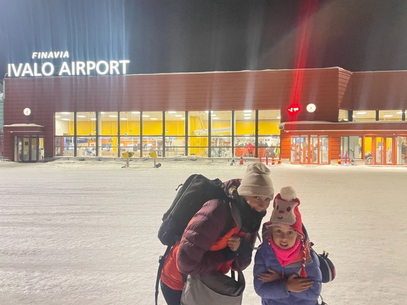

*We arrived in Ivalo an hour and a half late after a delayed departure to a balmy-24 °C🥶*

We collected our baggage to find the kid's suitcase and all their clothing totally saturated. Thanks Finnair!

On arrival at the hotel, they quickly checked us in and told us to leave our bags behind and whisked us to the dinner buffet. Pat appreciated their priorities. Presumably hungry guests are cranky guests, so best to stuff them full of food as soon as they arrive to ensure everyone’s happy. After we finished dinner, we collected a small sleigh and loaded it up with our bags to take it to our cabin. The kids were unimpressed that the bags got a ride but they were left to walk. The disappointment didn’t last long when they spotted all the snow banks and kept themselves occupied on the short walk by trouncing through the snow (regrettably not wearing their ski clothes).

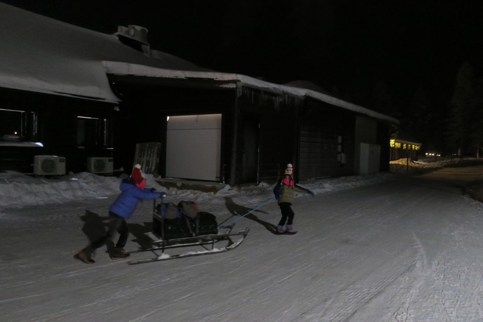

*Luggage service*

The Aurora Cabin is small but very well heated. There’s a bed for Kate and Pat, a sofa bed set up for the girls, and a small bathroom with a toilet and shower. Everything we need and nothing more. We prepared for the close quarters as that was a common theme in the reviews that we read. But knowing we weren’t going to be spending a ton of time in the room anyway its size wasn’t a drama. All snugged into bed, everyone fell asleep after the requisite bedtime wiggles.

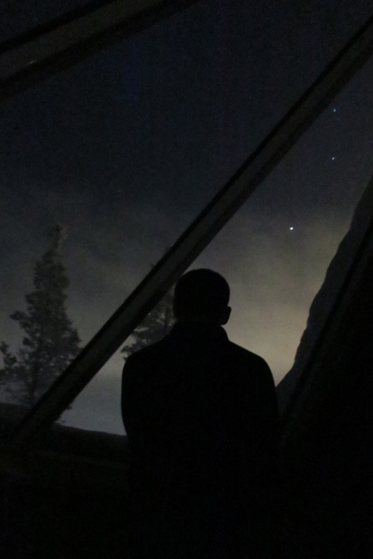

*Overnight there were some Northern Lights through the glass roof at 1am, but not for long*

The morning of the 3rd we got up, got layered, had a quick buffet breakfast, and went to get our included snow gear hire. Margot's was way too big, but as we were running late it had to do. Everyone in the group waited the 5 extra minutes for our family to get organised, then we headed to the reindeer pen. We were warned the reindeer are more wild than tame and spend 7-8 months of the year off free in the forest. At the start of winter, any who weren’t eaten by wolves are caught and brought back to pull sleighs. It’s only males as the females are mostly pregnant, and it takes 4 seasons to train them. Message was - don’t touch, don’t shout, just be chill. If you scare them, they can take off at 50km/hr carrying 200kg behind them.

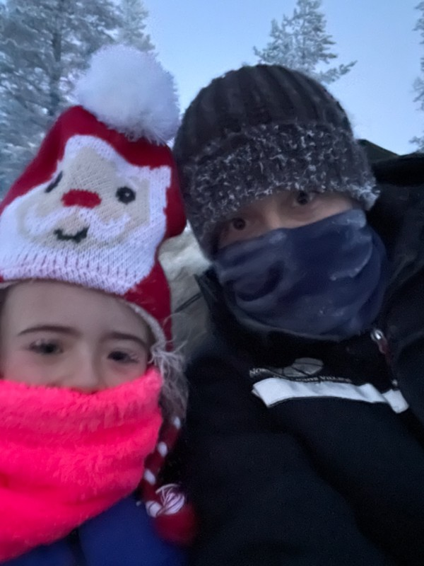

*In the way below freezing temps, being chill was pretty easy*

The experience itself was a 20 minute sleigh ride through the forest. The reindeer were led by a guide on foot who made sure we remained way below the 50km/hr speed limit. It was beautiful and Kate loved being so close to the reindeer, but it was also so cold, and within minutes we had frozen eyelashes and hair.

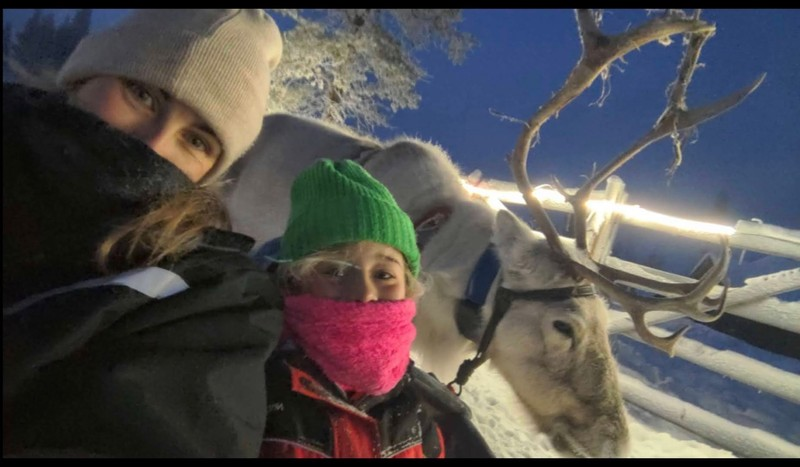

*Reindeer Selfie!*

We followed the reindeer up with an uneventful lunch and a walk to the local shops to pick up some postcards, and cold and flu tabs for Pat, who was starting to feel congested. The girls were enraged on the walk to pass a perfect toboggan hill but be told there wasn’t time to try it out. After some confusing discussion with the shop assistant (who had great conversational English, but not so great medical grade English) we discovered cold and flu tablets either don’t exist or are prescription only, and got a nasal spray compromise.

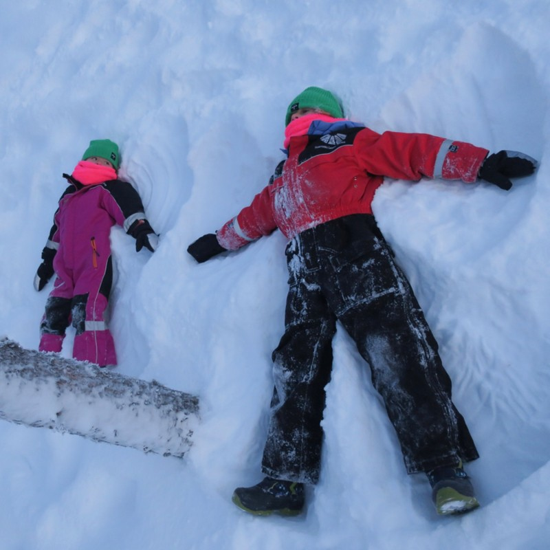

*Snow Angels*

We came back for our 1.30pm cross-country skiing lesson only to find out it actually started at 1pm. Oops. The staff were very nice, rescheduled it to tomorrow, and moved the kids snowmobile to today at 3pm.

The kids were furious we’d missed the skiing until they found out we could fill the free time with tobogganing. “Furious children” seem like it’s becoming a theme on this trip… Need to teach these kids some zen.

We arrived 20 minutes early for the snowmobile, we will not miss anything again! This also gave us a chance to get Margot a snowsuit that fits. The kids loved hooning around the track as fast as they could with a stop for a (frozen) marshmallow (semi) toasted over a fire in the hut to warm up every now and then.

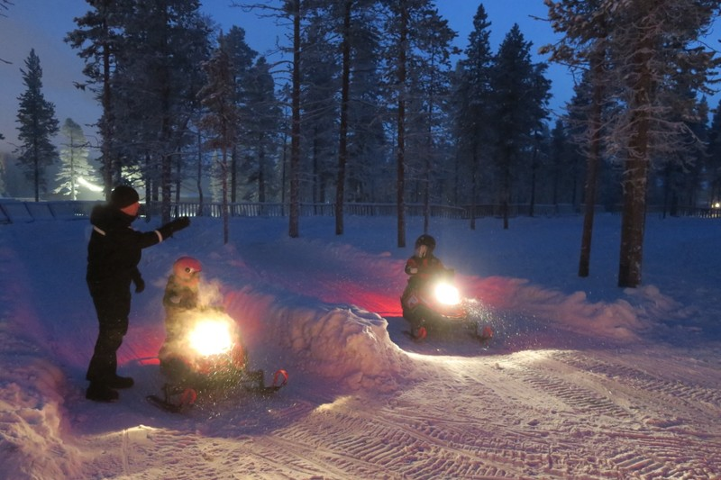

*Woo!*

Once we were all actually freezing, we headed to an early dinner and bed.

Overnight the accommodation app woke us up intermittently to let us know the Northern Lights were visible out the window. This time we had the camera ready to go. Our cabin is in the back row, so we only have forest behind us. Good for the (relative) lack of light pollution, not so good because the trees mostly obscured the Northern Lights. What we could see were faint glows behind and through the trees. And rather than being a brilliant fluorescent green they were more of a dusty grey.

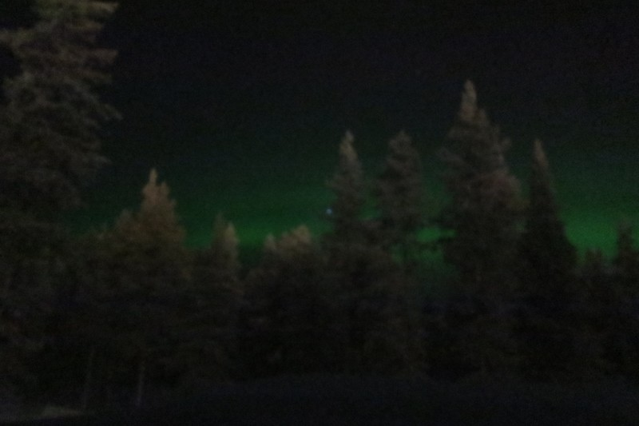

*It came out more obvious on the photos than it was in real life - hopefully we get a better view of it tomorrow on our trip out to the Aurora Hut.*

Either way, it was still incredible to be snug in bed looking out at the night sky and seeing shooting stars, normal (boring) stars, and the occasional glimpse of the Northern Lights.

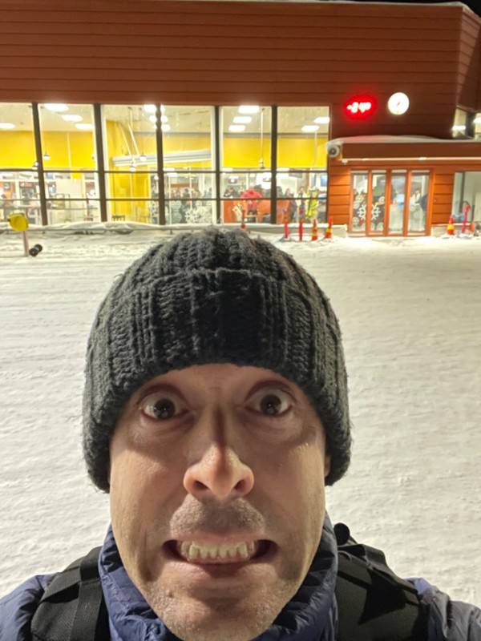

*Just after this was taken, it ticked over to -25!*

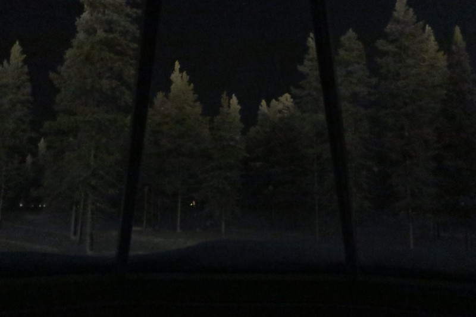

*Amazing view from the cabin*

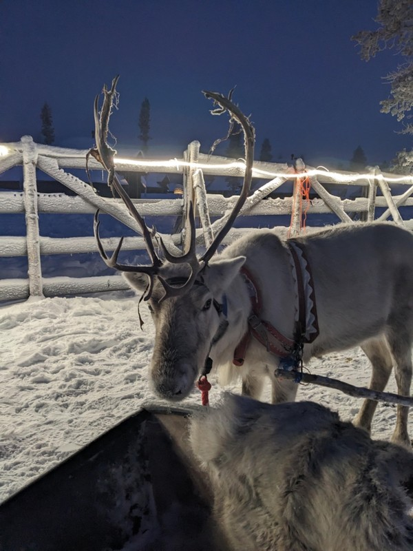

*Reindeer*

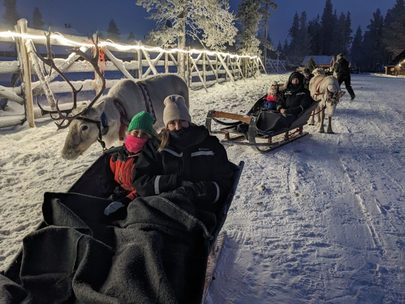

*And more reindeer*

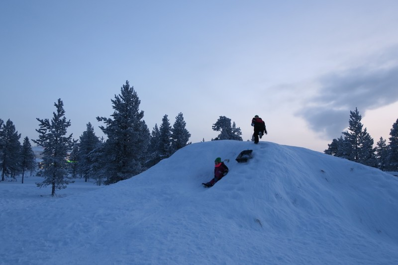

*Fanging it down the toboggan hill*

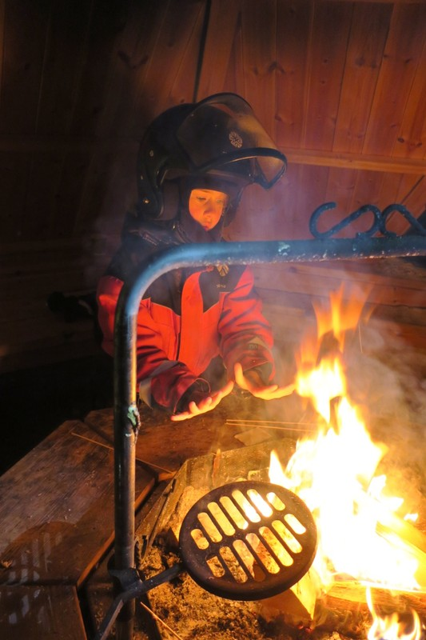

*Warming up with frozen marshmallows*
