After breakfast the first activity of the day is our husky sled ride. We’d gotten ourselves all rugged up for the ride, including ski goggles and toe warmers. Our cabin is right next to the huskies so we’ve seen them coming and going over the last few days. These dogs are just little bundles of energy and seem to live to run! After our brief tutorial on how to control the sleigh we were introduced to our doggies. Vi and Kate paired up and Pat and Margot paired up on another sled. The dogs are super cute and we think we might just take a few of them home with us.

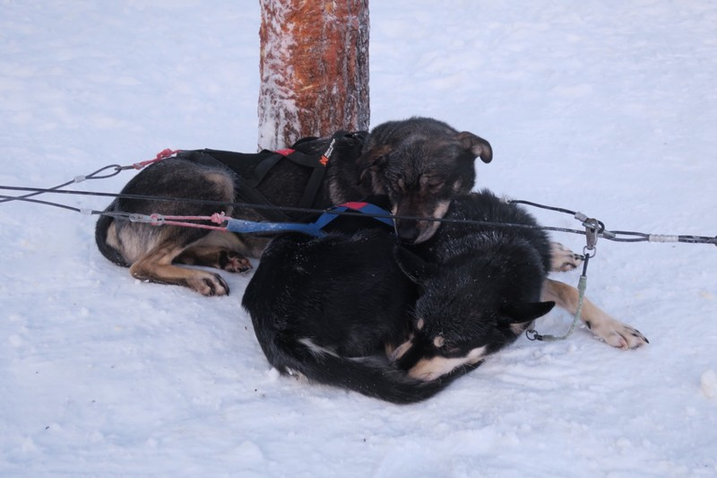

*Surely Australian customs won’t mind some live dogs being imported?*

Before the ride, Vi complained that her toes were too hot and asked for her toe warmers to be taken out of her boots. Figuring that her two layers of socks, snow boots, and the blanket on the sleigh would be enough for the 5km ride, we agreed.

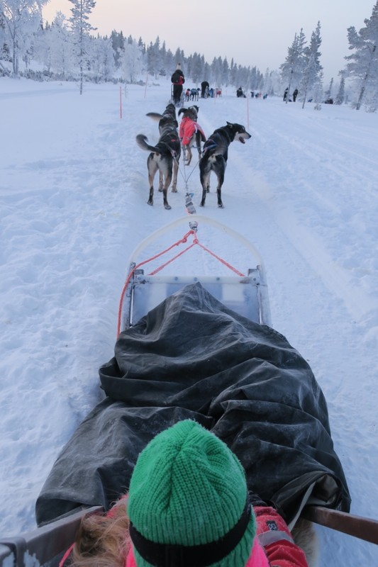

*Rugged up*

One piece of advice that Chris and Megan gave us was to try and leave a big gap between the group in front so you could have a bit of the trail to yourself. But that was easier said than done because there was a snowmobile controlling the pace at the front and if we spread out too much they stopped the first sleigh and waited for everyone to catch up. The dogs attached to Pat and Margot’s sleigh were keen beans, and strong ones at that, so Pat ended up riding the soft brake for a good chunk of the ride to keep the dogs from colliding with the sleigh in front.

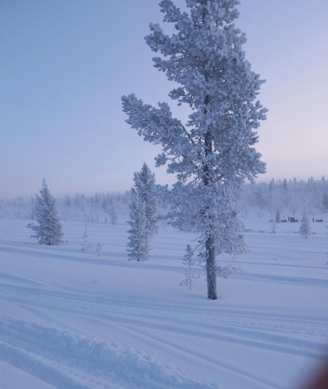

*Scenery along the way*

Margot was absolutely in her element for the first half of the circuit, squealing with joy as we made our way through the forest. Violet loved the first half of the circuit too. After the halfway point, the cold started to get the best of both kids. Margot’s fingers started to hurt and the blanket on the sleigh wasn’t doing anything to help warm them back up. Violet’s toes were the casualty on the other sleigh and made the second half of the ride pretty miserable for her. Perhaps it was a bit shortsighted to let her take the toe warmers out. Lesson learned for the next time we go on a husky ride in the arctic.

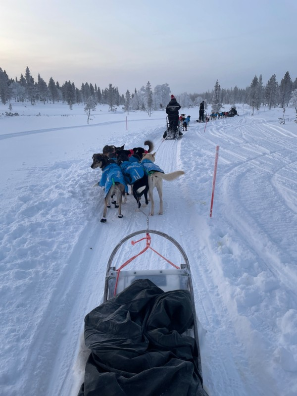

*Pat and Margot’s dogs got tangled at one stage in their excitement*

After we got back, Margot was too cold and wanted to go back to the cabin to warm up. Violet and Pat hung around and were introduced to the teenage huskies. Most of the dogs were relatively shy and didn’t seem super keen on getting cuddles, but there was one dog who made it his mission in life to jump up and try to steal any beanie that had a pom pom on it.

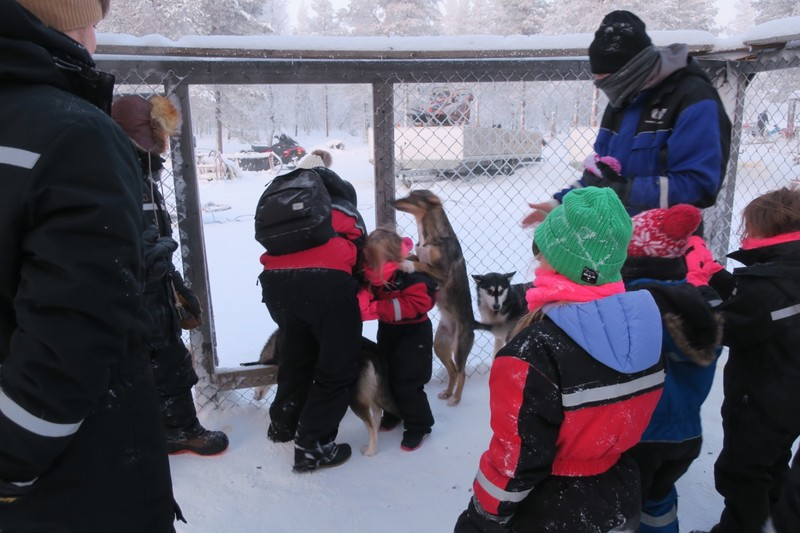

*He was successful a few times and looked very pleased with himself.*

Once we’d warmed up, we met briefly with Brad and Luke, who were just about to go on their 10km husky ride and were going to borrow our ski goggles. At lunch Vi said her favourite so far was the snowmobile (but she wishes it was faster) and tobogganing. Margot liked the reindeer. Violet said the reindeer were cute, but also not fast enough. Need for speed with this kid.

At around 3pm as the light was fading, we went to our cross country skiing lesson. At this point the temperature was -30, feels like -38. We collected the skiis and poles, then had to walk about 10 minutes to the start of the track. Violet was incapable of holding onto her skiis while walking and dropped them a dozen times. The guide and the rest of the group didn't wait, and Violet was hysterical and falling over in her panic to catch up. She was not in the best mental state when we caught the group and had our ‘lesson’, which consisted of the guide telling us ‘left leg with right arm and push but make sure you don’t do it like downhill skiing but do move your heels out to slow down inside the tracks and they’re one way - got it? Off we go’.

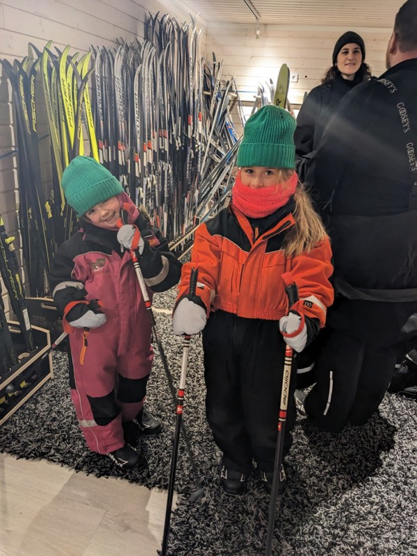

*We didn’t really have it*

The rest of the group left while Pat helped the girls and Kate into skiis. Kate told the guide she could go ahead to check on the others expecting her to come back and check on us at some stage. Margot was having trouble with the movement required. Violet was having a tantrum because she wants to go ahead, Margot because she wants to go back home. After about 30 minutes, Kate has lost all sensation in her hands and feet. It’s completely dark, the air is glittering with the ice crystals forming from the freezing temperatures. The guide seemingly does not plan to return to us. When we got to a part of the track blocked by a random parked car, we turned back. Violet continued to cry about leaving, and Margot about not leaving fast enough, but on the plus side everyone seems to have the hang of the movement required and we make good time on the return. As we got back to the starting point, guide came back to check on us. We told her we are done (which she could probabaly tell from the screaming kids). Violet's hair was completely frozen end to end, but everyone’s fingers were too cold to take a picture.

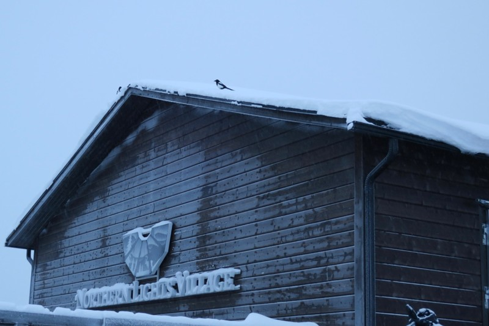

*On our return to the Northern Lights Village, everyone was crying (for different reasons) but eventually we all cheered up and had a hot chocolate.*

Kate feels an issue here that’s putting the kids more on edge is that they need to play. They need a playground or a space indoors that isn't a tiny room or restaurant for running and climbing and jumping. Or a space outdoors where the temperature isn’t trying to kill you with exposure to get their bodies moving. Instead, there’s lots of wiggles and big feelings and killing each other.

After dinner we had another activity today - an Aurora hunt. We rugged and rugged and rugged up some more (merino thermals, fleece layer, down jackets, snow suit on top, two pairs of socks, toe warmers, snow boots) then went in ‘heated sleighs’ pulled by snow mobiles out into the snow. After 20 minutes we arrived at our teepee and the guides set to work getting a fire going inside for warmth and to heat up the ubiquitous blueberry juice. The teepee was quite large, but our guide said that smaller teepees (they weren’t actually called teepees, because that’s what the Native Americans called their tents, but that’s all Pat can remember so that’s what we’re going with for now) would have supported a group of 12 people back when they were used for proper shelter and housing.

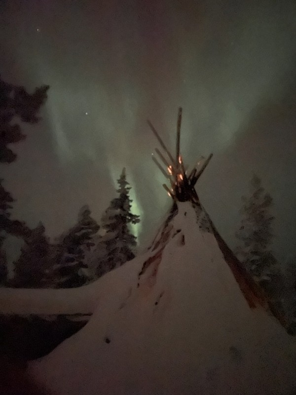

*Teepee*

After only a few minutes, one of the guides poked his head in the tent and said there was an Aurora starting, so we all shuffled out to look. The Aurora had indeed come out and it was really amazing. True that it’s brighter in photos, but the size and extent of it can’t be shown in a photo. The movement of the lights across the sky, and the excitement every time you turned your head and noticed a new part starting was hard to beat. One of the top experiences of the trip so far. We were incredibly lucky that we ended up with clear skies and a great show from the Northern Lights given how far in advance this activity was booked.

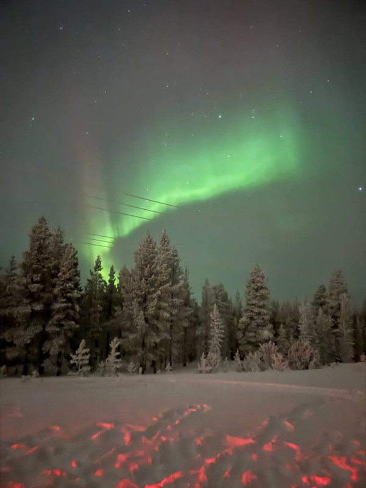

*Wow*

The only detractor was a particularly rambunctious British kid (around 6-7 years old) with inattentive parents letting him run amok, shining his torch everywhere while people are trying to see the Aurora, encouraging Vi and Margot to roll around in the snow in (literally) -40C, just generally being a pain in the bum. As a child travelling solo he probably had a lot of ‘play energy’ he needed to get out too, but we would have preferred not with our kids, not at 11pm, not in the snow.

After a while, the kids got too cold and tired (really, everyone was), so we piled back into our “heated” sleigh and set off back to the accommodation to put them to bed around 11.30.

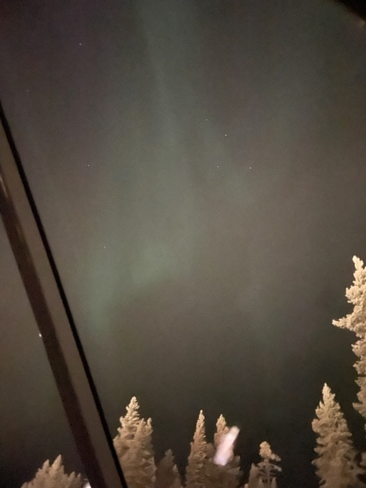

*Through the glass ceiling*

While not as bright and spectacular as it was out in the forest, we could still see the Aurora through the glass roof of our cabin as we were drifting off to sleep. Not a bad was to finish the day.

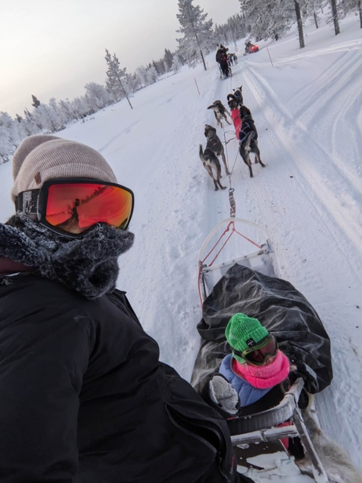

*More huskies*

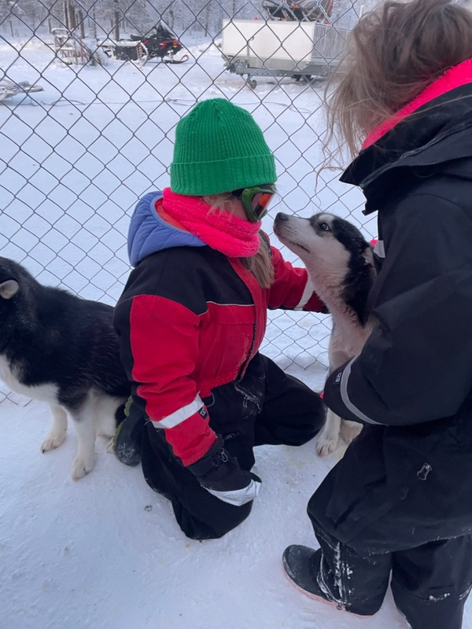

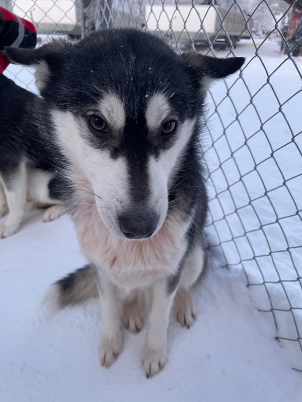

*How can we not have more?*

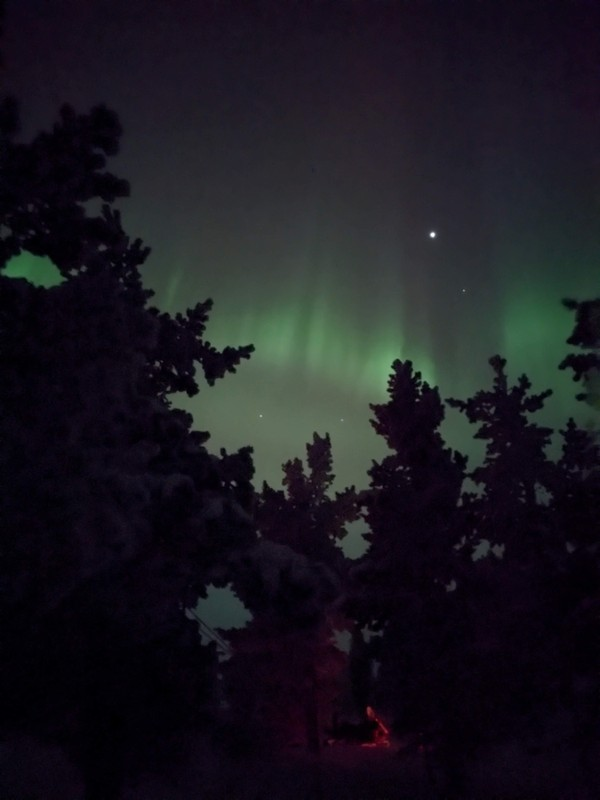

*Also a lot of Aurora*

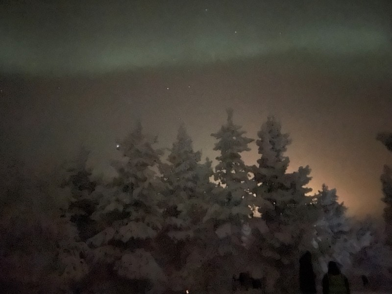

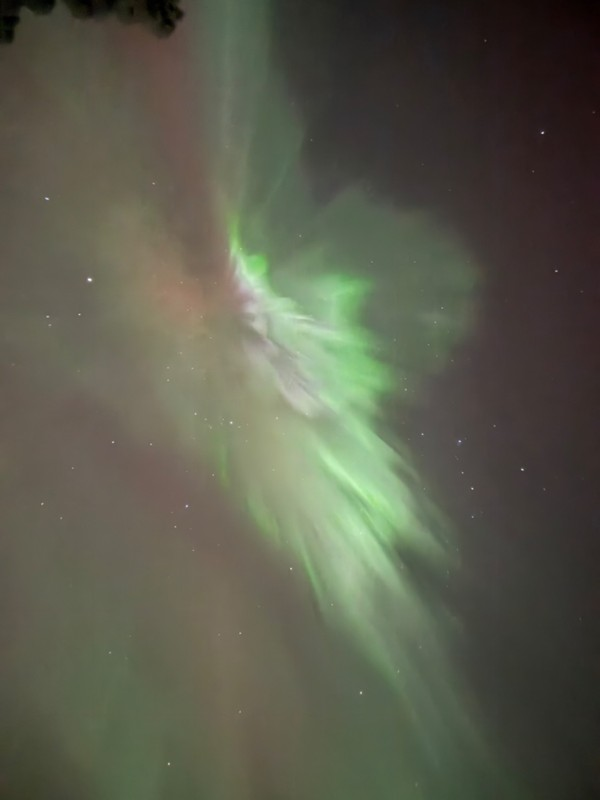

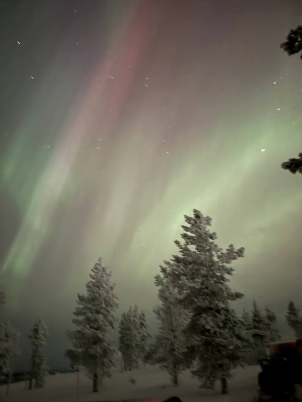

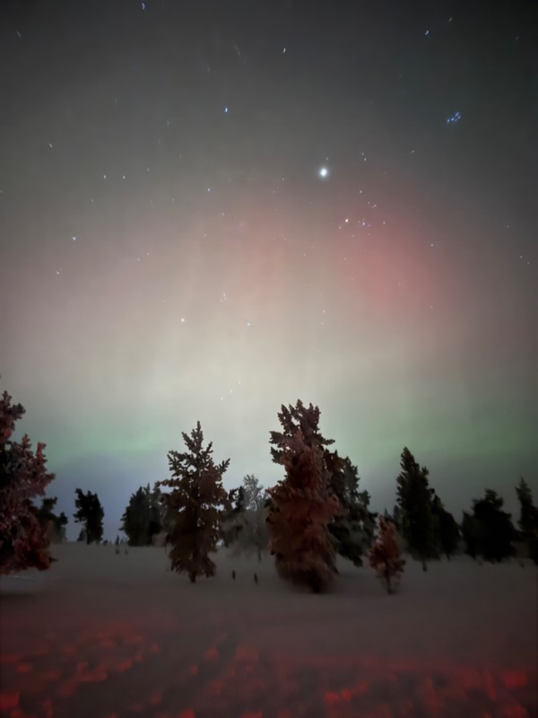

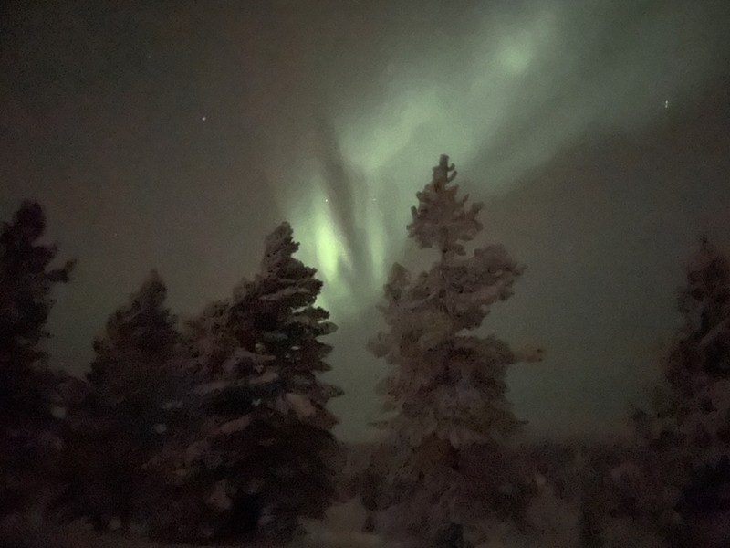
