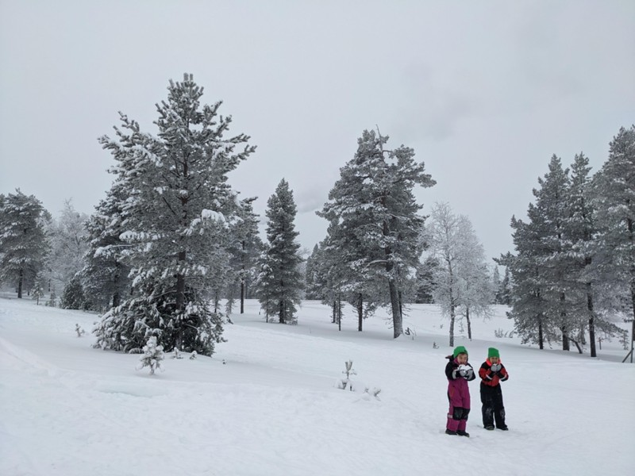
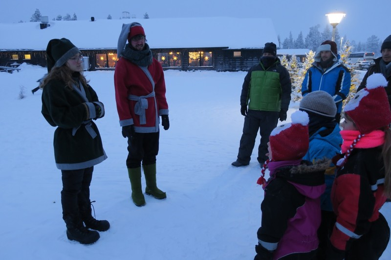
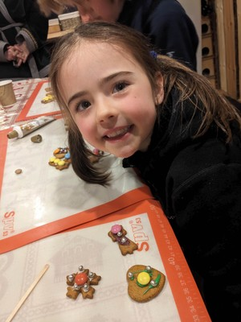
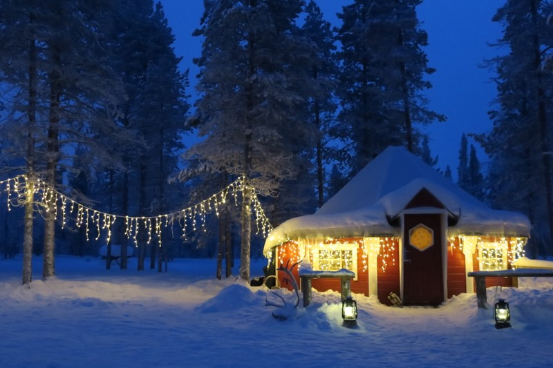
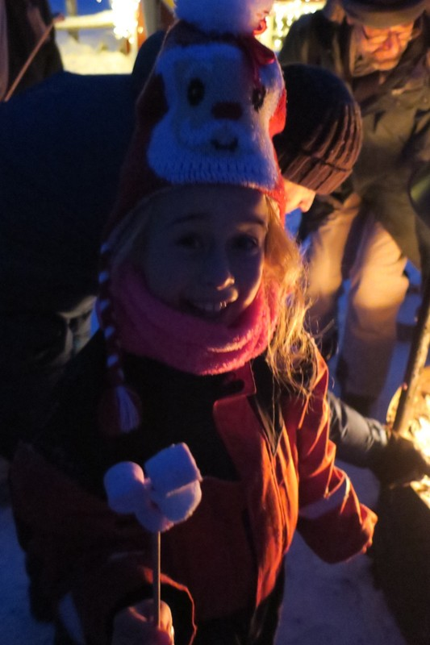
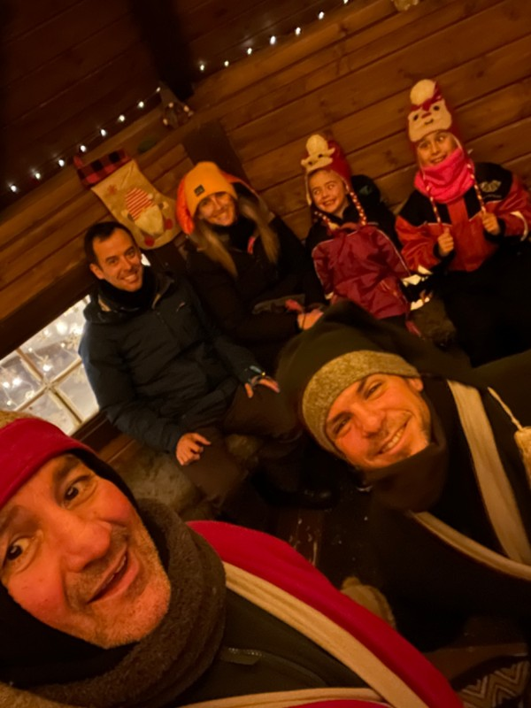
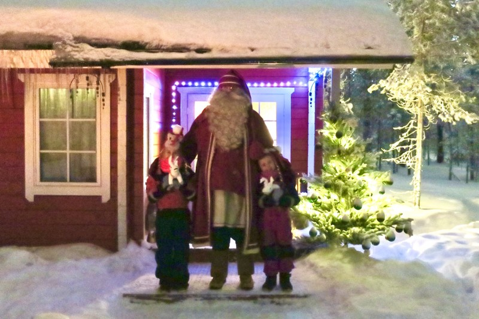
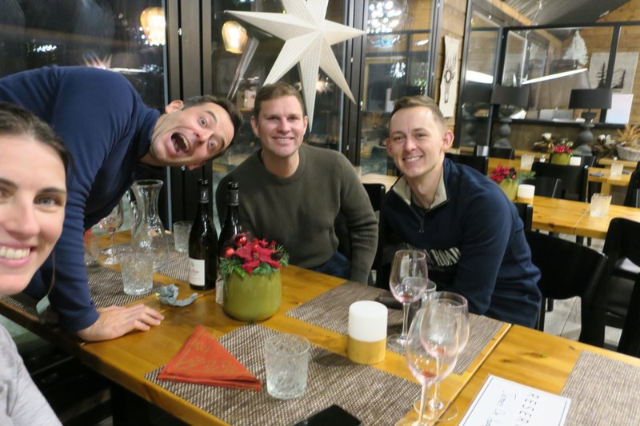
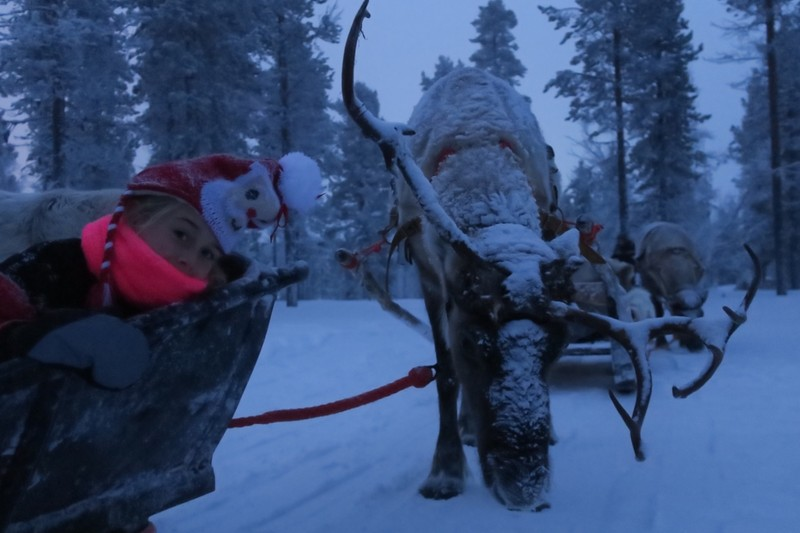
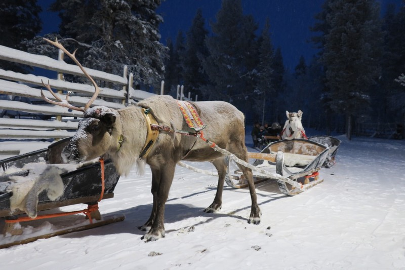

After the very late night last night, we had a slow start today. We enjoyed a balmy walk to the restaurant in -19 °C, made it to breakfast just before the end of service, and stacked our table with every food we thought we might feel like before the buffet was cleared away. We lingered after breakfast and the girls played with a little toddler and his 4 year old sister. When they disappeared for a little too long we tracked them down to a kid's play area at the back of the restaurant. Apparently our complaint yesterday was unfounded!

Eventually we got our energy up enough to walk to the shops to buy a few souvenirs. On the walk back it snowed.

*The kids quenched their thirst by picking up handfuls of snow and jamming it in their mouths.*

Back for lunch, the kids met the British boy, Magnus, from last night again. They played quite raucously and needed regular intervention from us. Turns out Magnus and his family are coming to this afternoon's Search for Santa too. When leaving the restaurant we took our time putting on our layers before heading to the starting point to put a bit of distance between us and Magnus for some family time, but Magnus' family were waiting for us outside and the kids ran off with him again.

The Search for Santa is one of the most popular activities to do up here in the Arctic. We were very keen to take the kids, but also worried about confusing Violet (as she's at the age where she might start to question Santa soon). We don't want her to be the only kid in late primary insisting Santa is real because she went to the North Pole and literally saw him. We told the kids it was a game that everyone in Lapland plays, and it's just a game, but they could believe it if they wanted. Hopefully this will minimise the trauma!

Other than Magnus' family, we were joined by three South African men from Johannesburg who I think just wanted to give the magic a try.

*We were collected by elves and taken on a skipping competition to their hut.*

Inside, we all made gingerbread cookies and wrote letters to Santa. Magnus opted to sit between Violet and Pat instead of with his parents, which was ok, but a little frustrating. Once the cookies had baked, it was time to decorate. We all collected our cookies from the tray (and Magnus collected a good number of Patrick's too). Each kid had a little bowl of Smarties and shiny balls to use for decoration. As Magnus had ended up with more than his share of cookies, he ran out of decorations. His Mum took Margot's bowl of candy and gave it to Magnus so he could keep decorating. Kate put her confrontational pants on and insisted it be returned (unfortunately not before half of it had been swiftly pilfered).

*Decorating Gingerbread*

Bellies full of gingerbread, we left the hut and met a new elf who was in charge of training Santa’s reindeer. She again explained how the reindeer are more wild than tame and to not make loud noises, sudden movements, or touch the reindeer under any circumstances. Much to Kate’s joy we were treated to another reindeer sleigh ride which took us to our next destination, the Candy Cane Hunt! We hopped out of the sleighs and a new group of elves told us there were candy canes hiding in the forest: one per person. Violet, Margot, and Pat each found one, but Kate came up empty. It seems that Magnus took two, his Mum eventually dobbed him in.

*Elves’ Cottage*

You might not know this, but elves are apparently fiends for marshmallows. They came around with a bowl of marshmallows and invited each kid to put as many as they wanted onto a stick to toast over the fire. Our kids took on the challenge and had 5 or 6 per stick. After an unhealthy amount of marshmallows, the group was ushered inside for hot chocolate and learning about elves. The kids learned they can become elves if they are very good for 5 years in a row. When they turn 18, they’ll be invited to elf school and after 100 years of study they’ll become an elf and stop ageing! Not a bad deal. They also learned if they become elves and are caught being naughty by Santa 3 times in a row they get sent to be an Elf on a Shelf as punishment.

*Millions of marshmallows*

Magnus wanted to sit with our girls all the time, which was understandable because all they wanted to do was play, but still quite frustrating we couldn't sit as a family and enjoy the Santa experience together. It was a bit of a relief when his family was called away to meet Santa and we got some time without them!

*‘Elfie!*

After some Christmas trivia, George and Alex the elves saw on their Santa Tracker apps that we had a 95% chance of seeing Santa if we went out right now! We hopped into a heated sleigh and went through the forest. Elf George stopped in front of a house and said we should all stand out front and shout "Come Out Santa!", then if it wasn't Santa's house we could run away. As soon as she heard someone coming Margot bailed and ran away. She wasn’t about to take the fall for Elf George’s crazy plan to just shout at a stranger’s house! When she saw it was Santa, she ran back and threw herself at him for a hug. Surprisingly Violet joined for a hug too.

Santa invited us in and took us to the couch for a chat. He asked if the girls had any questions for him. Margot asked how old he was and he said he stopped paying attention at 500 years old. He also told them some of the things he knew about them from the questionnaire that we filled in, which impressed the kids. Something that ended up being lost in translation was our “hopes” for Margot for this year. We said that we hoped she will settle into her new kindergarten class, which Santa misinterpreted and told Margot that she needs to “settle down in kindergarten”. To which Margot replied, “Awwwwww! But I like being crazy!” Hopefully this isn’t something that scars her for life?

*Santa!*

We took a family photo and Elf George helped Santa give the kids a couple presents each: two stuffed reindeer. There were also presents for Kate and Pat: two reindeer keyrings. All in all, it was a really nice afternoon and the kids absolutely loved it.

That night, we had dinner with Brad and Luke at the buffet. Kids chatted with them and didn't at any point imply the Santa experience was anything but real. It was (as always) great catching up with Brad and Luke. It’s pretty fantastic having the kind of friends where if you say "We're going to the Arctic" their response is "We'll come too!"

*Arctic Hangs*

![Reindeer Spam]](./images/large_91112752_Unknown.jpeg)

*Reindeer Spam]*
