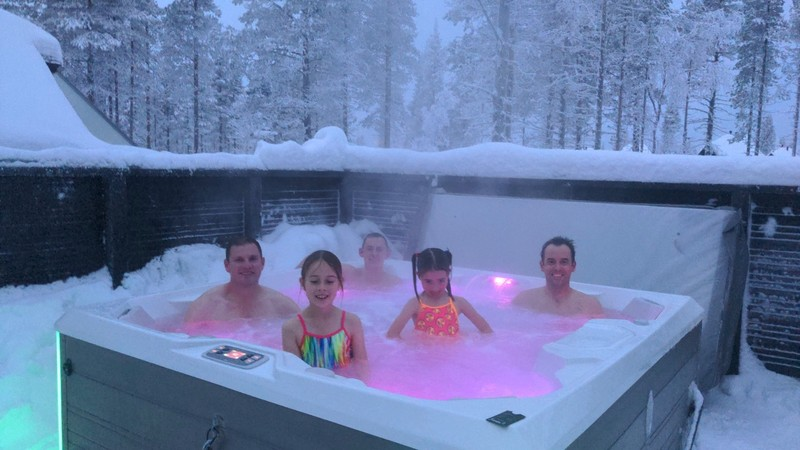
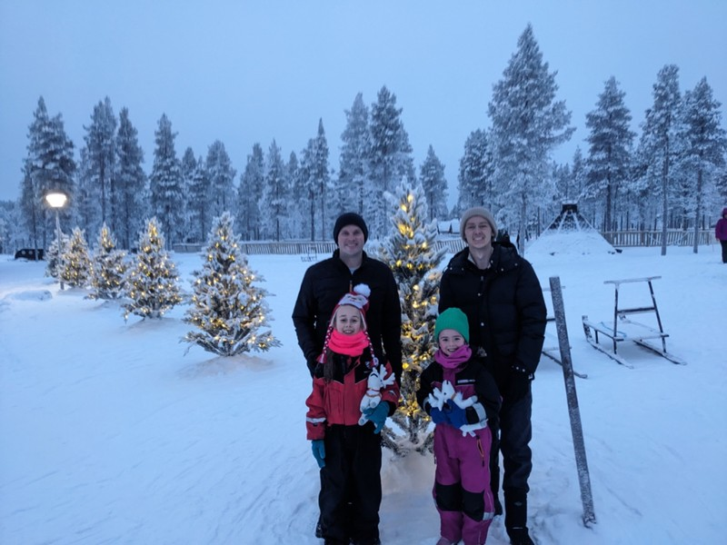
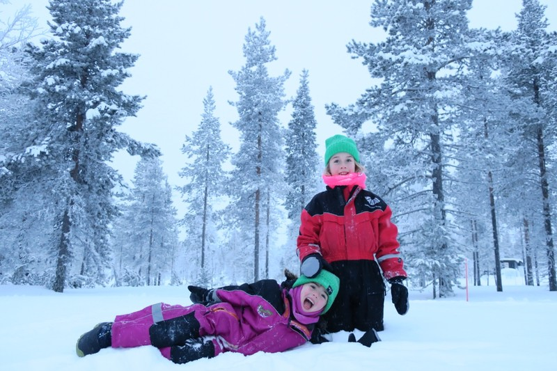
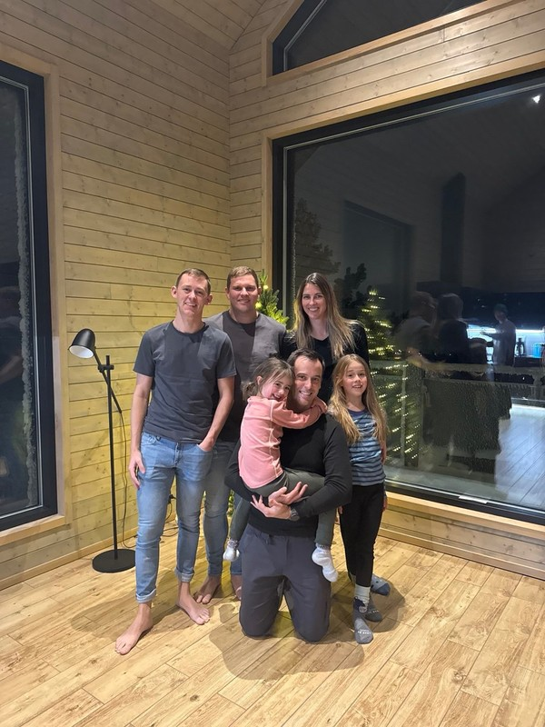
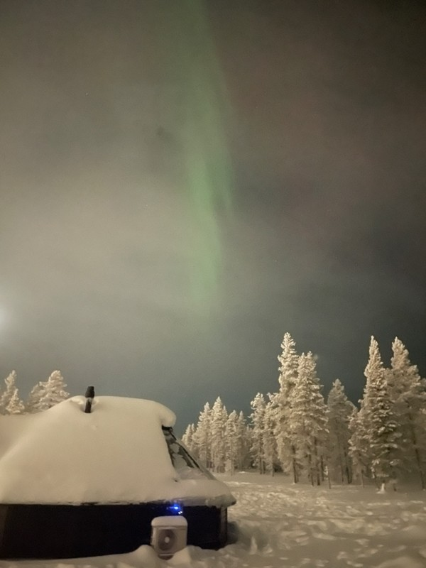
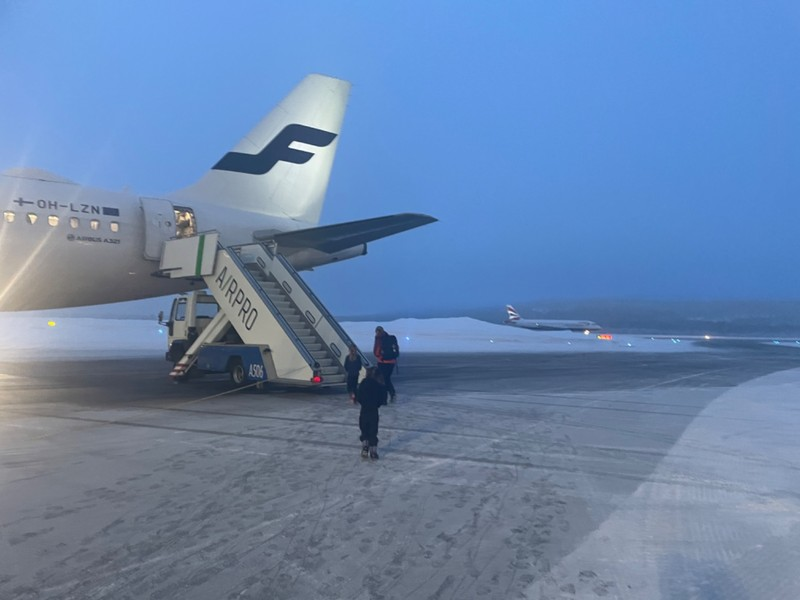
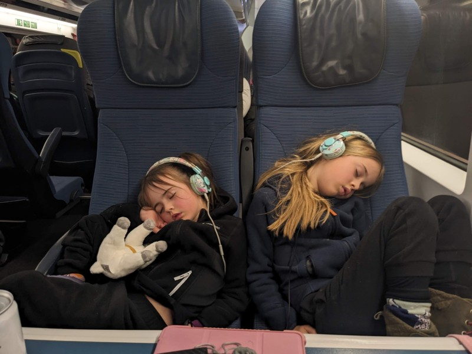
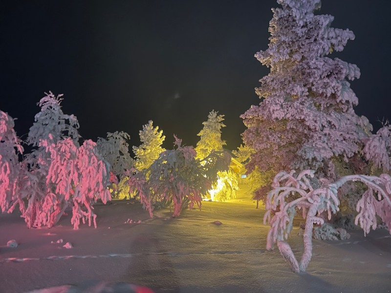
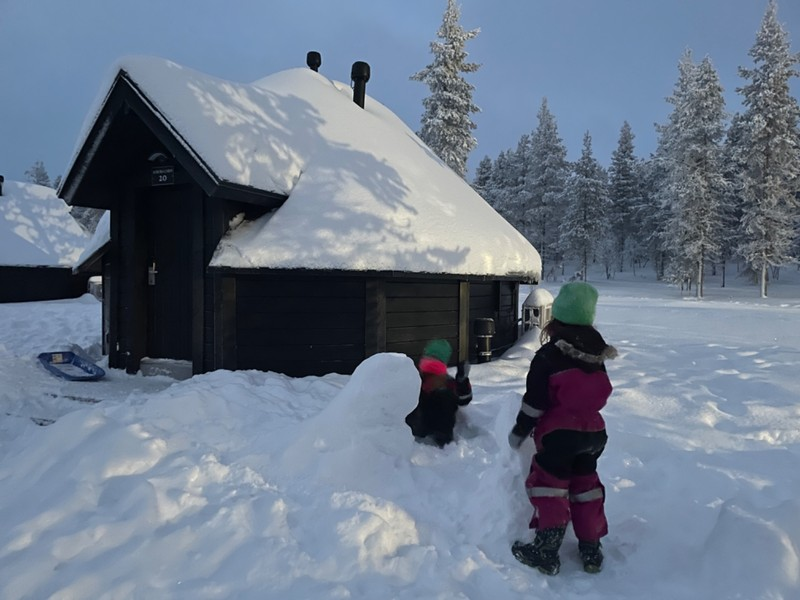

The title are the first things Violet said this morning after walking out of the cabin and asking for the temperature. She's right though, we can breathe the air without pain and our lashes are no longer freezing.

Brad and Luke met us straight after breakfast for our sauna and jacuzzi session. We lucked into this when the resort accidentally included a spa day in our itinerary (which we weren't meant to get), and when they realised their mistakes we got a free sauna session as compensation.

When we got to the sauna, Kate was a little disturbed to find the jacuzzi was outside and a walk in the snow was necessary to get to it. Her only experience with swimming in the snow was in Switzerland where you got in the heated pool indoors, and went through a tunnel to the outdoor area. We were warned by reception NOT to leave the key in the sauna as the door would lock and we'd all be stuck running to reception for a replacement key in the snow, dripping wet, in swimwear.

*Surprisingly Relaxing!*

We all got changed and headed to the sauna. We weren't sure if the kids would be keen, but they gave it a good try! It was quite relaxing, and warm enough to keep blood flow in feet for the snowy zoom from the sauna to the jacuzzi. Margot couldn't even consider it and insisted on being carried - can't really blame her, we may have done the same if it was an option. Absolutely lovely experience, the hour went by far too quickly. Pat researched jacuzzis for the back yard when we get home. We were very jealous of Brad and Luke who had booked a second session plus ice pool plunge for later this afternoon.

*Post Sauna Vibes*

The rest of our day was spent doing not much. Kate and the girls finished the Narnia book, and Pat sent some work emails.

In the afternoon Pat and the kids did a little tobogganing. Margot’s first go down the hill a couple days ago ended with a tumble and getting tossed from the toboggan. On that day, she wasn’t interested in giving it another try and went down the hill on her bum. Today, Pat wanted her to get back on the proverbial horse and just had her sit in the toboggan and he pushed her along the (mostly) flat ground. Then we went to the bottom of the hill, then halfway up, then all the way to the top. After some butterflies, she let Pat push her and slid down the whole hill, no tumbles this time!  As Pat hoped, she squealed with joy and ran back to the hill for round 2. Pat was inspired by the kids and grabbed a toboggan for himself. Violet challenged him to a race down one side, which Violet won handily. Pat could only manage a few runs before the bumps got the better of him. Being old sucks.

As a brief aside, there’s been snow falling intermittently throughout the day which has made everything feel quiet and peaceful.

*The kids have been pretty impressed with the snow!*

Late in the afternoon, Brad picked us up to visit his and Luke's accommodation which they were sharing with 4 other lovely Aussies (mostly expats now living in London). We were very impressed with their confidence driving in the dark, on snowy streets, on the wrong side of the road. They had a beautiful cottage with huge glass windows for walls, high wood panelled ceilings, a sauna, and a hilarious fake fireplace with ribbons and lights that looked like fire in place of anything actually warm or functional. One of the women they were travelling with, Kate, had an endless amount of patience playing hide and seek with Brad and the girls.

*Cold out there, but snug inside with friends*

When it got late, we went back to Northern Lights Village for dinner and the girls had quite a nice play with Magnus (he is growing on me).

*More lights through the window on our last night*

The morning of the 7th was mostly packing and transit to the airport. The flight was over an hour delayed, but they held the connection in Helsinki. A dozen passengers from our flight ran to the new gate and boarded, but there was another 45 minutes sitting in the plane at the gate after boarding apparently waiting for luggage to be loaded. Pat commented 100% of our flights within Finland have been delayed. Kate wondered if this is the negative side to passenger rights - in the EU if the flight is delayed more than 3 hours the passenger is entitled to compensation. Perhaps to avoid hitting the 3 hour mark they routinely hold connecting flights for an hour or two rather than move delayed passengers to a later flight and pay the compensation.

*Our last frosty boarding*

Watching the sky tracker on the flight it was clear the pilot wasn't going to try to make up for lost time and we would be arriving over an hour late. We had booked the Eurostar to Brussels with around 2 hours from landing to boarding, and it looked unlikely we'd make the connection after deplaning and waiting at the luggage carousel. Pat paid for the in-flight Internet so we could secure tickets on the later train (which has us arriving in Brussels after 11pm). While on the WiFi he received an email from Finnair that somehow in the hour on the tarmac, one of our bags had not made it into the plane.

This is our first trip post-covid checking a bag; we've gotten right into carry on only. The wet bag followed by lost bag really makes me appreciate why!

*Napping on Eurostar*

We arrived in Amsterdam, found actually neither bag had arrived (I guess we’re living in snow gear and boots for a while!), got a quick dinner, got the late Eurostar and made it to our apartment in Brussels just before midnight.

*It’s really beautiful when you can admire and breathe at the same time*

*Goodbye Saariselka and Northern Lights Village!*
