Everyone but Kate had a sleep in this morning. She was up a bit earlier and got some coffee brewing (bless her cotton socks!), started warming some pastries for breakfast, turned up the heating, and opened the blinds. This last activity may have been one too many - turns out we look directly into the neighbours' bathroom. Half asleep Kate took a few seconds too long to realise the blob she was staring at was a naked, showering man and made some very awkward eye contact with the poor guy before she bailed to hide in a corner of the apartment invisible to the neighbour.

Once we were all up, we wandered around Brussels vaguely towards a few tourist attractions. On the walk we passed many huge murals. Brussels is a comic book town and the birth place of Tin Tin, Asterix and the Smurfs (to name a few).

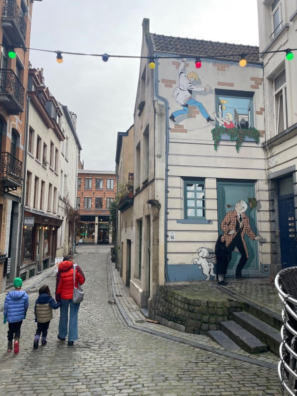

*It celebrates this fact by covering walls in with comic book homages.*

We also passed heaps of second hand book and comic stores. Our meander brought us to one of the most famous sites in Brussels - the Manneken Pis. This fountain is pretty much what you'd guess from the name - a statue of a little boy doing a wee. Seemingly one of the reasons it's famous is that it has over 1000 outfits it cycles through (and a museum for the wardrobe it's not using). It was apparently vital for water supply in the 1600s, and now the Belgians just love him.

When we got there, Violet was disappointed with his size, Patrick with how new it looked (investigating now it does sound like this is a new replica, and the original is in a museum after being stolen and damaged too many times), and Kate with the fact he was nude and demonstrating none of his outfits. We took the obligatory pic and headed off.

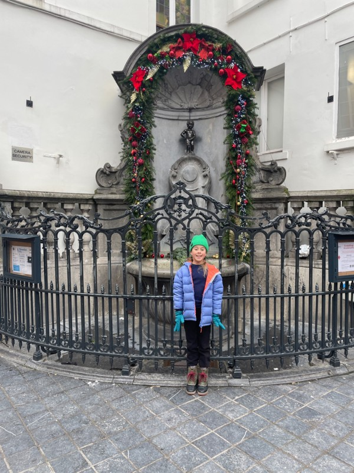

*Second dose of nudity for the day*

We made our way to the shopping district and bought some clothing so we could get out of the things we'd now been wearing for two days. The kids had the best time picking out new clothes and decided they would be matching. Back to the apartment we waited for the luggage, which arrived after dinner. You can't really get much better with lost luggage, we were only without it for 24 hours, but it was still so disruptive, and made it impossible to do much with the day. Carry on only - totally convinced it's the way to go (when you're not packing layers for the literal arctic winter anyway).

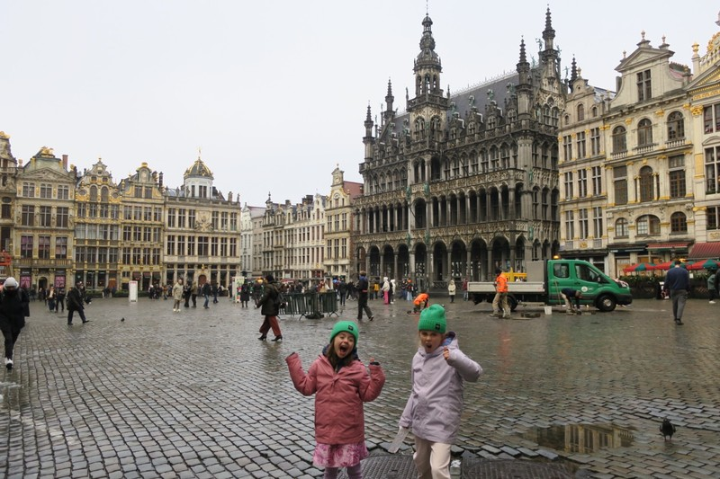

*Grand Place - all the building gild*

Our second morning in Belgium it was snowing heavily. The kids had a run in the snow and played a hide and seek game based on following footprints while we used the laundromat. One of the big reasons we'd come to Belgium was to give Violet a chance to use her French, but we hadn't really accounted for the miserable Winter weather keeping all the other children inside. At least the girls have each other!

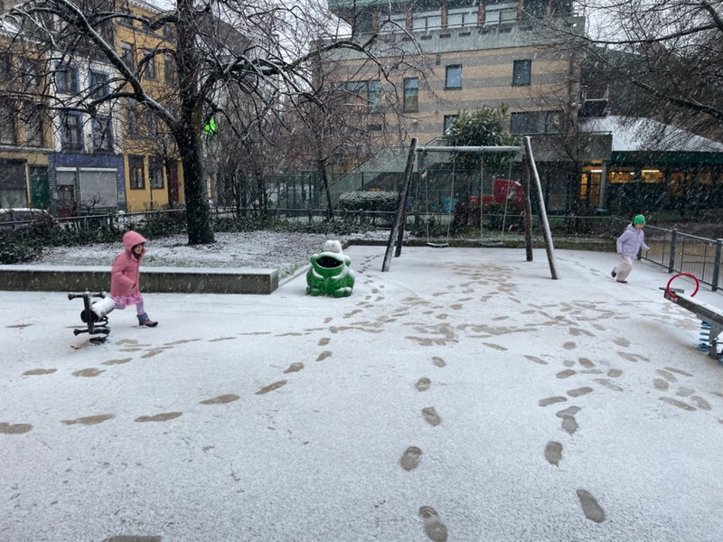

*Cache cache*

We'd bought Vi a French language guide book to Brussels, and today we were going to try to tick some items off her to do list. She wanted to try a tarte endive, so Kate had a look for local tart shops. Off we went to Le Temps de Tartine. Sounded like a safe bet, but it hardly had tarts at all, definitely none with endive. We got sandwiches.

Next stop was a small kids bookshop. It was decorated with forest murals, and was very busy with a school group. Margot preferred to wait outside in the slush than deal with the crowd, but Vi found a couple of books.

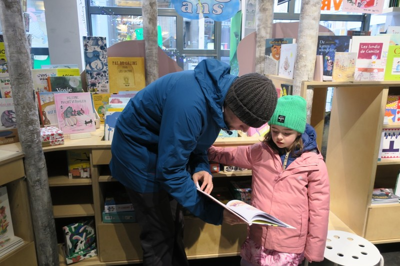

*Pat tried to get Margot enthused*

Kate had high hopes for the success of the next activity - she had researched the best Chocolate factory in Brussels where we could all get the best hot chocolate, Frederic Blondeel. Literally a mug of melted chocolate - it was divine, but too rich for the girls who refused to drink it. We picked a selection of Belgian chocolates to take away, and headed back to the tram station.

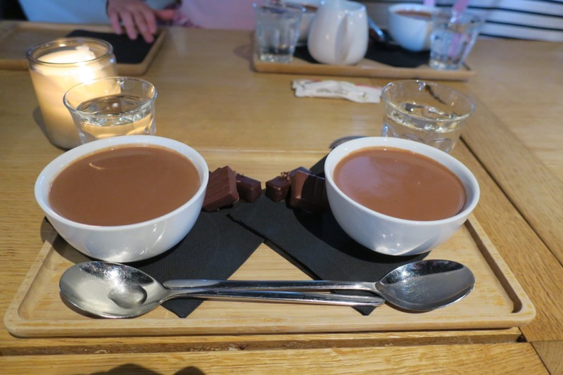

*Kids absolutely missed out*

Pat was becoming increasingly annoyed at the trams. Travel is free for under 6s, and the paying parent has to take the kid through a special gate. I assume it uses some kind of camera to confirm it is an adult and child waiting before opening the gate (not 3 sneaky teenagers), but it seemed to malfunction at least half the time, leaving him to call a fuzzy Flemish speaker and explain, again, that Margot is 5 and the gate needs to bloody open before he burns it and the whole station to the ground.

To be fair to the Belgians - Kate did try to sneak Violet through these gates a couple of times too, so I guess they gave reason to be mistrustful.

Violet's next item was seeing the Atomium. Built in preparation for the 1958 World’s Fair (of which Brussels was the host), was meant to be a tribute to the world’s scientific progress and be a feat of engineering the at which the whole world would marvel. According to one plaque in the interior, when it was unveiled, the engineering community responded with a snooty and collective “meh, it’s alright I guess”, while all the plebs thought it was pretty neat. We’re definitely in the latter camp because we were all thoroughly impressed. It’s designed to represent the atomic structure of steel and the spheres and tubes are all large enough to house various exhibits.

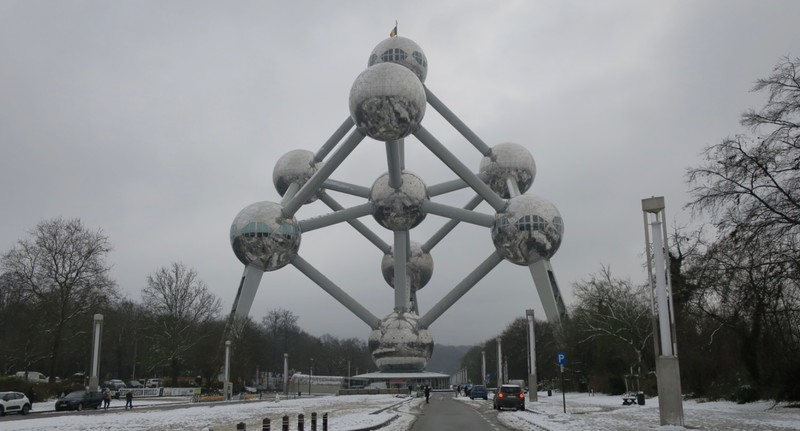

*See slush in foreground*

On much of the walking today we were wading through snow slush. The walk from the tram station to the Atomium was the worst part of it. For mysterious reasons, instead of having paved paths, many are made of compacted gravel. Once the ground was saturated, there was nowhere for the water or slush to drain and they became shallow creeks of mushy ice. We'd been in Edinburgh during a 'yellow alert' and snowed on the the Arctic circle, but Brussels after an hour of snow is the city to defeat Pat's ECCO shoes. His feet are cold and wet and miserable. Kate's Emu boots are fantastic at keeping her feet warm and dry, but she's still struggling with the visceral discomfort of letting her feet go into ice water to her ankles with each step.

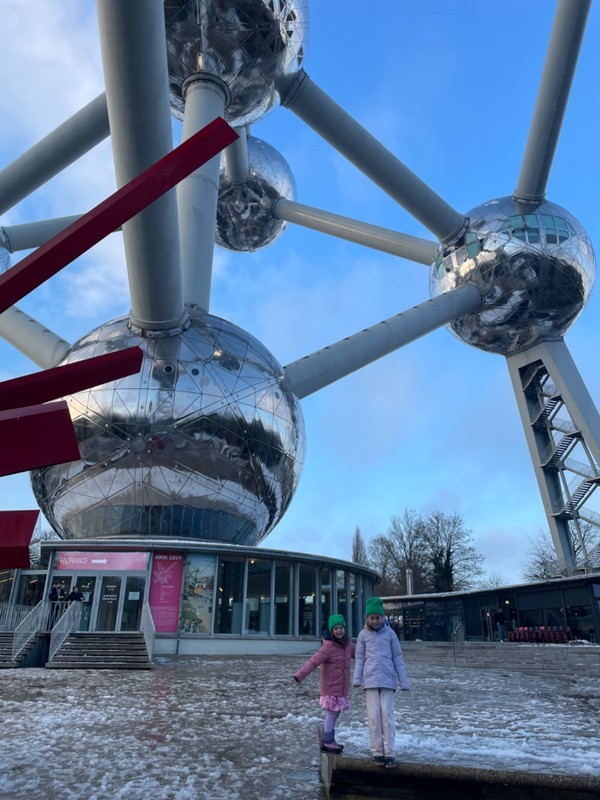

*The kids run and splash and are completely nonplussed*

The Atomium itself was very cool. We started the tour by taking what was once the world fastest elevator, rocketing us to the top sphere at a mind boggling 5m/s. It was actually pretty slow, but in the 1950s I can imagine people having to hold on to their monocles as the magic metal box zipped them to the top. The top sphere had a viewing platform and a restaurant, then we progressed down lifts, staircases and escalators to another 3 of the spheres. Two had immersive light and music shows inside (similar to the Botanic Gardens, great if you're there, impossible to photograph), and the last a mini museum on the 1958 World Fair and history of the Atomium. We all had a great time, we were only disappointed that not more of the balls were open to visit.

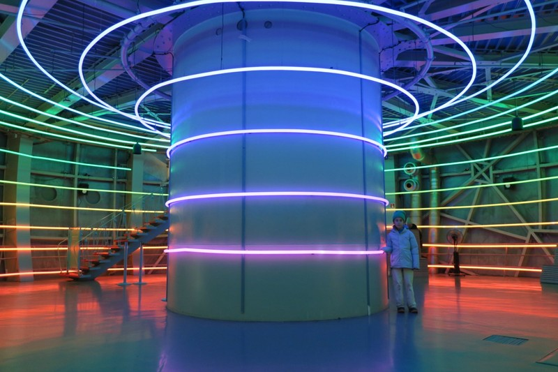

*Atomium Light Show*

Last stop for the day was another bookshop, this one giant. We had told the girls we'd go to a famous 5 story bookshop in Lille a half hour away but when we went to book train tickets it was about $350 return -  a little too much for a bookshop. Luckily Violet was quite satisfied with this alternative, and Margot has a great time too. We were there for an hour and could have stayed longer except it was getting dark.

We walked back through town, which was very pretty really. We had Turkish fast food for dinner and commented on the international range of doner styles (Berlin style, British, American) for an international city. Kate suffered the obligatory, international mild stomach upset that follows take out donner the following day.

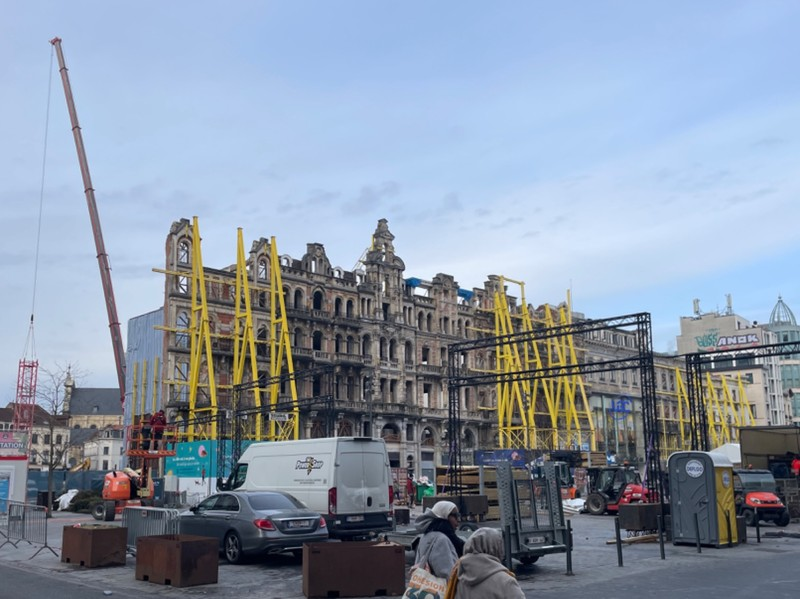

*Maintaining the historic facade while demolishing the rest of a building*

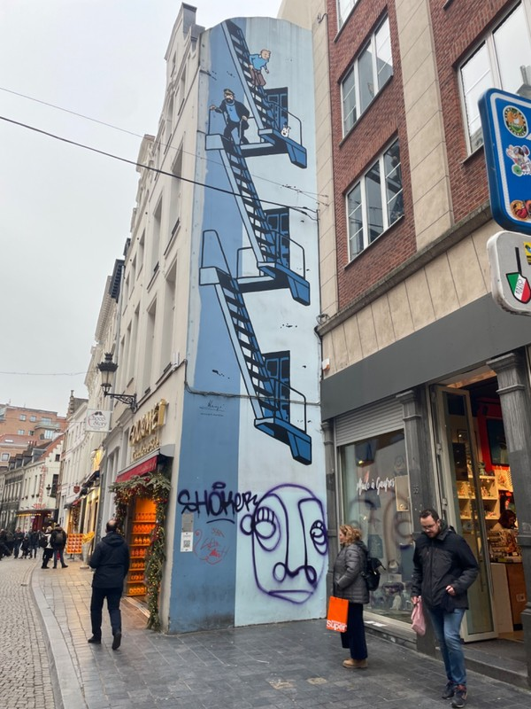

*Tin Tin Mural*

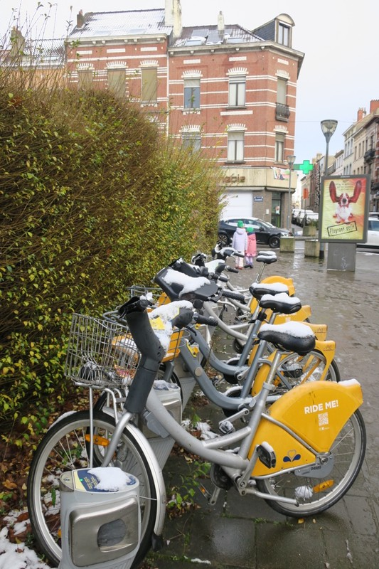

*Free city bikes under-utilised for some reason*

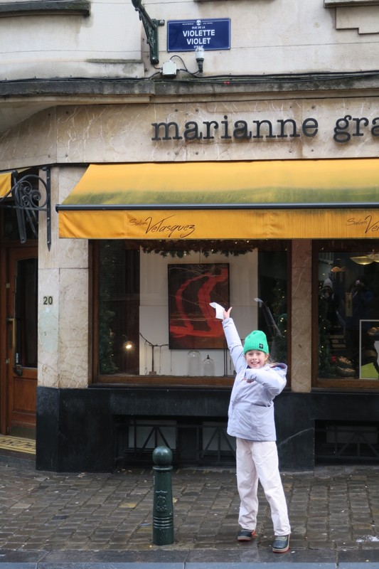

*Violet and her street*

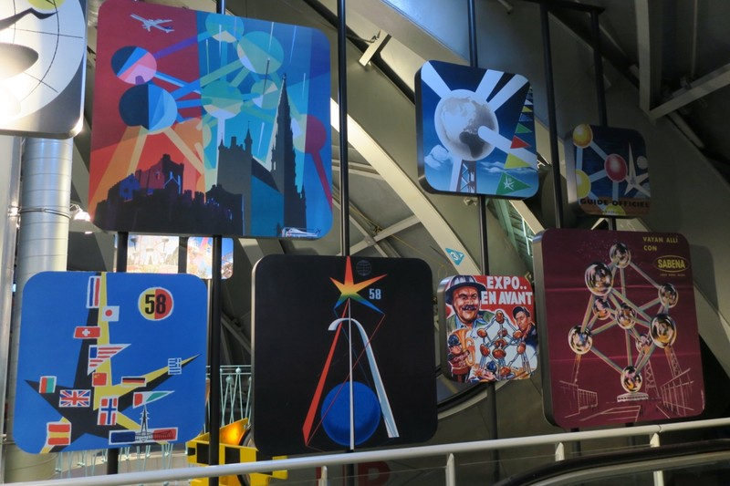

*Posters from the World’s Fare - the girls liked the spaghetti meatballs in particular*

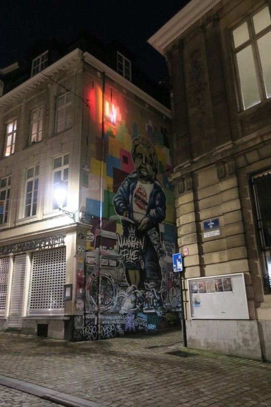

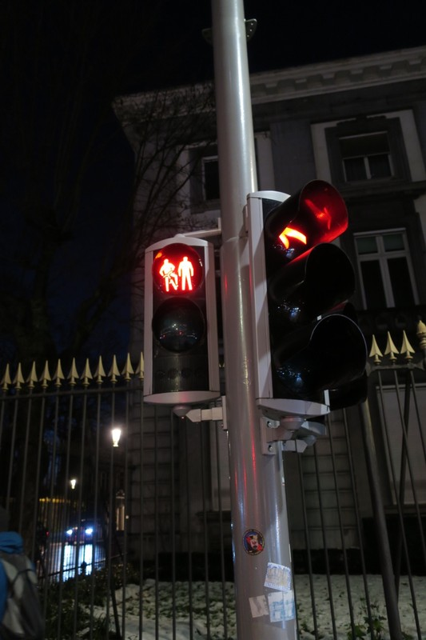

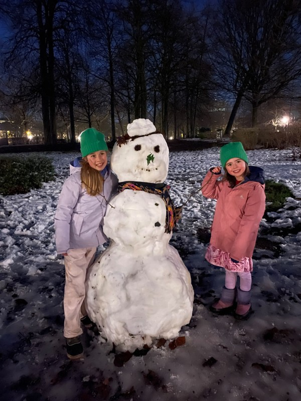

*Bits from the walk home*
