During the whinge about the trams yesterday, we failed to mention the decoration of the metro stations here. Each is decorated with mosaics, or murals, or photos, and we’ve had fun looking at each as we passed through.

The main attraction today was the Lego Discovery Centre, which was a bit out of town in the docks. It’s like a Lego Store on steroids: lots of impressive local Belgian buildings built from Lego (the town square we saw with all the gold buildings, the Atomium, presumably something that was the EU Parliament building). There were also a ton of “just for fun” buildings: a disco, a gym, a construction zone for building oversized novelty pies where cement mixers did the mixing, steamrollers rolled out the dough, a dragon breathed fire to bake the pie, and a crane was used to place the pastry on top. Standard bakery procedure.

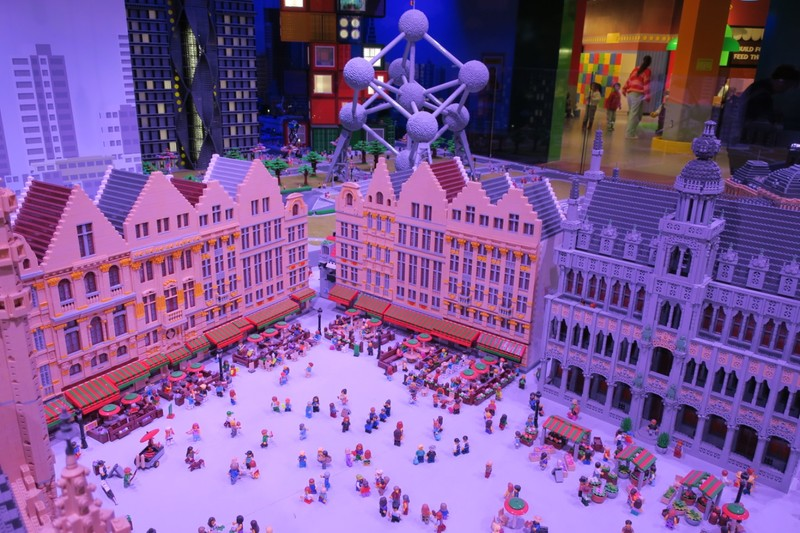

*Lego Grand Place*

In addition to admiring all of the constructions (which was admittedly more fun for Kate and Pat than it was for the girls), there were several build stations where the kids were encouraged to creatively build to meet challenges. Each of the kids worked to build cars and in the end they were both successful in making one that would navigate the loop and jump, which according to one of the employees there were the most challenging tracks. Margot in particular was very proud of her car and carried it around with her the rest of the day. Well, Pat and Kate did most of the carrying.

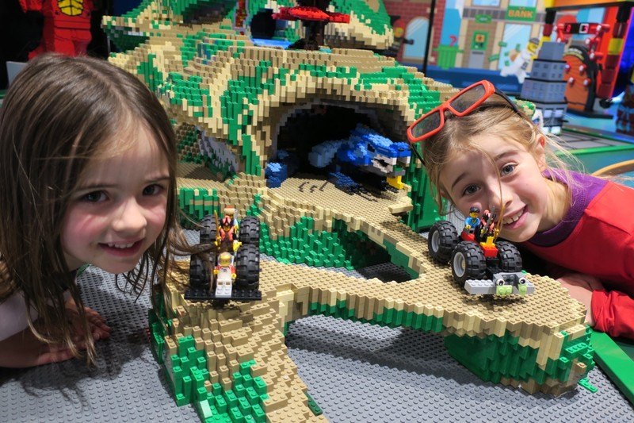

*Cars and Minifigs*

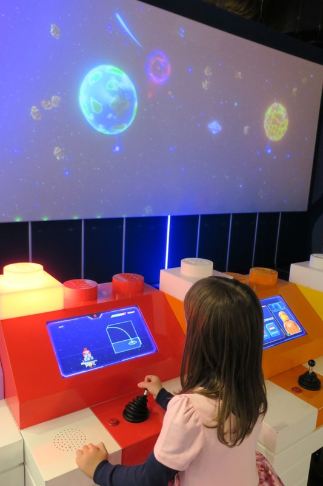

*Another challenge was building a spaceship which would then be scanned by a camera and imported into a game which the kids could then control.*

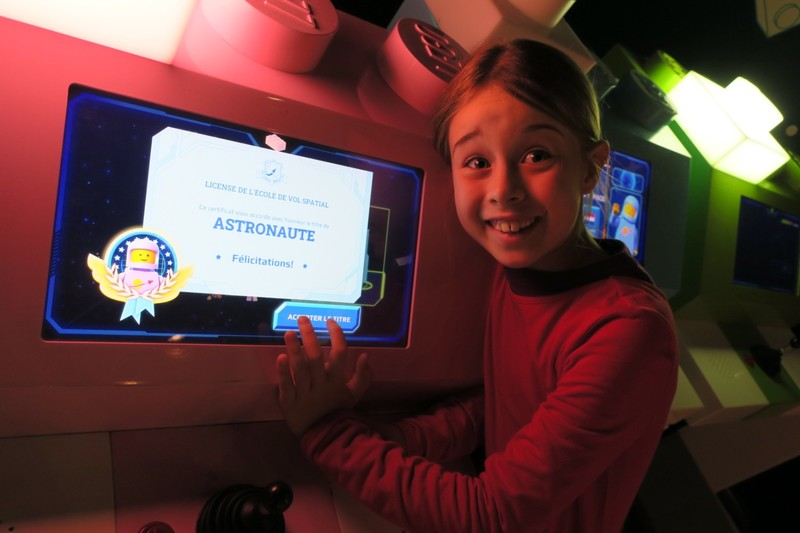

*Violet tried it out in French*

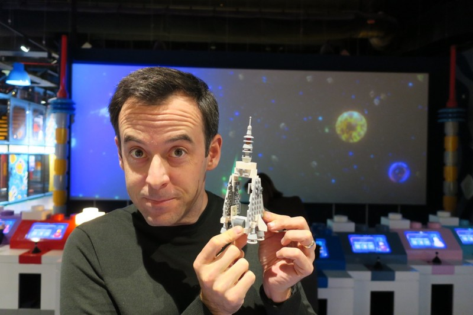

*Patrick was the most proud of his creation for this one.*

In addition to LEGO construction there were a few rides. The kids' favourite was a train ride which meandered around a short circuit and had magic wands which everyone used to complete mini games in the tunnel: popping bubbles, zapping fish, stars, and spaceships. Despite its short duration, the kids didn’t seem to lose interest and insisted we go back several times (we did the train at least 4 times).

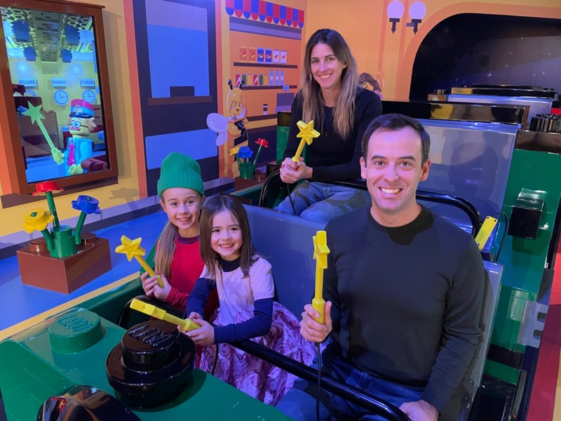

*Again!!*

The second favourite ride was a bank robbery challenge, where you entered a U shaped tunnel with heist movie style lasers blocking your path. You had to contort yourself around them and make it to the exit as quickly as possible. Each laser you tripped added a penalty to your time and made a rather loud and unpleasant noise in the tunnel, which Violet didn’t appreciate. She did enjoy the challenge though and wormed her way through on her belly over and over until we pulled her out to let other kids try.

We watched several short Lego movies in their actual 4D cinema. The 4th dimension was giant fans that propelled wind, water, and fake snow at the audience at appropriate times to align with the action on screen.

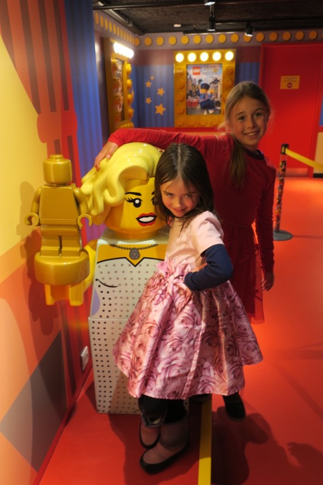

*Posers posing at the cinema*

Pat's highlight was a lesson with a Lego Master Builder. A tutorial ran hourly and taught you how to build a small creation of your choice. The person running the tutorial told us that he won the position by competing on a televised game show prior to the store’s opening a couple years ago and now he's the most popular parent at his kid's school. We ended up being the only family in our session, so the girls got a very personalised workshop and learned how to make a turbo snail.

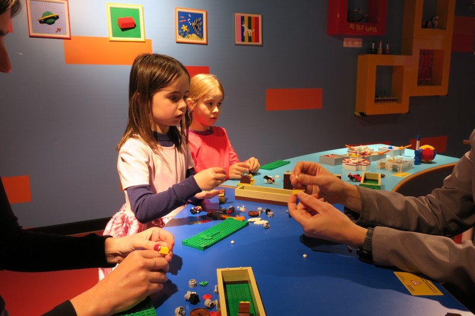

*Lego masters in training*

Aside from a school group of ~30-40 children, we were one of only a few other families that were there today. One of the employees (Ken) was incredibly helpful and told us to basically ignore all the printed schedules and just tell him when we wanted to do something and he’d make it happen.

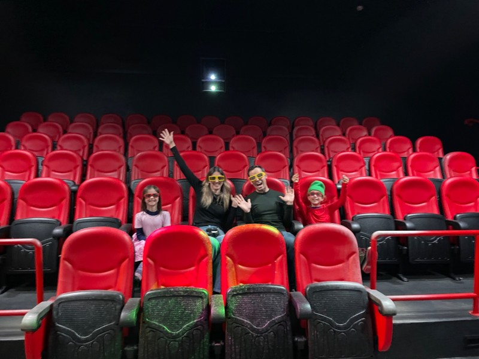

*Private Screening!*

By the time we left to go to dinner we’d be there for more than 7 hours, which sounds like a long time but we basically had to drag the kids away. We had barely managed to get them to eat lunch they were so involved.

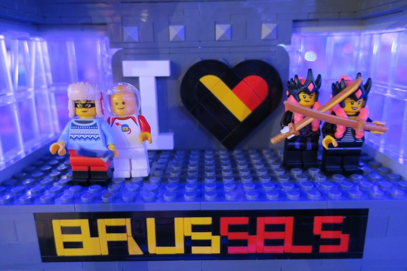

*Our Mini figures love Lego Brussels*

Pat was keen to go to a restaurant for dinner and try some Belgian food. After a bit of research, we settled on Fin de Siècle and ordered some local beer, beef stew (carbonades a la biere), some kind of lamb and feta stew, and a couple plates for the kids (ragu and tandoori chicken). The kids did a great job keeping it together in the restaurant so we could all enjoy a meal together, and the food was very nice.

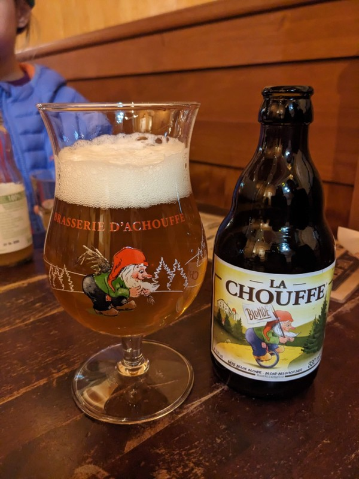

*We really enjoy how every beer you order comes with a custom glass*

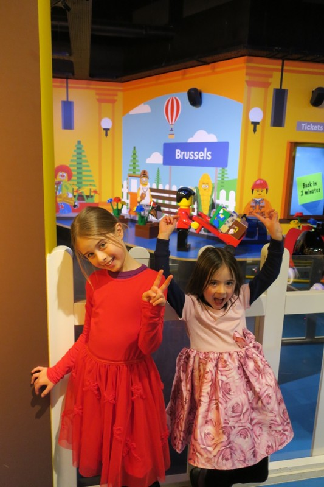

*More posers posing*

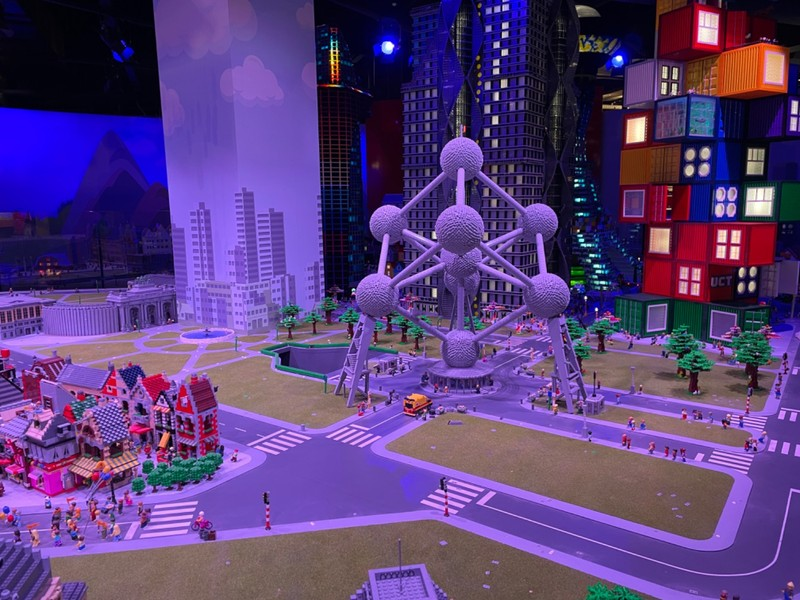

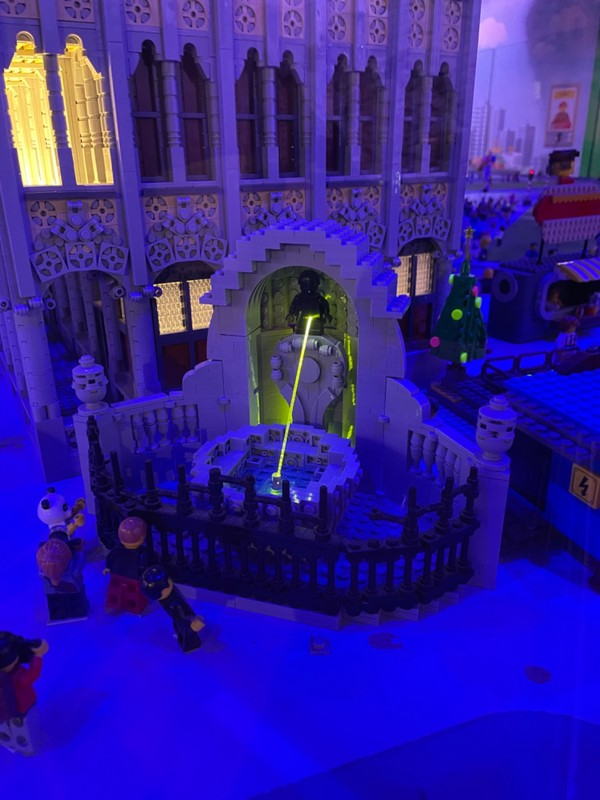

*A bit more mini-Brussels*

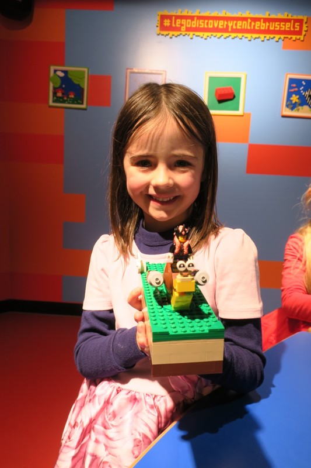

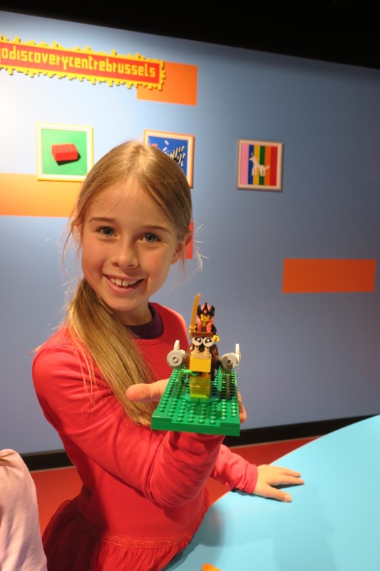

*Turbo Snails!*

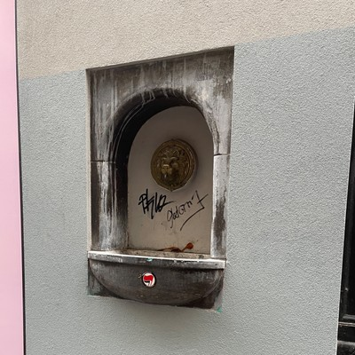

*Every lion we pass is currently Aslan and a photo is required*
