Our last morning in Belgium was spent packing, cleaning, and eating waffles. Kate's was very cold and dry and may have been a leftover from yesterday, but the other three were delicious.

Then it was the tram to the Eurostar station, the Eurostar train to Schiphol Airport, a flight Schiphol to Abu Dhabi, another flight Abu Dhabi to Kuala Lumpur, a private transfer from the airport to the Shangri La, and bed.

When we woke up, it was the 13th of January. The 12th was lost to transit and time zones.

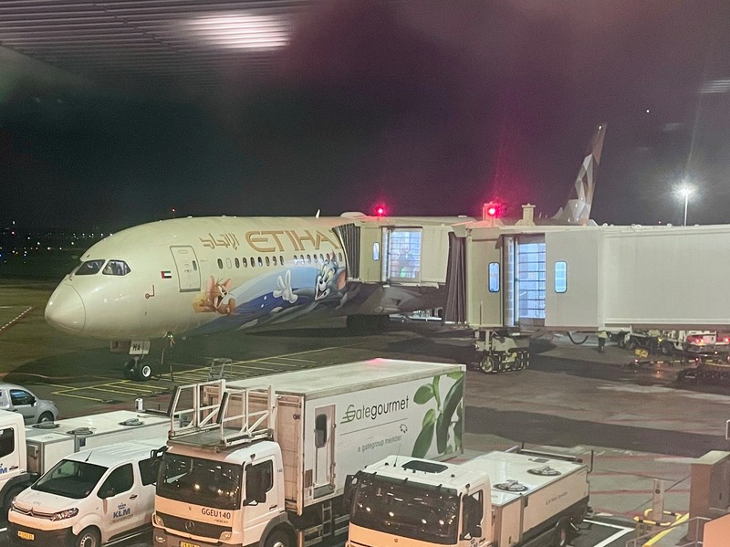

*Our plane was decorated with Tom and Jerry cartoons on the outside, much to the delight of the girls*

A few quick things of note from the transit.

- A surprisingly unsurprising number of women in full burqas in the Abu Dhabi airport, only their beautifully mascara-ed eyes visible.

- A death threat on landing in Kuala Lumpur. “Welcome to Kuala Lumpur where the local time is 7:55pm. If you bring drugs into Malaysia there’s a mandatory death sentence if we catch you”. Having boarded the plane in a city where they sell joints and weed brownies in souvenir shops, that information felt like it would be more useful to people before boarding, not on arrival.

- We organised the airport transfer months ago with the Shangri La for 3 times the cost of a normal taxi to ensure we had a) booster seats for the one hour drive into town and b) zero dramas at the airport having to deal with dodgy taxi drivers. The van came equipped with two baby capsules (suitable for an 18 month old, max) and our driver disappeared for about 20 minutes after meeting us when we took the kids for a wee before leaving the terminal. Sigh.

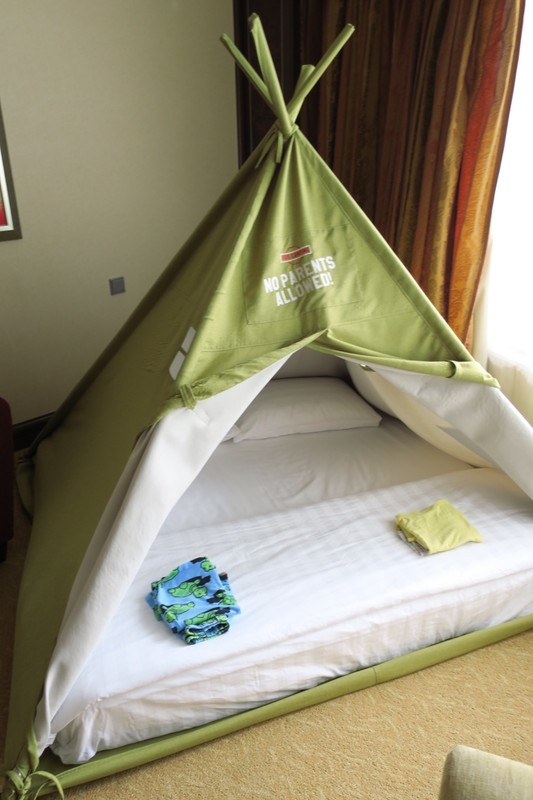

*Kids were very impressed with their teepee double bed when we arrived!*

We started the first full day in Malayasia at the included Shangri La breakfast buffet. An extensive spread as expected! American, European, Chinese, Indian, Malay and bakery options PLUS two chocolate fountains and an ice-cream station in case you need a sugar hit on waking. The only issue was our uncertainty about food hygiene - can we eat cut fruit? Is the pizza buffet full of salmonella from sitting under a heat lamp since 6am? We were conservative and pretty careful about what we ate. Meanwhile Violet and Margot made friends with one of the servers who worked at the bakery.

After breakfast we walked into the KLCC mall near the Petronas Twin Towers to look for a new sleep clock for the girls after the existing one broke in Brussels. Tried 5 different shops getting increasingly stressed with the people and lights and noise and endless consumerism in all the shops. When the fire alarm started going off and the mass of crowds continued to walk calmly around like that screaming is a normal background noise all the time we gave up and called it a fail.

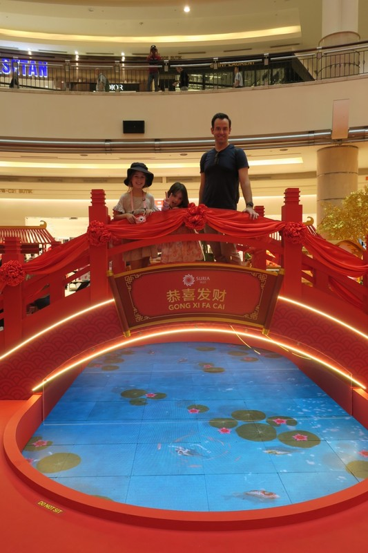

*Everything is fully decked out for Chinese New Years*

As we left to go to the big central park next door, Violet realised she didn't have the special kid camera she'd been given for Christmas. After a little thought she remembered she might have put it down in the first shop we visited when she was playing with the Lego display. We traipsed unwillingly back into the mall. Amazingly, the camera was behind the counter at the shop, with a picture of a hand doing a peace sign added to the roll.

Malls are hell on earth.

Back to the central park, we enjoyed a nice wander through the trees with no shops, artificial lighting or fire alarms. We came upon a closed splash park, and a massive playground which appeared to be a graveyard for mid-sized plastic play equipment; replicas of similar slide/bridge/monkey bar combos over and over as far as the eye could see. The girls tired of it fairly quickly, and we went back to the hotel.

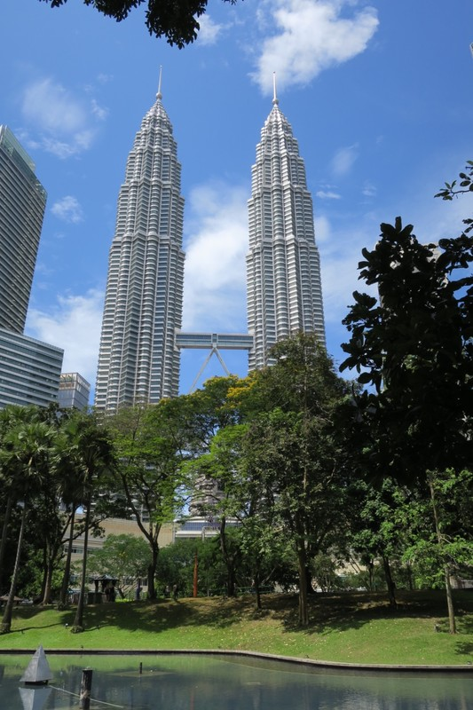

*Twin Towers from the park*

We noticed almost immediately on leaving the hotel this morning that this place is not designed for pedestrians. The footpaths randomly end in a busy road or brick wall. There are minimal protected crossings, but unlike other places in South East Asia it isn't acceptable to just walk across when there's a gap in traffic. The few protected crossings let every combination of traffic go, then all pedestrians have a green light long enough to cross only if you are Usain Bolt. Good luck if you're elderly or disabled!

We did make it back unscathed and had a swim at the hotel to cool down.

We ventured out for dinner, walking through lively streets with a multicultural crowd, huge advertising signs, people dressed as animals, and couples filming dances for TikTok.

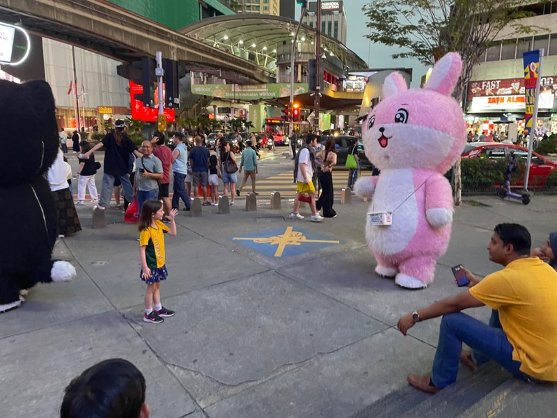

*Margot making friends with a ‘balloon animal’*

We were heading to a hawker centre, which is like a food court with the same stalls you'd see selling street food in a night market, but with running water so possibly better ability to clean utensils etc? Malaysia has a massive range of food due to local influences of the Chinese, Malay and Indian cultures, plus colonial influences from the Dutch, English and Portugese, plus recent migration from all over Asia. There's plenty of interesting fusion foods to try. The centre we went to was called Lot 10, and apparently had chosen their favorites from the local street market to set up semi permanent stalls. The mall is also known for its quality Japanese fare. We finished the night with a range of dumplings (which Vi loved), and two big bowls of ramen (which went down well with Margot).

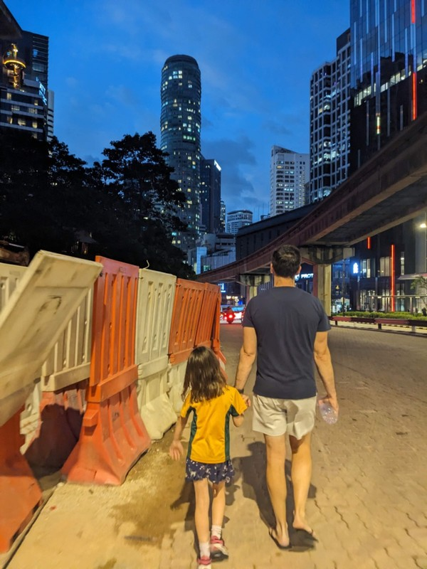

*Walking home on the stellar footpath*

This is the girls' first time in Asia, and they made some observations today about the differences between here and Europe:

- More traffic

- More motorcycles

- More trees ('Why doesn't Australia have this many?' ponders Violet)

- More fountains

- Bad footpaths ('but you forget because of all the trees, like in Fiji' said Violet)

- More balloon animals (this is what Margot calls people dressed as animals)

- More signs everywhere ('Ads, flashing signs, street signs - all the signs' clarifies Margot)

- More tall buildings

- More malls and shops

- Lots of women in headscarves ('What's the thing on their heads called? It's beautiful' opines Violet)

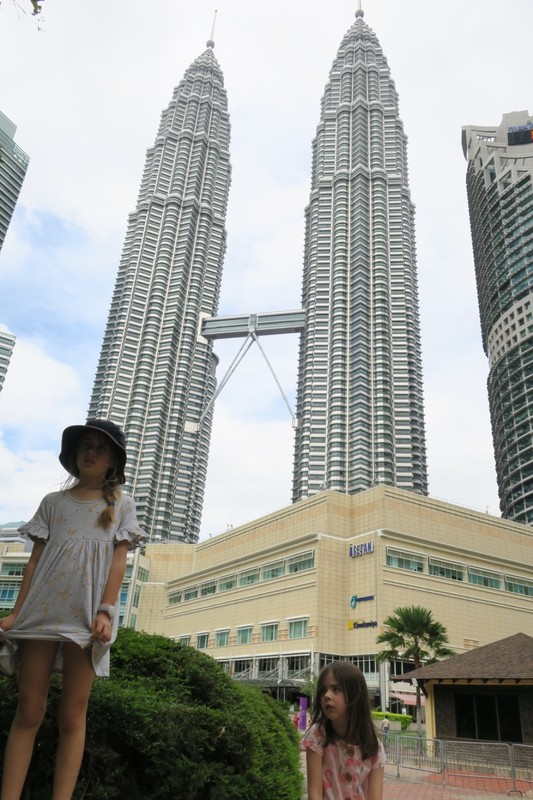

*The exact moment Vi realised her camera was lost - “Take a picture with my camera too! Oh…”*

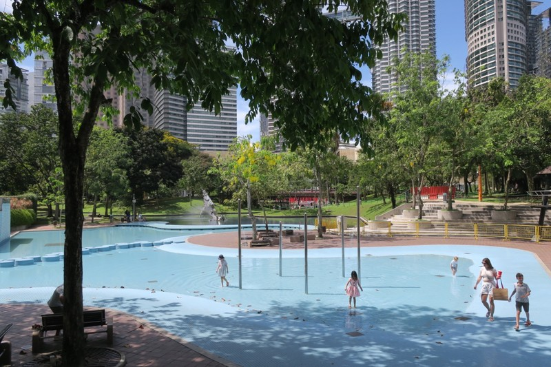

*Kids definitely staying out of the closed splash park*

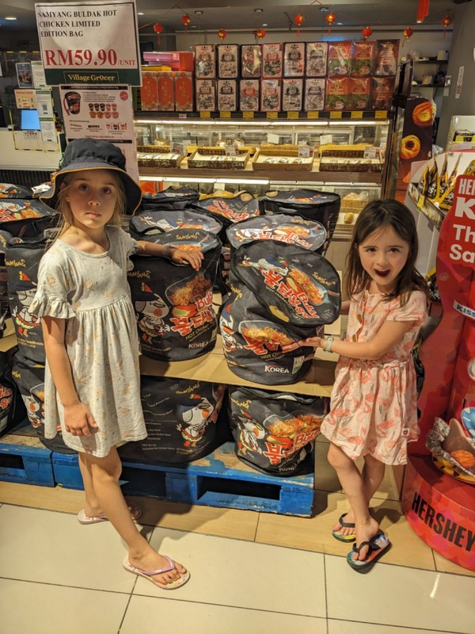

*“Who can eat this many noodles??”*

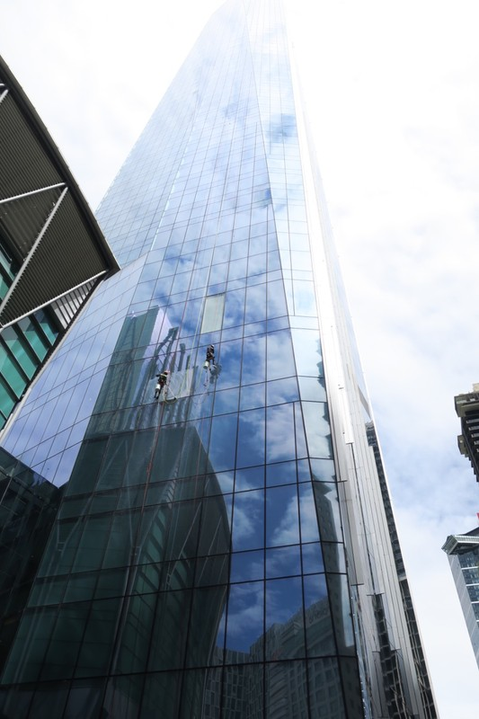

*Extreme window cleaning*

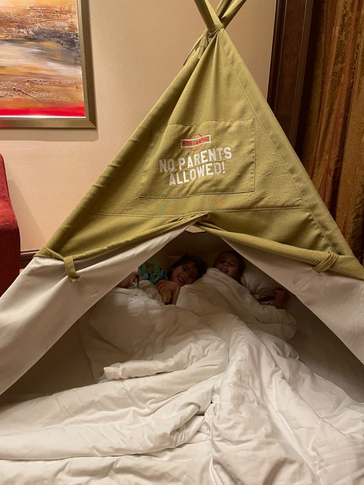

*Snuggling in for the night*
