Kate was a keen bean this morning and wanted to get ready fast so we could get to the Batu Caves before it got too hot and too busy. Unfortunately, “fast” didn’t appear to be in Pat’s or the girls’ vocabulary this morning, so despite getting up at 7, we didn’t leave the hotel in our Grab (Malaysia’s version of Uber) until around 9.

Lucky for Kate, the driver was on her side and he absolutely gunned it to the cave. The predicted 28 min drive took half that. Just like that we’re back on track! Well, not really, because it’s already stinking hot and there are already quite a few people here, but back in the right direction.

The Batu Caves are massive cathedral like limestone caves to the north of KL. They were used as shelter by the indigenous people, then as a guano farm by the Chinese, then were officially 'discovered' (i.e. noticed by a white man) in 1878 by an American naturalist. Shortly after this, they were converted into a Hindu temple. They're the focal site for a Hindu festival in Feburary, Thaipusam, where thousands of worshippers walk barefoot from KL City Centre to the temple carrying milk to be greeted by the enormous statue of the Hindu God of war, Lord Murugan.

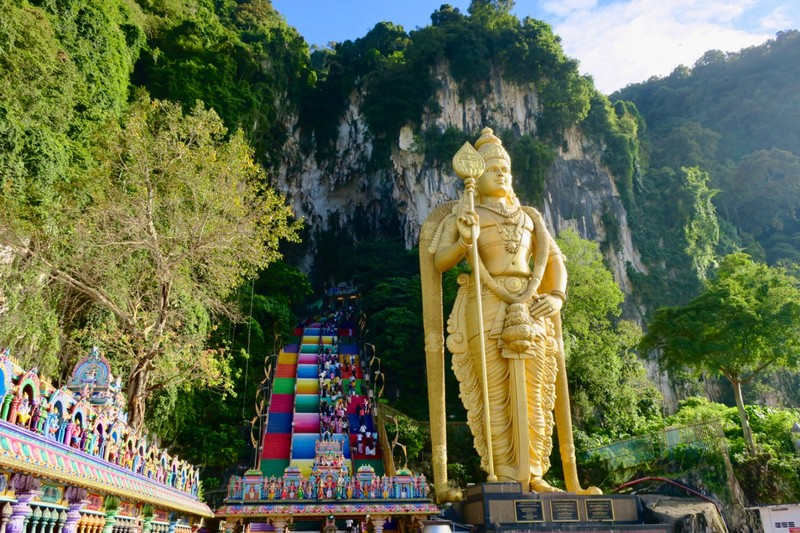

*Quite a greeting*

The first thing we noticed on getting out of the car were all the monkeys! A friend of ours in Canberra was just bitten by a money in Zimbabwe, so we were even more vigilant than normal when it came to cheeky wild animals. We told the kids to make sure they kept their distance and didn’t offer (or appear to offer) the monkeys any food. They asked why there were so many monkeys around and we explained it’s likely because people feed them, which isn’t very good for the monkeys. Sure enough, we walked past quite a few people handing out bananas or coconuts to the monkeys who grabbed the food and scarpered off to eat their loot as more monkeys noticed and chased them/mobbed the people who had the food.

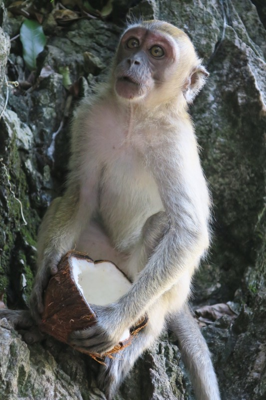

*I can see why people are tempted though. Pretty cute.*

The statue of Lord Murugan was definitely imposing, towering 40 meters over us, and the stairs next to him leading to the caves were actually as bright as the photos we’d seen - it’s not just filters! Apparently the rainbow makeover was cooked up in 2018 by the temple management committee, but not actually approved by the government and not really legal at a heritage site. But it’s got the Instagram tourists visiting, so I guess the influencer dollar overpowered any motivation to reverse it.

Much to Kate’s delight, there were also chickens pottering around. Distressingly, there were a couple of them pecking at styrofoam boxes and eating the bits they were able to pull off. Mmmmmm, microplastics. Delicious.

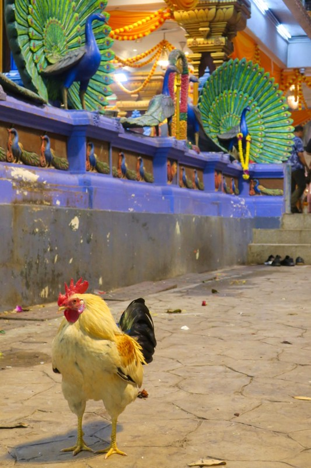

*Almost as imposing as Lord Murugan*

The walk up the 278 rainbow steps was a piece of cake for the kids. Online blogs said it was doable with kids, but plan to stop and rest regularly. Margot basically dragged us up the steps, complaining audibly every time we stopped for a photo.

Pat and the kids took their shoes off and went into one of the smaller temples at the top. There was a kiosk in front selling tickets and various other things (candles and incense perhaps?). But there didn’t seem to be anything stopping us from going up for a closer look. One of the temple priests saw that we looked a bit lost and motioned for us to come over. He gave each of the girls a small flower and put a tilaka dot on everyone’s forehead using a special ash paste.

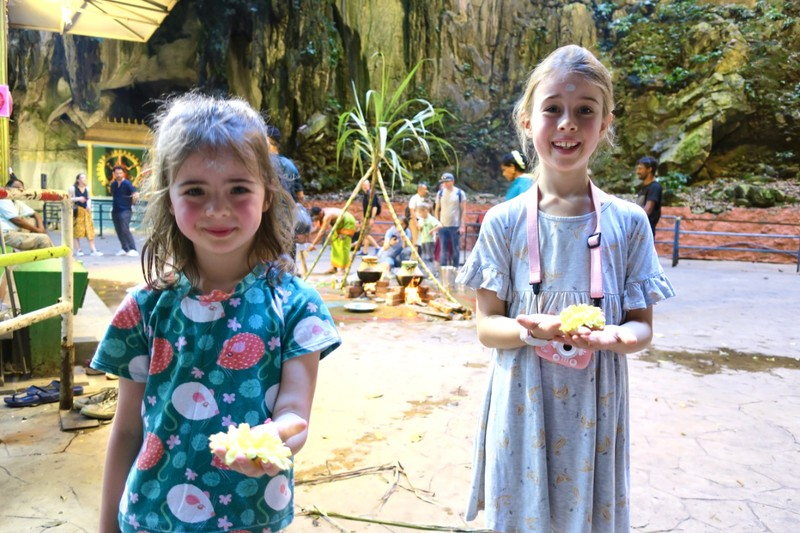

*I think both of the kids found the whole thing a bit magical*

To get into the largest temple you walked through an archway down a path towards a shrine. There was a crowd gathered around a small fire with a pot of liquid set over it. People (presumably Hindus based on their dress, dots, and involvement in the ceremony) were recording videos with phones. We stood around for a while to watch and see what might happen, but we eventually gave up and started back down the rainbow stairs. Perhaps we should have hung out a little longer, because a few minutes later there was some loud music that started playing. Perhaps the liquid started to boil and that was significant? Will need to do some reading and see if we’re able to learn more about the ceremonies there.

We passed a number of smaller rainbow temples and statues on the walk back to the Grab pick up location which were also really beautiful and a nice surprise. The massive imposing limestone cliffs were an interesting contrast to the dense city built almost to their base.

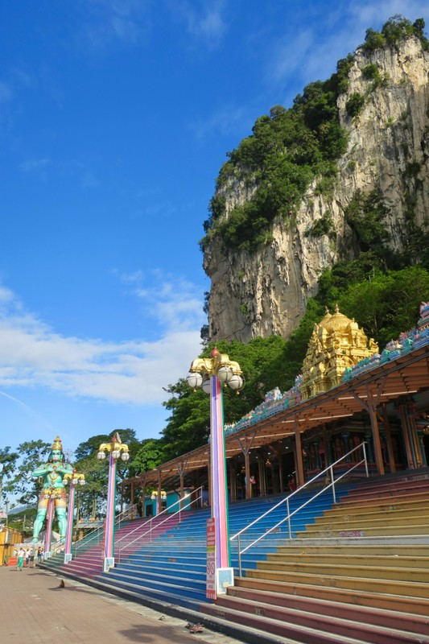

*One of the less famous rainbows*

We had thought we’d use the remainder of the day to go to Sunway Lagoon, a water theme park a half hour from the hotel. Back at the hotel, Kate discovered it's closed today. On investigating alternatives, it became apparent there are all kinds of modesty dress rules for swimming in Malayasia. It seems you’re basically meant to swim fully clothed if you're a woman. Rashies are not accepted in many places because they’re not made of the preferred material. As Kate, Violet and Margot don’t have the right clothes, we had to break it to the girls we wouldn’t be able to go to the waterpark after all. They took it well, but only after a promise Kate would stop being precious about water temperatures and jump in the hotel pool this afternoon.

We walked to Pavilion mall for lunch as recommended by our friend Gavin who has family in Malayasia and visits often. This hawker centre was much cleaner looking than the one from last night’s dinner. More ramen for Margot, Chinese dumplings for Vi, shallot pancakes and Wonton Mee (dumpling soup) for Kate and Pat. All delicious - would recommend. Vi was very interested in a man making pulled noodled by hand, stretching out dough repeatedly until it made delightfully satisfying long strands which went straight into the water to cook.

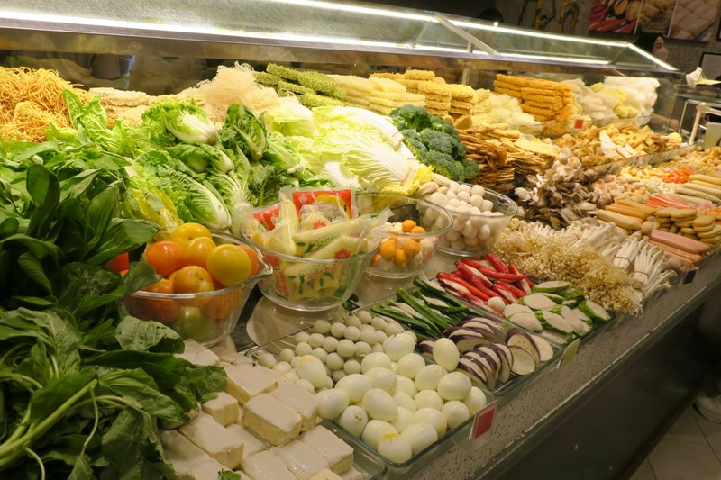

*Appealing fresh produce*

On the walk back to the hotel we discovered an air conditioned walkways over the street level. This is the way to travel if you’re a pedestrian. Eventually the gravy train ended and we had to turn and exit the walkway back to street level to make it back to the hotel.

Walking through the lobby, Pat spotted some pilots arriving at the hotel and pointed them out to Margot and asked if she wanted to meet them. She did, but only if dad came along and made the introductions. They were incredibly friendly and offered Margot and Vi their hats for a photo op. Pretty sure they said they were from Saudia Airlines and had arrived from Jeddah for a couple days before flying back home.

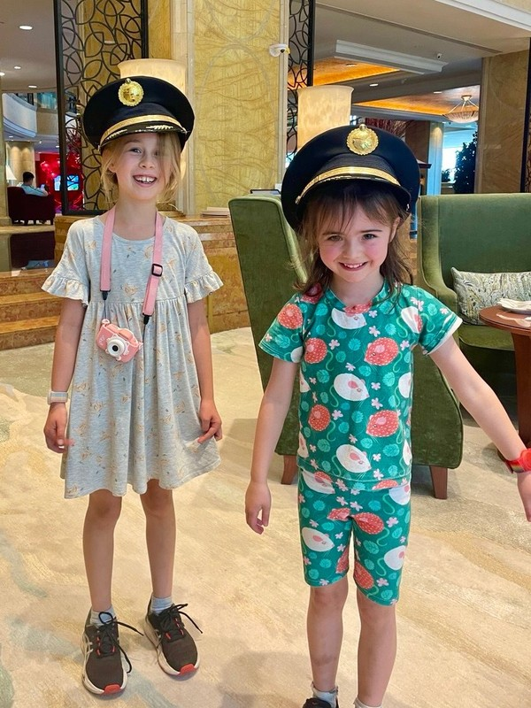

*Pilots of tomorrow. Maybe for a different airline…*

While we cooled off the kids played with lego in the room, now half the figures were Gods and the other half were worshipping them in temples.

We finished the day with literally hours in the pool (honestly, where do the kids store the energy for this)! Even Kate was in for an hour or so playing post office and pets, but she does not have the stamina of those girls!

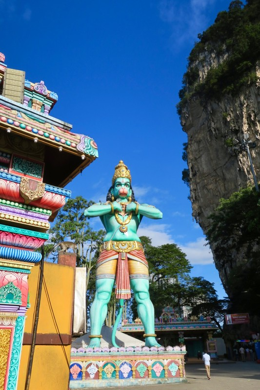

*This guy wasn’t as big or shiny as Murugan, but we were fans*

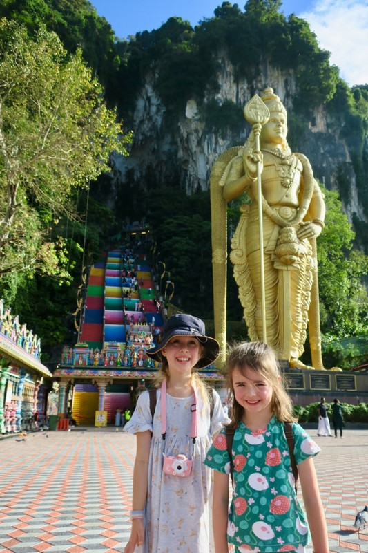

*One of the few photos Margot allowed on this walk*

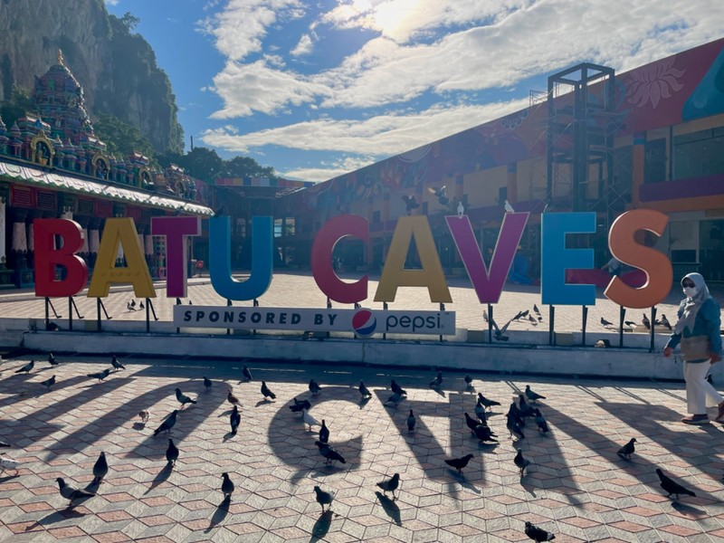

*Batu Caves - Sponsored by PepsiCo*

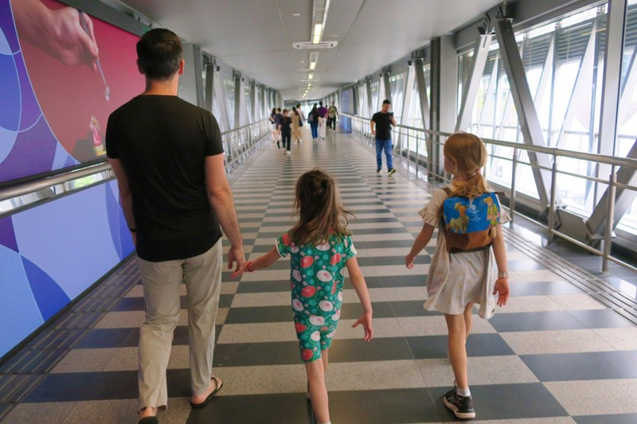

*Air conditioned, raised above street level - way to travel*
