Today we had one activity planned - visiting Kidzania. Kidzania is a mini-city kids’ theme park with 30 parks around the world. We don’t have any in Australia, and we were keen to give it a try in KL.

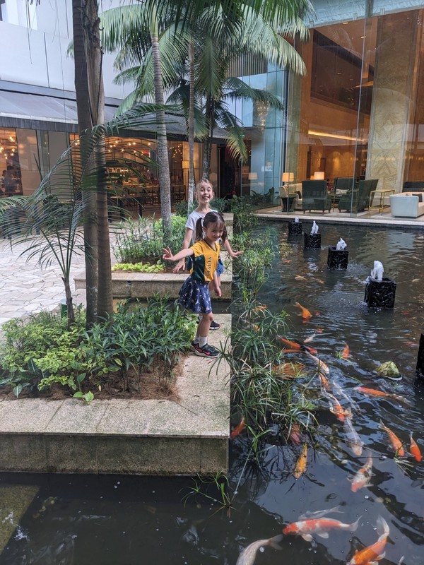

*Feeding the fish after breakfast*

We arrived at an Air Asia check in desk, which really confused the girls after all the flights we’ve done lately. “Where are we going now?”, “I thought we were staying in Malaysia”. After ‘checking in’ (showing our tickets) we were sent up a series of escalators to ‘security’ (where facial recognition confirmed we matched the selfies we had to submit to get tickets) and ‘immigration’. All of this took place below the cut up and mounted body of a seemingly real Air Asia plane.

Once inside, the kids were issued passports as new citizens of Kidzania, given a stack of starter KidZos cash, and told to go wild. The centre is like intro to capitalism for kids. Inside there were 2 stories of streets and stores. Some shops the kids could ‘work in’ to earn a KidZos wage (the pay was lower for unskilled labour, higher for professionals), some places they could spend their KidZos on activities or toys, and some you could spend real money on things like lunch. All of the stores were sponsored by real businesses. We’d heard some of the more popular activities book out, and to get a slot as soon as you arrive. The kids had ants in their pants while we locked in sessions with the Police, Tealive, Firefighters, Airline Pilot and Paramedics for later in the day.

It’s seriously too much to go through every activity the kids tried, and they probably only tried half of the activities on offer. Highlights for the kids were:

- Making bubble tea (which they tossed out because they thought the bubbles and tea were gross)

- Running around like crazy things delivering packages to the shops as posties (Margot did this activity three times)

- Making (and eating) sushi and A&W Burgers

- Operating a toll booth in the area where other kids were driving little electric cars around a track

- Working as hotel cleaners tidying up a messy room

- Margot loved being an airline pilot, Violet hated the flight simulator

- ‘Smoothie shop’, which was mostly riding stationary bikes at high speed to operate blenders and mix smoothies

Margot said she loved being a dentist, but I wonder if she just said that to make me happy?

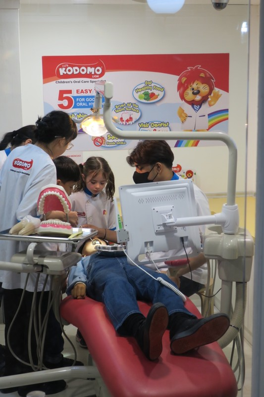

*I definitely liked watching her use dental tools to clean the fake person’s teeth in any case.*

In an astounding coincidence, we ran into Cody, Mrs Foong's husband at Kidzania who was there with his two kids while Mrs Foong enjoyed some retail therapy at the shopping center across the road. Hard to believe that a) we met them on the plane on our first flight out of Australia to Malaysia and b) that we'd run into them again in Malaysia 3 weeks later at a random activity! Margot is going to have fun reminiscing with Mrs Foong about it when school starts.

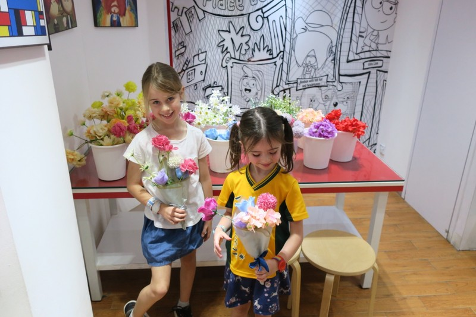

*Florists!*

One of the funniest activities to watch as a parent was working at the Famous Amos Cookies stand. They put on their gloves, hairnets and aprons and rolled out three cookies on their baking trays. The instructor put all the trays into what looked like an oven from the kids' side. From our perspective we could see it was hollow. The man stood in the hollow tipping the dough from the trays into a bin, then popped back into the kids' view with sealed plastic packages of 3 cookies for each kid. 'Here are the cookies you baked!' Violet noticed hers were stale, but didn't click that it might indicate they weren't fresh out of the oven.

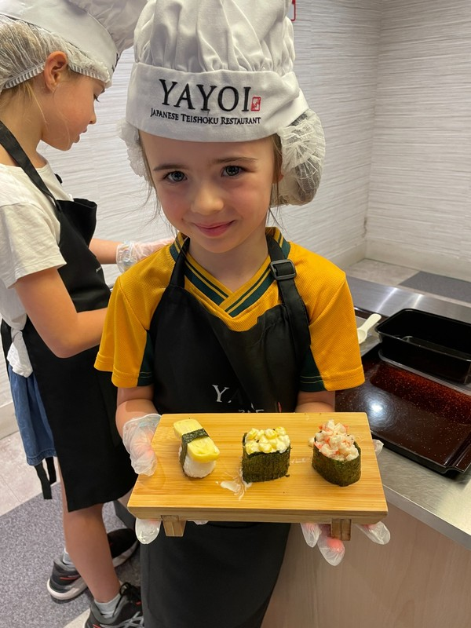

*The real sushi they really made*

Overall, the activities were a bit hit and miss. Some of them were great and well thought out, but some needed more purpose. In particular, the Police activity was total rubbish and we don't understand why it books out. It consisted of the kids arriving, chucking on uniforms, getting on a golf cart with lights on the top, driving to a fake fire and standing hand in hand keeping the area clear while the firefighters spray water all over the building to extinguish the fire. I guess the ride in the little golf cart could be fun? But we felt it was a missed opportunity to do something like thwart a bank robbery, or follow some clues to track down a criminal and thrown them in prison.

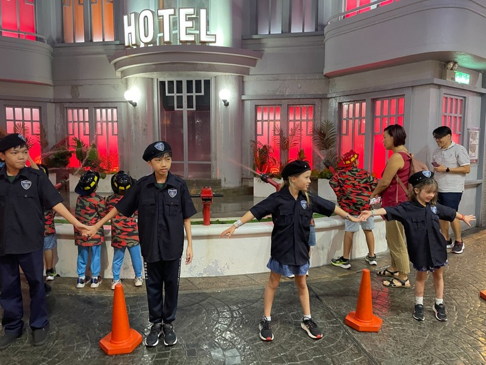

*Very peaceful (boring) police officers*

One that was really well done was the process the kids had to go through in order to drive the little electric cars around the streets. In order to get her drivers licence, Violet had to make a trip to the optometrist and have an eye test done (the optometrist was also a job the kids could do). They then had to take their successful eye test and take it to a driver's training centre where they had arcade style driving games set up to teach the kids basics of driving (go, stop, speed limits, etc). While the instructions to the game weren't very well communicated (Violet "failed", which nearly brought her to tears until she realised that really, everyone passed and she would still be able to drive the little cars), the idea was very clever. At the end she was given a drivers licence which she could present at the track and hop into one of the electric cars to zoom (really, potter) around the track only to be stopped by whichever kid was currently on a power trip operating the toll booth boom gate.

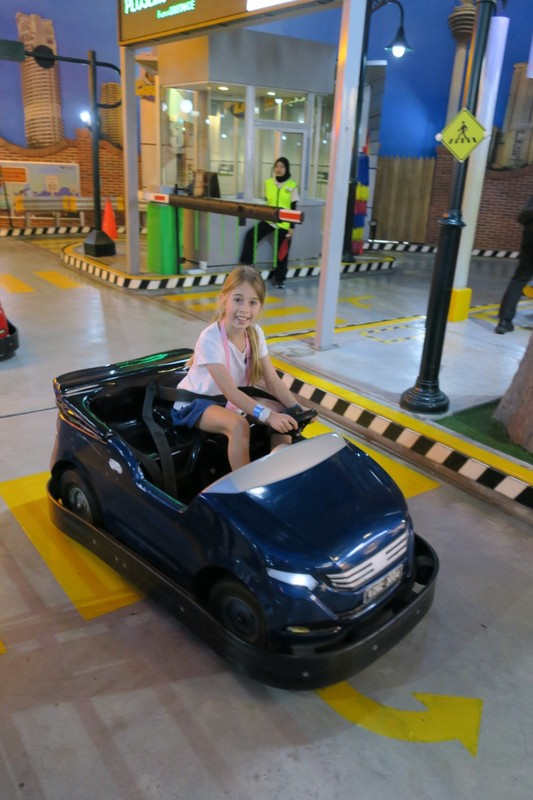

*Cutting laps*

A major disappointment for Violet was saving KidZos to do the indoor rock climbing activity, but being told (very nicely) she wasn't allowed to climb in a skirt unless she had shorts to put underneath. Boo modesty.

The biggest curiosity for the girls was found in the bathrooms where half of the stalls were occupied by porcelain squat toilets. The girls could not grasp how it could possibly work. Another toilet observation was bidets everywhere in every toilet (at Kidzania and in other places). These seemed to be abused by some patrons with water sprayed up the walls and on the back of the doors.

We stayed until closing time, and by then the kids were utterly exhausted. Both girls slept on the ride to dinner with Kate in the middle back seat holding their heads up. The drive that had taken less than 20 minutes in the morning took over an hour in peak KL traffic. We had dinner at Din Tai Fung - delicious as always plus bonus cute panda desert dumplings.

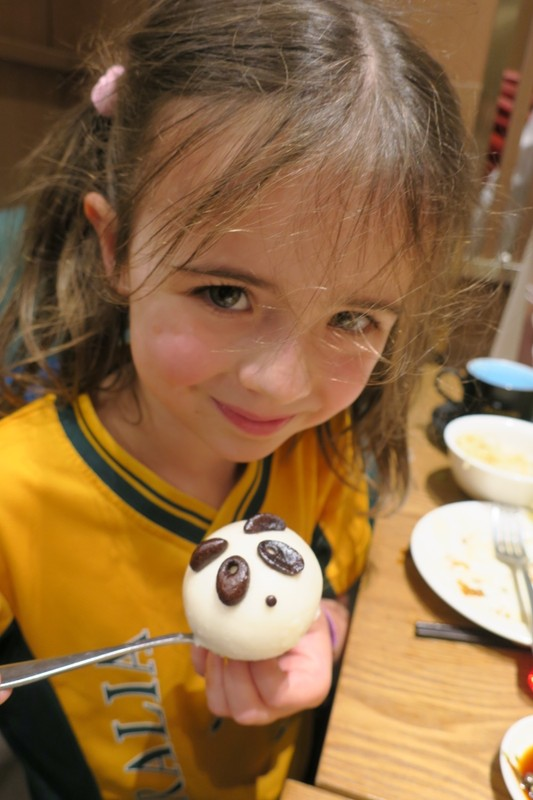

*And they were filled with chocolate!*

Dinner made us think about the prices in KL and how seemingly random they are. Things like clothing and cosmetics more expensive than in Australia, but a massive dinner for 4 at very nice restaurant was only $80 AUD. A meal at Burger King was the equivalent of $4 AUD, but Five Guys was more than $20 (not that we ate at either). Their equivalent of Uber (Grab) was insanely cheap, petrol was cheap, but going against the grain in SE Asia, their beer is very expensive! $17 AUD for a beer in the hotel. Granted that's inflated hotel prices, but still way more than you'd expect to pay anywhere in Australia. Even buying a bottle at the supermarket was approximately on par with Australia. Maybe the Islamic cultural influence has had an impact on alcohol pricing to try and discourage it? The end result of it all was we spent the week not drinking, which on reflection is probably a good thing to help us get over jet lag and sleep better. Good decisions are so boring.

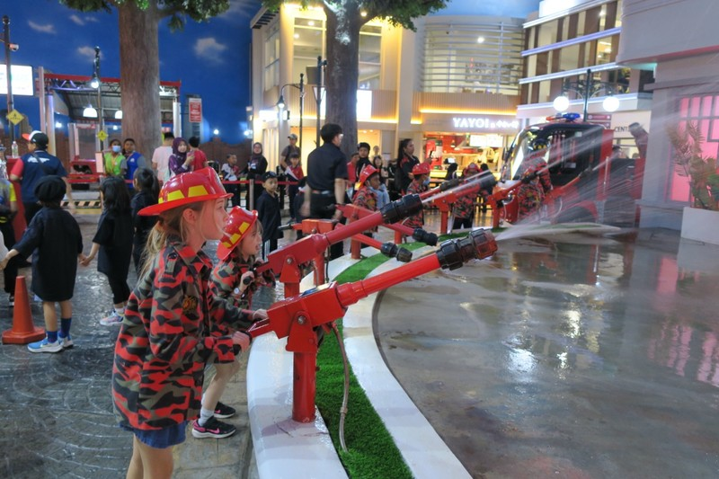

*Fighting Fires*

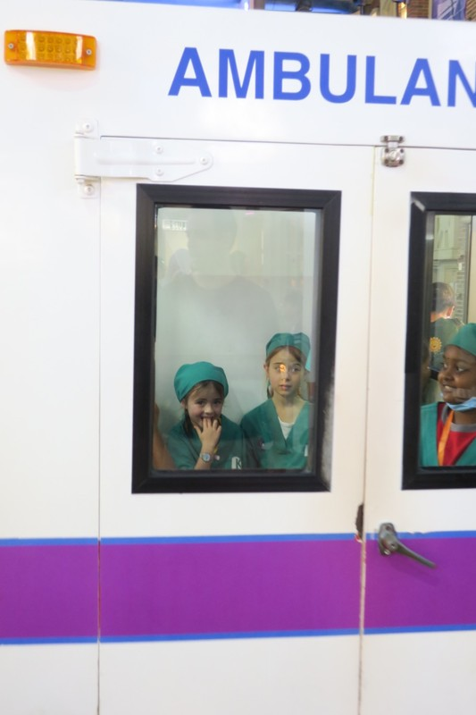

*On the way to the battlegrounds of WWI*

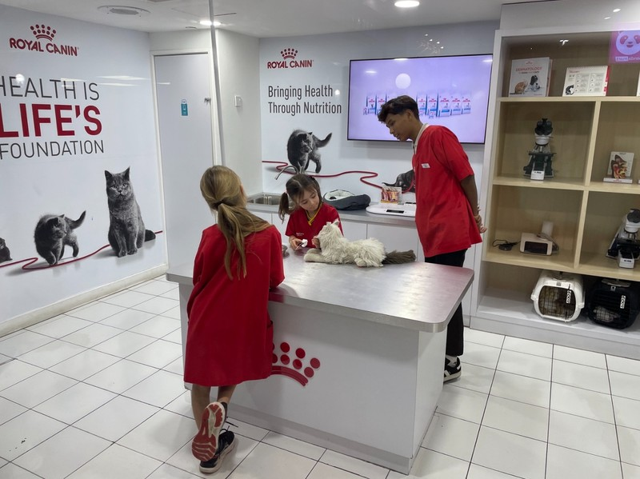

*My first artery forceps*

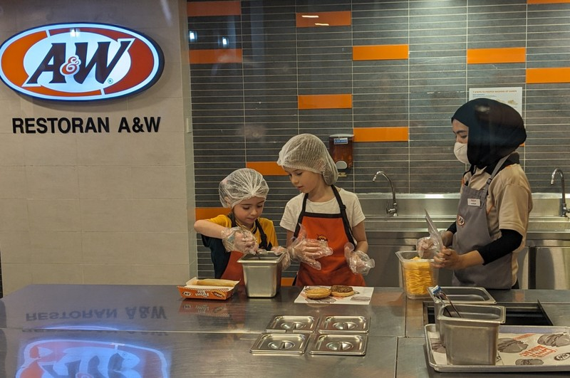

*They ate everything they cooked - something to be said for kids preparing their own food*

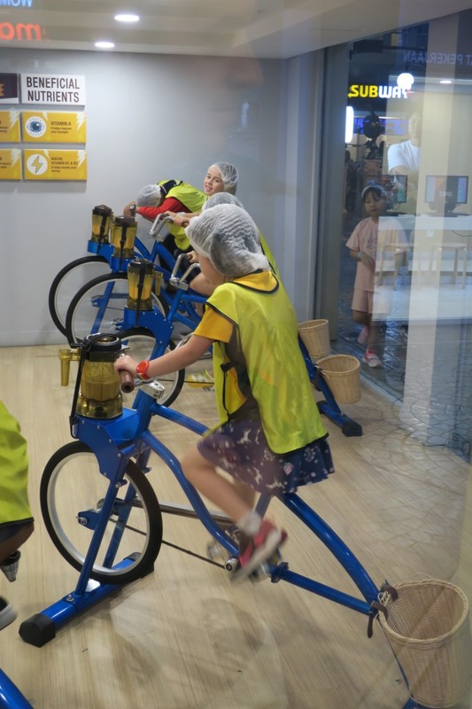

*Sweating for Smoothies*
