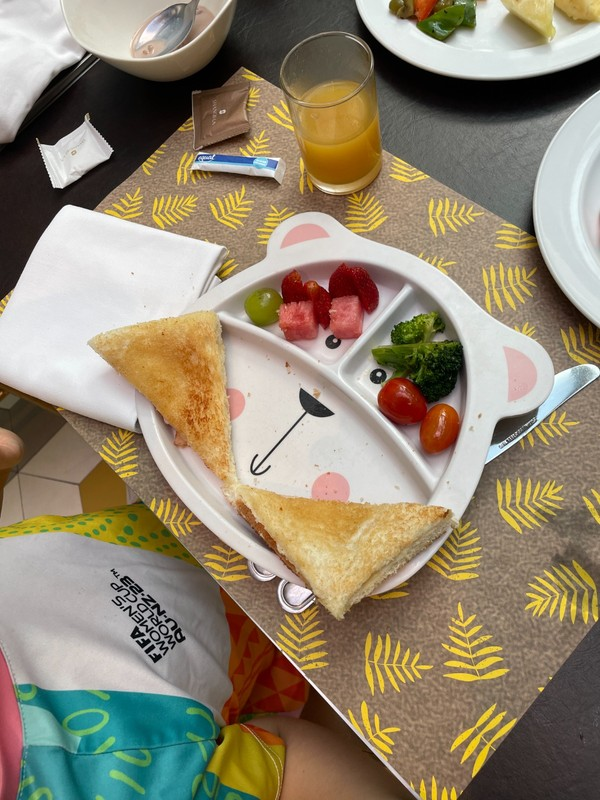
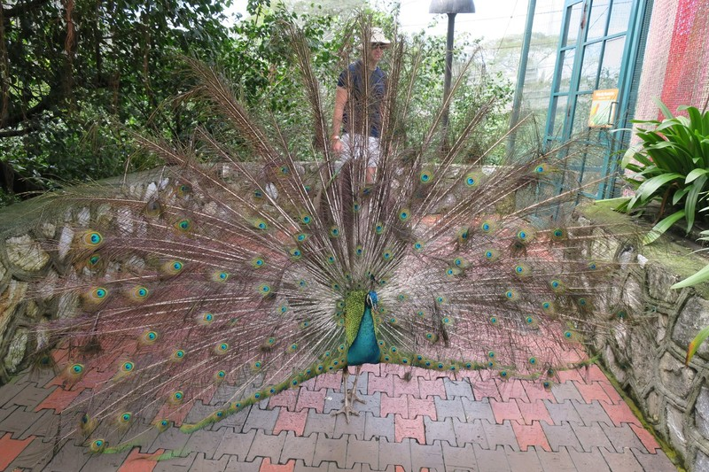
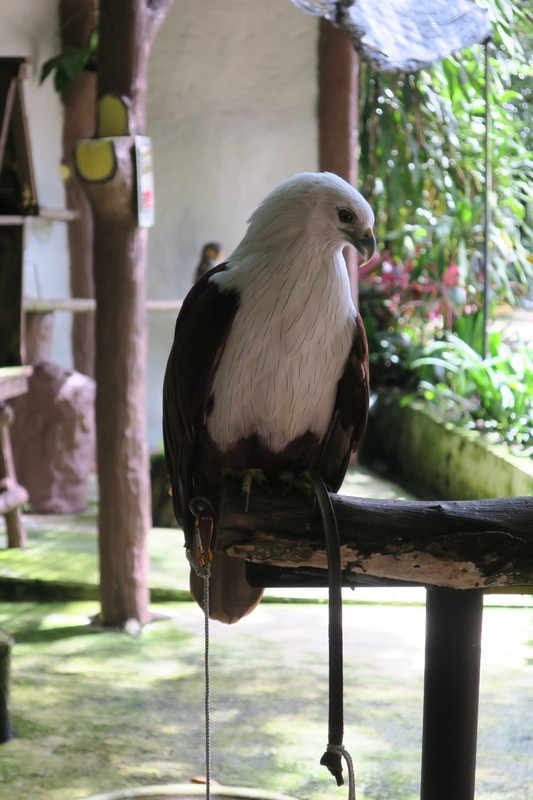
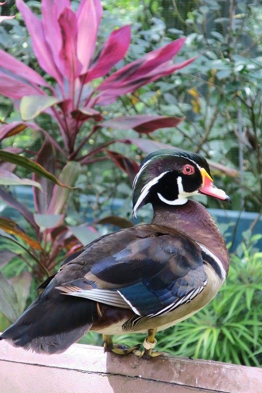
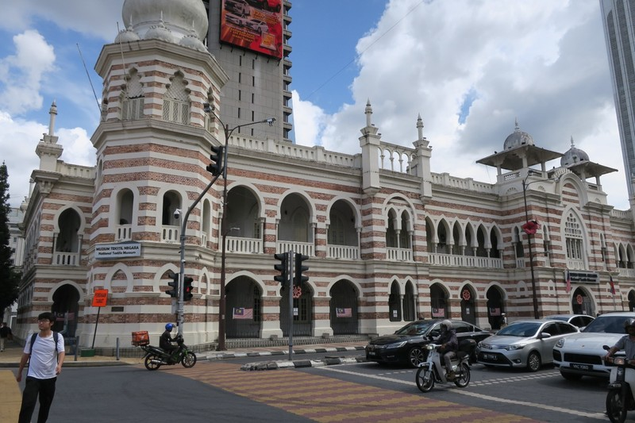
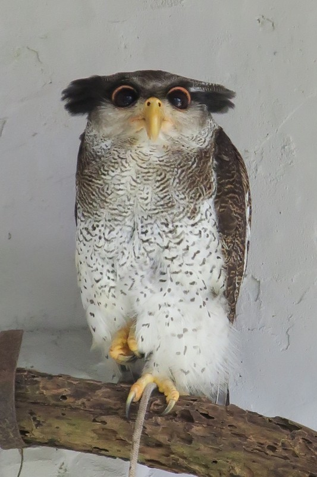
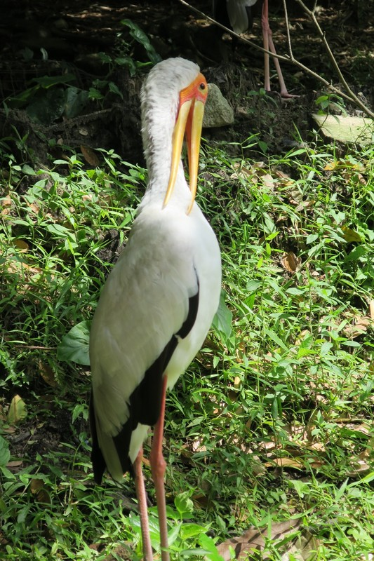
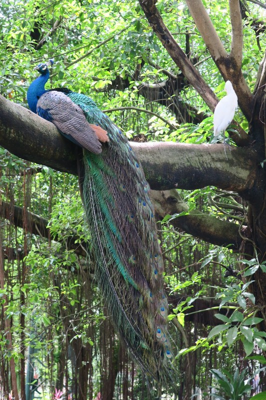
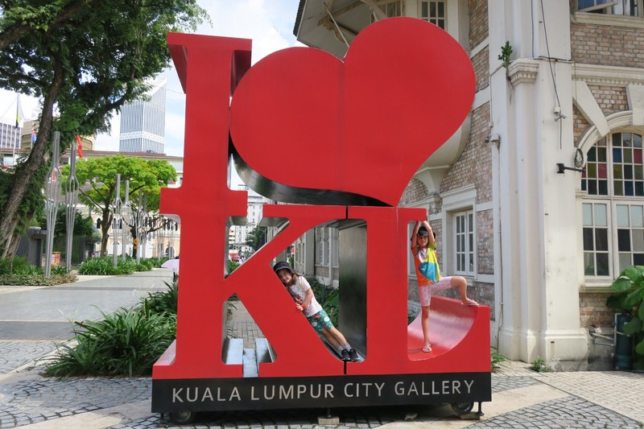
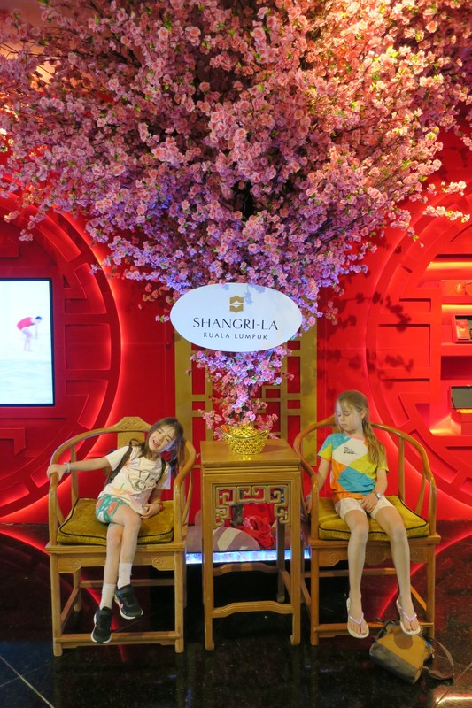

The girls were very pleased to wake up this morning to a special breakfast custom made by their baker friend Aiden and served on a plate shaped like a teddy bear. They continued with their new morning routine of saying hello to the koi in the pond next to the restaurant until the mozzies realised their breakfast had arrived and descended.

*Cheese toastie and veggies*

A few people had recommended we check out the KL Bird Park while we're in town. It was advertised as the second biggest walk in aviary in the world, although looking it up later this is apparently (like all claims to being the biggest anything) a contentious topic. Do you measure it by ground area, or by height, do you include areas that aren't netted, does the number of birds or bird species come into it, etc. In any case, we trust it's pretty big. We grabbed a Grab there, bought our tickets, and headed in.

*As soon as we got into the park, the path was blocked by the back of a peacock, his tail feathers completely unfurled.*

Towards one end of the park we came across a group of monkeys, who clearly weren’t welcome in the bird park, but no one could be bothered to move them along and fix the holes in the aviary netting. They were absconding with fruit left on platters for the birds, and enjoying swinging around after finding that expert landscape design for birds also suits monkeys quite well.

Mostly we saw happy birds flying around, stretching out in the sun, or swimming in the watering holes, but there were still lots of small enclosures for some of the birds, and ropes around the legs of the birds of prey to keep them from flying off. The owls were roped to little stands directly in the sun, and while they were trying their best to sleep they were not looking terribly happy. A Google search afterwards suggests there used to be a cage with 10 hawks crammed in, now there's just the one sad fellow tied to a perch. An improvement, but maybe this isn't a suitable place for those kinds of birds at all?

*Flightless Hawk*

We were also a little perplexed and sad in the parrot enclosure. While the lorikeets and rosellas were allowed free reign with some of their African and South East Asian cousins, the cockatoo and galah were kept in solitary confinement in tiny boxes and looked quite miserable. Sulphur Crested Cockatoos are apparently “interesting” here, not garden destroying assholes like they are in Australia. We know cockatoos are absolute terrorists, but I'm not convinced they need to be kept in cells. There was one large talking parrot who said "hello" to the girls about 30 times, much to their delight, but it all seemed rather depressing to the adults. We finished up our mixed visit with a mostly inedible lunch at the attached cafe.

*Some gorgeous birds though*

It was getting hot, but we decided to walk to the touristy colonial bit of the city and China Town as it was less than 2km away. We passed the Islamic Arts museum, which looked very interesting, but no one was dressed appropriately to go in. We also walked passed the enormous National Mosque of Malaysia, but again, no visit due to inappropriate dress. We carried on with our increasingly hot and sweaty walk until we got to Independence Square, an area full of colonial buildings where the Malayasia flag was first raised in independence from British rule. It was absolutely ridiculously hot, so we didn’t spend as long here as we had planned, nor did we make it to China town.

*Interesting mix of colonial buildings and skyscrapers*

It was interesting reading a little about colonialism in Malayasia though. We hadn’t realised it didn’t really exist as a cohesive country until the Dutch and British decided to stop fighting each other (to focus on fighting the French), drew a line on a map and agreed everything to the north of the line was Malayasia and British, and everything to the south was now Indonesia and Dutch. It's baffling to think about how many countries have been created by Europeans scrawling lines on a map to divide up land they probably have never actually been to. At least it was for a cause that we can all rally behind: fighting the French.

Caught another Grab to head back home for a much needed swim to cool off. For dinner, we decided to head back to Pavilion since there was more than enough choices to keep everyone happy. For their last dinner in KL, the kids wanted a traditional Malaysian dinner of Pizza Hut. Sigh.

*This photo is kind of cute, but it was sad in real life*

*The storks were fabulous*

*As were the peacocks*

*Kids love KL!*

*And posing with every Chinese New Year decoration in town*
