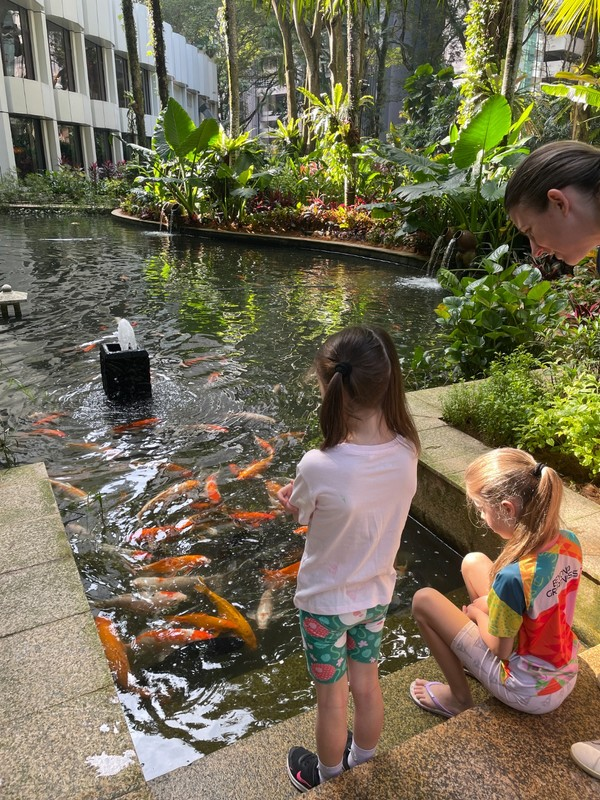
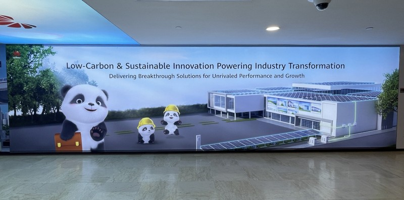
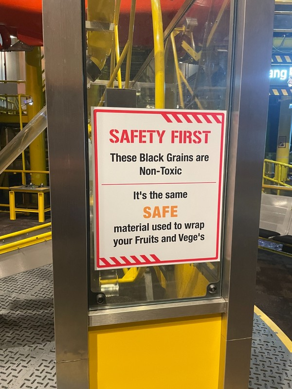
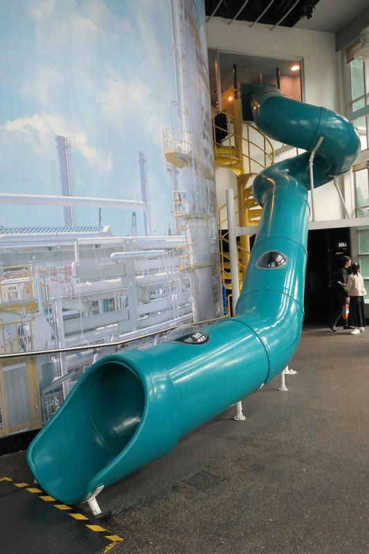
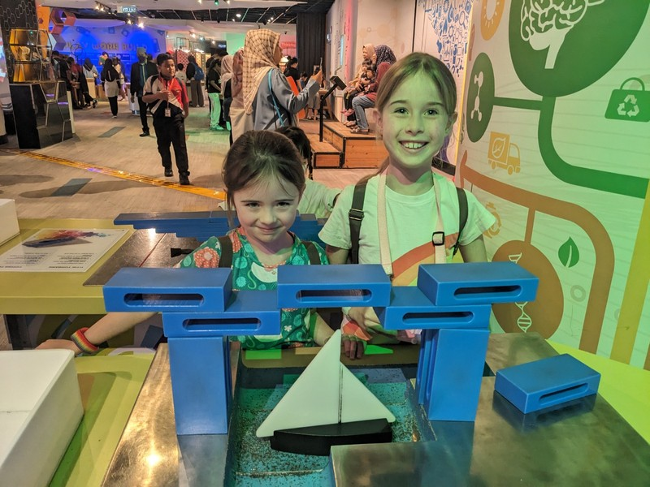
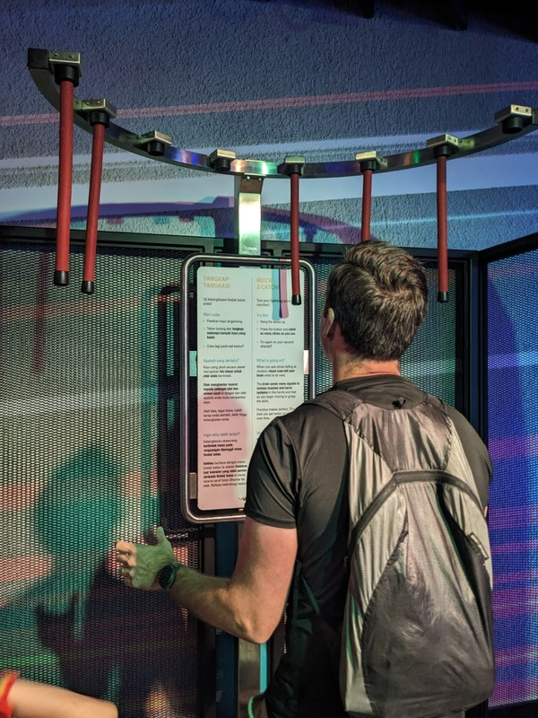
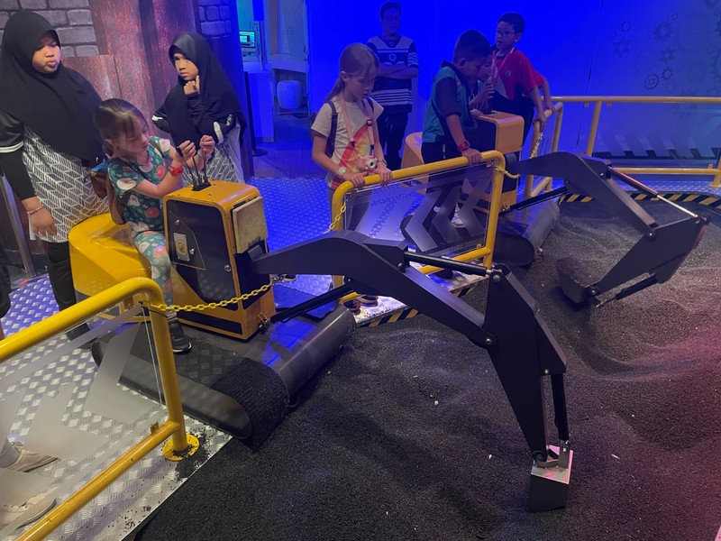

At breakfast the kids were keen to give a present to their chef friend, Aidan. They'd decided on one of the reindeer antler key rings that we got in Finland. Aidan was very excited by the gift and said he'd make the kids a very special Indian themed breakfast this morning. He arrived at the table a bit later with two plates filled with delicious smelling curry and roti. The kids enjoyed most of it and finished off breakfast with ice cream, because apparently that's now what we do after breakfast.

*Bye fishies*

The kids wanted one more swim before we had to pack and check out of the hotel, so we took them to the pool after breakfast. We then went back to the room and started the worst part of any holiday: getting ready to go home. Fortunately, we still had most of the day at our disposal, so once we finished packing, we stashed the bags at reception and set out for our final adventure in KL.

It's embarrassing that it took us this long to discover the air conditioned tunnels, but now that we knew about them, we designed our walking routes to maximise the amount of time away from the hot and humid weather. We only had a short walk from the hotel until we found the tunnel entrance which took all the way to KLCC. This is clearly the way to travel if you're in this tourist zone.

*On the way, we stumbled on what is perhaps one of the best pieces of corporate buzzword nonsense. I couldn't even tell you what they were trying to sell.*

We had a Malaysian lunch at a nice restaurant in the Petronas Towers/KLCC before heading to the Petrosains Science Discovery Centre. Having a science centre sponsored by a giant oil company felt a bit like a conflict of interest, and it certainly delivered on some amusing experiences inside. For example, the kids learnt how to dig for coal using an excavator, about how dinosaurs became oil, and while there was a good amount about pollution/global warming, there was also a lot of bias (e.g. Plastic isn't so bad! Carbon capture is great, we just need to dig for gas to free up space!). There was also a full size replica of the deck of an oil rig.

*If anything, we should be eating it!*

Kate and the girls spent quite a lot of time playing a game on a large tabletop display where you can create stars and planets. The physics engine of the game simulated what happened when two stars got to close together and collided, or what would happen to a planet orbiting a star if it was too close (hot burnies), just right (an Earth-like world creates and sustains life until life ends up destroying itself in a nuclear disaster), or too far away (ice planet). The girls spent their time with a little boy tossing a bunch of stars together which ended up creating a massive black hole and in doing so destroying the universe. So much for the solar systems I was trying to build.

On the way out, one of the final exhibits spoke about the impacts of climate change. Poor Margot had a moment of realisation that the changes will happen in her lifetime and had a mini mental breakdown. Violet had also not realised, but was easily distracted by a giant slide. Two very different children.

*Sliding solutions*

Violet had a rough experience later when she was playing a 'speed throwing' game. After waiting an age for her turn, a very assertive boy came, told her to give him the ball, and took over. No one knew if there was an appropriate way to correct him in this Islamic country, so we just had a chat with her about expressing her needs; telling people she needs a bit longer, or maybe throwing the ball at their head.

*Building bridges*

Perhaps the best part of the centre was a game designed to test your reaction time. You had to stand on a specific spot while several batons were hanging from a curved rail over your head. Once you started the game, the batons were randomly released at different intervals and you had to try and grab them before they hit the ground. Most people stood still and thrust their arms this way and that grabbing at the batons when they fell, but we watched a young girl absolutely putting her life on the line trying to catch the batons. She literally threw herself to the ground, diving and lunging after each baton as they fell. Her family was clearly concerned she was going to hurt herself, but curiously did nothing to discourage or stop her. I can't remember if she caught any, but I can tell you that that girl is going to run the world one day.

*Pat having a crack at it with less commitment*

Back to the hotel to collect our bags and into our final Grab to the airport. We'd been lucky this whole time and all our cars have had seatbelts. But this one was missing the middle seatbelt in the back for Kate. And unluckly for Kate, this was probably one of the worst, most aggressive drivers we've had this trip. Speeding, tailgating, leaving his indicator on for 10 minutes until the point he wanted to change lanes, then mysteriously turning it off just before merging, driving on the shoulder to pass cars, waiting until the absolute last minute to swerve through several lanes to make the exit from the highway, all in pouring rain and rush hour traffic.

In case I die - love you all. (spoiler: she didn't die. She's right here next to me practicing French on her phone).

And with that, we arrived at the airport where KLIA tried (unsuccessfully) to gaslight us into thinking the airport is really close to the city with massive murals quoting people who used to say things like "it used to take 1:30 to get to the airport, now it's only 45 minutes!". Really, it was a pretty long and dreadful drive (our psycho driver aside). We've clearly been spoiled by how close Canberra airport is (and even how close Sydney airport is to the CBD).

*Digging for coal*

We asked the kids for their highlights and take aways from the trip.

**Margot**

- Kidzania

- Ice cream for breakfast in Kuala Lumpur

- Santa

- Lego Discovery Centre

- Learning if you pat a dog statues nose you'll get good luck

