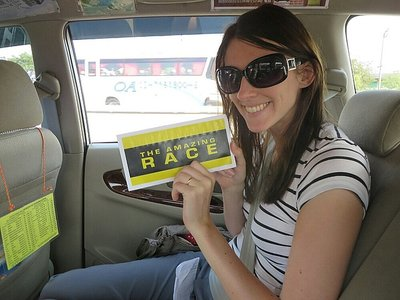
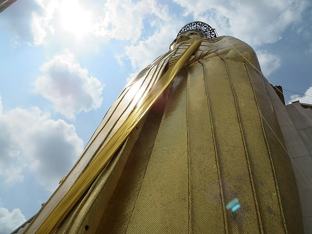
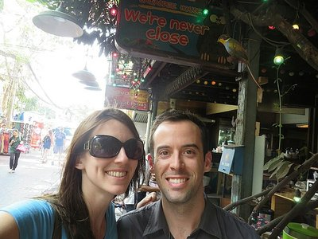
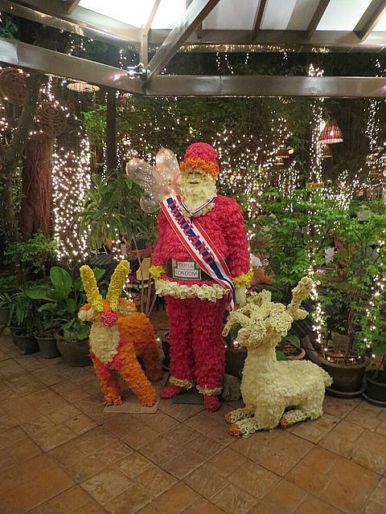
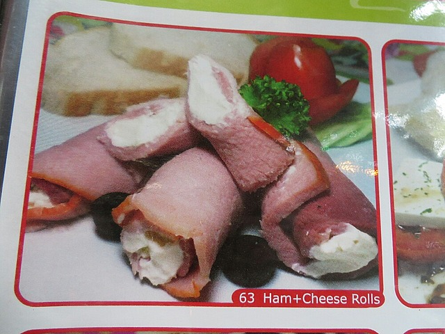

We actually had an okay night's sleep in the airport hotel. After breakie in the lounge and another uneventful flight we arrived in Bangkok.

On the ride into town we opened the gift from Brad, Kate, and Andy - an Amazing Race challenge to visit a rooftop restaurant with a spectacular view for dinner or a few cocktails. It was all very exciting.

*Amazing Race Gift*

Unfortunately even with that entertainment, the taxi ride was  painful. The driver didn't speed and weave like a psychopath (which was nice when you don't get seatbelts) but the trip took forever because of protests. Lots of streets were barricaded and traffic jams were dreadful. At one point the driver gave up on a 30 minute standstill of traffic and we ended up driving the wrong way back up the street to try an alternative route. I felt bad for him as the ride from the airport is a fixed fare and I doubt he made a profit with how long it took.

It has been 6 years since Kate last visited Bangkok and it doesn't smell as bad as she remembers. However the mental clumps of power lines are worse. As is the traffic, but whether that's just due to the protests is hard to say.

The hotel was very clean and nice. Of primary importance the air conditioning killed it, and the desk staff were really lovely and helpful. They also supplied a free tuk tuk to the Grand Palace which we took advantage of.

Unfortunately on arrival we couldn't get into the palace because Pat (the trollop) was wearing shorts that exposed his knees. How I could marry someone so salacious? There was a sign indicating you could rent pants but there was also a huge queue. While we were umm-ing and ahh-ing an "official" with a lanyard approached us and suggested we to come back at 2pm when the crowds will be smaller. He put us into a tuk tuk for a 'city tour'. We knew it was a scam and we shouldn't do it. Then we did it anyways. We are dumb, but he had a lanyard!! Not just anyone has one of them!

*Standing Buddha*

First stop we went to the big standing Buddha. It was very big. And standing. Men were selling sad little birds in cages you could pay to free and there were a lot of sick dogs around. After looking around a bit we went back to the tuk tuk. The driver had a quick word with a man when he thought we weren't looking, then went to the toilet. After an appropriate wait, the other man approached us telling us how wonderful Thai jewelry and tailoring is and how we should buy things while we're here to support the local economy. He said we were in a special tuk tuk organised by the government to take tourists on a tour of the city from the major sites and weren't we lucky. Getting more and more scammy by the minute. Once he finished his sell, the tuk tuk driver returned.

We were meant to go to the Golden Mound, and we did start off in the right direction. We had a lot of fun with the much more psycho driver going on the wrong side of road, driving on the footpath, weaving, speeding and eventually just going through the protest zone.

Unsurprisingly at this point, the next stop was not the Golden Mound, it was a tailor. We had a polite look but didn't buy anything. After that we were taken to a jewelry shop. Again no purchases, so the last stop was a return to the Grand Palace because the driver "wasn't feeling well" and couldn't keep going (or more likely because we didn't buy anything).

All in all, for $2 it was still a fun city tour.

*Far Away Bar*

We were pretty hungry now, so we headed to Khaosan Road for lunch. Got some big beers, green curry and pad Thai. Not spicy but not bad. We walked down an alleyway Kate had fond memories of to find the Far Away Bar (they're never close) and found it was much busier and bigger than it was 8 years ago. Loads more restaurants, hotels, cocktail bars set up on the side of the road and tons of deck chairs with locals offering Thai massage. We found Kate's old bar which was also significantly expanded and busier. We had a cocktail and people watched all the dirty hippies, white bogans and backpackers. Aside from staff, there were no Thai people.

When the afternoon started to move into the evening we headed back to the hotel for a shower then went back out to dinner at Cabbages and Condoms, a suggestion by Gill Townsend. The restaurant aims to raise funds and awareness of safe sex for family planning purposes. The decor of the whole place was condoms right down to light shades, so they got that bit right. However, despite being yummy, we saw no cabbages in our food.

All in all a good first official day to the trip!

*Safe Sex Santa*

*Ham and Cheese Rolls - Not What I Expected From the Description, But I Probably Should Have*
