Woke up and headed to the river to try and find the stop for the public commuter boat that would take us to the Grand Palace (round 2). This time Pat had some shame and wore full length pants. The boat arrived packed with people - over 100 people when it could fit maybe 50 comfortably / safely. Still a bit wary of safety in South East Asia (a feeling that would eventually pass) Pat decided it was way too full, looked like suicide, and didn't want to get on. Kate agreed with the sentiment but not the conclusion, expressing 'what better way to die than to drown in a river in Bangkok??'. For some reason this didn't put Pat at ease. In the hesitation they stopped letting people on the boat and the decision was made for us. Pat was a bit relieved and Kate was a bit irritated. We started walking toward the palace along the river.

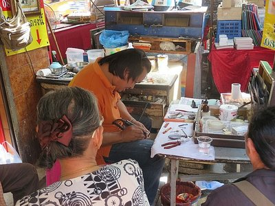

*Ghetto Dentist*

On the way, we stumbled across a cool street market. Kate especially enjoyed a ghetto dentist making dentures for 200 baht by using old dentures and adjusting as required on the spot. Ew. Kate took notes and, much to the annoyance of the "dentist", a few sneaky pictures. Pat commented about how that fun detour wouldn't have happened if we were dead on the bottom of the river. Kate was still not impressed.

Properly equipped with some modesty (aka pants) we went into the Palace. We saw the Jade Buddha, invented stories for the awesome endless murals along the walls and admired many very ornate buildings. Surrounded by what seemed like solid gold temples, Kate wondered about religious wealth here not being used to help poor Thai people.  Pat thought it may actually not be that much gold, just leaf plating. As it turned out, a lot of the locals actually bring gold leaf to affix to various religious symbols and statues as a form of prayer and alms. So there ya go.

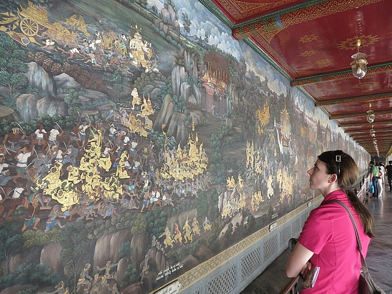

*Endless Murals at Grand Palace*

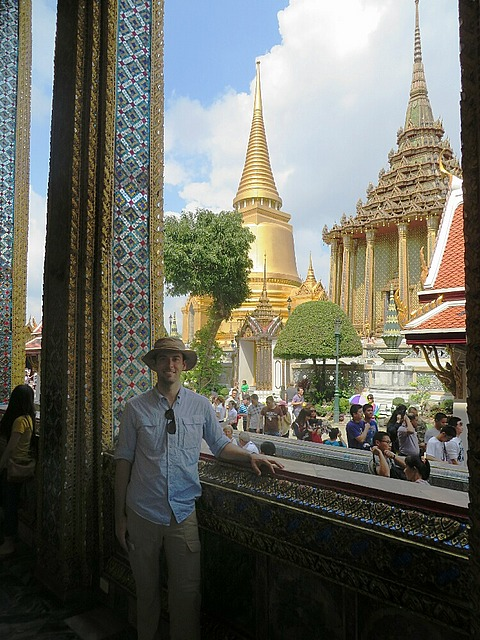

*Pat at Grand Palace*

After walking around for a couple hours, we left the Grand Palace for Wat Pho, a complex of temples nearby (another suggestion from the lovely Gill Townsend). We explored lots more cool temples, saw the giant reclining Buddha, and several other Buddhas. Starting to see a pattern emerge?

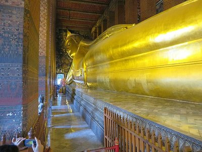

*Reclining Buddha*

Once we had our fill of Buddhas for the time being, we left Wat Pho and decided to head towards the giant swing. Used our map to guide us along the way and accidentally ended up walking through barbed wire and the protest zone. Oops! We eventually found the giant swing which turned out to be in the middle of a giant round about so we couldn't go up to it easily. Also, apparently it's not a swing you can ride much to Pat's disappointment. Why did we even bother?!

Always walking. Hot and walking. No food and still walking. Can't quite remember where we were walking to, but we never got there. Gave up and headed back to tourist Khaosan Rd.  While it may be full of white backpackers, it's also full of restaurants so we'll cave and admit we're white backpackers too if it means some (clean) food and a place to sit.

Finally, lunch, beer, water, sitting!

Back at the hotel, we went to make a dinner reservation at fancy pants rooftop bar in the city to accomplish our Amazing Race challenge, but were knocked back. The receptionist looked Kate up and down and asked pointedly, "Do you have a dress?". After finding out they didn't have anything available for tonight, we ended up making a booking for tomorrow night instead.

After a hard day of walking and eating, we decided we had earned a break and walked across the suicidal road our hotel was on to get a Thai massage, a gift courtesy of Karla and Eddie. Pat apparently had a giant knot in his back which the masseuse tried in vein to remove. Kate left refreshed, Pat left with a sore back.

End of the day we went out for dinner: stray dogs, cute cats, and power lines everywhere. Not sure how the entire city didn't erupt in a fireball caused by dodgy wiring on high voltage lines. Walking past all of the street vendors, it was incredible the variety of food that you could purchase from a stall on the side of the road. It all looked and smelled amazing but the fear of food poisoning put us off in the end. We came close but decided it wasn't worth the risk. Maybe tomorrow?

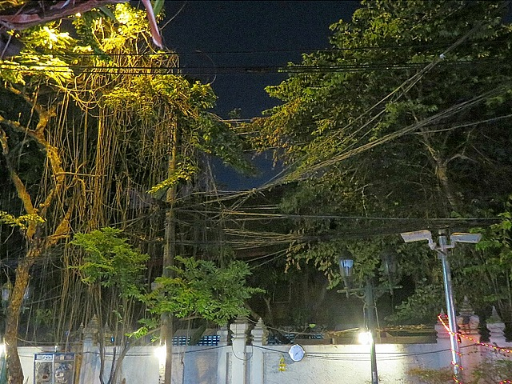

*Tremendously Safe Power Lines*

At dinner Kate rubbed chilli in her eye (not smart), tried to get it out with aeroguard (less smart). Bought a 4 pack of beer and called it a night.

Pat is still trying to come to grips with South East Asia. While it certainly doesn't smell as bad as I imagined, there was still something keeping me from relaxing and enjoying myself just yet. The seemingly endless temples were beautiful, but they were also crowded with tourists. I suppose that's what people come here for. Well, that and the cheap beer!

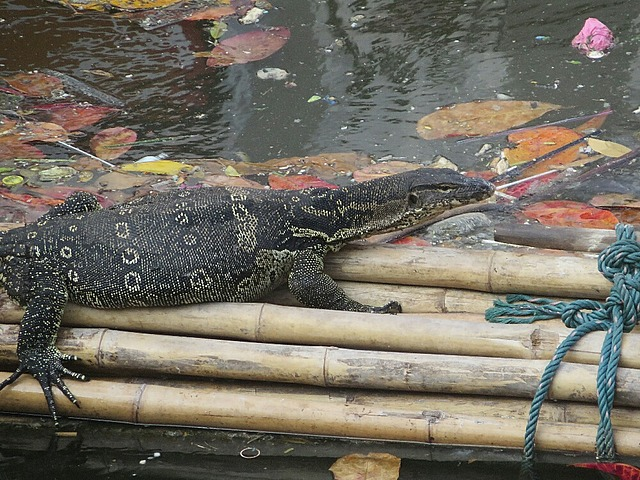

*River Lizard Laying Out*

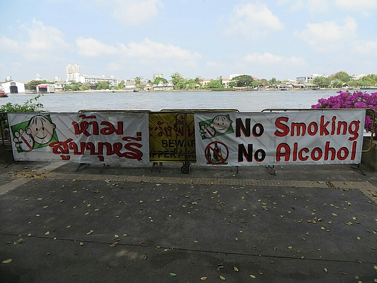

*No Alcohol for White People, Apparently*

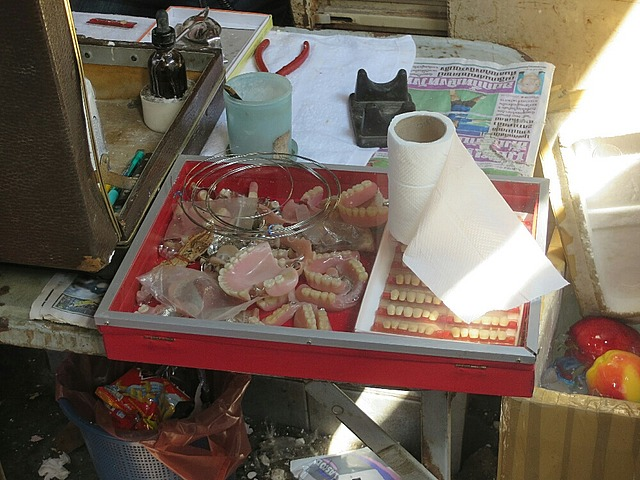

*Super Hygienic Dentures*

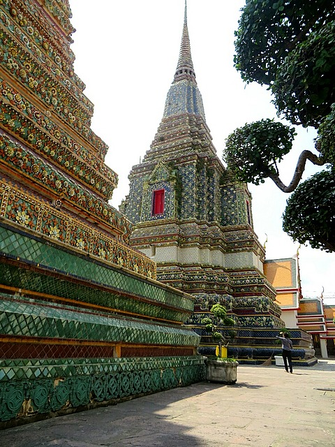

*A Temple in Wat Pho*

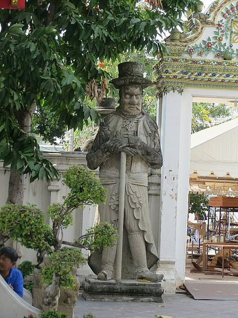

*This Guy*

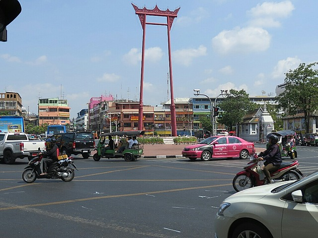

*Giant Swing, Giant Disappointment*
