After an early start this morning, we headed straight to the Golden Mound for a climb. Walking along the river we watched people set up their stalls. There were lots with whole fried fish etc out already- maybe from last night and will probably sit there all day. We reconsidered our position from yesterday, maybe we won't try street food today.  
   
When we started to get close a man stopped us saying the protest zone was ahead and there was no access to the Golden Mound today. He suggested other Buddhas we could visit - maybe the Standing Buddha? Kate, now suspicious of dodgy city tours, said no thanks.  
   
On we trundled. About a block further along we came upon a huge protest zone - the road to the Golden Mound is closed. We should have trusted that man! He didn't have a lanyard! Have we learnt nothing!?! We pause and wonder if maybe this will be like the top of the Eiffel Tower and we're doomed to never get there. We rally. 'Avoid protest zones', what does the Australian Government know?? We decide to go alongside the protest zone down the street and try to get in from other direction (sorry Mum).

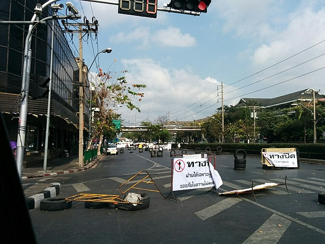

*Blockades Near Protests*

All the stalls we passed with tourist shirts yesterday have protest shirts today. These guys really move fast! After a bit of aimless wandering and backtracking- success! We got into the mound complex. We climbed up and enjoyed the nice city view. Very pretty.

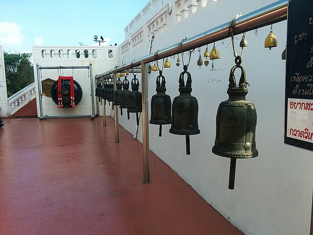

*Bells on Golden Mound*

On the way back we decided not to tempt fate any further and found a return route bypassing the protests along a small river through local residences. It was nice to see some Thai people in Thailand. We stopped for breakfast served by a cranky lady boy and headed back to the hotel to get ready for the day.  
   
We tried to get a taxi into town to visit the electronics market (Pantip). It was a struggle. The hotel staff had to bargain with the taxi driver to take us into town at all. Despite being a Sunday, traffic is mental. Gridlock everywhere. But we arrive.  
   
The electronics market lived up to its name. 5 story tall building filled with all sorts of fake iPads, phones and tablets. We didn't end up buying anything as it all looked just a touch too dodgy for the price. We tried to walk to Paragon Mall and Siam Centre downtown but were foiled by protests. This is the first time there have been people, not just barricades. We backtrack and try another route. 30 minutes later we are foiled again by more protests. We give up on the CBD and catch the Skytrain back.   
   
The train takes us over major protest areas- the first totally deserted except an army person posted every 15 metres or so. In the next protest zone there are hundreds of tents in a massive square surrounded by road closures. It seems to be a very effective, non violent way to protest. It's certainly hard to ignore.

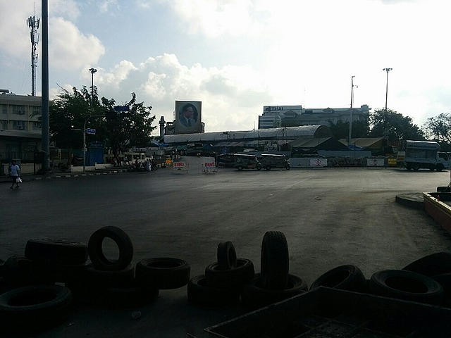

*Empty Streets Around Protests*

After the train we had to get the boat back up the river to get to the hotel. There were stalls selling tourist tickets on the docks for 40 baht, but once you got on the boat it was only 15. The staff at our hotel warned us about this so we didn't shell out the extra dough, but we felt a little bad for all the other white people ripped off. Almost $1! Each!!

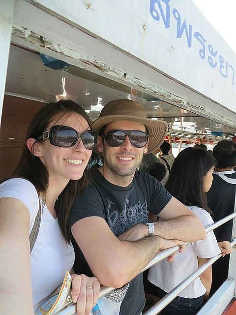

*Alive on Boat Back to Hotel*

The boat ride was very crowded but we didn't die, so we'll call it a win. However this public transport adventure took longer than expected and we're now running short on time to get to the rooftop restaurant for sunset.  
   
We jump in a taxi but TRAFFIC!!!!!!!!!!!!!!!!! For the love of God, so much traffic. All major intersections and roads are blocked by protests, forcing all traffic onto narrow surface streets, not designed to handle the entire city's transport needs. We wonder whether the average Thai person supports these protests or just finds them a huge inconvenience.   
   
We pull up to the hotel that houses The Banyan Tree Restaurant just as the sun was hitting the horizon and race through another hotel, up a lift and up a few flights of stairs to get to the to the rooftop in time. Made it with minutes to spare.  
   
Unreal views of the city. Panoramic views in every direction. Pollution creates a beautiful sunset. The place is very pricey, but it's also amazing so we decide to supplement the Amazing Race gift with some of the spending money gifted by Kate's Uncle Hugh, Aunty Di and cousin Dean to have both cocktails AND dinner.

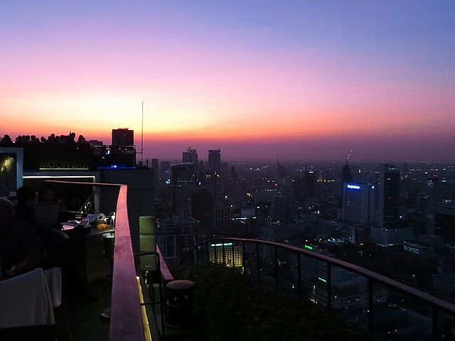

*Sunset Over Bangkok*

Kate ordered "Wild Trout Salmon", which, disappointingly, was just salmon, not some awesome trout-salmon hybrid super fish. I had an amazing steak (Waygu), like best steak I've ever had amazing. We were given a special drink to celebrate honeymoon (the 'moon romance').   
   
From the rooftop you could occasionally hear shouts and chants from the protesters below. It was an interesting juxtaposition of the protestors below fighting for democracy and the rich white people up here eating expensive food and drinking dry gin martinis.  
   
With some difficulty we found a taxi willing to drive us home, each ride we end up paying more than the last. Initially we thought this was the best taxi yet with actual seatbelts! But when he decided he'd had enough and drove around the barricade, through protest zone where everyone was wearing bullet proof vests, the seatbelts started to feel less safe and more like an impediment to escape if something escalated suddenly.  
   
Exiting the barricades and getting back to the hotel was a relieving end to the evening.

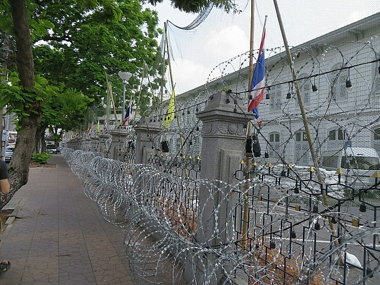

*More Barricades and Razor Wire*

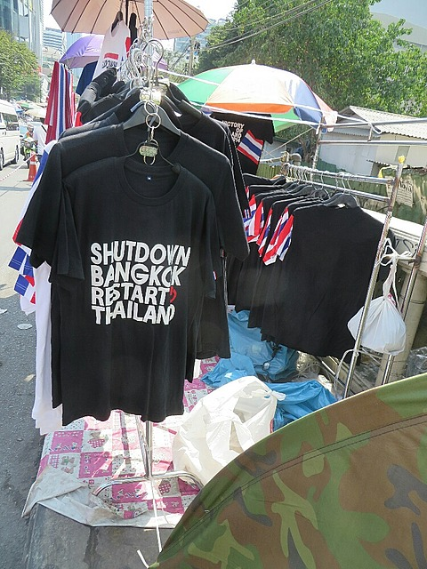

*Protest T-shirts*

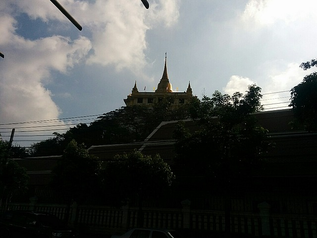

*Bad Picture of the Golden Mound*

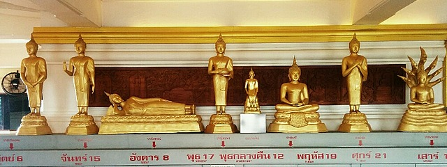

*Buddhas for the Days of the Week*

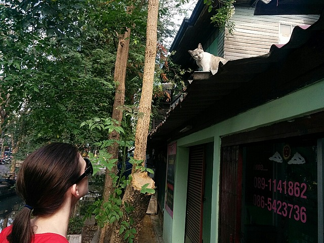

*Kate Making a Friend in Thai Suburbia*

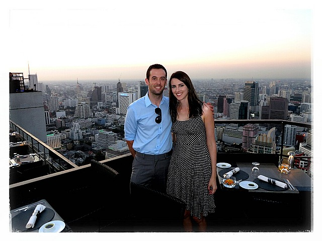

*Us at Vertigo Bar*

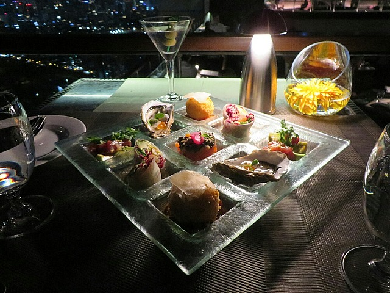

*Entrée and a View of Bangkok*
