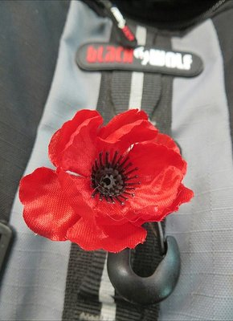
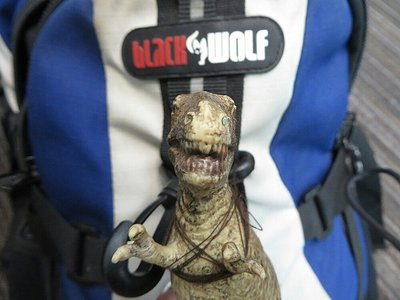
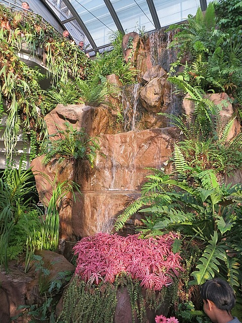
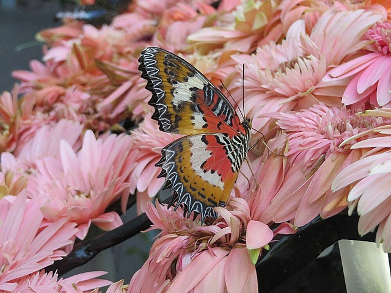
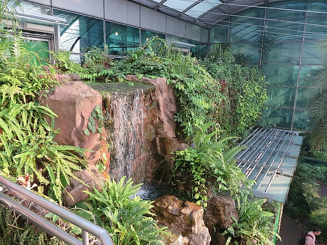

After a hectic rush to get to Adelaide Airport and a failed attempt at the "it's our honeymoon, can we have a free upgrade to business class?" ploy, we have arrived in Singapore airport for what was supposed to be a short 2 hour layover before our flight to Bangkok.  As it turns out, our connecting flight had been cancelled a while ago and no one bothered to tell us about it!  So now we are stuck in Singapore until 6:00 tomorrow morning 😢

*Kate's Travel Companion*

We only noticed the change after we had checked in, cleared immigration, and went to the lounge in Adelaide to have a celebratory glass of champagne (it certainly pays to be a frequent flyer). At this point it was too late to speak to Virgin Australia (who we booked through) as they don't have a desk in the international "terminal", and Singapore Airlines (who we flew with) refused to help as they didn't book the flight. After a phone battle with Virgin during boarding, both airlines assured us it would all be sorted out when we arrived in Singapore, just go to the desk on arrival and a note on our problem and a solution will be waiting.

*Pat's Travel Companion*

7 hours of uneventful flying later (watched Rush and Gravity which were both great) we arrived at the service desk to be met with blank stares and 'a note on what?? About who?? Huh?? Let me get my manager'.  
   
To Singapore Airlines' credit, after a long chat and a moderate wait (and a mini mental breakdown from Kate (number two for the trip so far, for those keeping score)), they eventually set us up with dinner vouchers, a room in the airport hotel, and breakfast vouchers for our troubles. So in the end it worked out about as well as it could have given the hideous layover that has been sprung on us.  
   
So for now, we are posted in the Singapore Airlines gold lounge with a cold pint of beer, a glass of French wine, a plate of chicken wings and mini cheeses. All of which Kate has spilled on herself already. Life could be worse 🙂

More updates to come, hopefully about how much fun we're having and not about flight dramas!

*Butterfly Garden in Changi Airport*

*Pretty Butterfly*

*Butterfly Garden*
