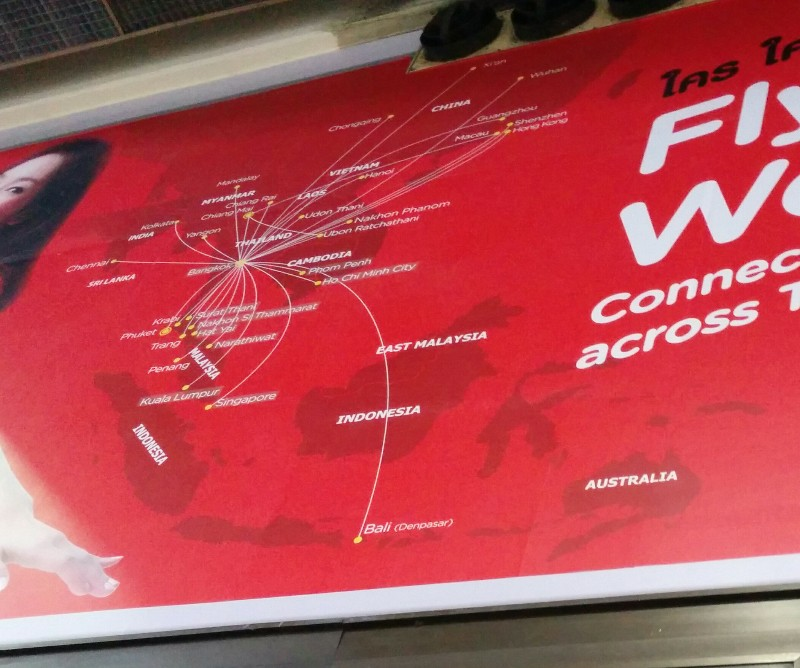
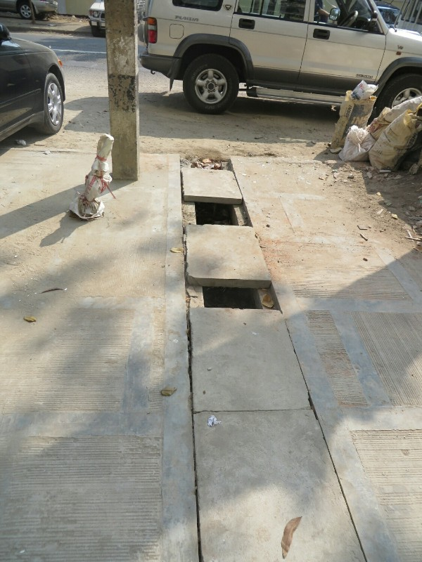
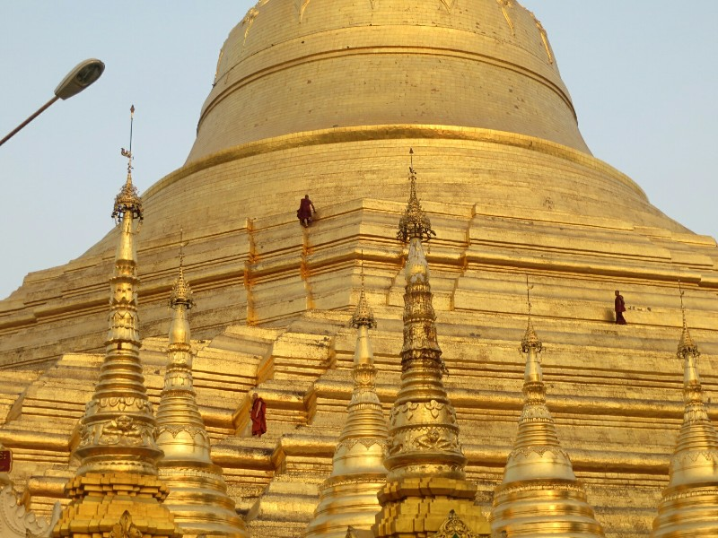
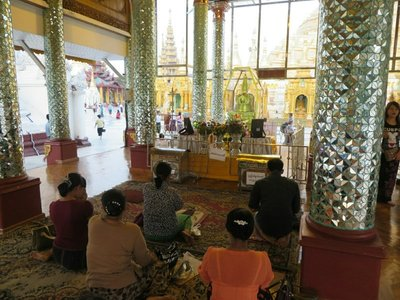
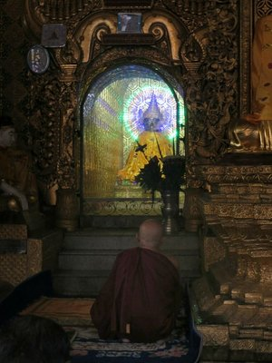
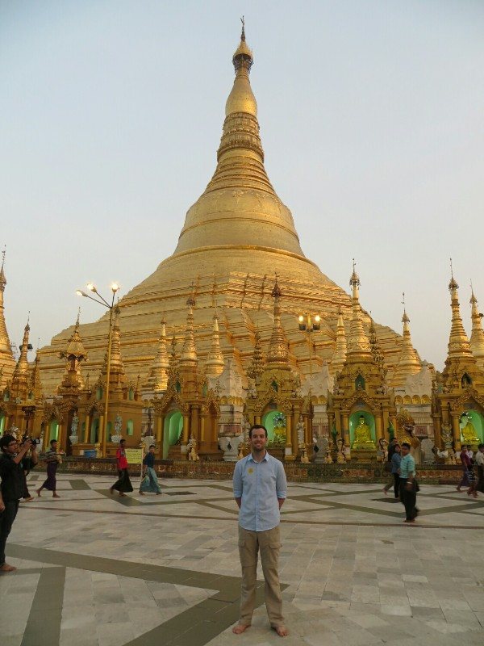
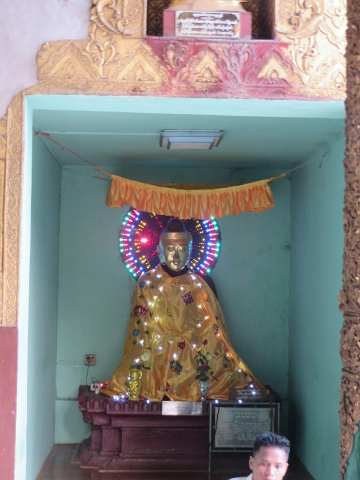
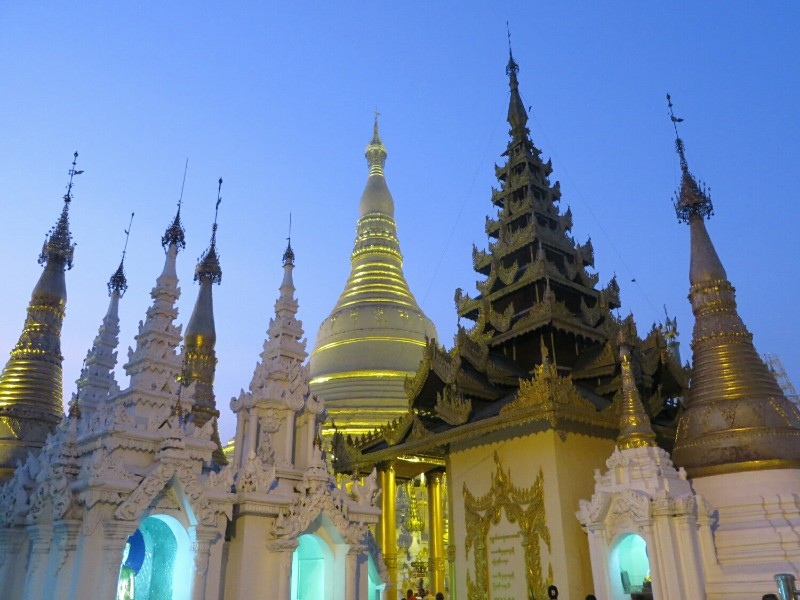

It's transit day to Myanmar! In the taxi to the airport there is no seatbelt on Pat's side - he is starting to accept that he will die here. Traffic is less bad today. The last few days observing driving in Bangkok it's gone from  looking like everyone drives crazily with no regard for the speed limit, lane lines or road rules to seeing a bit of organised chaos; you pick a speed you like then everyone gives way to everyone. You feel strangely safe.

The slowest person in the world was operating bag check. Kate, ever patient, was about to explode. I remained cool as a cucumber, as always. An hour after getting into the three person line to check in we got out and went to immigration. At the front of the immigration queue Kate and I realised we forgot to fill out our departure cards. Oops. We held up the line while everyone thought of creative ways to kill us. Some kind of reverse karma?

*Air Asia's Map- I never realised how small Australia is compared to Indonesia!*

After security we celebrated our last meal in Bangkok with an authentic Thai breakfast: Sausage McMuffins. Delicious, salty, plastic food.

The flight was OK, but on arrival the man in the window seat next to Kate started pushing her and trying to climb over her to the aisle. This is while the doors are still locked and there is literally nowhere to stand. Eventually she asked him to stop it and got a harrumph in reply. During immigration Kate was furious when the same man violated the sanctity of the queue, pushing past everyone waiting and going straight to the front. Worse, people followed him and formed a renegade line. Then immigration served them ahead of the original, genuine queue!! Outrage.

On the other side we were picked up by very nice man from the travel agent we used to book the local flights (OneStop, I'd highly recommend them to anyone visiting) in a nice new, air conditioned car. There's not even a pretense of seatbelts here. In Bangkok they have the belt without a place to plug it in. Here we got nothing.

At our hotel we tried to pay for our room but they refused a lot of our USD because they had been folded previously. Pat couldn't believe it. What's worse is Kate was right. She told me this would happen weeks ago and suggested we trade them for newer ones. I said that was ridiculous and refused. Sigh. Eventually we found a few that were "acceptable". Kate silently gloated. Or maybe a bit out loud.

On the way to lunch we passed a construction site with a "safety first" sign on it. Just past this we observed guys hanging off the 20th storey supported only by their own strength, no safety gear, hammering into the walls. Good ol' Asia. Yangon smells more like Pat expected Bangkok to smell; everything smells like poo. The footpaths (where there are footpaths) are built over sewers and are quite rickety with random gaps. Kate spent the whole day terrified of falling in.

*Easy access sewers! No ninja turtles here, just poop*

We ate at local cafe and as the only white people we felt totally out of place. The food was pretty good but we were intentionally overcharged which put a dampener on proceedings. Damn our lily white completions!

For an afternoon activity we visited the Shwedagon Pagoda, the most sacred pagoda in Myanmar. It apparently houses relics from four of the past Buddhas. They claim it was built 2600 years ago when two travelers met Buddha, were gifted with 8 of his hairs (new idea for cheap Christmas present?) and needed somewhere to put them. Archeologists think it's more like 1600 years old. Still... pretty old. And a massive amount of history associated, from the Portuguese stealing gold to make cannons in the 17th century, to the British turning it into a fort and trying to store gun powder in it during the colonial period, to monks peacefully protesting there against the military government and being beaten and shot at in 2007.

*Monks only on the Pagoda! Such favouritism*

Also very impressive is the 76 karat diamond it's topped with. Phew!

It was a very beautiful and ornate pagoda in a huge complex. There were some western tourists, but I think more visitors were from Myanmar than anywhere. I especially enjoyed a temple full of people praying to a replica of Buddha's tooth (not even the actual thing), and Pat had fun with the neon lights decorating all the Buddhas.

*Praying to a replica of a tooth (anatomically wouldn't get you a pass in wax carving BTW) and a solemn monk praying to holy Neon Buddha*

After the pagoda we had dinner at Feel, a restaurant recommend by the hotel staff as being authentic Mayanmar cuisine. We weren't disappointed. A very helpful waiter walked Pat through all the options and helped him pick some delicious curries. The meal also came with complimentary soup, salad and dessert. For $5 it was a really good feed! Before coming we heard all sorts of things about how oily and fatty Mayanmar food would be, to the point they recommend people with heart disease try to find Western food instead. And they were right. But it's damn tasty.

*Pat and the Shwedagon Pagoda*

*More neon Buddha*

*Shwedagon Pagoda Complex after sunset*
