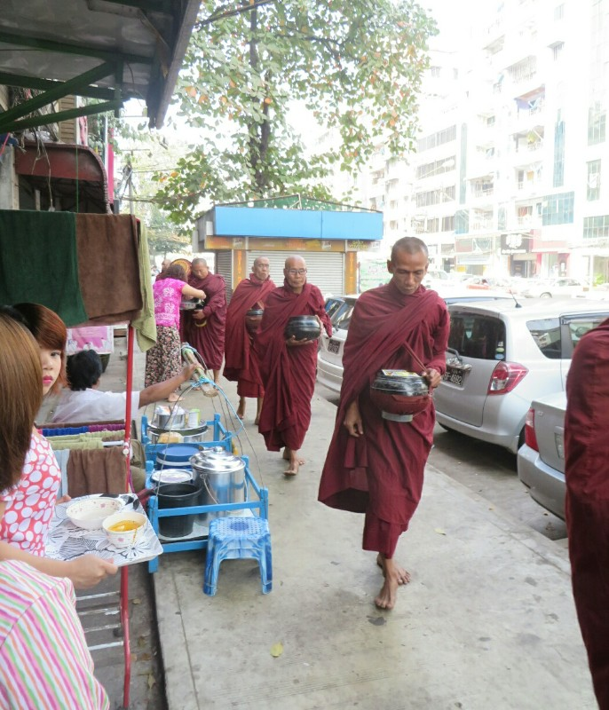
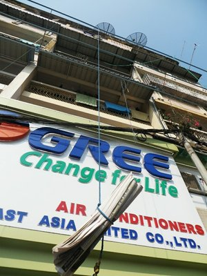
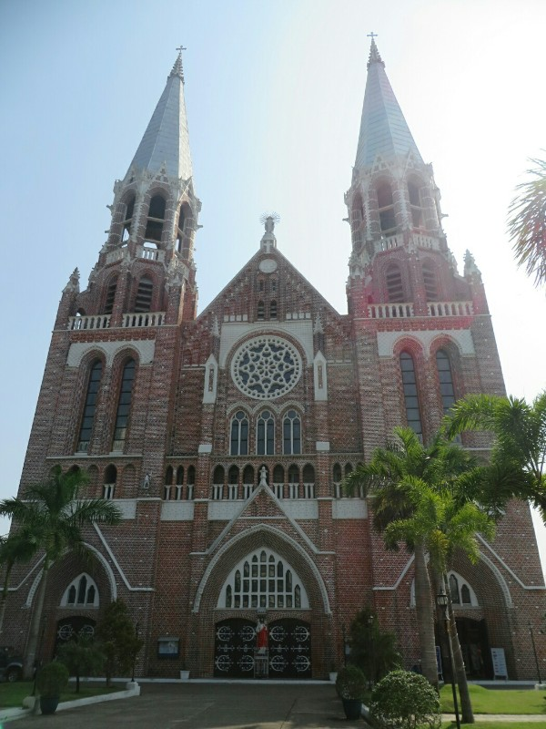
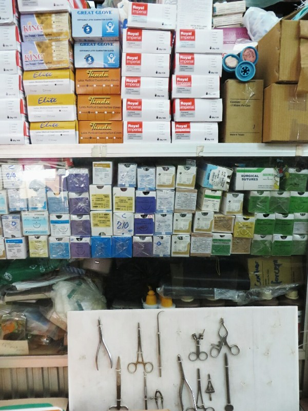
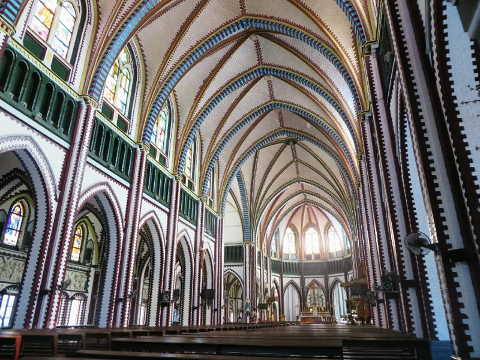
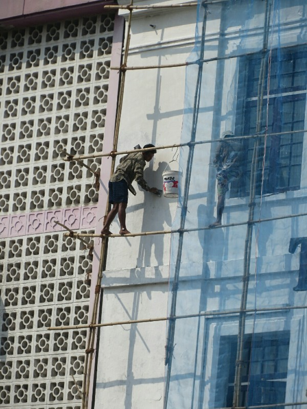

The road out front of the hotel was surprisingly noisy given lack of daytime traffic. Kate fell asleep to, and woke up to a man walking up and down the road yelling something that sounded like it belonged in The Lion King (a wim a wey?)

We had breakfast at hotel which wasn't fantastic but whatever. It included rice, watery beans, eggs, toast and grossly undercooked bacon. Minus taste but plus energy. We then went to the bank and managed to exchange some of our folded notes , albeit at a lower exchange rate. We lost $1.50! Outrageous. Here followed a little 'silent' gloating from Pat.

*Procession of monks*

We wandered out onto the streets of Yangon. A line of monks passed us on the street for their morning alms. People gave them rice and other bits of food. They gave us a booklet about the teachings of Buddha which was quite interesting.

One of the monks was walking with a crutch and had a huge notch in his left temple like someone hit him hard in the skull with a post as a child. It was quite upsetting but he seemed to be in good spirits.

All of the school aged kids said "hello" as we passed them, and they giggle and smile as we say hello back. There were newspapers hanging from strings attached to windows of high apartments, save the hassle of coming down to check your postbox?

We walked to St Marys church, a very large, ornate, brick church which doesn't appear to fit in South East Asia at all. It has some new stained glass windows which were installed a few years ago and small birds flying in through the remaining open windows chirping inside the church. It was built during the English colonial times, apparently there's still a 15% Catholic population in Yangon. (As an aside, there are also 8 Jews. Isn't that specific?)

We sat in the pew to admire the building and enjoy the tranquility when some Japanese tourists started to take our photo on their phones. They started off sneaky, but when we noticed them they gave up pretense and just started going for it. We left shortly after them, and had the same experience with the same people out the front of the church! This must be how celebrities feel. Instagram here we come!

*This will go down in history as the place the illustrious 'Kate and Pat' were Discovered*

Next we wandered towards markets. On the way we met a random man who helped us cross the streets (unlike Bangkok where they stop for pedestrians if you step onto the road, they just beep and speed up here. Pedestrians also never have right of way, even if the little man is green. It's a bit hectic). He told us about Yangon and other things to do in Myanmar, and told us about his family. He offered to take us to a local market and suggested we look at his friend's stall. He was nice helping us cross the streets and was at least being upfront about the reason he wanted to take us to the market, so we decided to go along. Kate bought a long skirt for a couple of dollars from the man's friend to wear to the temples. Everyone was happy.

The local markets were really interesting- aside from an aisle of clothes shops they were absolutely full of  pharmaceuticals and medical instruments. Who shops here?? After seriously considering buying a kit to intubate someone prior to a GA we headed to the tourist markets. Full of gold and jade. Too expensive.

*Gloves, sutures and surgical instruments. All perfectly sterile, I'm sure*

We walked through a huge fruit market with delicious looking produce in China Town to get to the CBD. We had a quick bite to eat then looked around town a bit. Yangon is a city of eclectic architecture; colonial buildings from the British next to ancient Buddhist pagodas next to decaying buildings damaged in World War II (or more recent protests) next to huge new malls plastered with massive posters for Korean beauty products next to dodgy building projects. It's times like these you need Ted Moseby.

The day got very hot at some point, so we headed to the hotel and had an afternoon nap.

After a hard few hours snoozing we decided we'd earned dinner. We went to quite a nice place called Monsoon and had some cocktails, a couple of curries and tempura veggies. All really delicious, although the lady hacking up her lungs at the next table detracted from the ambiance a little. After dinner we headed to the hotel for more much needed rest.

*Inside St Mary's Cathedral*

*Safety First- Balancing on a rickety frame to paint a high rise*
