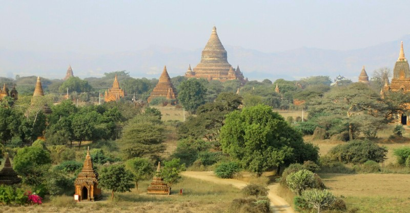

We had a VERY bad nights sleep, especially Kate who was a cranky pants at 5am when we had to get up to go to the airport.

The Yangon Domestic Airport was chaotic to say the least. Little organisation, no info about which gate our flight left from, no gates for that matter. Just a big room with unintelligible shouting over the PA system and guys holding signs shouting about flights in Burmese. Somehow we got on the plane. Definitely no thanks to Kate- I was unhelpfully snoozing.

Our flight with Air Bagan was fine. The plane was tiny but the staff were friendly and we got croissants and fruit. Needed the sugar hit. Don't tell my patients I said that.

At the airport in Bagan we had to pay a $15 per person fee to visit the archeological zone. Queue dramas with folded currency. Grumpy, under rested Pat decided he could play that game too and turned back the first notes offered as change due to completely unacceptable creases. First world anarchy- very satisfying. Once we got through that ordeal we were picked up by Thien (a guide Kate found on Tripadvisor) and Wen (his driver) in a clean car with air con, free water and face wipes. Thien was very nice, polite and knowledgeable. It's a shame we were so tired, snappy and unbearable.

For the rest of the day we went on a marathon viewing of pagodas and temples (ones you can't go in and ones you can respectively). If you are not interested in these things, skip the next entry, you will find it very tedious.

