First stop was Shwesandaw Pagoda, built in 1057 by a fellow called King Anawrahta. We climbed to the 5th storey and Thien gave us a little history lesson.

So. Bagan has been around a long time but things only got busy in 1044 when Anawrahta took the throne. He:

- Founded the kingdom of Bagan and made this area the capital

- Was converted to Buddhism by a chap in the neighboring Kingdom

- Invaded said neighboring Kingdom and stole their ancient, precious Buddhist scriptures and Buddhist relics

- Forcefully converted the entire population to Buddhism and

- Oversaw the start of what became a few hundred years of building temples and pagodas, including this pagoda (where he stored some stolen Buddha hairs).

Busy guy.

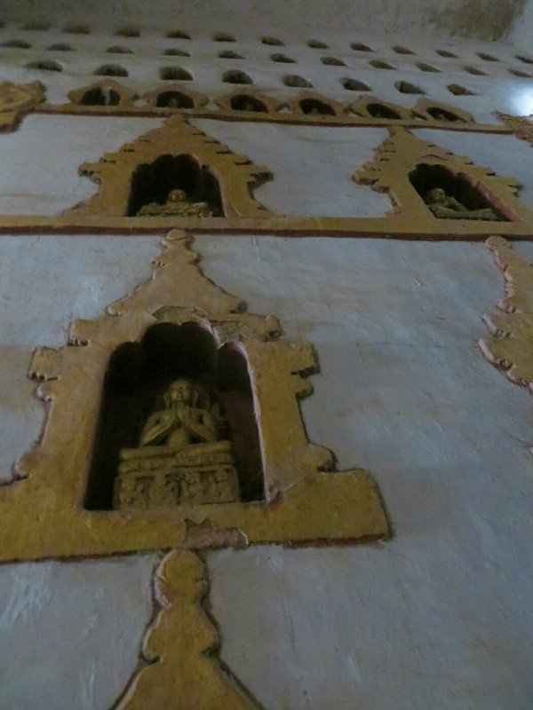

*Buddhas- we saw a lot today*

Bagan fell to the Mongols in the mid 1200s, by which point there were over 10,000 temples. The locals still hold a grudge against the king in charge at the time and call him "Tayok-Pyay Min" which translates to "The king who ran away from the Chinese".

There are about 2000 temples still standing although many have fallen into complete disrepair, especially since a big earthquake in the 1970s.

History over.

The bottom of the temple was crawling with kids trying to sell postcards and pictures along with stalls selling clothes and crafts. We tried the 'maybe later' tactic and jumped in the car as quick as possible.

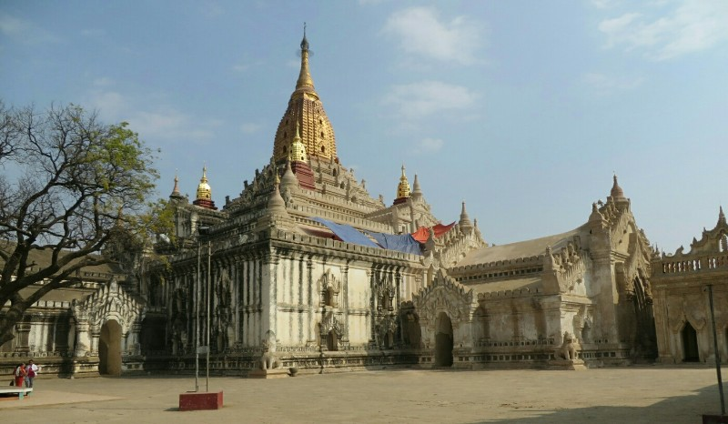

*Ananda Temple half cleaned. They predict they'll finish cleaning in 2018. Big job*

Stop 2 was Ananda Temple, built in 1105 by King Anawrahta's son. On the way in we saw what we thought was men repainting the walls, but later discovered they were removing a plaster covering placed to hide the original wall murals because people kept cutting sections of the mural off the wall to take home.

The temple houses 4 standing Buddhas who face North, South, East and West. Two of them look Indian and are apparently the originals, two look Chinese and are recreations after the originals were damaged. A lot of the Buddha statues get damaged and vandalised because precious gems and money are often stored in them and people are greedy. There was actually a long story about a massive diamond that used to be on one of their heads  which the Burmese believe was stolen by a Frenchman who became a monk to infiltrate the temple, then killed the other monks and ran off with it. He was then eaten by a tiger and over a few hundred years everyone who came near the diamond died a gory death. It's now in the Smithsonian (the Hope Diamond), so the diamond is real, but it's origins in Myanmar are perhaps questionable.

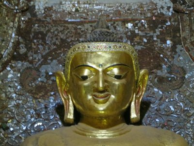

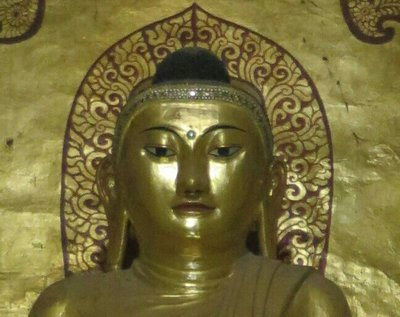

*Original Indian and replacement Chinese Buddhas*

Linking the Buddhas there are two sets of 4 corridors forming two squares (an inner square and an outer square) with hundreds of Buddha images set in the walls. Thien showed us one set of statutes wrapping the whole way around the temple that tell the most recent Buddha's story from reincarnation, birth, leaving his worldly connections and possessions (including his position as prince, his wife and his son) and finding enlightenment.

A lot of the Buddhist teachings are pretty appealing, like avoiding anger, greed and indecision and the emphasis on giving and remaining unattached from things you can't take with you after death (ie. everything except karma). I am on board with avoiding attachment to physical possessions, but I'm not so sure about avoiding attachment to other people. Thien said that's why we have so many lives, too hard to get it perfect off the bat.

On to the biggest temple in Bagan, Dhammayangyi, built by 'The Evil King' in 1167. He definitely earned the nickname- he murdered his father and brother to ascend to the throne, then had a whole load more people killed directly and indirectly through his reign. In the end after 3 years at the helm, Indian mercenaries assassinated him for killing his wife, an Indian princess. The layout of Dhammayangyi was very similar  to Ananda but the inner square of corridors and area where the Buddhas normally sit was all bricked off. Apparently no one knows what's in there, Thien thinks it's the evil king's body. He also said there was a maze upstairs he used to play in as a kid, but it's also sealed off because the temple is cracking and it's too dangerous mehmehmeh. Pfft.

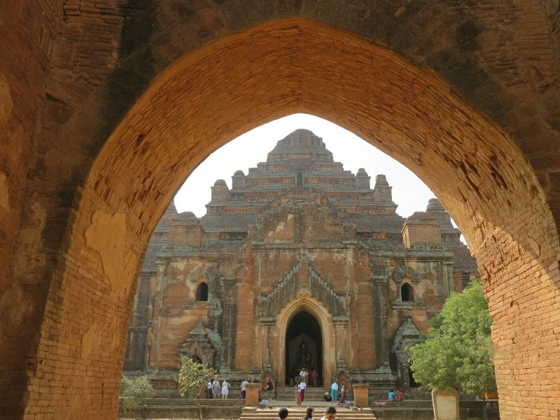

*The Evil King demanded the bricks be laid so close together he couldn't get a pin between them, anyone who failed to meet these standards had their hands cut off.*

Pat and Kate were starting to get very tired and overwhelmed with information, probably the same feeling anyone reading this has.

But on we went! We passed the ruins of the old city wall into Old Bagan. We took a couple of pictures in front of Thatbyinnyu, the tallest temple in Bagan but didn't go in.

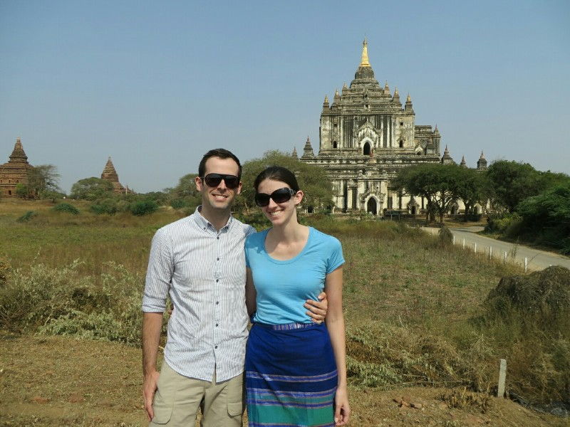

*Out front of Thatbyinnyu, the tallest temple in Bagan*

The only pagoda we visited within the city walls was Shwegugyi, because you could climb a narrow staircase to second storey. It was also positioned next door to the ancient palace foundations which are being excavated.

We headed out of Old Bagan through Tharaba Gate (built in 849, before all the temples), the only city gate of 12 still standing. The gate survived, we're told, because it is protected by two ancient nats (aka spirits) worshipped before the introduction of Buddhism. There are statues of them, a brother and sister, on either side of the gate. The story says the brother (they call him Mr Handsome) was a blacksmith so strong the King feared him and wanted him killed. When the King came for him he fled to the forest, so instead the King found his sister. The sister (Golden Face) was so beautiful he married her and told her to call her brother back as now he could hold office and help protect the kingdom. Unfortunately when the brother returned the king had him tied to a tree and burned to death. The sister was so distressed she jumped in the flames and died too. From then on anyone who came near the tree had bad fortune because of the angry nats. So, they cut it down and threw it in the river. It floated to Bagan where the spirits asked the local King for a resting place. He had the tree placed on a sacred mountain (Mt Popa) and statues of them built and placed in the gate.  In return the happy spirits protect Bagan. Especially vehicles we're told- anyone with a new car, or cart, or bike, or hot air balloon brings it to the gate to get the spirits' blessing.

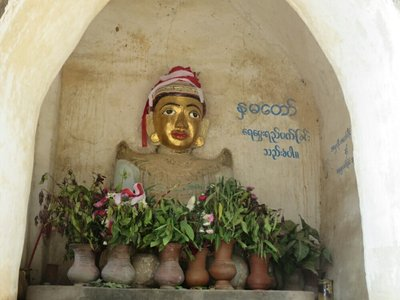

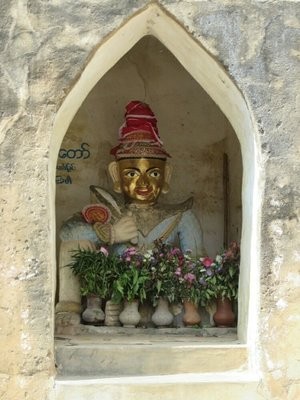

*Golden Face and Mr Handsome*

Next we stopped for lunch at Eden BBB (Best Bagan Burmese). Very tasty and very much needed. Then we got to have an hour nap. Perfect.

Post nap, reinvigorated, the tour continued.

First afternoon stop was Shwezigone Pagoda. This pagoda was also built by the first Buddhist king, Anawrahta. The position was chosen by a white elephant carrying a Buddha relic gifted to, or stolen by the King (depending who you ask). It was a beautiful Pagoda, the photos don't do it justice.

Here Thien told us about the different levels of merit/karma you can get for different offerings. Third best is food (like giving alms to the monks), second best is water (there are pots all over Bagan in public places filled with drinking water for the locals), best is blood (like giving blood at the hospital). We thought that was pretty cool and very actively positive for the community for a religious belief.

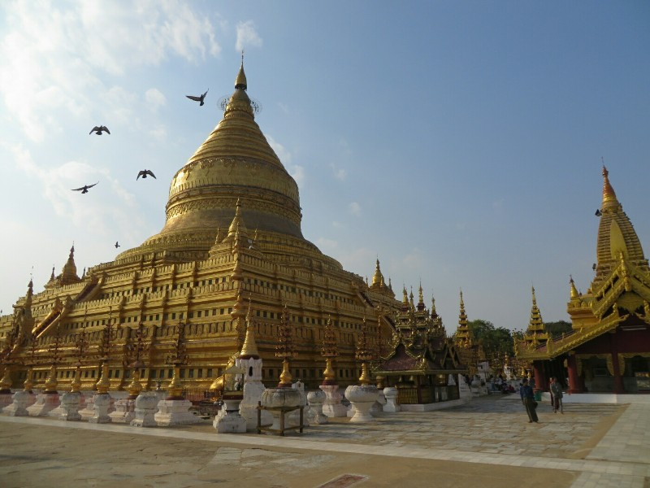

*Soooo shiny*

Also of interest at this pagoda was a building in the corner full of little figures.  Thien explained back when the King decided everyone would be Buddhist he knew he couldn't really force people to believe what he wanted them to believe, so he took the old items of worship from their homes and placed them in Buddhist temple complexes. People could still pray to their old Gods, they just had to take the new one on board too.

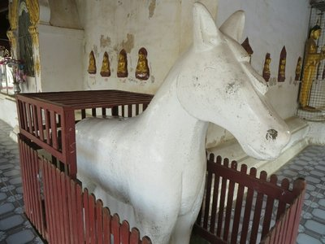

Many locals still pray to these nats, one in particular was popular because if you offer it a bracelets it will make your babies stop crying. They're also called upon to help when people are possessed by bad spirits. We asked Thien how people could believe in both reincarnation and ghosts/spirits and he sort if dodged the question. We didn't want to be rude or question his beliefs too much so we left it.

The other handy thing was a statue of a horse you could pat if you have an ache or pain and it'll be healed. The head and lower back seemed to be popular spots.

Next stop: Gubyaukgyi, a very small temple famous for it's wall frescos. The whole place is kept in darkness to prevent the paintings from fading more quickly. Some lovely tourist also came by in 1899 with a saw and chopped out half the frescos as a souvenir. I do not understand people. No respect for religion or art. Ugh.

Second last for the day was Htilominlo Temple, built in 1218. The King who built this temple was chosen to ascend to the throne from 5 brothers because when they stood in a circle with a white umbrella in the middle, it bent towards him. As good a way to pick as any. As a result, the Buddhas in the temple have umbrellas next to them.

There was also a bonus Buddha in a corner- it was found floating down the river a few years ago when the river banks broke and a temple fell into the water.

For sunset we headed back to the first pagoda we visited, the Shwesandaw Pagoda. The same kids and stall owners we met in the morning were still there, and worse they remembered us. Patrick made the mistake of giving one of them his name earlier so she followed him saying "Patrick! You said you'd look at my clothes! I've waited all day! Don't be mean, you promised!" He felt baaaad.

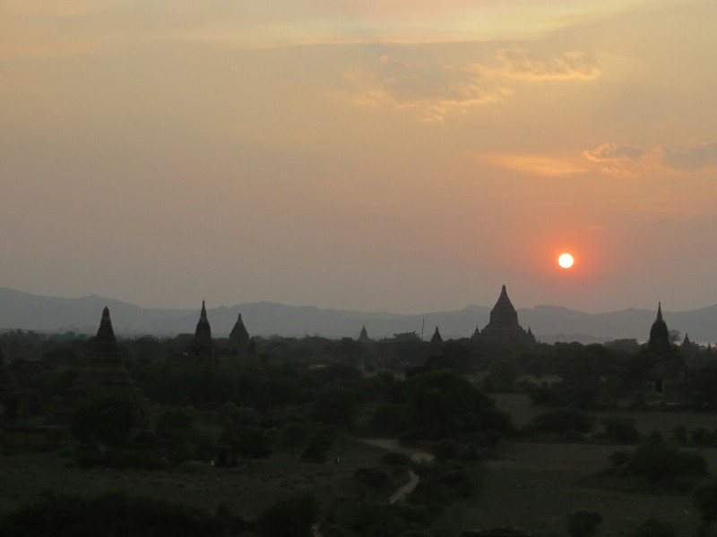

*Sunset*

The pagoda was crawling with tourists! Definitely the most popular sunset spot. We set up and took a million photos of the sun going down, none of which really show how spectacular it was.

Thien dropped us off and said goodbye. We went to dinner at a restaurant he recommended, Queens. Despite being recommended for amazing local cuisine, we caved to cravings and ordered burgers.

And so ended the longest day ever.

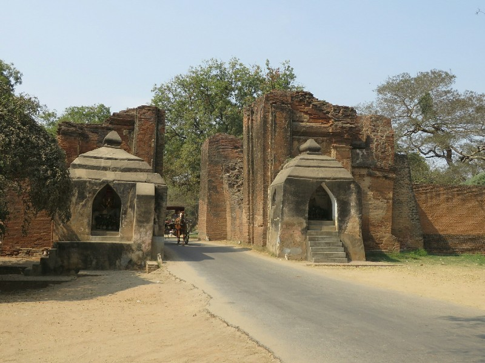

*Tharaba Gate*

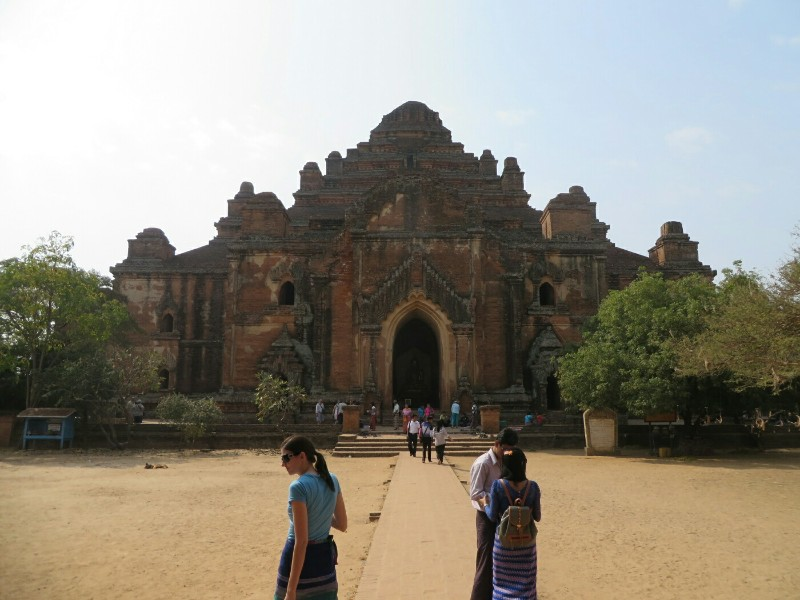

*Evil King Temple- Huge*

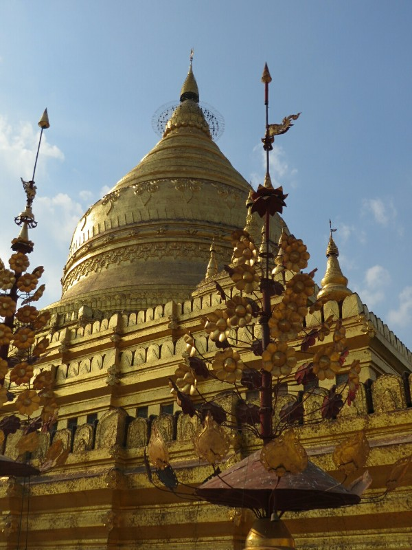

*Shwezigone Pagoda- Beautiful*
