This morning we got up at 6 to watch the sunrise from a temple nearby that Thien suggested. In our typical style, we couldn't remember its name or where it was (we left the hotel and confidently pointed in opposite directions) so ended up just having an early morning walk.

After a few fails we found a temple we thought looked right and poked around for someone to unlock the gate. Apparently we were too noisy. There was a barking from the bushes, then one by one four dogs traipsed out, had a look at us, had a stretch, a scratch then all had a cuddle and a play together. Cute.

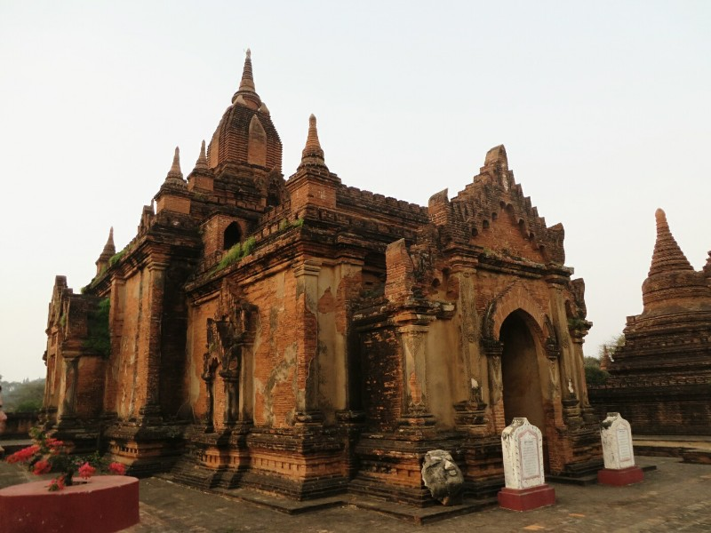

*Foiled- missed the sunrise trying to find a way into this temple*

Unfortunately, despite the racket we inspired, no person with a key emerged. So we moved on.

On the walk home we found a temple you could climb- was this the one we were meant to go to? We had missed the sunrise but we climbed up and watched the hot air balloons float across the horizon.

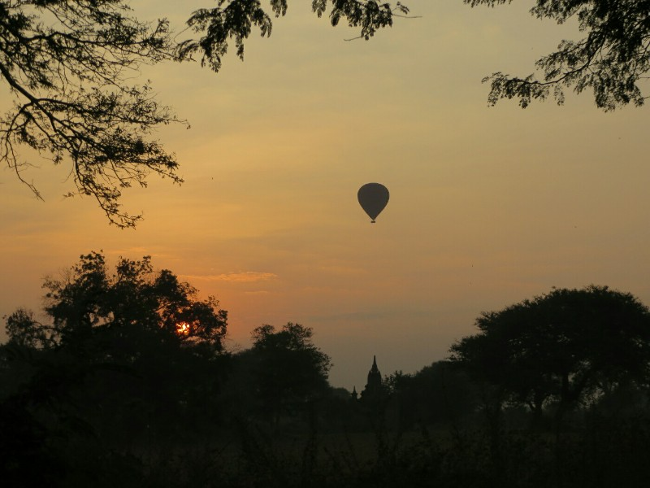

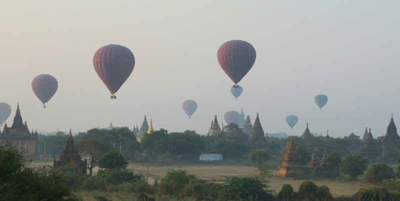

*Worth waking up for*

After an amazing hotel breakfast (seriously amazing, eggs or crepes cooked to order, continental breakfast, Chinese breakfast, Myanmar breakfast and full English breakfast food options- mmmm) we hired bikes, a wedding gift from Mandy Lewis, and rode down to old Bagan.

We passed local ladies balancing big baskets on their heads like in The Jungle Book and lots of young monks, including two 7 or 8 year olds having a pretend martial arts style fight. Very fitting with Buddhist teachings on violence. We stopped at a pagoda with a beautiful garden. There was a man sweeping the paths despite the trees dropping new leaves behind him as quickly as he swept. I would find it infuriating, I feel he was almost meditating.

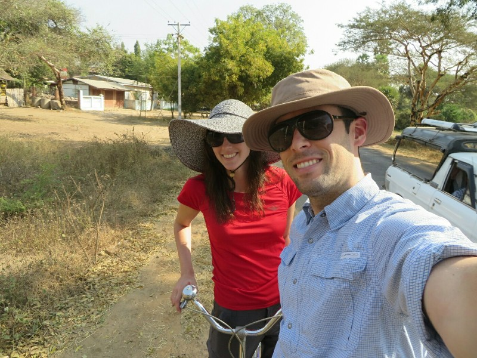

*Thanks Mandy!*

We rode past the school as it was getting out for lunch- mayhem! Trucks, cars, motorcycles, motorized bikes, carts with horses and oxen all in gridlock. Adults were picking up kids, kids were picking up younger kids... I think everyone in town was there.

Once we navigated our way through we went into a village to a small family lacquer shop. The owner showed us how lacquerware was made. His mother weaves a bamboo base, he paints layer after layer of thin lacquer on the bamboo over weeks or months until it's thick enough, his cousin and sister in law etch in designs, he paints them with dyes from India, revarnish and repeat for each colour they want to add. Takes months! It was really amazing to see the work that goes into a rice bowl!

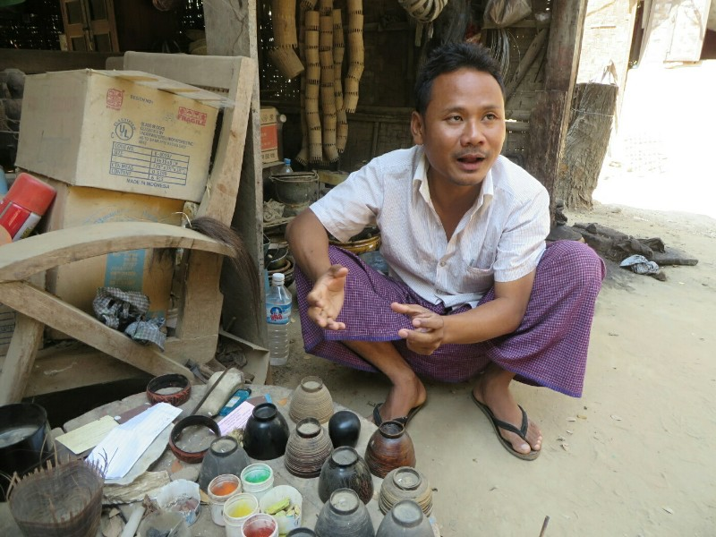

*Learning about lacquer*

We headed back out on the bikes. Our maps were useless and we got lost constantly. In Old Bagan a man giving us directions said he had the key for a temple in town and he'd let us in later for sunset if we wanted.

We headed off we thought in the right direction but were soon lost again. The bikes weren't made for dirt roads and we kept having to get off and walk when the sand got too deep and the tires got stuck. We passed through a few very small villages where no one spoke English but clearly knew we were lost by the fact we were there at all and pointed us onwards. We cleverly only brought one small water bottle on this adventure in the desert so we were parched.

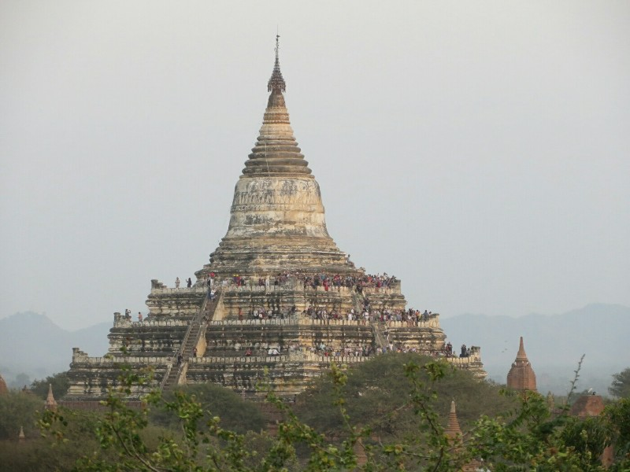

*We could see yesterday's sunset temple from Goni- packed!*

Finally, finally we found the temple we wanted to see (North Goni) and upon arrival could see the nice paved road we should have taken. Sigh. We climed up a few floors and enjoyed a great view. Some local kids hanging out trying to sell stuff to tourists showed us a set of hidden stairs to get even higher (to the 7th storey). One of the kids had a bunch of paintings so we bought one from him. Other kids were cleverly asking where we were from and asking for Australian currency for their "collection". It was cute the first time. Less cute the second, third and fourth kid.

As sunset approached the temple was flooded with tourists, vendors and kids, we decided to head (along the paved road this time). We went to the temple in town, the caretaker unlocked the gate and let us into the temple so we were the only ones there. It was very peaceful.

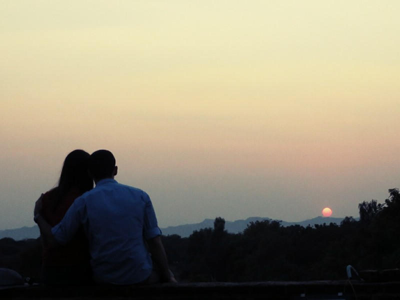

For dinner we went to a place that puts on a nightly traditional puppet show. It was surprisingly fun with a superbly talented puppeteer. He had the puppets flipping and cartwheeling without tangling the strings, at one stage a horse puppet flew across the stage and somehow stole the other puppet's pants... Great value. Also helping keep the night fun was gin cocktails being cheaper than soda water. Who are we to argue?

Someone in the restaurant was celebrating their birthday, so we finished the evening all singing Happy Birthday, and everyone got free cake.

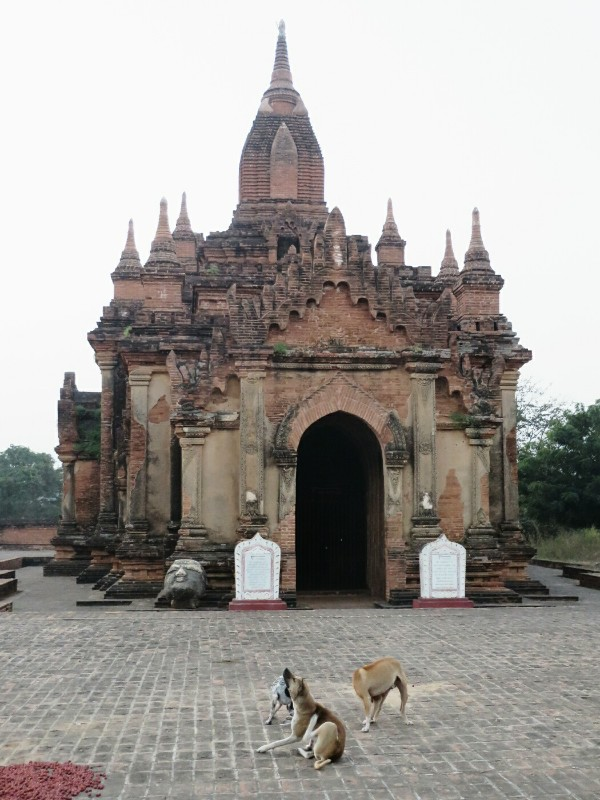

*Dogs we woke up being cute*

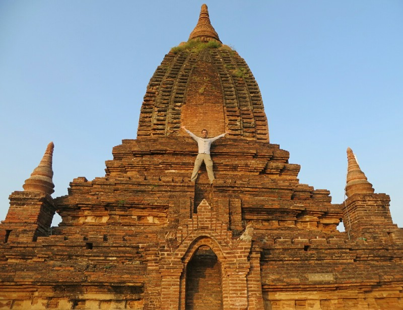

*Pat conquers Bagan at sunrise*

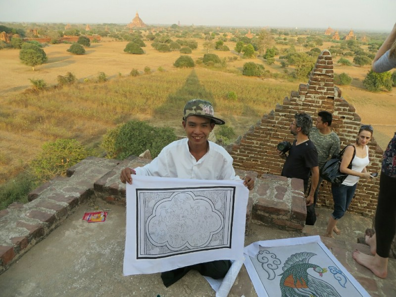

*Local kid who showed us upstairs*

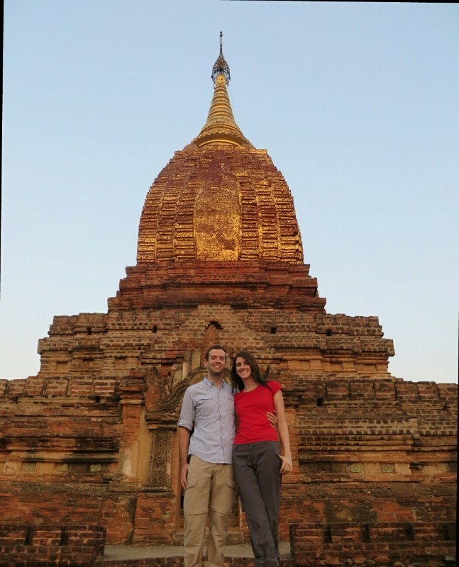

*Private sunset temple- pretty similar design to sunrise temple!*

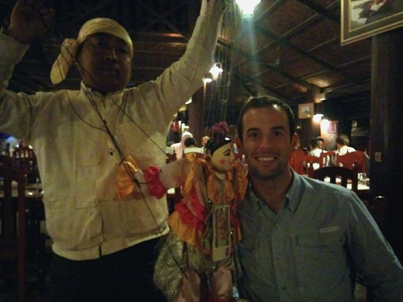

*Pat and his puppet friend*
