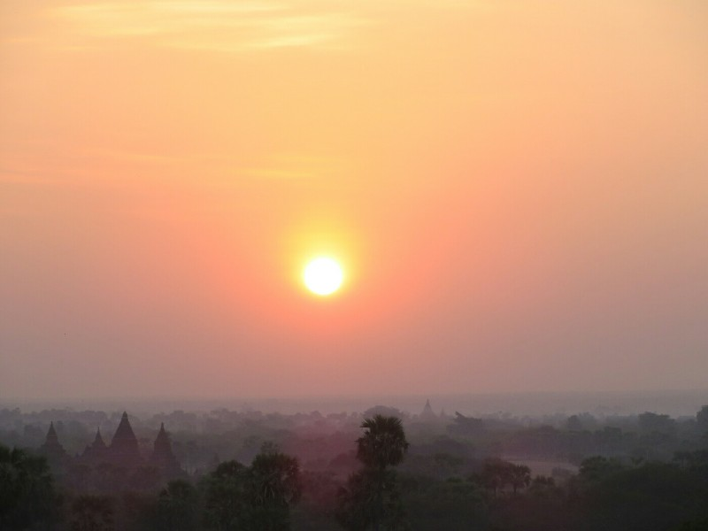
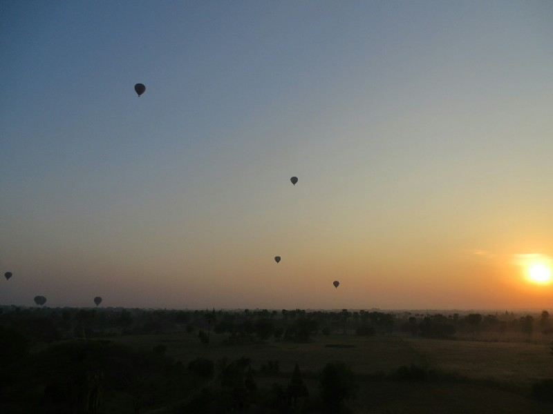
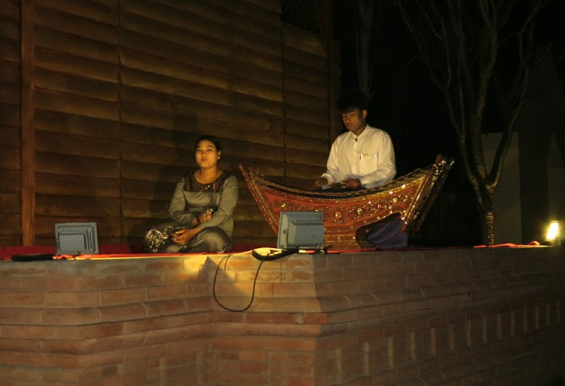

Katie woke up sick this morning, it seems impossible to go on holiday without Katie getting sick at some point. She almost never gets sick at home when she's working all the time - it's as if her body working against her, waiting for the perfect and most inconvenient opportunity to strike. Both of us are glad for Tommy's traveling pharmacy.

*More sunrise*

After our failure yesterday to catch the sunrise, we suited up and gave it another go this morning, slightly better prepared  with a definite destination in mind. Made it this time! The pagoda was a bit crowded, but we got a comfortable spot where we could watch the sunrise in peace. All of the hot air balloons were out again this morning, however several balloons didn't take off until a full 20-30 minutes after sunrise. We agreed that we would be more than a little peeved if we spent $350 each and only went above the tree line 30 min after the sun rose. The view would still be spectacular so I'm sure people's grumpiness quickly faded.

*More balloons*

Since Kate wasn't feeling too hot, we spent most of the day lounging around the hotel and reading (Kate's on The Book Thief, Pat's on Dune). We ventured out briefly for food but that was about it. Super exciting!

The hotel was hosting some big event which entailed lots of music and literally hundreds of people, looks like the entire town has come along! A bit insulted that we weren't invited.

Around dinner time Kate was feeling a bit better so we ventured out to BBB for dinner. When we arrived, we were led to a private table on the lawn lit by candlelight with Burmese musicians playing and singing just next to our table. I wish I could have claimed credit for organising a little romantic surprise for Katie, but to be honest I didn't even realise it was Valentine's day for the majority of the day. Not a great start to married life...

*Private show*
