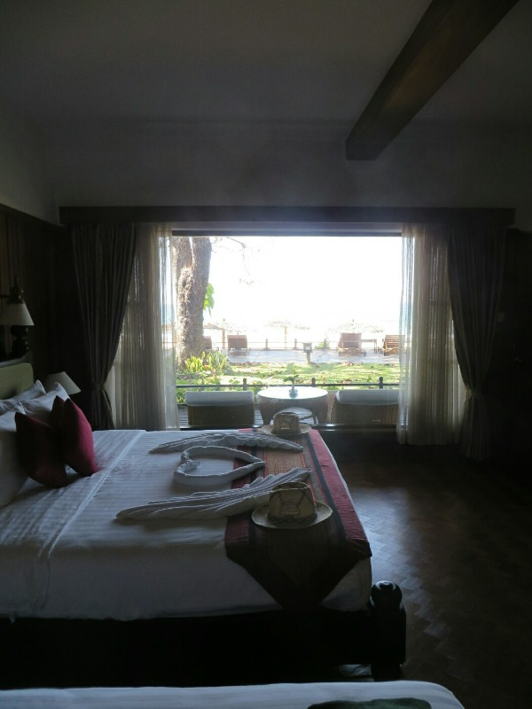
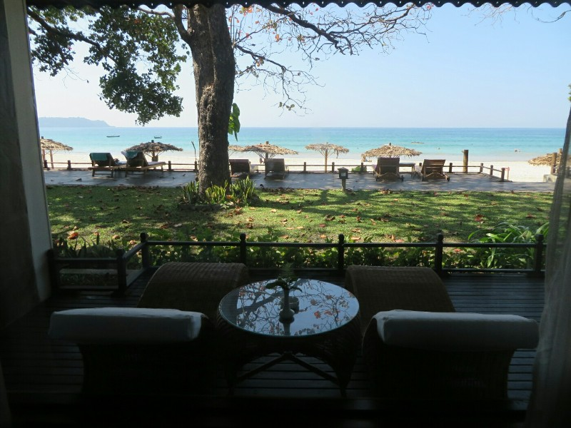

We were up at 6am for our flight to Ngapali. We arrived at the tiny airport 90 mins before departure as instructed, but we're not sure why we had to be here so early. After a half hour of nothing, security opened and everyone leaving on a flight this morning went through to the gate at once. Lucky this isn't USA style security or we would have been there all day.

On the other side there's one gate for 6 flights all departing in a 15 minute period. There's no assigned seating and no signs to let us know which flight is boarding. It's pandemonium. A wild wave of people run to the gate each time an unintelligible flight announcement is made, 5/6 find out its not them and receed to await the next one, then race back 3 minutes later to try for good seats again. Kate gets involved in the melee (good outlet for morning Kate's grumpiness), Pat sits back and reads Dune.

After a delay in takeoff then another delay at our connection, we arrive in Ngapali airport. Also tiny, also pandemonium. We had to go through immigration despite it being a domestic only airport. On the other side of immigration (the other half of a 6x6 metre room) there were desks set up for lots of the resorts but not ours. We walked out of the arrival room and were just dumped out onto a dirt road. No sign of where our luggage could be found or where one might find a taxi. We stood there looking lost until someone from one of the other resorts asked where we were staying and said someone from our resort would be waiting for us just down the road in the carpark and would get our bags for us.

Success! We got into a funny old mini bus that reminded Pat of the college gas truck. After a rough ride down a dirt road (we passed them building a new paved road over half of it by hand) we made it! We arrived to a cold towel (nice) and a glass of cold orange tea. Instead of the usual standing at the counter while they check you in, they had us sit in a comfy couch while they did their thing behind the desk.

And then relaxation. Ahhh.

*Our room- free sunhats included!*

*Absolute beachfront cottage.*
