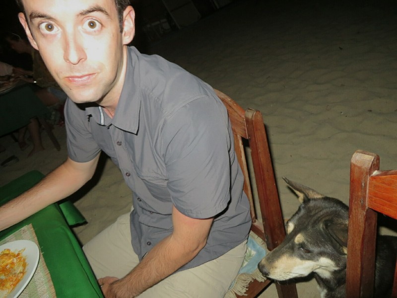
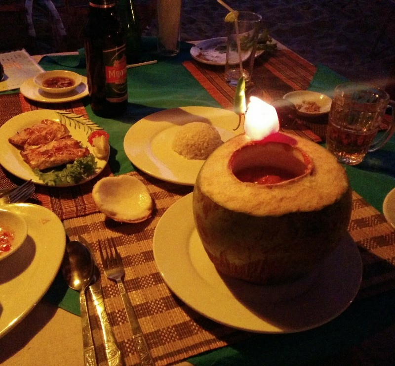
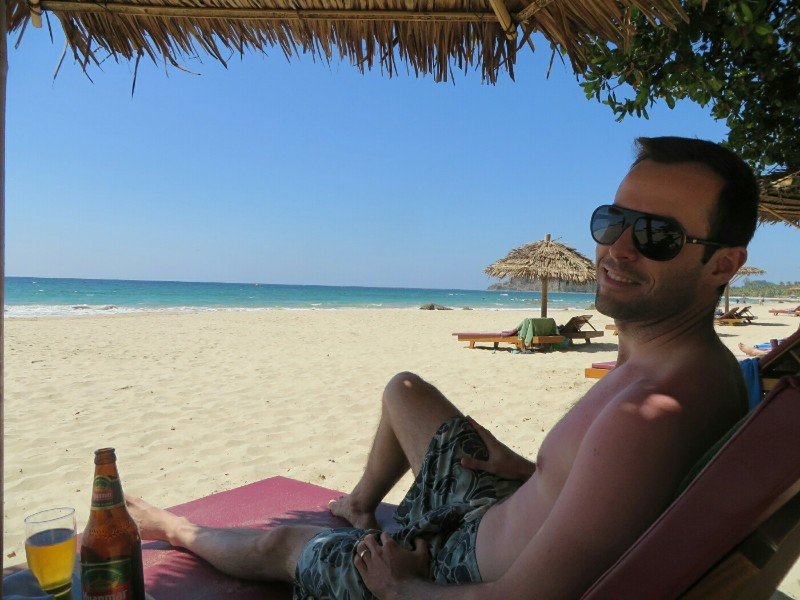
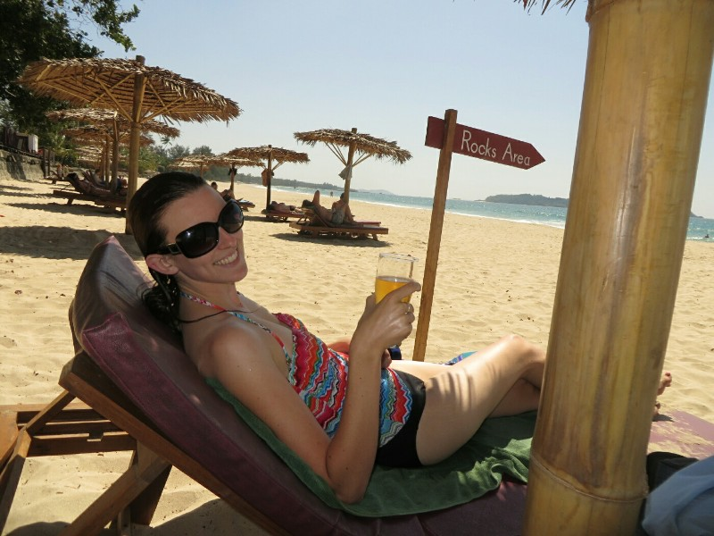
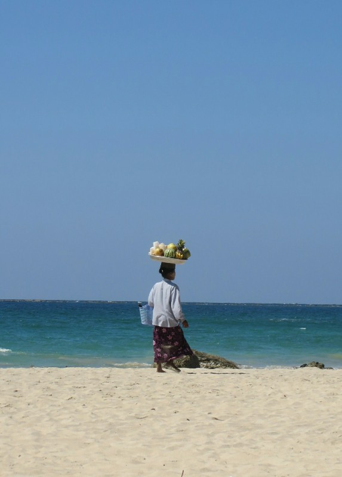
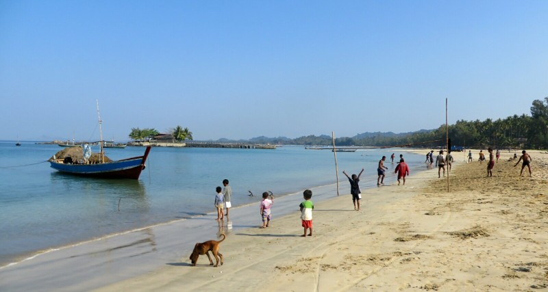
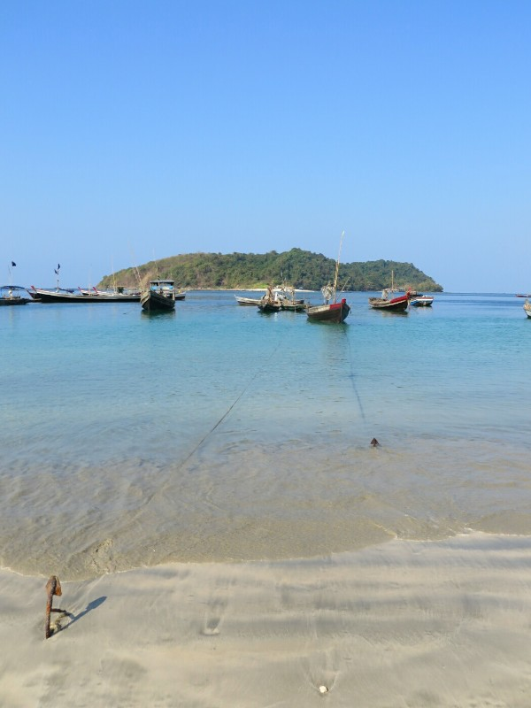
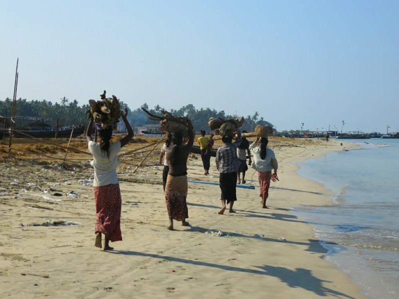
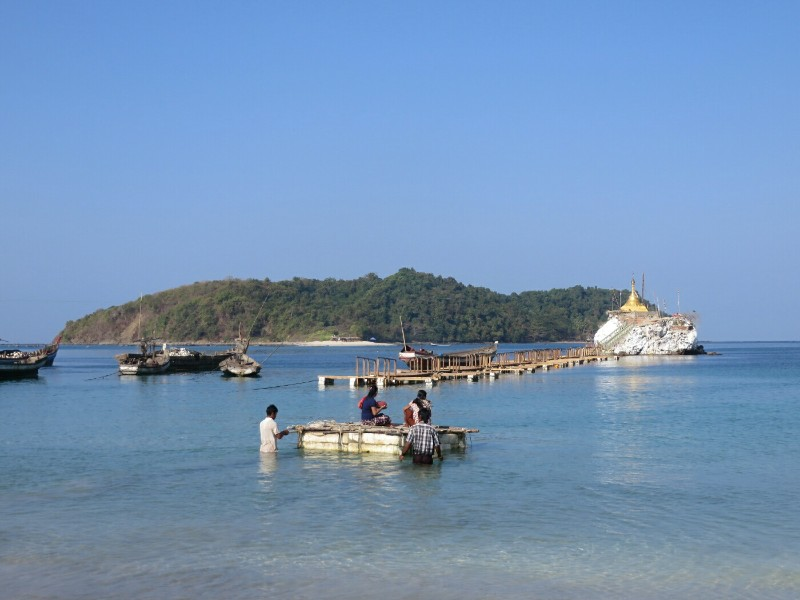

*We woke up to waves crashing just outside the window and watched the sunset over the ocean every night. It was just beautiful. The government strictly limits development of the beach (the number of resorts and their size) to keep the natural beauty intact. Another great side effect is a very limited number of tourists- it's not at all hard to find a private spot to watch the waves with no one else in sight.*

*We had almost all our lunches and dinners at these beach front restaurants. Every meal in Myanmar came with a huge plate of peanuts, which we followed up with the best and freshest seafood we've ever had (even Kate was ordering calamari and prawns by the end!) and under $15 for both of us, including a couple of (overly sweet) cocktails each.*

*There were a lot of cute dogs. Kate knew she shouldn't feed them... Then she did anyway. Pat was not impressed*

*Our favorite restaurant was Ko Ye. We watched a lot of sunsets there. The steamed fish was just to die for with the freshest tomato dressing; the mixed seafood grill was cooked to perfection with lobster, crab, prawns and squid; and the local specialty, coconut curry was so flavoursome and (unlike most Burmese food) not too oily. Everything we had was fantastic. I'm making myself hungry.*

*The restaurant is named after the owner (Ko Ye) who runs it with his brother (the chef). His whole family help out when they're not working at the resorts or working on their plantation. We met most of his family, they were all lovely although their English was limited.*

*The more we went back, the more Ko Ye would throw things in. Initially some veggies or tempura, then later he started making us special coconut seafood curries actually served in a coconut and on our last night, banana flambe.*

*Other than eating amazing food, we hung out on the beach and read. We both finished our books and started 1984.*

*Kate didn't know what to do without waves. She's used to being dunked and half drowned for a good time. Pat said "just float!"*

*This lady was on the beach every day selling fresh fruit. I don't know how many times we heard her monotone call: 'Mingalaba! Bananacoconutpineapplemangowatermelonpapayapomelloorange'*

*We walked down to the local village one day. The difference from the end of the resorts to the start of the village was marked. Most obviously, there was rubbish everywhere. And a lot more dogs. We watched the local kids play soccer...*

*The men set out on their fishing boats...*

*The women dry the fish and carry sticks and reeds to the village for building projects...*

*And locals set out on rafts to access the temple to make offerings and pray.*

*In the evenings we sat out and watched the stars and passing satellites for a while. We decided we'll have to go back for our 5 year anniversary. Or maybe 2 year. Or maybe just at the end of the trip we move here instead of Canada... I hope it remains this perfect.*
