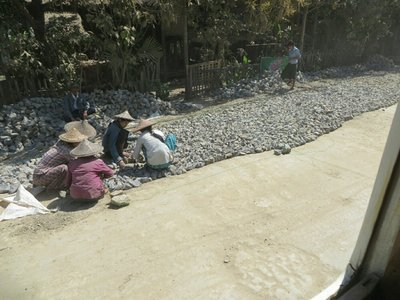
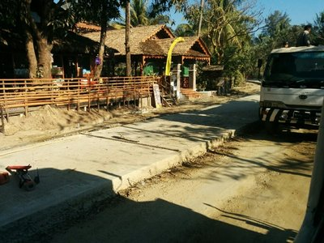
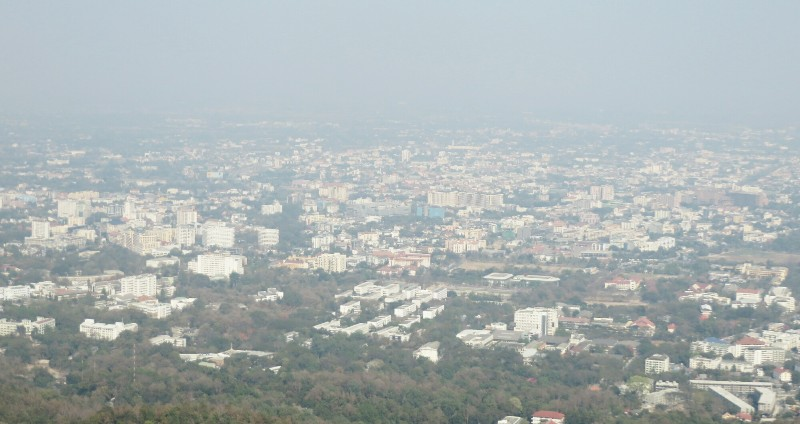

Sadly after 5 days we had to leave Ngapali. On the drive to the airport  the road appeared to have made serious progress. New sections were compete that they hadn't started weren't there earlier in the week. Fast workers!

Back to the airport, back to chaos. A guy from our hotel took everyone's passports and tickets and went to "immigration" (why is there immigration for these domestic flights?? A lady came by trying to scam people out of $1 for "luggage tax". Most people got out their wallets, but Kate was having none of it and told her to beat it. We went through "security" (which consisted of a metal detector that wasn't turned on and a xray machine that also wasn't turned on) without incident. Phew! Then off to Yangon.

Arrived, another insane airport. I miss the beach. Everyone's bags from all flights were just dumped in a pile on the floor in the "arrivals hall". People were crowding the doors like animals waiting for their bags, shoving other people out of the way to get to the front, as if that will make them come faster.

Bags (eventually) in hand and no blood shed we walked out of the domestic airport towards the international airport next door.  We initially tried the direct route but ended up inside someones house... They were very nice about us wandering into their living room.  Next shot via the main road, we made it.

A sign at a check in counter said check in was open when we arrived. We joined the longish queue with no one at the desk in front. Eventually two Air Bagan staff members showed up and set up shop. At a different counter. Ugh. One enterprising d-bag from the back of the line sprinted up to be in front of the new queue and gloated loudly "I knew they were going to do that!" Clever! A group of three Thai men who had been second in the original queue didn't see he had cut in and went in front of him to the counter. D-bag freaked out at them about how you can't just cut in line and made them go back, exclaiming "You see what I mean about the Chinese!?", to no one in particular. Class A hypocrite.

At the gate Pat tried to buy a postcard. The lady at the shop says "3 for $1"  
I only want one.   
3 for $1.   
Can I give you 50c for one?   
3 for $1.   
Okay, take $1, but I just want one.   
3 for $1.   
Pat gives up. I refuse to buy any on principle! I come back to Kate and complain we have no postcard to send to Mom and Dad. The lady was so unreasonable and stubborn. Etc.  Kate rolled her eyes, went back and just bought 3 for $1.

After that fiasco we boarded a bus to be taken to our plane. It drove us along the tarmac back to the plane we'd just gotten off at the domestic terminal. Going nowhere, slowly. After many hours of transit very efficiently undoing our week of relaxation, we arrived in Chiang Mai. No more Myanmar!

*Smoggy Chiang Mai!*

Mixed emotions on leaving. It is a beautiful country, the people are fantastic and you feel safe everywhere, but from a tourism perspective it was a bit rough around the edges. They don't have the infrastructure yet (issues with currency, issues at airports, overpriced accommodation by South East Asian or even Western standards). That said, none of those really detracted from our experience. They certainly made it uncomfortable at times, but we agree we'd both prefer occasional discomfort in return for the untouched beauty and uncrowded thousand year old landmarks Myanmar holds.
