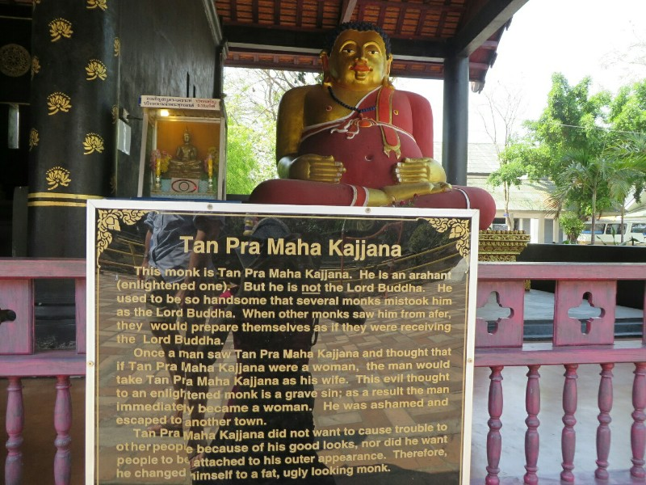
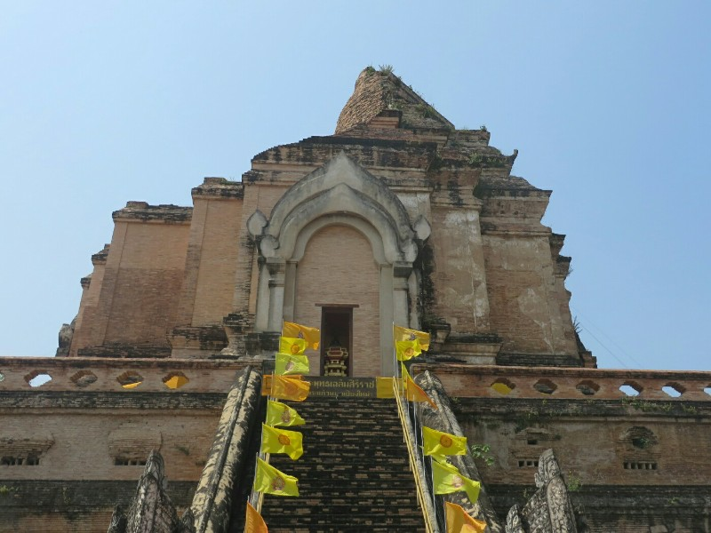
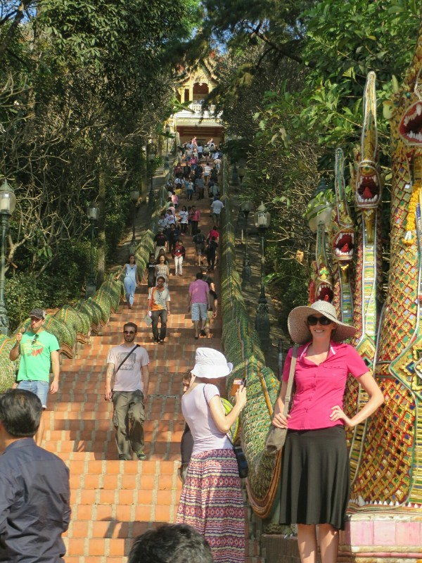
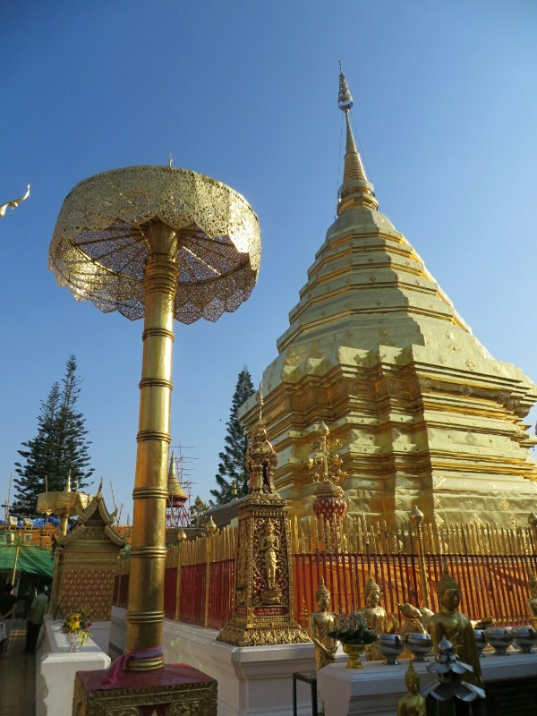
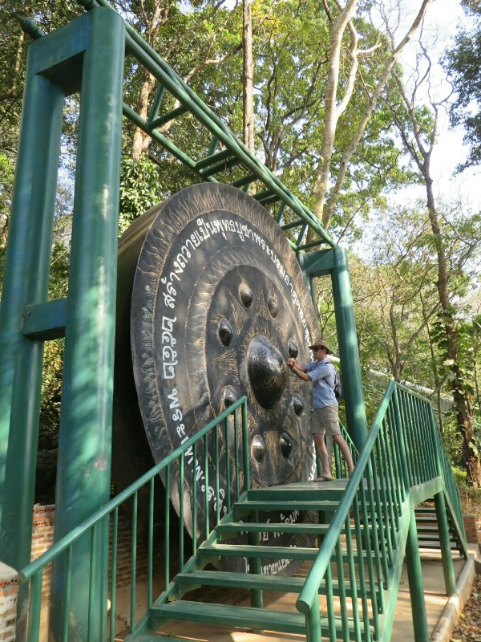
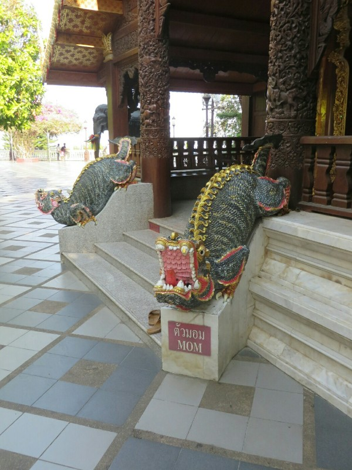

We started our first day back in Thailand with brekky at a nice restaurant in a laneway parallel to ours. We have decided Chiang Mai is the Melbourne of Thailand. Lots of alleyways, kitschy coffee shops, graffiti, hipsters etc. We're quite enjoying it.

There were unwashed, long haired hippies from all corners of the globe walking past. Two at the front were discussing world finance- not what you expect from a slightly smelly man with dreads in tie dye and a barefoot, braless woman.

*It's Not Easy Being This Beautiful*

We considered what to do with the day. Everywhere was offering day trips- rafting, trekking, cooking classes and elephant camps. The elephant camps vary widely in what they offer, and in how they treat the animals. We were initially planning to go to one (playing with and riding elephants sounds pretty fun) but had a look into it first because we were unsure how they treat the animals here.

These elephant camps pose a big ethical quandary for us. First of all, they're an endangered species and we feel bad actively encouraging their use in tourism. They really should be left in the wild. Secondly we found out how they 'tame' the elephants to allow people to ride them and to teach them to paint etc. They're not like dogs and easily domesticated, or like horses who can be broken humanely. The process the use is called 'Phajaan' or The Crush. They take young elephant babies away from their mother, confine them in a small space then starve, sleep deprive, beat and torture them (with nails and electric prods) until they break and submit. Pretty much all elephant camps in Thailand claim to treat their animals ethically, but if they submit to bring ridden, they have gone through Phajaan. Even if they're treated better now, we decided we didn't want to ride an elephant if it encourages and perpetuates that kind of cruelty.

There are a couple of alternative camps, ones which buy and save elephants from the riding camps, especially injured elephants. At these places all visitors do is watch and sometimes bathe the elephants. This I could believe is actually ethical. However, the money you give these camps still ends up going to the riding camps, the more money these camps get the more elephants they buy from the other ones which unfortunately indirectly encourages and supports the riding camps. As long as there is a lucrative tourist market to interact with elephants, elephants will be taken from their habitat and many will still undergo torture. We ended up deciding putting money towards the elephant tourism industry at all would be (to us) unethical and decided to spend the day around town instead.

We had a wander around old town and stopped in a couple temples along the way- a 600 (?) year old wooden one which was very different to any temple we've seen yet and a big stone ruined one you can't climb on (no fun). The Buddhist calendar is weird and doesn't match up to western calendar so we were having trouble dating things. Well, either their calendar's different or they're not writing the history of the temples, they're predicting what's going to happen...

*Temple We Couldn't Climb*

Had lunch at little cafe (Rachadamneon Kitchen). The owner was quite abrupt. Missing Ko Ye. We asked for extra spicy and it still came back mild. Seems to be a theme.

After food we went to a travel agent near the hotel to organise how we'd get from Chiang Mai to Luang Namtha. We decided to get a direct bus (12 hours) for 1000 baht each rather than doing it by local transport over 2 days. We might regret this decision later.

That sorted, we found a tuk tuk to take us to Doi Suthep (a temple on a mountain). Pat sucesfully bargained the price down by 50 baht ($1.60), great work! It was a long, steep, twisty turny road in the back of a pickup truck. Kate got a bit queasy. There were lots of people cycling up the hill- they must be very fit. Pat wished he had his bike, Kate thinks he and all these other people are crazy.

*Few Stairs to Climb*

Dropped off at the top of the mountain, it was 300 stairs to climb to temple. The temple was nice but I think we have been spoiled by the magnificent pagodas in Myanmar. We walked down, then back up and down again for a bit of exercise. We are so unfit after our time in Ngapali doing literally nothing but sleeping and eating. Gotta improve!

So we drove back down, got pizza for dinner and went to sleep. We'll start tomorrow.

*Doi Suthep*

*Big Gong*

*What Buddhists Think of Their Mothers - Harsh*
